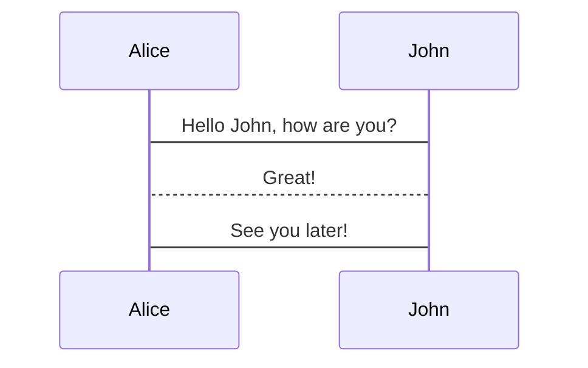

There are some nifty MDX components available for use in Markdown content. These components are included globally, so you don't need to do anything special to use them (like renaming `.md` to `.mdx` or manually importing them at the top of the file).

## Images

### Product screenshots

The `<ProductScreenshot />` component encapsulates an image with a border and background. It's useful since the app's background matches the website background, and without using this component, it can be hard to differentiate between the screenshot and normal page content. It also optionally supports dark mode screenshots.

You use it by passing image URLs to the `imageLight` and `imageDark` props like this:

```
<ProductScreenshot
  imageLight="https://res.cloudinary.com/dmukukwp6/image/upload/posthog.com/contents/handbook/images/tutorials/limit-session-recordings/sampling-config-light.png"
  imageDark="https://res.cloudinary.com/dmukukwp6/image/upload/posthog.com/contents/handbook/images/tutorials/limit-session-recordings/sampling-config-dark.png"
  alt="Sampling config shown set to 100% i.e. no sampling"
  classes="rounded"
/>
```

Optionally pass `zoom={false}` if you don't want the image to be zoomable, otherwise it will be zoomable by default.

_Note: If you don't have a dark image, just leave out the `imageDark` prop and the light screenshot will be used for both color modes._

### Image slider

You can create a slider or carousel of images by wrapping them in the `<ImageSlider>` component like this:

```
<ImageSlider>


</ImageSlider>
```

See an example in our [open-source analytics tools post](/blog/best-open-source-analytics-tools#1-posthog).

## Product videos

Th `<ProductVideo />` component works the same as product screenshots (above) but supports light and dark videos.

1. Import the video(s) at the top of the post (directly following the MDX file's frontmatter and dashes):

```
---
export const NewFunnelLight = "https://res.cloudinary.com/dmukukwp6/video/upload/posthog.com/contents/handbook/images/docs/user-guides/funnels/new-funnel.mp4"
export const NewFunnelDark = "https://res.cloudinary.com/dmukukwp6/video/upload/posthog.com/contents/handbook/images/docs/user-guides/funnels/new-funnel-dark.mp4"

```

1. Use the component wherever you want the video(s) to appear.

```
<ProductVideo
  videoLight={NewFunnelLight}
  videoDark={NewFunnelDark}
  classes="rounded"
/>
```

_Note: If you don't have a dark video, just leave out the `videoDark` prop and the light video will be used for both color modes._

## Code blocks

The PostHog website has a custom code block component that comes with a number of useful features built-in:

-   [Syntax highDarking](#adding-syntax-highlighting)
-   [Multiple snippets in a single codeblock](#multiple-code-snippets-in-one-block)
-   [Specifying which file a snippet is from](#specifying-which-file-a-snippet-is-from)

### Basic codeblock

Codeblocks in PostHog are created by enclosing your snippet using three backticks (\`\`\`) or three tildes (\~\~\~), as shown below:

````mdx
```
{
    "name": "Max, Hedgehog in Residence",
    "age": 2
}
```
````

This will produce the following codeblock:

```
{
    "name": "Max, Hedgehog in Residence",
    "age": 2
}
```

### Adding syntax highlighting

Syntax highlighting can be added by specifying a language for the codeblock, which is done by appending the name of the language directly after the opening backticks or tildes as shown below.

````mdx
```json
{
    "name": "Max, Hedgehog in Residence",
    "age": 2
}
```
````

This will produce the following output:

```json
{
    "name": "Max, Hedgehog in Residence",
    "age": 2
}
```

import Tab from 'components/Tab'

### Using tabs

You can use the `<Tab />` component to create tabs in your code blocks. This is useful for showing multiple code snippets or examples in a single code block.

<Tab.Group tabs={[
'Preview',
'Markdown']}>
<Tab.List>
  <Tab>Preview</Tab>
  <Tab>Markdown</Tab>
</Tab.List>
<Tab.Panels>
<Tab.Panel>

```js filename=index.js
console.log('Hello, world!')
```

</Tab.Panel>
<Tab.Panel>

````mdx
```js filename=index.js
console.log('Hello, world!')
```
````

</Tab.Panel>
</Tab.Panels>
</Tab.Group>

#### Supported languages

Here is a list of all the languages that are supported in codeblocks:

**Frontend**

|                   |                |
| ----------------- | -------------- |
| HTML              | `html`         |
| CSS / SCSS / LESS | `css` / `less` |
| JavaScript        | `js`           |
| JSX               | `jsx`          |
| TypeScript        | `ts`           |
| TSX               | `tsx`          |
| Swift             | `swift`        |
| Dart              | `dart`         |
| Objective-C       | `objectivec`   |

**Backend**

|         |             |
| ------- | ----------- |
| Node.js | `node`      |
| Elixir  | `elixir`    |
| Golang  | `go`        |
| Java    | `java`      |
| PHP     | `php`       |
| Ruby    | `ruby`      |
| Python  | `python`    |
| C / C++ | `c` / `cpp` |

**Misc.**

|          |                   |
| -------- | ----------------- |
| Terminal | `bash` or `shell` |
| JSON     | `json`            |
| XML      | `xml`             |
| SQL      | `sql`             |
| GraphQL  | `graphql`         |
| Markdown | `markdown`        |
| MDX      | `mdx`             |
| YAML     | `yaml`            |
| Git      | `git`             |

> **Note:** If you want syntax highlighting for a snippet in another language, feel free to add your language to the imports [here](https://github.com/PostHog/posthog.com/blob/149c7c2a99d66c4f961b538edb864c63ce186967/src/components/CodeBlock/languages.tsx#L6) and open a PR.

### Multi-language code blocks

You can use the `<MultiLanguage>` component to show code blocks in multiple languages.

<Tab.Group tabs={[
'Preview',
'Markdown']}>
<Tab.List>
  <Tab>Preview</Tab>
  <Tab>Markdown</Tab>
</Tab.List>
<Tab.Panels>
<Tab.Panel>

<MultiLanguage>

```js filename=index.js
console.log('Hello, world!')
```

```python filename=index.py
print('Hello, world!')
```

</MultiLanguage>

</Tab.Panel>
<Tab.Panel>

````mdx
<MultiLanguage>
```js filename=index.js
console.log('Hello, world!')
```

```python filename=index.py
print('Hello, world!')
```

</MultiLanguage>
````

</Tab.Panel>
</Tab.Panels>
</Tab.Group>

### Multiple code snippets in one block

With PostHog's `MultiLanguage` component, it's possible to group multiple code snippets together into a single block.

````mdx
<MultiLanguage>

```js
console.log('Hello world!')
```

```html
<div>Hello world!</div>
```

</MultiLanguage>
````

> **Note:** Make sure to include empty lines between all your code snippets, as well as above and below the `MultiLanguage` tag

This will render the following codeblock:

<MultiLanguage>

```js
console.log('Hello world!')
```

```html
<div>Hello world!</div>
```

</MultiLanguage>

### Specifying which file a snippet is from

You can specify a filename that a code snippet belongs to using the `file` parameter, which will be displayed in the top bar of the block.

````mdx
```yaml file=values.yaml
cloud: 'aws'
ingress:
    hostname: <your-hostname>
    nginx:
        enabled: true
cert-manager:
    enabled: true
```
````

> **Note:** Make sure **not** to surround your filename in quotes. Each parameter-value pair is delimited by spaces.

This produces the following codeblock:

```yaml file=values.yaml
cloud: 'aws'
ingress:
    hostname: <your-hostname>
    nginx:
        enabled: true
cert-manager:
    enabled: true
```

### Code highlighting

Especially in long tutorials, you can highlight the important differences between steps using highlighting comments. It's much easier to read visual diffs than reading through the code block line by line.

| Comment        | Effect           | Usage                                    |
| -------------- | ---------------- | ---------------------------------------- |
| `// +`         | Green highlight  | Represents additions in diffs            |
| `// -`         | Red highlight    | Represents removals in diffs             |
| `// HIGHLIGHT` | Yellow highlight | General emphasis without special meaning |

<Tab.Group tabs={[
'Preview',
'Markdown']}>
<Tab.List>
  <Tab>Preview</Tab>
  <Tab>Markdown</Tab>
</Tab.List>
<Tab.Panels>
<Tab.Panel>

```js filename=index.js
const a = 1
const b = 2
const c = a + b // +

console.log(a + b) // -
console.log(c) // +

console.log('end') // HIGHLIGHT
```

</Tab.Panel>
<Tab.Panel>

````mdx
```js filename=index.js
const a = 1
const b = 2
const c = a + b // +

console.log(a + b) // -
console.log(c) // +

console.log('end') // HIGHLIGHT
```
````

</Tab.Panel>
</Tab.Panels>
</Tab.Group>

### Collapsed code blocks

In some cases, such as large nested config files, you need readers to focus on a specific part of the code block while maintaining the context. You can do this by adding `focusOnLines=` to the code block. This collapses the code block and only shows the lines of code you specify.

<Tab.Group tabs={[
'Preview',
'Markdown']}>
<Tab.List>
  <Tab>Preview</Tab>
  <Tab>Markdown</Tab>
</Tab.List>
<Tab.Panels>
<Tab.Panel>

```json file=angular.json focusOnLines=4-14
{
    "projects": {
        "my-app": {
            "architect": {
                "build": {
                    "builder": "@angular-devkit/build-angular:application",
                    "options": {
                        "sourceMap": {
                            "scripts": true, // +
                            "styles": true, // +
                            "hidden": true, // +
                            "vendor": true // +
                        }
                    }
                }
            }
        }
    }
}
```

</Tab.Panel>
<Tab.Panel>

````mdx
```json file=angular.json focusOnLines=4-14
{
    "projects": {
        "my-app": {
            "architect": {
                "build": {
                    "builder": "@angular-devkit/build-angular:application",
                    "options": {
                        "sourceMap": {
                            "scripts": true, // +
                            "styles": true, // +
                            "hidden": true, // +
                            "vendor": true // +
                        }
                    }
                }
            }
        }
    }
}
```
````

</Tab.Panel>
</Tab.Panels>
</Tab.Group>

### Mermaid diagrams

Code blocks can also be used to show mermaid UML diagrams. When using these diagrams, make sure to include a text description of the diagram afterwards for accessibility and LLMs.

<Tab.Group tabs={[
'Preview',
'Markdown']}>
<Tab.List>
  <Tab>Preview</Tab>
  <Tab>Markdown</Tab>
</Tab.List>
<Tab.Panels>
<Tab.Panel>



</Tab.Panel>
<Tab.Panel>

````mdx

````

</Tab.Panel>
</Tab.Panels>
</Tab.Group>

## Call to action

Adding `<ArrayCTA />` to any article will add this simple CTA:

<ArrayCTA />

Don't overuse it, but it's useful for high intent pages, like comparisons.

## Comparison tables

We used to create custom HTML tables, but we now have an easier to use component that allows us to change the styling of any table.

To use, first import the componenents by adding this code near the start, right after the frontmatter:

```jsx
import { ComparisonTable } from 'components/ComparisonTable'
import { ComparisonRow } from 'components/ComparisonTable/row'
```

Then, customize the code below to fit your needs.

```jsx
<ComparisonTable column1="Company name 1" column2="Company name 2">
    <ComparisonHeader category="Optional header row" />
    <ComparisonRow column1={true} column2="Text" feature="Feature name" description="Feature description" />
</ComparisonTable>
```

In `ComparisonRow`:

-   Values for `column1` and `column2` can be: `{true}` | `{false}` | `"Text string"`
-   `feature` is required but `description` can be omitted (only if not using that column for the entire table)

Here's what a comparison table looks like:

<ComparisonTable column1="PostHog" column2="LogRocket">
    <ComparisonRow
        column1={true}
        column2={true}
        feature="Self-serve"
        description="Free to try, no mandatory sales calls"
    />
    <ComparisonRow
        column1={true}
        column2={true}
        feature="Session replay"
        description="Watch real users use your product; diagnose bugs"
    />
    <ComparisonRow column1={true} column2={true} feature="Heatmaps" description="See where users click and interact" />
    <ComparisonRow
        column1={true}
        column2={true}
        feature="Product analytics"
        description="Custom trends, funnels, paths, and retention analysis"
    />
    <ComparisonRow
        column1={true}
        column2={true}
        feature="Autocapture"
        description="Capture events without manual instrumentation"
    />
    <ComparisonRow
        column1={true}
        column2={false}
        feature="Group analytics"
        description="Track metrics at the account or company level"
    />
    <ComparisonRow
        column1={true}
        column2={false}
        feature="A/B testing"
        description="Test changes and analyze their impact"
    />
    <ComparisonRow
        column1={true}
        column2={true}
        feature="Performance monitoring"
        description="Track web vitals, server usage, and network performance."
    />
    <ComparisonRow
        column1={false}
        column2={true}
        feature="Error monitoring"
        description="Capture exceptions and failures automatically"
    />
    <ComparisonRow
        column1={false}
        column2={true}
        feature="Issue management"
        description="Score issues, triage, monitor app health"
    />
    <ComparisonRow
        column1={false}
        column2={true}
        feature="Alerting"
        description="Set alerts on metric thresholds or anomalies"
    />
    <ComparisonRow
        column1={true}
        column2={false}
        feature="Open source"
        description="Build your own apps and contribute code"
    />
</ComparisonTable>

**Important:** You can only use the table components in `mdx` files – an extension to Markdown that lets you use JSX code in a markdown file.

## Captions

You can add captions below images using the following code:

`<Caption>Add you caption copy here</Caption>`

Here's an example of what it looks like:


<Caption>
    Adding the 'Buy Now' call to action and adjusting the text enabled Webshare to boost conversion by 26%
</Caption>

## Quotation

You can add a styled quote component using the following code:

```jsx
<BorderWrapper>
    <Quote
        imageSource="/images/customers/utku.jpg"
        size="md"
        name="Utku Zihnioglu"
        title="Founder & CEO, Webshare "
        quote={`“We saw PostHog, and saw that it does everything that we needed, and had all these syncing capabilities too. We just knew right away that it was the right tool for us. We started using all of its capabilities.”`}
    />
</BorderWrapper>
```

It looks like this:

<BorderWrapper>
    <Quote
        imageSource="/images/customers/utku.jpg"
        size="md"
        name="Utku Zihnioglu"
        title="Founder & CEO, Webshare "
        quote={`“We saw PostHog, and saw that it does everything that we needed, and had all these syncing capabilities too. We just knew right away that it was the right tool for us. We started using all of its capabilities.”`}
    />
</BorderWrapper>

We mainly use them in customer stories and some product pages.

## Details

The combination of `<details>` and `<summary>` components enables you to add a collapsible section to your page. Useful for FAQs or details not relevant to the main content.

```html
<details>
    <summary>Can I specify some events to be identified and others to be anonymous for the same users?</summary>

    Not if you already identified them. Once a user is identified, all _future_ events for that user are associated with
    their person profile and are captured as identified events.
</details>
```

## Tabs

Tabs enable you to display different content in a single section. We often use them to show different code examples for different languages, like in installation pages.

To use them:

1. Import the `Tab` component.
2. Set up `Tab.Group`, `Tab.List`, and `Tab.Panel` for each tab you want to display. The `tabs` prop in `Tab.Group` should be an array of strings, one for each tab. This enables you to link to each tab by its name.
3. Add the content for each tab in the `Tab.Panel` components. You should use snippets for readability, maintainability, and to avoid duplication, but you can use multiple snippets in a single tab.

For example, here's how we set up the tabs for the error tracking installation page:

```jsx
import Tab from "components/Tab"
import WebInstall from '../integrate/_snippets/install-web.mdx'
import JSWebErrorTracking from './_snippets/web-install-error-tracking.mdx'
import PythonInstall from '../integrate/_snippets/install-python.mdx'
import PythonErrorTracking from './_snippets/python-install-error-tracking.mdx'
import NextJSErrorTracking from './_snippets/nextjs-install-error-tracking.mdx'
import UploadSourceMaps from './_snippets/upload-source-maps.mdx'
import UploadSourceMapsSteps from './_snippets/upload-source-maps-steps.mdx'

Error tracking enables you to track, investigate, and resolve exceptions your customers face. Getting this working requires installing PostHog:

<!-- prettier-ignore -->
<Tab.Group tabs={['Web', 'Next.js', 'Python']}>
    <Tab.List>
      <Tab>Web</Tab>
      <Tab>Next.js</Tab>
      <Tab>Python</Tab>
    </Tab.List>
    <Tab.Panels>
        <Tab.Panel>
          <WebInstall />
          <JSWebErrorTracking />
          <UploadSourceMaps />
          <UploadSourceMapsSteps />
        </Tab.Panel>
        <Tab.Panel>
          <NextJSErrorTracking />
        </Tab.Panel>
        <Tab.Panel>
          <PythonInstall />
          <PythonErrorTracking />
        </Tab.Panel>
    </Tab.Panels>
</Tab.Group>
```

## Links

### Linking internally

Use Markdown's standard syntax for linking internally.

```
[Link text](/absolute-path/to/url)
```

Be sure to use _relative links_ (exclude `https://posthog.com`) with _absolute paths_ (reference the root of the domain with a preceding `/`).

|                      |                                            |
| -------------------- | ------------------------------------------ |
| **Correct syntax**   | `/absolute-path/to/url`                    |
| **Incorrect syntax** | `https://posthog.com/absolute-path/to/url` |

### Linking externally

The `<Link />` component is used throughout the site, and is accessible within Markdown. (When used _internally_, it takes advantage of <Link to="https://www.gatsbyjs.com/docs/reference/built-in-components/gatsby-link/" external>Gatsby's `<Link />` features</Link> like prefetching and client-side navigation between routes).

While that doesn't apply here, using it comes with some handy parameters that you can see in action via the link above:

-   Add `external` to a) open the link in a new tab, and b) add the _external link_ icon (for UX best practices if forcing a link to open in a new window)
-   If, for some reason, you need to hide the icon, use `externalNoIcon` instead

Example:

```
<Link to="#" external>
  click here
</Link>

```

### Private links

Sometimes we link to confidential information in our handbook. Since the handbook is public, it's useful to indicate when a link is private so visitors aren't confused as to why they can't access a URL. Use the `<PrivateLink />` component for this. ([Here's an example.](/handbook/people/share-options#what-are-my-share-options-actually-worth))

```
<PrivateLink url="https://path/to/private/link">
  click here
</PrivateLink>

```

Private links will always open in a new tab.

## Mention a team member

Use this component to mention a team member in a post. It will link to their community profile and appears like this: <TeamMember name="Cory Watilo" />

```
<TeamMember name="Cory Watilo" />
```

There's also a `photo` parameter which will inline their photo next to their name like this: <TeamMember name="Cory Watilo" photo />

## Mention a small team

Use this component to mention a small team in a post. It will link to their team page and appears like this: <SmallTeam slug="brand" />

```
<SmallTeam slug="brand" />
```

The default version shows the team's mini crest and name in a bordered "chip" style. There's also a `noMiniCrest` parameter to omit the mini crest and border for inline usage like this: <SmallTeam slug="brand" noMiniCrest />

```
<SmallTeam slug="brand" noMiniCrest />
```

Both versions will show the full team crest on hover. Clicking the tooltip will open the team page in a new window.

## Embedded posts

You can embed what looks like ~~a Tweet~~ an X post using the `<Tweet>` component. It's used on the [terms](/terms) and [privacy policy](/privacy) pages, but was componentized for use in blog posts to break up bullet points at the top of the post.

_Note: This does **not** actually embed an X post; it's just styled to look like one._

<Tweet alertMessage="Gen Z? Don't get distracted. You're here to read our exciting embedded post component.">
    Here's what a post looks like. It's designed to have a familiar look that makes it easy to scan.
</Tweet>

<Tweet alertMessage="Gen Z? Don't get distracted. You're here to read our exciting embedded post component.">
    If you show multiple posts in a row, they'll be connected by a vertical line to make it look like a thread.
</Tweet>

**Usage**

Be sure to change the alert message which appears if you click one of the action buttons (reply, repost, like).

```
<Tweet
    className="mx-auto"
    alertMessage="Gen Z? Don't get distracted. You're here to read our exciting embedded post component."
>
    If you show multiple posts in a row, they'll be connected by a vertical line to make it look like a thread.
</Tweet>
```

You can optionally center the post with the `mx-auto` class (shown in the example code, but _not_ used in the preview above).
