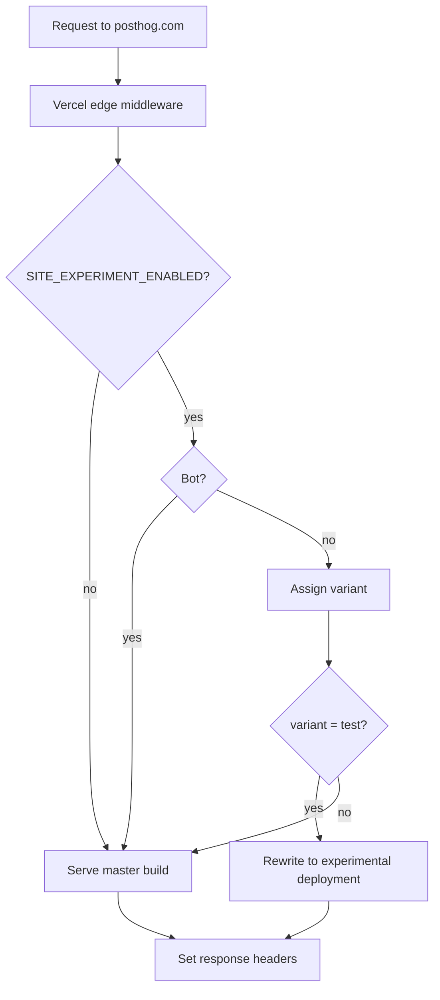

Use this when you need to A/B test **two complete posthog.com builds** at the same URL, for example a large redesign branch vs. `master`.

Middleware on production (`master`) evaluates a PostHog feature flag and **rewrites** a share of traffic to a separate Vercel deployment. Users stay on `posthog.com`; they are not redirected to a different domain.

## How it works



**Routing** is handled by middleware. **Analytics** are handled by the normal PostHog JS SDK on the client. Both should use the same `distinct_id` when the PostHog cookie is present.

## Files

| File | Purpose |
|------|---------|
| `middleware.ts` | Vercel edge entry point. Runs on all paths except `/api/*`. |
| `src/lib/siteExperimentMiddleware.ts` | Flag evaluation, cookies, rewrite URL building. |
| `gatsby/onPreBootstrap.ts` | Generates `posthog-init.js` with client-side experiment exposure. |

Middleware lives on **`master` only**. The experimental branch is a normal static deployment. It does not need `middleware.ts`.

## Variant assignment

On each request, middleware calls **PostHog `/flags?v=2`** with the visitor's `distinct_id`.

PostHog handles variant stickiness per `distinct_id`. Middleware does not cache assignments in a cookie, so rollout changes in PostHog take effect on the next request.

If the PostHog flags API fails, middleware **fails open to `control`** (current production site).

Holdout variants (`holdout-*`) are treated as **control** for routing.

Bots (Googlebot, etc.) always receive **control** and are not bucketed.

## Cookies

| Cookie | Set by | Purpose |
|--------|--------|---------|
| `ph_<token>_posthog` | Middleware (new visitors only) | Seeds `distinct_id` when no PostHog cookie exists yet. |

## Environment variables

Set these in the **Vercel project dashboard** for production. Edge middleware does not reliably read ad-hoc entries from `.env.local`. Only variables registered in the Vercel project (or `NEXT_PUBLIC_*` vars inlined at bundle time during `vercel dev`) are available.

| Variable | Required | Example | Notes |
|----------|----------|---------|-------|
| `SITE_EXPERIMENT_ENABLED` | Yes | `false` → `true` | Kill switch. Keep `false` until you are ready. |
| `SITE_EXPERIMENT_DEPLOYMENT_URL` | Yes | `https://posthog-git-my-branch-post-hog.vercel.app` | Full production build of the experimental branch. No trailing slash. |
| `SITE_EXPERIMENT_FLAG_KEY` | Yes | `my-site-experiment` | Must match the PostHog multivariate flag key. Required when middleware is configured. |
| `GATSBY_POSTHOG_API_KEY` | Yes | (same as existing site) | Used to call `/flags` and read the PostHog cookie. |
| `SITE_EXPERIMENT_CONTROL_VARIANT` | No | `control` | PostHog variant name for production site. |
| `SITE_EXPERIMENT_TEST_VARIANT` | No | `test` | PostHog variant name for experimental site. |
| `POSTHOG_FLAGS_API_HOST` | No | `https://us.i.posthog.com` | Defaults to US Cloud. |

```bash
vercel env add SITE_EXPERIMENT_ENABLED
vercel env add SITE_EXPERIMENT_DEPLOYMENT_URL
vercel env add SITE_EXPERIMENT_FLAG_KEY
```

## PostHog setup

1. Create a **multivariate feature flag** with variants `control` and `test`.
2. Set the flag runtime to **All** (or ensure server-side evaluation works for your release conditions).
3. Create a PostHog **Experiment** linked to that flag with your goal metrics.
4. Start rollout at `0%`, then dogfood with a release condition (e.g. email domain `@posthog.com`), then ramp.

Experiment exposure and goal metrics come from the **client SDK** evaluating the same flag. When `SITE_EXPERIMENT_ENABLED=true` and `SITE_EXPERIMENT_FLAG_KEY` are set at **build time**, `gatsby/onPreBootstrap.ts` generates `static/scripts/posthog-init.js` with an `onFeatureFlags` callback that calls `getFeatureFlag()` for that key. That emits `$feature_flag_called` for the PostHog experiment. When the env vars are unset, the snippet is omitted so normal traffic is unaffected. Middleware only decides which HTML/assets to serve.

## Experimental branch deployment

The experimental branch needs a **full production build**, not a PR preview:

- PR previews use `GATSBY_MINIMAL=true` and are not comparable to production.
- Deploy the branch to a **stable Vercel URL** (deployment alias or dedicated project).
- Use the same PostHog project keys as production so analytics stay in one project.

Point `SITE_EXPERIMENT_DEPLOYMENT_URL` at that stable URL.

## Local testing

`pnpm start` does **not** run middleware. Use `vercel dev`:

```bash
vercel dev
```

Edge middleware reads env vars from the **Vercel project**, not from Gatsby's `.env.development`. Pull production/preview env or add vars in the Vercel dashboard:

```bash
vercel env pull .env.local
```

Required vars for local middleware testing:

```bash
SITE_EXPERIMENT_ENABLED=true
SITE_EXPERIMENT_DEPLOYMENT_URL=https://your-experimental-preview.vercel.app
SITE_EXPERIMENT_FLAG_KEY=my-site-experiment
GATSBY_POSTHOG_API_KEY=phc_...
```

If middleware reports `enabled: undefined`, the vars are not reaching the edge runtime. Confirm they exist in the Vercel project for the environment you are pulling.

Verify in DevTools → Network → document response headers:

- `x-ph-site-variant: test` or `control`

Every page load calls PostHog `/flags` for routing. Expect a small latency cost per request.

## Production rollout checklist

1. Deploy experimental branch → stable Vercel URL.
2. Merge middleware to `master` with `SITE_EXPERIMENT_ENABLED=false`.
3. Set all Vercel env vars.
4. Verify routing on production (check `x-ph-site-variant` response header).
5. Create PostHog experiment; dogfood with `@posthog.com` release condition.
6. Flip `SITE_EXPERIMENT_ENABLED=true`; ramp rollout in PostHog.
7. When finished: disable experiment, set `SITE_EXPERIMENT_ENABLED=false`, remove middleware in a follow-up PR.

## Kill switch

Set `SITE_EXPERIMENT_ENABLED=false` in Vercel. Middleware passes all traffic through to `master` immediately. No redeploy of the experimental branch required.

## Tracking caveats

- Middleware `/flags` calls are for **routing only**. They do not register experiment exposure.
- The client SDK records exposure via `getFeatureFlag()` in `posthog-init.js` when `SITE_EXPERIMENT_ENABLED=true` at build time. That sends `$feature_flag_called` for the experiment. Toggling the env var requires a redeploy to update the generated script.
- Assignment should match when the same `distinct_id` is used on both sides. Middleware reads the PostHog cookie; the client uses `localStorage+cookie`. A rare split can occur if `localStorage` has a stale ID but the cookie is missing.
- `/api/*` routes always hit production serverless functions and are not rewritten.

## What is excluded

- `/api/*`: Vercel serverless functions (HubSpot, contact forms, etc.)
- Bots: always control, for SEO stability
