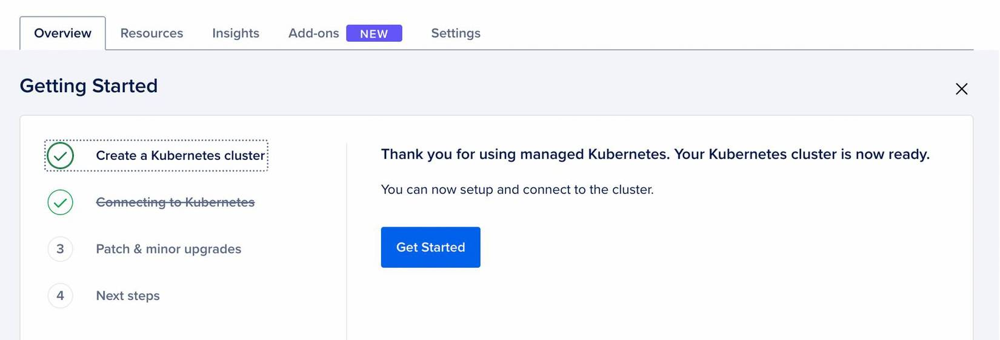
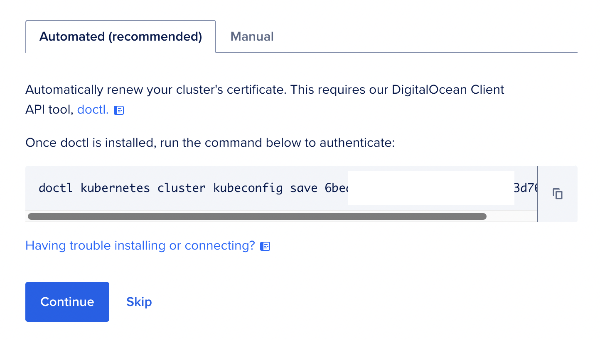
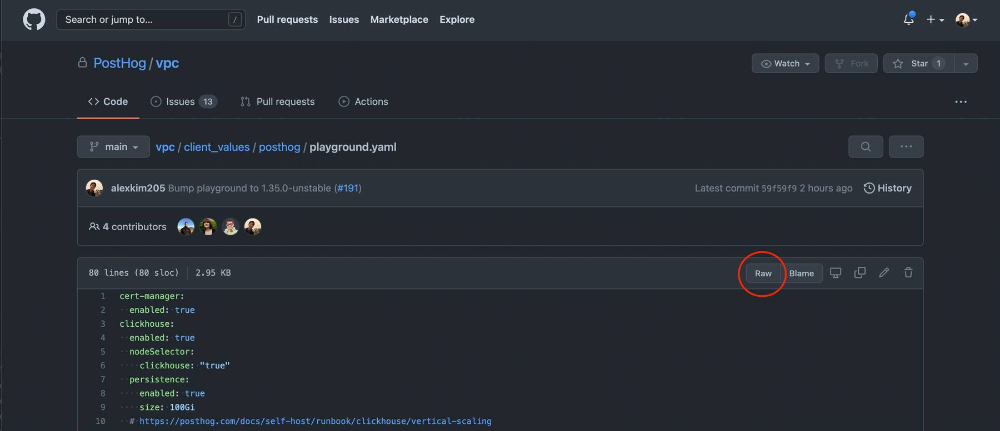
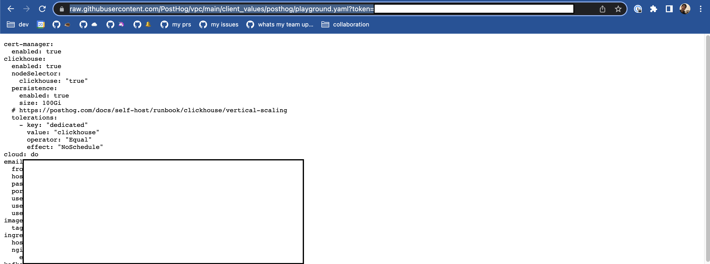

At the moment, we release a new version every month ([unless it makes sense not to!](/blog/we-ship-whenever)). This might change in the future.

For consistency, releases happen on the last Monday of every month. Code freezes and break the release happen on the Wednesday before that. Each month there will be a different release owner in charge of the release, to be updated under this [calendar](https://calendar.google.com/calendar/embed?src=c_n8hc1iedb0k8gqhuiv83jolm50%40group.calendar.google.com&ctz=America%2FNew_York).

If we've shipped features that we want to feature in the release notes, we use the label `highlight` on our pull request. If after the code freeze we have important bugfixes that we want to get into the release, we add the label `release-[version]`. This makes it easier for the release owner to figure out changes for the release blog post and to cherry-pick commits between the Code Freeze and the Release.

## Version numbers

Every month we bump the `minor` in `major.minor.patch`. At the moment, we're at version 1 for major. This will only change once we have released sufficient functionality under stage 2 of [our Roadmap](/handbook/strategy/roadmap/).

Hopefully we will not have to do many patch versions, but if between versions we discover a breaking bug, we will.

## Timeline

> 💡 For the context of this guide `[version]` is interpreted as the version of the release (e.g. `1.29.0`).

Three business days before the release (Wednesday before the release), we institute a code freeze. Feel free to make an announcement on Slack before we cut the branch, so people can have a heads-up. Then, we branch `master` into `release-[version]` and deploy that to our playground environment, [playground.posthog.com](https://playground.posthog.net/). We then host an hour-long "Break the release" session where everyone lends a hand in testing for any bugs. It's a recurring meeting, so you don't need to set it up.

Only bugfixes and finishing touches are allowed to be merged into this branch between the code freeze and the release going out. This gives us about three days to test the release.

The release manager is ultimately responsible for the timeline of the release. They are responsible for creating the "Code freeze" and "Break the release" calendar events as soon as possible. They should create these events under the `Releases` calendar linked up top.

## Steps

### Pre-release (Wednesday before the release)

1. [ ] Start the `release-[version]` branch from `master` to initiate the code freeze.
1. [ ] Figure out what's updated in this release with the command below or by asking the Product or Engineering Team. The command will output the entire commit list to `log.txt`. You can use this list to obtain external contributions to highlight in the Array. In addition, you can look for the `highlight` tag in PRs but be mindful it's not used very consistently.
  ```bash
  git checkout release-[version]
  git log --pretty=format:"%s %ae" [old-version]..head > log.txt
  ```
1. [ ] Update the `VERSION` value in `posthog/version.py` and add an appropriate entry in `posthog/versions.json`. Then commit those changes:
  ```bash
  git checkout release-[version]
  git add posthog/version.py posthog/versions.json
  git commit -m "chore: Bump version to [version]"
  ```
1. [ ] Publish the `release-[version]` branch:
  ```bash
  git push -u origin release-[version]
  ```
  Note that this will result in a Docker image tagged `release-[version]-unstable` being built. It might take a while, but it should show up [in Docker Hub](https://hub.docker.com/r/posthog/posthog/tags?page=1&name=release) within half an hour. You can check the build's status on the [GitHub Actions page of the main repo](https://github.com/PostHog/posthog/actions/workflows/docker-unstable-image.yml).
  
  > 💡 Make sure you have `doctl`, `helm`, and `k9s` installed before going through the next steps. You can install all of these with `brew install doctl helm k9s`.

1. [ ] Upgrade PostHog playground
    1. The PostHog Playground uses a helm chart deployment on Digital Ocean. Find the playground cluster in our [Digital Ocean Kubernetes clusters list](https://cloud.digitalocean.com/kubernetes/clusters?i=7cfa7c).
    1. If this is your first time on Digital Ocean, you'll see the below screen. If it's not, or you don't see the Getting Started flow, click "Remind me how to use this file to connect to the cluster" in the "Config file" section under the "Overview" tab. Click Get Started.

      

    1. Copy the automatic connection script by clicking the copy icon.
  
      

    1. Open terminal and run the command you copied. This command will set the correct kubectl context for the playground environment. As a sanity check, run `kubectl config current-context` and make sure that the current context name has `playground` in it somewhere.
    1. _Optional:_ Open another terminal window and run `k9s`. Use the arrow keys to scroll down to the PostHog clusters and keep an eye on this for the duration of the upgrade. [`k9s`](https://k9scli.io/) is a terminal GUI that makes it easier to manage and observe your deployed Kubernetes applications.
    1. Go to the [`playground.yaml` file in the `vpc` repo](https://github.com/PostHog/vpc/blob/main/client_values/posthog/playground.yaml) and update the `image: -> tag:` value (`release-[version]-unstable`) with the new version. Commit the change as soon as `release-[version]-unstable` shows up [in Docker Hub](https://hub.docker.com/r/posthog/posthog/tags?page=1&name=release).
        > ⚠️ Note that you might need to follow major upgrade notes as mentioned in the [upgrade guide](https://posthog.com/docs/self-host/deploy/digital-ocean#upgrading-the-chart), the same way our users would be required to. If so, make any additional changes to the `values.yaml` file as needed.
    1. Copy the URL of the new `playground.yaml` file. You can get that by navigating to the file [here](https://github.com/PostHog/vpc/blob/main/client_values/posthog/playground.yaml), clicking Raw in the GitHub UI, and copying the URL of that page.

      

      
      
    1. In a separate terminal window, follow the upgrade instructions [here](https://posthog.com/docs/self-host/deploy/digital-ocean#upgrading-the-chart). Replace `values.yaml` in the last upgrade command with the URL you copied in the previous step. Example:

      ```shell
      helm upgrade -f 'https://raw.githubusercontent.com/PostHog/vpc/main/client_values/posthog/playground.yaml?token=ABC' --timeout 20m --namespace posthog posthog posthog/posthog --atomic --wait --wait-for-jobs --debug
      ```

    1. Optional: Keep an eye on the progress of the upgrade in `k9s`
    1. If the `helm upgrade` command fails or if in the end the output for `kubectl get pods -n posthog` doesn't show everything as running, then ask `team-platform` for guidance.
    1. Go to the [playground](https://playground.posthog.net/) and test that everything is working as expected. Check that the version running is the same as the one we're releasing.
1. [ ] Time for the "Break the release" session! It's imperative that the session uses the published `release-[version]-unstable` image from Docker Hub to avoid any potential bugs creeping up in the final build stage.
1. [ ] Write up the [PostHog Array blog post](/handbook/growth/marketing/blog#posthog-array). Please tag Joe Martin for review, as this helps Marketing coordinate other announcements. Do not release the post until the day of release.

### Launch (day of the release)
1. [ ] Tag the version in GitHub. This will also build and push the `release-[version]`, `latest-release` (for both PostHog base & FOSS) Docker images to Docker Hub. **Please do this once the release branch is finalized, some users may see the image on Docker Hub and update immediately.**
  ```bash
  git tag -a [version] -m "Version [version]"
  git push --follow-tags
  ```
1. [ ] Create a new [`charts-clickhouse`](https://github.com/PostHog/charts-clickhouse) branch named `bump-[version]` to update the Helm chart:
    1. In [`Chart.yaml`](https://github.com/PostHog/charts-clickhouse/blob/main/charts/posthog/Chart.yaml) update `appVersion` to the new version.
    1. In [values.yaml](https://github.com/PostHog/charts-clickhouse/blob/main/charts/posthog/values.yaml) update `image.default` to point to the new tag (i.e. `:release-[version]`).
    1. In [`ALL_VALUES.md`](https://github.com/PostHog/charts-clickhouse/blob/main/charts/posthog/ALL_VALUES.md) update the default value of `image.default` to what you set in the previous step. Also, update the `AppVersion` [shields.io](https://shields.io/) badge at the top.
    1. Push the relevant changes and create a PR. Add the `bump minor` label to the PR. **Do not merge until the `release-[version]` branch is built.** (You can see that [in Docker Hub](https://hub.docker.com/r/posthog/posthog/tags?page=1&name=release-))
1. [ ] Publish the [PostHog Array blog post](/handbook/growth/marketing/blog#posthog-array).
1. [ ] Create a new main repo (`posthog`) branch named `sync-[version]`. Cherry-pick the `release-[version]` commits updating `version.py` and `versions.json` into `sync-[version]` and create a PR to get them into `master`. **Merging this to master will notify users that an update is available.** The Array post should be out at this point so that the "Release notes" link isn't a 404.
1. [ ] Go to the [EWXT9O7BVDC2O](https://us-east-1.console.aws.amazon.com/cloudfront/v3/home?region=us-east-2#/distributions/EWXT9O7BVDC2O) CloudFront distribution to the "Invalidations" tab and add a new one with `/*` value. This will refresh the CloudFront cache so that users can see the new version.
1. [ ] Send a message on the PostHog Users Slack (community) in [#announcements](https://posthogusers.slack.com/archives/CT7HXDEG3) to let everyone know the release has shipped.
1. [ ] Send the newsletter with the PostHog Array. The Marketing Team will arrange this, provided Joe Martin has been tagged for review in the PostHog Array blog post. 
