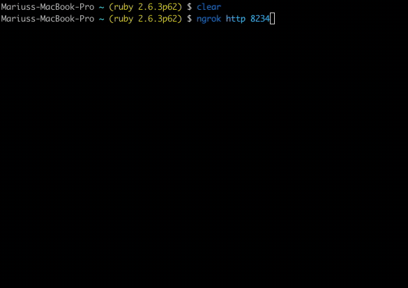
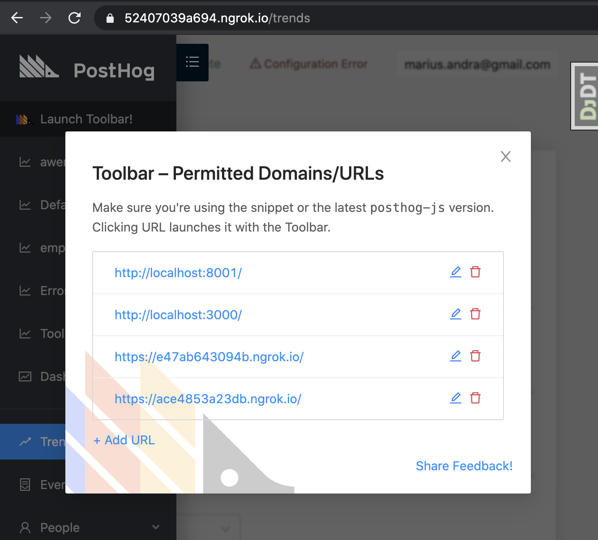
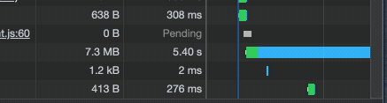

Setting up HTTPS locally can be useful if you're trying to debug hard
to replicate issues (e.g cross domain cookies, etc).

There are two ways you can get HTTPS locally: ngrok or with nginx and a local certificate. The easiest is to use ngrok.

## Set up SSL via ngrok

1. Start ngrok tunnel to 8234 (webpack dev server). This will give you a tunnel URL such as https://68f83839843a.ngrok.io

```sh
ngrok http 8234
```



2. Copy the URL to `JS_URL` and start webpack

```sh
export WEBPACK_HOT_RELOAD_HOST=0.0.0.0
export LOCAL_HTTPS=1
export JS_URL=https://68f83839843a.ngrok.io
yarn start
```

3. Copy the URL to `JS_URL` and start the django server

```sh
export DEBUG=1
export LOCAL_HTTPS=1
export JS_URL=https://68f83839843a.ngrok.io
python manage.py runserver
```

4. Start a ngrok tunnel to 8000 (django)

```
ngrok http 8000
```

Do what you need with the returned URL!

5. Tips & Tricks

If testing the toolbar, make sure to add whatever ngrok urls to the list in /setup.




Also, watch out, network requests can be slow through ngrok:



## Set up SSL via nginx and a local certificate

0. Update openssl if "openssl version" tells you "LibreSSL" or something like that.

In case "brew install openssl" and "brew link openssl" don't work well, just use 
"/usr/local/opt/openssl/bin/openssl" at the command in the next step.

1. Create key
```
openssl req -x509 -newkey rsa:4096 -sha256 -days 3650 -nodes \
  -keyout localhost.key -out localhost.crt -subj "/CN=secure.posthog.dev" \
  -addext "subjectAltName=DNS:secure.posthog.dev,IP:10.0.0.1"
```
2. Trust the key for Chrome/Safari
```
sudo security add-trusted-cert -d -r trustRoot -k /Library/Keychains/System.keychain localhost.crt
```
3. Add `secure.posthog.dev` to /etc/hosts
```
127.0.0.1 secure.posthog.dev
```
4. Install nginx (`brew install nginx`) and add the following config in `/usr/local/etc/nginx/nginx.conf`
```nginx
     upstream backend {
         server 127.0.0.1:8000;
     }
     server {
         server_name secure.posthog.dev;
         rewrite ^(.*) https://secure.posthog.dev$1 permanent;
     }
 
     server {
         listen       443 ssl;
         server_name  secure.posthog.dev;
         ssl_certificate  /Users/timglaser/dev/localhost.crt;
         ssl_certificate_key /Users/timglaser/dev/localhost.key    ;
         ssl_prefer_server_ciphers  on;
         ssl_session_cache    shared:SSL:1m;
         ssl_session_timeout  5m;
         ssl_ciphers          HIGH:!aNULL:!MD5;
         location / {
            proxy_pass http://backend;
            proxy_set_header X-Forwarded-For $proxy_add_x_forwarded_for;
            proxy_set_header Host $http_host;
            proxy_redirect off;
            proxy_set_header X-Forwarded-Proto $scheme;
         }
         location /static/ {
            proxy_pass http://127.0.0.1:8234/static/;
        }
     }
```

5. Add the following command to start nginx
```bash
nginx -p /usr/local/etc/nginx/ -c /usr/local/etc/nginx/nginx.conf
```

6. You can stop the nginx server with
```bash
nginx -p /usr/local/etc/nginx/ -c /usr/local/etc/nginx/nginx.conf -s stop
```

7. To run local development, use
```bash
bin/start-http
```
