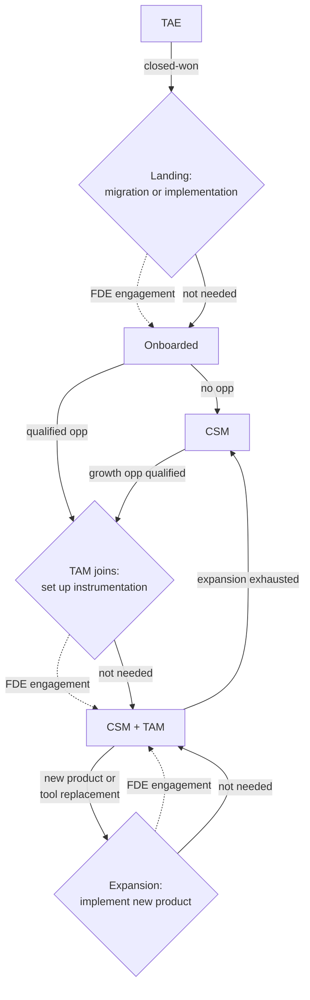

Forward deployed engineering (FDE) works alongside the sales, customer success (CS), and onboarding teams. They own the commercial relationship and bring us in when they need scoped delivery of technical outcomes.

## Who owns what

- **Sales** owns the deal and the commercial relationship; see [new business](/handbook/growth/sales/new-business-how-we-work).
- **CS / TAMs** own the ongoing customer relationship and health; see [customer success](/handbook/cs-and-onboarding/customer-success).
- **FDE** owns scoped technical engagements that unblock adoption or expansion.

We collaborate with these teams to provide focused, embedded technical work. The commercial relationship stays with the account owner throughout.

## How FDE gets pulled in

Sales or CS flag a technical blocker or opportunity, and we scope it. Before you route something to us, run the quick self-check in [how to get an FDE involved](/handbook/forward-deployed-engineering/how-to-get-fde-involved). That page also covers the cases where a customer can self-serve without an engagement at all, which is often.

One thing worth naming from the sales and CS side: **an FDE ask usually surfaces mid-deal or mid-relationship**, so the person routing it already holds the commercial context we don't. Bring that with you: where the account is in its lifecycle, what's actually at stake commercially, and how time-sensitive it is, so we scope against the real constraint rather than the technical problem in isolation. Then bring it to the <SmallTeam slug="forward-deployed-engineering" /> team.

## Where FDE fits in the customer lifecycle

An FDE engagement is one tool in the account team's toolbox, next to cost reviews, training, and implementation help. It is not a separate sales motion. The [accounts overview](/handbook/growth/sales/accounts-overview) shows how an account moves between the TAE, the CSM, and the TAM. There are three points in that journey where it's worth asking whether an FDE engagement would help the customer:

1. **Landing.** The TAE closes the deal. A migration or a first implementation is the natural first engagement, before the customer counts as onboarded.
2. **A TAM joins.** A qualified opportunity comes out of onboarding, a CSM account qualifies for growth, or an unowned account shows PLG signals. The TAM's first step is often to fix the instrumentation and set the account up for success. Some customers want an FDE to do that work with them.
3. **Expansion.** The TAM sells a new product or replaces another tool. An FDE implements the new product as part of the expansion.

The customer moves on the same way whether or not they take an engagement.

### What this means

- **Raising FDE is optional.** The TAM or TAE decides whether to mention it at all. Many customers won't need an engagement, and that's fine. They still know the team exists and can come back to it later.
- **These aren't the only ways in.** Audits, signals, and a TAM or customer coming to us directly all still work. See [how to get an FDE involved](/handbook/forward-deployed-engineering/how-to-get-fde-involved).
- **This proactively sets up accounts for success** Delivering an FDE engagement alongside a new product sale or a TAM assignment is the right timing to setup a customers environment correctly before problems arise. 

## Pre-sale vs post-sale
FDE engagements begin where pre-sales ends. If a prospect needs deep, ongoing technical work to be convinced, that's a signal the engagement should be scoped.

- **Pre-sale:** helping a prospect prove PostHog will work for them through advisory reviews, proofs-of-concept, and architecture assessments, often alongside [trials](/handbook/growth/sales/running-trials). Currently FDEs don't do pre-sales work.
- **Post-sale:** implementation, migration, and expansion work for existing customers. This is where the FDE engagements live, and where the work is most likely to compound.

## Handoffs

Clean handoffs in both directions:

- **Into FDE:** CS or sales gives us the customer context and the technical ask, and we scope it before committing.
- **Out of FDE:** when the technical work is done, we hand the relationship back with a record of what was built, what the customer should do next, and any follow-on work captured explicitly. See [handover](/handbook/forward-deployed-engineering/working-with-customers#handover) for the checklist, and the sales team's [sales handover](/handbook/onboarding/sales-handover) for the adjacent process.

One rule of thumb: if the customer's team needs to act on something without us in the room, it belongs in a durable deliverable, not a Slack DM or a thread they'll never manage to find again.
