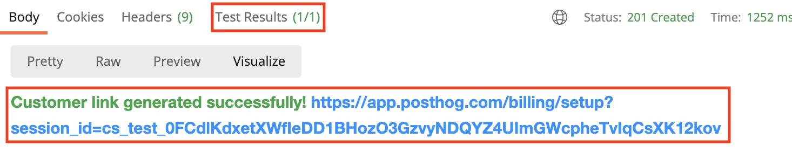

## Setting up billing
For customers with special pricing (i.e. very large volumes or Enterprise & Supported plans), we need to manually set up the billing information on the system. This page contains instructions for setting up billing. Please note this page covers the process after an official PostHog quote has been approved by the customer. For information before this stage, please refer to the [Sales](/handbook/growth/sales) section of the handbook.

### Self-hosted
Contrary to cloud plans, **all self-hosted _paid_ plans must be manually prepared** (i.e. there's no self-serve option). To set up billing for self-hosted, please follow these instructions:

#### Pre-setup
This process only needs to happen once.
1. Download the Postman collection from [license][license].
1. Open the collection & set up the required environment variables (per the instructions on the repo).
1. To test that everything is working as expected go to the "List licenses" request and make sure you get a 200 status code.

#### Setting up a subscription
1. Log in to the [Stripe dashboard](https://dashboard.stripe.com/customers) and go to customers.
1. Tap on New and fill out the form. At minimum please provide the customer's email address. However, it's recommended to add as much information as possible to make ongoing maintenance easier. It is particularly recommended to add the customer's Hubspot ID in the metadata section with a `hubspot_record` key (you need to save the customer record first).
1. Copy the customer ID from the Stripe dashboard (it starts with `cus_`).
1. Open the Postman collection and go to the "Create license [all options]" request.
1. If you don't have the price ID of the plan you can obtain it from the [products page](https://dashboard.stripe.com/products). Be sure to copy the **price ID, not the plan ID** (it should start with `price_`).
1. On the body section, adjust the appropriate parameters (for details on the parameters check out the [license][license] repo), 
    ```json
    {
        "valid_until": "2021-06-01T00:00:00.000000Z", // Timestamp (UTC) of when the license should expire (this won't affect the ongoing subscription agreement)
        "plan": "enterprise",
        "client_name": "Company, Inc.",
        "client_contact": "John Doe",
        "billing_email": "customer@example.com",
        "stripe_customer_id": "cus_iwdnHIV5",
        "stripe_price_id": "price_1HIbh9QhdPP",
        "coupon_id": "qthElB", // Optional (ID coupon for special pricing)
        "trial_end": "2021-01-22T00:00:00.000000Z" // Timestamp (UTC) of when the trial should end
    }
    ```
1. After sending the request, make sure that Test Results show `(1/1)` (see below) and open the visualize tab. You should see a message like the one below with a link to set up billing. **Send that link to the customer** who can use it to enter their card details on their own.



1. Finally, go to the _pretty_ tab and you will see the license key for the user. You may share that key with the customer once they have activated their subscription. After [#10](https://github.com/PostHog/license/issues/10) when the activation process happens automatically, you may share the license key with the customer immediately.

#### Activate subscription

As a customer, to redeem a license key:
1. Go to the license page in your PostHog instance. `<your url>/instance/licenses`.
1. Enter the received license key in the input.
1. Tap on activate license key and you are good to go.


[license]: https://github.com/posthog/license