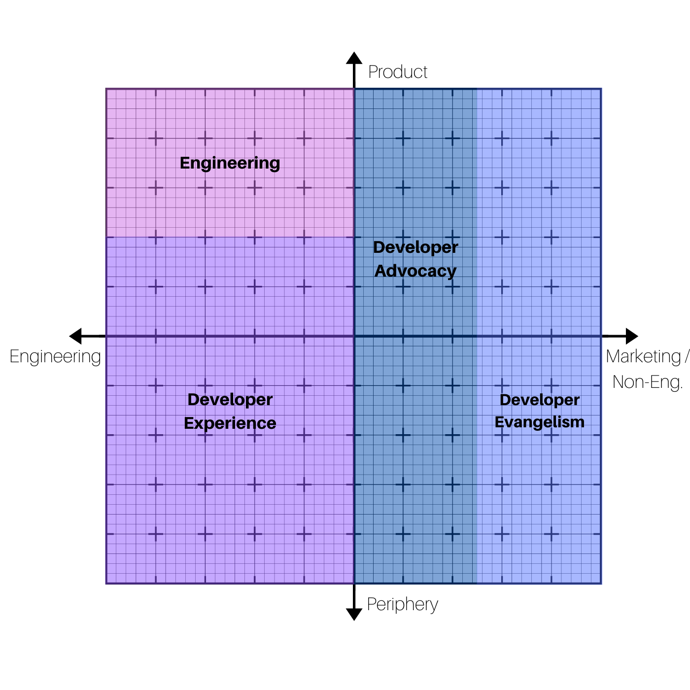

*Last Updated On: 16/03/2021*

As a developer-focused company offering a product that, in most cases, will require at least *some* developer involvement (and sometimes a lot of it!), Developer Relations is an important area to us.

While we are not a dev tool, an appropriate PostHog setup requires that the customer, at a minimum, integrate a PostHog library into their codebase. Additionally, engineers may also step in to:

- Deploy and maintain a self-hosted instance of PostHog
- Configure integrations with other services
- Export data from PostHog (e.g. via API)
- Add data into PostHog from third-party services
- Build a plugin for PostHog
- Run queries directly against the PostHog database (when self-hosting)

Finally, as an open core company with a large and well-established MIT-licensed offering, we are also in close contact with developers via:

- Bug reports
- Feature requests
- Pull requests

As a result, developers/engineers are a core part of our userbase and community, making them a key component of our success. 

Thus, this page will provide some insight into what Developer Relations at PostHog entails, with a particular focus on Developer Experience, the only subsection of DevRel that we currently have a specific role for.

## Making Sense of DevRel

Developer Relations is a confusing space, with a lot of controversy and disagreements about taxonomy.

For us, at the end of the day, the most important thing is that we have our own structure for conceptualizing this, rather than seeking an absolute truth - at the end of the day, every company approaches DevRel differently.

First, we see "Developer Relations" as the overarching field encompassing most of our interactions with developers as a company, be it via our product, direct contact with our team, or even an ad.

### Where we're at today

Here are some general areas at PostHog that fall under the umbrella of "Developer Relations", and who currently performs them:

|                Area                 |   Team(s) currently responsible   |
| :---------------------------------: | :-------------------------------: |
|   Core Product (Developer Tools)    | Engineering, Developer Experience |
|             Deployments             |            Engineering            |
|              Libraries              | Engineering, Developer Experience |
|          Technical Support          | Engineering, Developer Experience |
|      Integrations (+ Plugins)       | Developer Experience, Engineering |
|            Documentation            |       Developer Experience        |
|              Tutorials              |       Developer Experience        |
|         Developer Education         | Not really done beyond tutorials  |
|         Developer Marketing         |             Marketing             |
| Top of funnel content (dev-focused) |      Marketing, James (CEO)       |
|               Events                |        Marketing, Founders        |
|             User demos              |       Developer Experience        |
|        Community Management         | Developer Experience, Engineering |
|           User Interviews           |       Product, Engineering        |

As we can see, a lot of the roles that are linked to "Developer Relations" are actually performed by "other teams" - and that's not only fine, it's encouraged. 

Ultimately, for a dev-focused company, Developer Relations is bound to be a responsibility of everyone - albeit to largely varying degrees.

At PostHog, we also have engineers throughout the company - our CEO, Lead Designer, and Marketing Lead are all developers. This means that these responsibilities can comfortably be shared around teams instead of falling specifically under a Developer Relations team.

### Names and stuff...

However, as we grow, a DevRel team might make sense for us. As such, it's useful to think about some of the roles that would fit into this team.

To do so, let's borrow a definition from a [blog post by the Slack team](https://slack.engineering/defining-a-career-path-for-developer-relations/), which says:

*"Developer Relations (DevRel) is an interdisciplinary role that sits in a border space between product, engineering, and marketing."*

This definition may not be the exact truth, but it gives us a framework to conceptualize how some common DevRel roles might fit *at PostHog*:

Here, Engineering was added just for context, and there are also some notable omissions, such as Developer Educator, Developer Community Manager, Technical Writer, among others.

But let's make sense of this diagram:

**Axes**

On the Y-Axis we have "Product" at the top and "Periphery" at the bottom. "Periphery" encompasses everything that isn't necessarily the *core* product but is also a key component of our offering. This includes stuff like libraries, plugins, integrations, etc.

On the X-Axis we have "Engineering" on the left, which is rather self-explanatory: it encompasses the actual process of building things. On the other hand, we have "Marketing / Non-Engineering", which is an extension to the Slack definition to encompass non-Engineering tasks that also aren't Marketing. 

**Roles**

<!--

-->