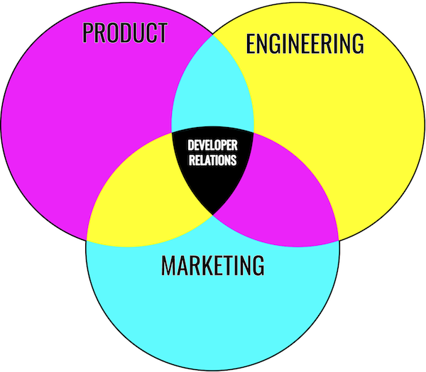

*Last Updated On: 04/08/2021*

As a developer-focused company offering a product that, in most cases, will require at least *some* developer involvement (and sometimes a lot of it!), Developer Relations is an important area to us.

Beyond being a developer-focused product, an appropriate PostHog setup requires that the customer, at a minimum, integrate a PostHog library into their codebase. Additionally, engineers may also step in to:

- Deploy and maintain a self-hosted instance of PostHog
- Configure integrations with other services
- Export data from PostHog (e.g. via API)
- Add data into PostHog from third-party services
- Build a plugin for PostHog
- Run queries directly against the PostHog database (when self-hosting)

Finally, as an open core company with a large and well-established MIT-licensed offering, we are also in close contact with developers via:

- Bug reports
- Feature requests
- Pull requests

As a result, developers/engineers are a core part of our userbase and community, making them a key component of our success. 

Thus, this page will provide some insight into what Developer Relations at PostHog entails in the near to medium term.

## Defining Developer Relations at PostHog

Developer Relations can be a confusing space, with a lot of controversy and disagreements about taxonomy.

For us, the most important thing is that we have our own structure for conceptualizing this, rather than seeking an absolute truth - at the end of the day, every company approaches DevRel differently.

At PostHog, we see "Developer Relations" as intersecting Product, Engineering, and Marketing. This is refleted in the work we do and the skills that people have who take on developer relations roles here.

The future may see developer relations becoming its own [small team](/handbook/people/team-structure/why-small-teams) but for the moment we work within the [growth engnieering](https://posthog.com/handbook/people/team-structure/growth-engineering).

## Near to medium term focus

Our near to medium term focus is as follows, in priority order:

1. Improve educational content
2. Support existing PostHog community
3. Engage with broader developer communities

### Improve educational content 

The near term focus for developer relations at PostHog is to improve the educational content available to developers (and potentially non-developer users via user guides). We broadly define this as **Education** with the specifics in the near term being the [PostHog documentation](/docs).

### Support existing PostHog community

We have a thriving community across [Slack](https://posthog.com/slack) (link will launch the PostHog community Slack) and [GitHub](https://github.com/posthog). We have programs in place to gather feedback, encourage and manage contribution, and reward positive community activities. But we feel we can do more.

### Engage with broader developer communities

Once we gain a better understanding of which developer communities benefit the most from PostHog we'll begin supporting and engaging with those communities. We have work to do before we make a start here.

If you believe that your community members would benefit from PostHog, [get in touch](mailto:hey@posthog.com).

## What's next?

At PostHog we work in the open. As such, expect pull requests and updates to this page as we work to further define, build, and execute Developer Relations @ PostHog.