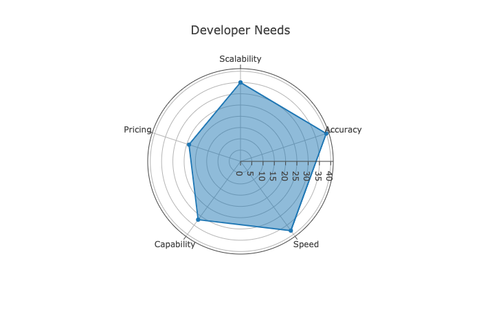
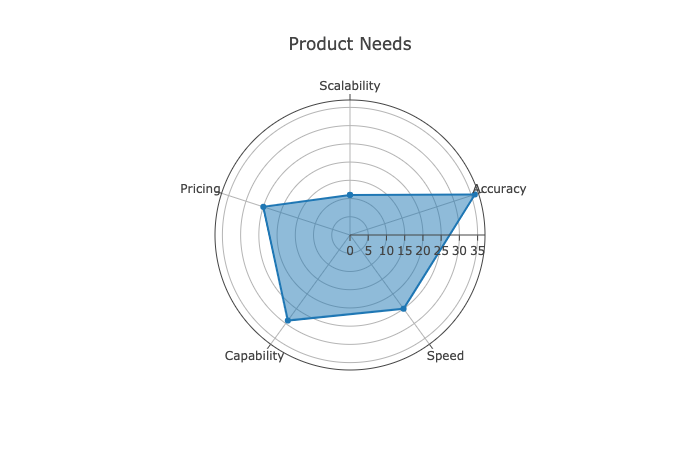

PostHog is used by a very wide variety of companies, teams and individuals - everyone from Fortune 500 companies to individual hobbyists. This document lays out general trends for two personas we typically focus on for our paid product. 

PostHog is a developer-focused company. We aim to support developers or technically capable individuals as our core users and buyers, from indie game developers to Product Engineers in enterprise businesses. 

Indie developers and hobbyists are an important audience for PostHog and are the primary users for PostHog Open Source. This document lays out general trends for two personas we typically focus on for our paid products.

Each of the two personas below include a short persona story for flavour, as well as indicative information and 'I statements' to explore key concerns. 

## Persona: Sam Software

| **Job titles**                                                                                                                                         | **Role**                                    |
|--------------------------------------------------------------------------------------------------------------------------------------------------------|---------------------------------------------|
| Senior or Lead Engineer, Tech or Engineering Lead, Product Engineer, Senior Software Developer or Engineer, Principal Engineer | Initiator, Influencer, Decision maker, User |

### Persona story
Sam is a Senior Software Engineer at a mid-sized developer tool company. Obviously very technical, Sam has more than 5 years of experience as a full stack developer and is comfortable with several common programming languages and libraries. 

28 years old, Sam doesn’t often post on Facebook or LinkedIn, but is more active on Twitter and Reddit and likes to engage with specific developer communities there. 

Sam first found PostHog through Google, but had seen the company mentioned before on sites such as HackerNews. Sam was specifically looking for a self-hosted alternative to other tools. Sam liked that PostHog seemed more technical than the likes of Amplitude or Pendo, and the fact that it was open source was interesting too. 

The main trigger for moving forward was that Sam could self-host the analytics and didn’t need to share data with third parties. Deploying quickly and working iteratively would be a definite advantage, especially as PostHog promised to scale through ClickHouse. Sam didn’t think much about pricing at this stage. 

After looking at a few of the docs, Sam tried the self-hosted option and deployed to AWS, then joined the Slack group in case there were any specific questions. The first thing Sam did once PostHog was running was create a funnel based on an onboarding flow, before delving into heatmaps and dashboards.
    
### Pain tolerance
Sam understands that PostHog isn’t a mature tool and so tolerates more friction than you may expect. Sam can also mitigate pain by controlling which updates are deployed when or by solving issues directly via pull requests. However, the balance between Speed/Accuracy is important to Sam, especially as scale increases. 

### Goals
- I want to self-host, so we don’t risk data breaches or compliance concerns.
- I want to see how features I’ve worked on are performing
- I want to enable the Product team without consuming more Engineering time
- I want a tool that can give us fast insights and scale to our needs.

### Challenges
- I’m concerned about the risk of breaches and who has access to data.
- I’m concerned about driving internal adoption for new tools. That can be tricky.
- I’m concerned about introducing tools which enable other teams to use up more of Engineering’s time.

### Deal-breakers
- It’s a deal-breaker if I have to put up with limited-time trials.
- It’s a deal-breaker if I have to go through a long, complicated sales process.
- It’s a deal-breaker if I have to spend ages setting it up and getting it working. Or if it needs constant maintenance.

### Deal-makers
- The faster I’m able to deploy and get started with a tool, the more I’ll like it.
- I’d love it if I can find out everything I need without speaking to a salesperson.
- I’d love it if I’m able to find answers to questions by myself and can get things working without needing to ask for help.
- I'd love it if I can test the product out or see it demonstrated at a scale similar to my needs.

## Persona: Pam Product

| **Job titles**                                                                                                                                         | **Role**                                    |
|--------------------------------------------------------------------------------------------------------------------------------------------------------|---------------------------------------------|
| Technical or Senior Product Manager, Chief or Head of Product, Product Engineer, Product Lead, Product Manager | Initiator, Influencer, Decision maker, User |

### Persona story
Pat is a Senior Product Manager at an early-stage SaaS company making productivity software. Pat is reasonably technical — he can get by with SQL, for example — but not a developer by any means. Pat just knows enough to work well with them!

28 years old, Pat is career-minded and active on LinkedIn, as well as Twitter and other platforms or private communities for knowledge sharing. Pat also likes to discover new products through ProductHunt or Kickstarter, among others. 

Pat started looking for a new analytics tool after becoming frustrated at using Google Analytics for product decisions and started by asking for recommendations from colleagues before widening the search to Google and review sites such as G2. In addition to PostHog, Pat also looked at Amplitude and Heap.io, trying their free trial options. Some other tools Pat required queries in SQL, which Pat ruled out in favour of no-code options.

Pricing was a bit of an issue for some tools Pat looked at, especially as some of them were lacking particularly interesting tools, such as session recording. This, combined with the option to avoid compliance and data challenges by self-hosting, tipped Pat into choosing PostHog. Scalability wasn’t something Pat really thought about, but feature flags seemed exciting from an experimentation point of view. 

Deploying PostHog wasn’t something Pat was able to do solo, but with the docs and a little help from the engineering team it was simple enough. Once it was running the first thing Pat did was look at recent trends and session recordings, before creating a dashboard of key metrics.
    
### Pain tolerance
Pat is willing to tolerate a few rough edges, so long as the results are accurate and easy to interpret. Having come from tools such as Google Analytics, Pat has high expectations for consistency and needs to understand any biases or skews at play.  

### Goals
- I want to interrogate product data in a tool designed for my use-cases. No more GA!
- I want to collect quantitative and qualitative insights about product usage.
- I want to be able to share data with relevant people and protect it from others. 

### Challenges
- I’m concerned about paying exorbitant fees or getting locked into long contracts for tools that may not solve our needs.
- I’m concerned about becoming a bottleneck or introducing a tool that isn’t sufficiently self-serve. I don’t want to have to ask for Engineering help all the time. 
- I’m not concerned about speed, but I am concerned about knowing why things are slow. If a dashboard isn’t in real-time, I need to know how far behind it is lagging and why.

### Deal-breakers
- It’s a deal-breaker if I start making decisions based on inaccurate data.
- It’s a deal-breaker if the price is too high for the benefit I believe I'll get. 

### Deal-makers
- It’s a deal-maker if the results I get are consistent or integrate well with other tools.
- It's a deal-maker if I have confidence I'll be able to get insights which improve my product.
