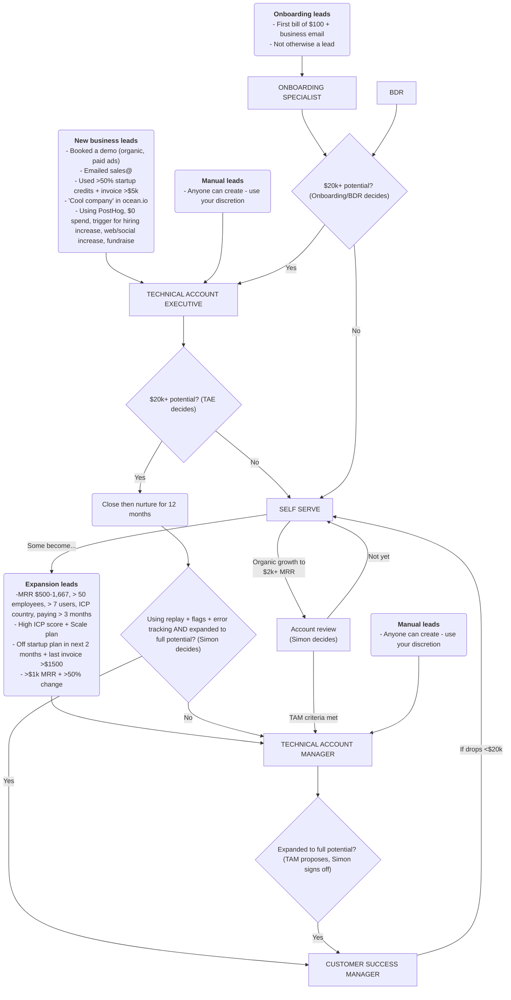

This is a high level overview of where leads and customer accounts go at different stages of their interactions with us. We use various criteria to figure out where the best place is for a customer to go. You find further details in this section of the handbook. 

As we grow, this will keep changing!

