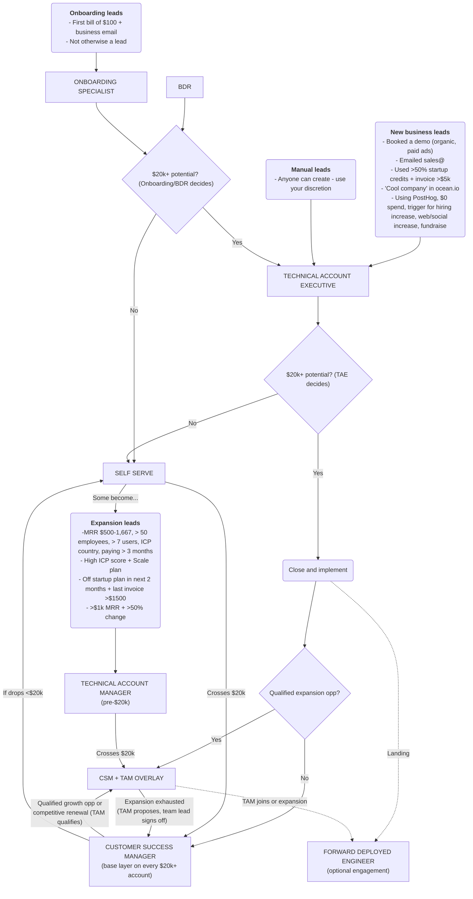

This is a high level overview of where leads and customer accounts go at different stages of their interactions with us. We use various criteria to figure out where the best place is for a customer to go. You find further details in this section of the handbook. 

As we grow, this will keep changing!

```mermaid

flowchart TB
    A@{ label: "<b>New business leads<br></b>- Booked a demo (organic, paid ads)<br>- Emailed sales@<br>- Used &gt;50% startup credits + invoice &gt;$5k<br>- 'Cool company' in ocean.io<br>- Using PostHog, $0 spend, trigger for hiring increase, web/social increase, fundraise" } --> C["TECHNICAL ACCOUNT EXECUTIVE"]
    B["<b>Expansion leads</b><br>-MRR $500-1,667, &gt; 50 employees, &gt; 7 users, ICP country, paying &gt; 3 months<br>- High ICP score + Scale plan<br>- Off startup plan in next 2 months + last invoice &gt;$1500<br>- &gt;$1k MRR + &gt;50% change"] --> D["TECHNICAL ACCOUNT MANAGER<br>(pre-$20k)"]
    n1["<b>Manual leads</b><br>- Anyone can create - use your discretion"] --> C
    n2@{ label: "<b>Onboarding leads<br></b>- First bill of $100 + business email<br>- Not otherwise a lead" } --> n8["ONBOARDING SPECIALIST"]
    n11["BDR"] --> n9
    n8 --> n9["$20k+ potential? (Onboarding/BDR decides)"]
    n9 -- Yes --> C
    n9 -- No --> n3["SELF SERVE"]
    C --> n4["$20k+ potential? (TAE decides)"]
    n4 -- No --> n3
    n4 -- Yes --> n5["Close and implement"]
    n5 --> n7["Qualified expansion opp?"]
    n7 -- No --> n6["CUSTOMER SUCCESS MANAGER<br>(base layer on every $20k+ account)"]
    n7 -- Yes --> n13["CSM + TAM OVERLAY"]
    n3 -- "Some become..." --> B
    n3 -- "Crosses $20k" --> n6
    D -- "Crosses $20k" --> n13
    n6 -- "Qualified growth opp or<br>competitive renewal (TAM qualifies)" --> n13
    n13 -- "Expansion exhausted<br>(TAM proposes, team lead signs off)" --> n6
    n6 -- If drops <$20k --> n3

    F["FORWARD DEPLOYED ENGINEER<br>(optional engagement)"]
    n5 -. "Landing" .-> F
    n13 -. "TAM joins or expansion" .-> F

    A@{ shape: rounded}
    B@{ shape: rounded}
    n1@{ shape: rounded}
    n2@{ shape: rounded}
    n8@{ shape: rect}
    n4@{ shape: diam}
    n3@{ shape: rect}
    n5@{ shape: rounded}
    n7@{ shape: diam}
    n6@{ shape: rect}
    n9@{ shape: diam}
    n11@{ shape: rect}
    n13@{ shape: rect}
    F@{ shape: rect}

```

## What this means

- **Every $20k+ account has a [customer success manager](/handbook/cs-and-onboarding/customer-success).**
- **A [technical account manager](/handbook/growth/sales/how-we-work#technical-account-managers) is an overlay.** A TAM joins when there's a qualified expansion opportunity to work, and comes off at quarter end once expansion is exhausted. [Account allocation](/handbook/growth/sales/account-allocation) covers how TAMs get added and removed.
- **A [forward deployed engineer](/handbook/forward-deployed-engineering/overview) is an optional engagement, not an owner.** The dotted lines mark three points where the account team should consider offering one: landing, a TAM joining, and expansion. [Where FDE fits in the customer lifecycle](/handbook/forward-deployed-engineering/working-with-sales-and-cs#where-fde-fits-in-the-customer-lifecycle) covers when and how.
