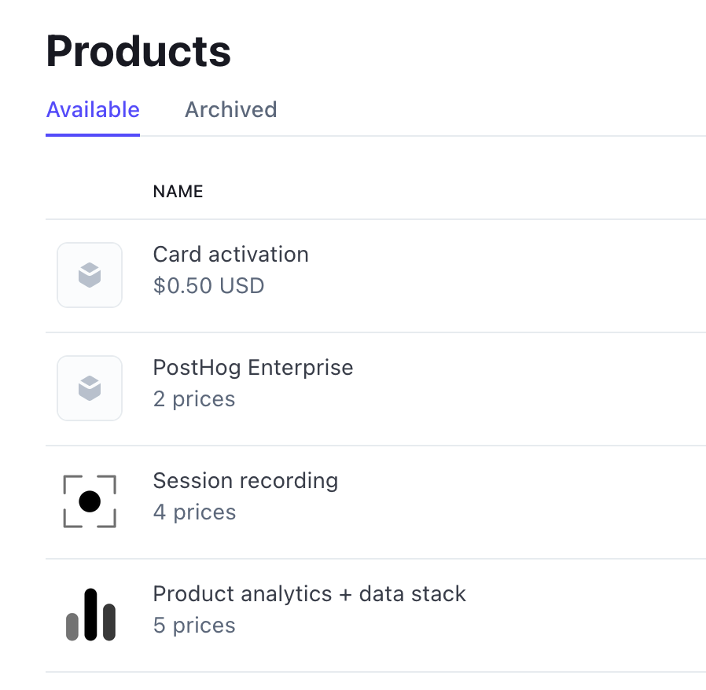
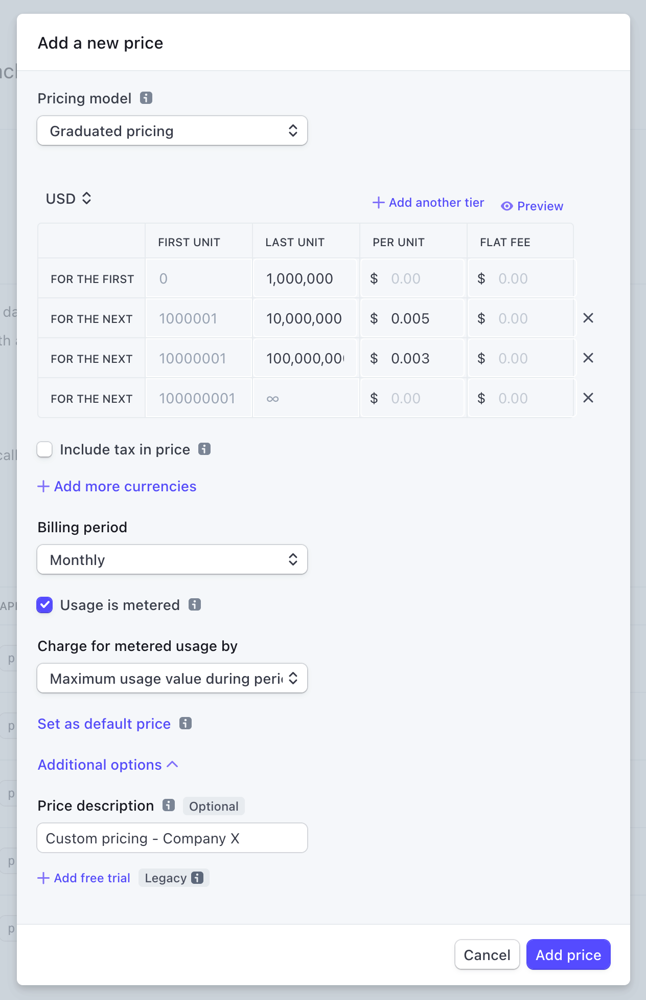
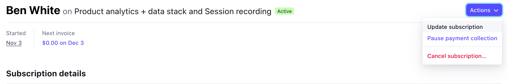

## Managing billing

All PostHog instances talk to a common external **Billing Service**. This service is the single point for managing billing across PostHog Cloud US, PostHog Cloud EU (and ,formerly, self-hosted customers). 

The Billing Service is the source of truth for product information, what plans are offered on those products (eg a free vs a paid plan on Session Replay), and feature entitlements on those plans. Our payment provider Stripe is the source of truth for customer information, invoices, and payments. The billing service communicates with Stripe to pull all the relevant information together before responding to customer requests.

### Annual Plan Automation

To ensure consistency in the setup of annual plans we have [Zapier Automation](https://zapier.com/app/zaps/folder/1809976) to take care of all of the Stripe-related object setup.

#### Loading contract details

Once an [Order Form is closed in PandaDoc](/handbook/growth/sales/contracts#routing-an-order-form-for-review-and-signature), Zapier will add a new row to the [Annual Plan Table](https://tables.zapier.com/app/tables/t/01H9QPTRYEZVGFTJ84XMCYQFSK) with the PandaDoc ID of the document.

In the table you can then click the button to [Load from PandaDoc](https://zapier.com/app/zap/207323516) - this will look up variables from the Order Form and add them to the table including:
* Reformatting human-readable numbers into Stripe-parsable ones (e.g. 60 million -> 60000000).
* Setting checkboxes to show whether a product is included
* Setting drop-down menus to show whether an overage rate is custom

#### Manual Edits Required

After loading the information from PandaDoc, you should review it for correctness as well as update the following:
1. The Contact Email column will have all signer emails, including the PostHog team.  Select the correct customer email and delete the others as appropriate.
2. Add the Stripe Customer ID (note you might need to create one and add address information if they've not previously been a customer).

#### Create the Up-Front Invoice and Subscription Prices

You can now click the [Create Annual Subscription](https://zapier.com/app/zap/206913950) button.  Using the data from the table row where the button was clicked this will:
1. Create a draft Invoice object against the Stripe Customer Object.
2. Add the ID of the Invoice to the table (for easy review later on).  The due date of the invoice will be the Contract Start Date + 30 days which are our standard payment terms.  **You might need to manually change this if we have different terms with the customer.**
3. Add the up-front price for each of Product Analytics, Group Analytics, Session Replay, Feature Flags and Enterprise to the draft invoice.
4. Where we have custom overages, create a Stripe Price for each of those and populate the table with the Price IDs.  _NOTE: We don't currently do anything here in cases where overage is none or free - need to figure out in future if this is necessary._
5. Enable the Amortization and Schedule Subscription buttons in the table.

#### Amortize Invoice

As Zapier works asynchronously we need to wait until the table is updated with all of the annual prices (indicating that the invoice is ready).  Clicking the [Amortize Invoice](https://zapier.com/app/zap/207286989) button will set the correct metadata for our revenue tracking on the invoice.

#### Schedule Subscription

Once all of the Price IDs are in place in the table, we can [Schedule the Subscription](https://zapier.com/app/zap/207295029).  Using the data from the table row where the button was clicked this will:
1. Consolidate all of the Price IDs into a query string which the Stripe API accepts.
2. Create a Subscription Schedule (as it may start in the future) containing all of the prices.  We calculate the number of iterations based on the term of the contract.  An iteration in this case is 1 year, the maximum allowed by Stripe.
3. Add the ID of the Subscription Schedule to the table

#### Checks and going live

The invoice will be in a draft state in Stripe.  You'll need to use the Invoice ID in the table to find it in Stripe.  Check it to make sure that everything looks correct, and that you have set up Customer Billing/Shipping addresses and Tax ID on the Customer object correctly.  Once you're happy with all of that you can send the invoice to the customer for payment.

The subscription will go live on the start date.  Once it is live you'll need to update the customer object in the [billing admin server](https://billing.posthog.com/admin) with the relevant Subscription ID.  Don't forget to also sync the customer record in the billing server with Stripe to pick up the new plans.

### Stripe Products & Prices

> ⚠️ Modifying products and prices should be done carefully. If you aren't sure at any point contact the #growth team to check what you are doing

Each of our billable Products has an entry in Stripe with each Product having multiple Prices.
We use a billing config file to determine what is shown in the UI and how billing should behave.
We use very limited metadata on some of these prices to allow the Billing Service to appropriately load and offer products to the instances:

#### Custom metadata
**On Stripe Products**
* `posthog_product_key`: `posthog_analytics` | `session_replay` | ... -> This allows PostHog to find and map the relevant products. **Important:** There should never be more than 1 Stripe product with the same `posthog_product_key`. The list of keys is defined in the main billing config.

**On Stripe Product Prices**
The following keys are used to manage Startup prices:
* `plan` - Any Startup plan prices must have the `plan` metadata set to `startup` to have their subscription automatically moved to the default (paid) prices. If not, when their subscription ends they will instead be switched to the free plans for all products. 
* `valid_days` -> The number of days a price is valid for, before automatically switching to another plan (the `default` plan unless `move_to_price_id` is set). Useful to create pricing that is only valid for a specific period, e.g. for the startup plans. Note: if more than one price with `valid_days` is added to a subscription, the validity period will be the *shortest* of the two, before resetting all plans to the default ones 
* `move_to_price_id` -> Can be used to specify if the customer needs to be moved to a specific pricing, rather than the default one, at the end of the subscription period.

### Working with pricing

Each Product has multiple prices that can be used in a subscription. Which price is default depends on the billing config file.
The `default` price in Stripe does not affect the actual default price for a product. This is instead defined in the billing config.
In general, if coming from the UI, a customer will subscribe to certain prices depending on the config. There are special prices named `Free` which can be used to give a product for free. These can be added manually and are typically used for Enterprisey customers who pay a flat fee up-front and $0 for the actual usage (which we still want to track but not charge for).

#### Types of billing plans we support
We generally support the following types of billing plans:

- Standard metered
  - This includes usage-based and metered, even if it has custom price tiers or is a special program like the Startup program.
- Metered, but with discount coupon
- Flat first tier, metered after
- Up-front payment, $0 first tier, metered after
- Flat up-front, no metering (renegotiate contract if they go over)

If at all possible, it's best to stay with these types of billing plans because we already support them, and adding extra stuff will increase complexity. If you do need to add a different type of billing plan, chat with the growth team before agreeing to anything with a customer to make sure it's possible!

#### Coupons and Discounts
As much as possible the existing prices should be used in combination with `Coupons` to offer custom deals to customers. Coupons are applied to the _Customer_ in Stripe, not to the customer's subscription. 

1. Visit the customer in the Stripe dashboard.
2. Select Actions -> Apply Coupon.
3. Select the coupon to apply.
4. The UI should soon reflect the change. If you need it to reflect immediately, use the "Sync selected customers with Stripe" action in Django Admin.

When calculating usage limits, discounts are taken into consideration _before_ the limit is calculated. This means that if the customer sets a billing limit of $200 and has a 20% discount, they will get charged $200 for _$250 worth of volume_. 

#### Bespoke prices
 
In more complex cases it may be useful to create a custom pricing configuration for a product(s).
To do this:

1. Go to the appropriate product in question (**do not create your own Product**)
1. Click "Add another price"
1. **Important**: For metered products (e.g. Product Analytics, Session Replay) select `Graduated Pricing`, `Usage is metered` and `Maximum usage during period`. This is crucial as the Billing Service will always send the maximum number of events for the billable period, respecting any billing limits set at the time.
1. Expand the `additional options` and add a straightforward Price Description like `Custom - {date of creation}`
1. Add the tiers as you see fit
     - If the custom prices are for a product and addons (eg. Product analytics and Group analytics) the tier volumes need to be exactly the same between the two products/prices. If tier 3 for Product analytics is up to 15M and tier 3 for Group analytics is for 16M, you'll get errors from the billing service).
    - If you are making a custom price for just one product (ie. someone is getting special pricing for Product Analytics but will get the normal pricing for Group Analytics), make sure the tiers match up between the main product and the addons.
1. Add custom metadata if needed.

### Plans
> ⚠️ Modifying plans should be done carefully. If you aren't sure at any point contact the #growth team to check what you are doing

You can find a list of available plans in the billing repo. These are found inside `costants/plans`, divided by folder.
Each plan can have a list of features, and a price.
Features are used to infer which features are available in the product, for a customer on that plan.
You can manually change the plan for a customer by updating the `plans_map` in the billing admin panel.

### Giving customers a free trial

1. Find the Organization in the Billing Service Admin portal
2. Find the `Free Trial Until` field and update that to the appropriate date
3. The next time that Customer visits PostHog, their `AvailableFeatures` will be updated to reflect the standard premium features (they might have to refresh their page to properly sync the new billing information).
4. Once this date passes their `AvailableFeatures` will be reset to the free plan unless they have subscribed within this time.

### Updating subscriptions

Stripe subscriptions can be modified relatively freely for example if moving to a custom pricing plan. 

1. Look up the customer on [Stripe dashboard][stripe_dashboard] using their email address or Stripe ID (this can be found in the Billing Service admin under `Customers`).
1. Click on the customer's current subscription.
1. Click on _Update subscription_.
1. Remove the old item from the pricing table and add the new item.
    - Enterprise: Use existing enterprise prices or create new ones.
    - Startup plan: Use existing Startup plan prices.
1. Click on _Update subscription_. Do not schedule the update for a later time. There will be unintended side effects if the changes are not applied immediately.
1. Do not prorate the subscription.
1. The changes should be reflected for the user within a few minutes.

> **NOTE:** Removing a metered product price (events, recordings) and adding a new price will likely reset the usage. This is fine as the Billing Service will update it during the next sync.

### Self-hosted differences

Self-hosted billing is no longer supported except for legacy customers who were using the paid kubernetes deployment.

