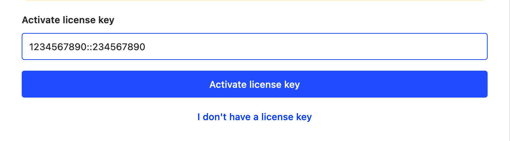

## Managing billing (V2)

With the addition of our "V2" Billing architecture, billing for **self-hosted** and **cloud** is almost identical, with all PostHog instances talking to a common external **Billing Service**. This service is the single point for managing billing across PostHog Cloud US, PostHog Cloud EU and self-hosted customers. It leans heavily on our payment provider Stripe for both showing what products are available as well as controlling things like free-tier allowances.

### Key differences to Billing V1
* We no longer administer billing from the cloud admin panel but rather from the Billing Service admin panel
* `Plans` are no longer used. All configuration and custom pricing / plans is done in Stripe

### Stripe Products & Prices

> ⚠️ Modifying products and prices should be done carefully. If you aren't sure at any point contact the #growth team to check what you are doing

Each of our billable Products has an entry in Stripe with each Product having multiple Prices. We use metadata on these prices to allow the Biling Service to appropriately load and offer products to the instances:

#### Custom metadata
**On Stripe Products**
* `posthog_type`: `events | recordings | enterprise` -> This allows PostHog to find and map the relevant products. **Important:** There should never be more than 1 Stripe product with the same `posthog_type`

**On Stripe Product Prices**
* `plan`: `standard | enterprise | startup | free` -> Identifies the plan that this price belongs to. If not set, the `default` price is used.

### Upgrading a customer to Enterprise
Enterprise plans consist of two things:
1. A unique Enterprise product charging the fixed price per month
1. Different Prices for each of the metered products (Events, Recordings)

Using the **Updating Subscriptions** flow below:
1. Remove all other prices in the subscription
1. Search for `enterprise` 
1. Add the `Enterprise Product` as well as the other products (Events, Recordings) labelled with `Enterprise`

### Custom pricing 

Each Product (Events, Recordings, Enterprise) has multiple prices that can be used in a subscription. The `default` price is the one that will be applied by the standard subscribe flows but there are also prices for the metered products (Events, Recordings) such as `startup` or `enterprise` which can be applied. For very special cases, each product also has a `free` price that charges nothing whilst enabling the features.

As far as possible these existing prices should be used in combination with `Coupons` to offer custom deals to customers. In more complex cases however it may be useful to create a custom pricing configuration for a product(s). To do this:

1. Go to the appropriate product in question (**do not create your own Product**)
1. Click "Add another price"
1. **Important**: For metered products (e.g. Events, Recordings) select `Graduated Pricing`, `Usage is metered` and `Maximum usage during period`. This is crucial as the Billing Service will always send the maximum number of events for the billable period, respecting any billing limits set at the time.
1. Expand the `additional options` and add a straightfoward Price Description like `Custom - fixed pricing
1. Add the tiers as you see fit

### Updating subscriptions

Stripe subscriptions can be modified relatively freely for example if adding the Enterprise plan or moving to a custom pricing plan. 

1. Look up the customer on [Stripe dashboard][stripe_dashboard] using their email address or Stripe ID (this can be found in the Billing Service admin under `Customers`).
1. Click on the customer's current subscription.
1. Click on _Update subscription_.
1. Remove the old item from the pricing table and add the new item. 
1. Click on _Update subscription_. Do not schedule the update for a later time. There will be unintended side effects if the changes are not applied immediately.
1. The changes should be reflected for the user within a few minutes.

> **NOTE:** Removing a metered product price (events, recordings) and adding a new price will likely reset the usage. This is fine as the Billing Service will update it during the next sync.

### Self-hosted differences

Self-hosted customers as of 1.42.0 can signup for premium services within the product just as a Cloud customer would. The only additional step that occurs in the background is that a `License` is generated and automatically saved in their PostHog database and the license key emailed to them. This `License` does not actually enable any functionality but acts as a sort of API Key to talk to the Billing Service so that they can setup payment just as the Cloud instances do. Unlike the Cloud edition, only one Billing Customer can be created per self-hosted License.

#### Troubleshooting self-hosted

1. Something goes wrong during the activation flow
  * The customer should have a license key sent to their email which they can enter manually on the Organization Billing page
  
  
2. The instance is air-gapped (blocked from calling external services)
  * If the customer can allow traffic to `billing.posthog.com` at least during the activation flow then they can do this and signup as normal.
  * If not, they will need some direct support to enter the license directly. Please reach out to #growth team who can advise here.

## Managing billing (Legacy)

> ⚠️ NOTE: Below is documentation for the legacy billing system. This applies to **Cloud customers who subscribed before 11.2022** or **self-hosted customers on version < 1.42.0**

This handbook section is sort of the operation manual for the billing engine. If you're looking for the technical details or need to troubleshoot something check out the relevant [tech docs](https://github.com/PostHog/posthog-cloud#additional-docs)

### Self-hosted

For information before this stage, please refer to the [Sales](/handbook/growth/sales/sales-operations) section of the handbook.

#### Setting up a subscription

You can send customers to https://license.posthog.com and they can self-serve a license.

You can create bespoke pricing with the following steps:

1. Go to https://dashboard.stripe.com/products and click 'Add product'
  2. Alternatively you can add a new price to an existing product
  1. If you want the user to get enterprise features, you need to click `Add metadata` with key `plan` and value `enterprise`
1. Give it a name (likely the name of the customer) and description. The customer will see this name!
1. Pricing model select "Graduated model"
   1. The first tier is likely a flat fee, all the other tiers are likely unit based prices
1. Select "Usage is metered"
1. "Charge for metered usage by" should be set to `Sum of usage values during period`
1. Save product, and copy the API ID under "Pricing" (starts with `price_`)
1. Send customer to `https://license.posthog.com/?price_id=price_...`

#### Activate subscription

As a customer, to redeem a license key:
1. Go to the license page in your PostHog instance. `<your url>/instance/licenses`.
1. Enter the received license key in the input.
1. Tap on activate license key and you are good to go.

#### One customer with multiple licenses

If a customer wants to have multiple licenses for multiple environments, but be billed from the same account:
1. Get the user to sign up for a license key as per normal.
1. Manually go to https://license.posthog.com/admin/, find the license key. Keep this tab open.
1. In another tab, create a new license key. You can use the same client name, but you'll need to use a different email. Just add `+one` to the email, so test+one@posthog.com. Copy across the `Stripe customer id`, `Stripe price id`, `Stripe subscription id` and `Stripe subscription item id`. Also tick **Billing ready**.
1. Add a note linking back to the original license + an explanation.
1. Click save and send the new key to the user. Repeat for how many license keys they need.

#### Yearly invoice

1. (if user already created a license) Cancel their subscription in Stripe
2. Manually create an invoice on the customer with the correct price. Either charge them using the method on file or send them an invoice with a payment link
3. Once the invoice is created, add the following fields to the "metadata" section on the invoice:
   `amortize-until`, with the value being the month until which to amortize, ie `2023-03`
   `amortized-dollar-amount`, with the MRR we should account for with this invoice. Probably the total amount of the invoice divided by 12.
4. (if we have agreed an overage rate with them) Set up a Price and Subscription to track and bill for the overage at the end of the contract:
   1. Create a new Price against the relevant Stripe Product:
      - Usage type - Metered usage
      - Aggregation mode - Sum across all usage records during period
      - Currency - USD
      - Interval - Yearly
      - Pricing - Graduated Pricing
      - For the first tier set the upper limit as your contract event amount, with a flat fee of $0
      - For the second tier set the overage price you have agreed
      - Name - _Customer Name_ annual contract overage _YYYYMMDD_
   2. Create a Subscription for the Customer using the above price
5. (if user hasn't created a license yet) Manually create a license in https://license.posthog.com/admin/. You should link the stripe customer id, but you can leave everything else blank. Make sure you tick `Billing ready`.

### Cloud billing
Cloud billing may be set up using self-serve. For this, the new user just needs to go to the [organization billing](https://app.posthog.com/organization/billing) page and select one of the available plans (internally please note these plans must have both `is_active` and `self_serve` set to `True`). Billing can also be set up from account creation, by adding the `plan_key` as a query string parameter (e.g. `https://app.posthog.com/signup?plan=standard`), this is helpful for redirections from landing sites where a plan has already been selected.

For PostHog Team: to set up a billing agreement, please follow these steps.
1. Go to the [Django admin](https://app.posthog.com/admin/) and open the [Organization billing](https://app.posthog.com/admin/multi_tenancy/organizationbilling/) objects.
2. Search for the relevant user (either by name, company name, email or Stripe IDs).
3. Once you have the appropriate user, select the plan you want to assign to the organization.
4. In addition to the plan, be sure to check the "Should setup billing" checkbox and click save.

After this the user will be prompted in their app to enter their card details to initiate the billing agreement.

If you need to activate a plan bypassing actual billing on Stripe (this should be extremely rare!), just set up a `billing_period_ends` that is after today's date (and be sure that "Should setup billing" is not checked).

#### Non-profit organizations
We offer 50% discount to non-profit companies (see [pricing](/pricing#non-profits)). The activation process is as follows:
1. Non-profit company reaches out to PostHog, likely via email.
1. On our end we validate the company is eligible for the discount.
1. Validate the customer has signed up for the standard plan and completed the billing process. Easiest done in [Stripe dashboard][stripe_dashboard], look up the customer using the owner's email address. The Standard Plan subscription must be active **and** the customer must have a valid payment source on file.
1. On the customer page click on Actions, and then _Apply coupon_. Select coupon "Non-profit organization discount" (ID: `NxipELS0`)
1. Let the customer know via email.

#### Startup & YC plans
We offer [a deal](/handbook/growth/sales/yc-onboarding) for certain YC companies & other startups, while the details of this deal change periodically (and are documented in the main website and/or ops repo), here are the details on how to apply the plan for a company. Internally, these plans have special logic handling in the [posthog-cloud][posthog-cloud] repo. If our deal terms changes (current details detailed below), a new plan needs to be added. This custom logic is handled in `multi_tenancy/models.py#handle_post_card_validation`). Currently we only have one plan (`plan_key = startup`) which provides free billing for 1 year and a 20M monthly event allocation.

**How to apply it**
- Follow the steps above (Go to Django admin, find the relevant customer, ...).
- For the plan, you'll choose the custom startup plan, `plan_key = startup`. Be sure to check the `should_setup_billing` checkbox!
- Let the customer know they need to enter their card information at the prompt (shown on every page of the app).
- After they enter their card information successfully, the plan will be activated and the prompt will disappear. The plan will last for 365 days from the moment they confirm their card details.

**General structure & notes**
- The way this plan works internally is that it creates a checkout session with `mode = setup` and with a card pre-authorization charge instead of a subscription agreement. This way, we validate the card is active and it gets saved on Stripe for future use. When we receive confirmation the charge has been processed and the card saved (via the `payment_intent.amount_capturable_updated` webhook), we do the custom logic handling to enable the plan for 365 days.
- There's an issue, [posthog-cloud#92](https://github.com/PostHog/posthog-cloud/issues/92), with some details on tech debt / improvements to this flow.

#### Updating subscriptions
This section provides instructions for a PostHog team member to change subscriptions for a existing customer (e.g. if they want to upgrade/downgrade, move from legacy plans to standard plans, etc.)
1. Look up the customer on [Stripe dashboard][stripe_dashboard] using their email address or Stripe ID (this ID can be obtained from Django Admin too, under `OrganizationBilling` object).
1. Click on the customer's current subscription.
1. Click on _Update subscription_.
1. Remove the old item from the pricing table and add the new item. 
1. Click on _Update subscription_. Do not schedule the update for a later time. There will be unintended side effects if the changes are not applied immediately.
1. Find the corresponding `OrganizationBilling` on [Django Admin](https://app.posthog.com/admin/multi_tenancy/organizationbilling/). You can look up by the same email address.
1. Update the **new billing plan and the new Stripe subscription item ID**. The subscription item ID starts with `si_` (not to be confused with a Subscription ID). This **ID will have changed**, the Subscription ID remains the same.

[license]: https://github.com/posthog/license
[posthog-cloud]: https://github.com/posthog/posthog-cloud
[stripe_dashboard]: https://dashboard.stripe.com/

