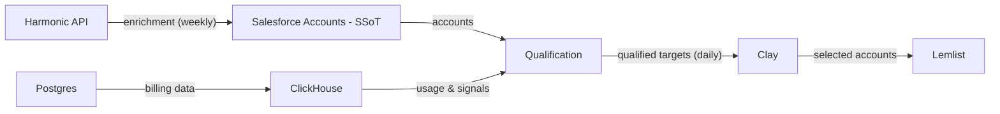
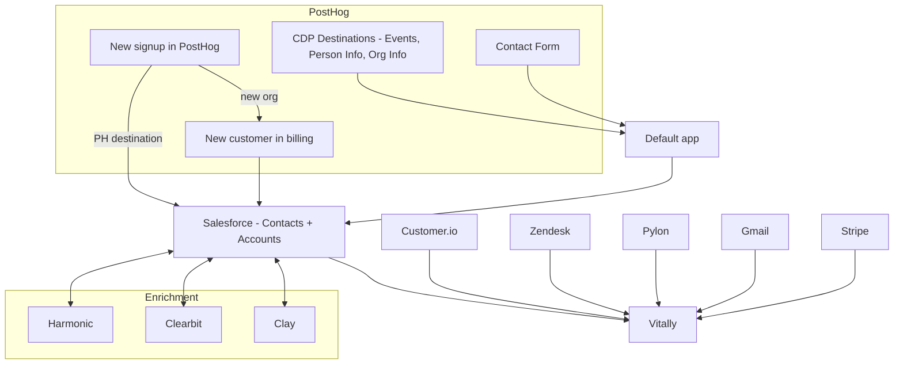

## Woah woah woah, we're doing outbound?

Yes! But do not be afraid:
- We are not doing this to 'go enterprise' - for now we're trying to reach more of [our ICP](/handbook/who-we-build-for). 
- Our investors did not ask us to do this - we came up with it ourselves. 

_So why are we doing it now? I thought our inbound pipeline was good?_

Outbound sales is a thing we will need to get really good at as we continue to scale PostHog, as 100% inbound eventually dries up. We are not going to be the first company in history to build a huge Saas business with zero outbound, and most companies like us start thinking about outbound around our ARR. Even the largest, most beloved devtool products of all time do this - they just do it in a smart way. 

We want to start doing outbound now because, if we wait til inbound slows down, we’ll panic and make bad decisions, trash the brand, and copy and paste what other boring companies have done in a short-sighted way that doesn't work for our audience.

Outbound is helpful because it is a good way to generate more leads in a semi-predictable way - and there are lots of cool ways to do it in 2025 using GTM engineering, agents etc. We should view outbound as a type of hyper-focused _marketing_ that generates sales opportunities.

## Let's get on the same page - what _is_ outbound?

‘Outbound’ means a few different things. This is how we think about it in relation to customers:

1. Using PostHog and spending a lot of money
2. Using PostHog and spending a little money
3. Using PostHog with good engagement/high ICP, but not spending any money
4. Person signed up at some point, but not really using, usually just kicking the tires
5. Not signed up, but has heard of PostHog
6. Not signed up, never heard of PostHog

> None of these people are currently talking to us - that's why they are under the umbrella of 'outbound'.

We’ll call 1-3 ‘warm’ outbound and 4-6 ‘cold’ outbound. 

## What we're doing today

Our model is:

- TAMs do warm outbound to group 1
- BDRs do warmish outound to groups 2-4
- TAEs do cold outbound to a top 10 list in groups 5-6

Our focus today is on inbound leads, getting much better at warm outbound (we have a huge number of leads that we could be converting better), and experimenting with colder outbound. <TeamMember name="Lorena Viana" /> is leading our experiments today with the <SmallTeam slug="demand-gen" />.

Check out the [leads page](/handbook/growth/sales/lead-scoring) for more detail on lead types, where they go, and the specific outbound campaigns we're running. These are changing very frequently as we figure out what does and doesn't work. 

## How TAEs talk to outbounded prospects

Remember, *we* contacted *them* — be transparent about our process and who we build for. How [well we do discovery in our initial conversations](/handbook/growth/sales/how-to-do-discovery) will dictate how well (or poorly) we position PostHog.

If they’re interested, we’ll show them how to try PostHog and help them along the way; if they’re not a fit, we’ll say so honestly. We need to earn the right for each step and not assume their interest.

So, what does that mean for a first conversation? We:

1. Do research & get context  
2. We are human & transparent when we meet them  
3. Explore their role & current state/stack  
4. Qualify or disqualify  
5. With explicit permission, give a brief PostHog pitch  
6. Ask the hard question  
7. Provide a relevant next step & schedule it on the call  
8. Action the task  
9. Rinse, lather, and repeat

Goal: help them decide if PostHog solves a real problem, not close in one call.

In order:

### 1. We do research & get context

Do basic account research:

* Prompt your LLM of choice for facts (especially with MCP access). Ask:  
    * What's their tech stack? (Job postings, BuiltWith/Wappalyzer, 1Password)  
    * Recent company news (funding, launches, hiring)  
    * Their role + tenure (LinkedIn, their website)  
* Why did they agree to this meeting? (Read <TeamMember name="Dmytro Sitalo" />’s notes in the New Business Slack)  
* What problem or pain did <TeamMember name="Dmytro Sitalo" /> flag?

Use this to form a call hypothesis.

### 2. We are human & transparent when we meet them

*We* contacted *them*. This call only makes sense if we can solve a real problem for them. Start with:

    *"Hey [name], thanks for making the time. I know this was a cold outreach from [Dmytro/our team], so I really appreciate you giving me 30 minutes."*

    *"Before we dive in, I'm curious - what made you decide to take this call?*

Often this is enough. If they’re vague or skeptical, get specific with your pre-prepared hypothesis:

    *"[Dmytro mentioned/I saw] that [specific trigger - e.g. you're growing team/launching new product/scaling analytics]. We work with companies at your stage who struggle with [specific pain - e.g. fragmented analytics tools/poor data quality/lack of actionable insights]. I wanted to understand if that's actually a problem you're facing."*

    *"If it is, I can share how other companies like yours have solved it. If it's not a problem, I'll tell you honestly (or you can tell me) and we'll keep this short. Will that work for you?"*

If they answer clearly, set a simple agenda:

    *"Got it. Here's what I was thinking for today: I'd love to understand how you're handling [your role/the use case behind the trigger] now, what's working and what's not, and then share how other companies like yours have approached it. If it seems relevant, we can go deeper. If not, I'll tell you honestly and we'll keep this short. Sound fair?"*

### 3. Explore their role & current state/stack - find the pain

As <TeamMember name="Charles Cook" />  says, companies don’t buy software; humans do. Start with their role/team.

    *"Tell me more about your role and team."*

Then move to the trigger/use-case:

    *“How are you thinking about [use-case/trigger] in that role/team? What do you need to understand about your product/users/customers?"*

Other prompts:

    *"What are you using for [use-case/trigger] today? And how'd you end up with that setup?”*

    *"What do you love about it? What drives you crazy?"*

You’re digging for pain, urgency, and priority in this part of the conversation. Drill in as needed:

* What's the pain and is it urgent/quantified? - *"You mentioned [pain]. Help me understand the impact. What's that costing you - in staff time, in missed opportunities, in money?"*  
* Is it a priority, and do they have a sense of timeline? - *"How much is [frustration] actually getting in the way? Is it blocking you or just annoying?"* *"Is there a timeline or trigger that makes solving this more urgent?"*  
* What does the decision process look like? - *"Hypothetically, if you did decide to switch tools, how does that work at [company]? Who gets involved?"* *"Who controls the budget for this kind of thing?"* *"Have you ever bought a tool like this before at [company]? What was that process like?"*

### 4. Qualify or disqualify

Run a quick mental evaluation of their answers on the call. Assess four factors:

* Specific pain identified  
* Line of sight to impact (time/money)  
* Timeline (next 6 months)  
* Authority or direct line to buyer

If unclear, ask directly, e.g. timeline:

    *Why is this a problem you're trying to solve this / next quarter?*

Their answer tells you if this is a priority.

If you have fewer than four, disqualify politely.

    *"Based on our conversation, and being completely honest, I don't think we're the right fit because [reason]. My recommendation: [alternative]. If [use-case/trigger] changes, do please reach out."*

If you have all four, ask permission to pitch.

Disqualify outbound tasks that won’t convert.

>**Bonus: end early** if they’re disqualified or disinterested. If highly qualified and eager, skip the pitch and go straight to a next step.

### 5. With explicit permission, give a brief PostHog pitch

Open with what you heard and ask for permission to pitch:

    *"Based on what you shared - [their pain] - let me tell you how PostHog works and you tell me if it's relevant. Does that work for you?"*

Pivot to a tailored elevator pitch (below is generic):

    *"PostHog makes dev tools that help product engineers build successful products. These include many discrete tools that help with user behavior and analytics, product engineering, communication and data - all in one platform.”*

    *"Companies switch for three reasons: (1) tired of fragmented tools, (2) want engineers and product teams to have direct access to data, (3) our transparent, usage-based pricing."*

### 6. Ask the hard question

Ask:

    *"Does that sound like it solves the problem you described?"*

If they’re uncertain, emphasize the free trial:

    *"Knowing that we offer folks like you a free trial period to evaluate PostHog for yourself, does it sound like PostHog solves the problem you described?"*

Wait. Embrace the pause. And, get their answer. If we don't solve a problem for them, this isn't worth continuing.

### 7. Provide a relevant next step & schedule it on the call

If qualified and interested, propose a next step and book it on the call:

    *"What makes sense as a next step? Demo? Trial? Talk to your team?"* *"Okay, I'll [take action]. Let's reconnect on [book specific date/time now]."*

If hesitant or marginal, ask:

    *"Here's what I'm hearing: [summary]. Not sure if we're a fit yet. What would help you figure that out?"*

If they disqualify themselves post-pitch, disqualify:

    *"Based on our conversation, and being completely honest, I don't think we're the right fit because [reason]. My recommendation: [alternative]. If [use-case/trigger] changes, do please reach out."*

### 8. Action the task in PostHog's Salesforce 

This is internal hygiene. Track tasks to reflect the opportunity:

- If qualified + next step, create an opportunity in `Problem Agreement` and use stage exit criteria  
- If marginal/no next step, switch task from `In progress` to `Nurturing` and progress them toward an opportunity  
- If not qualified, disqualify with reason and share feedback with <TeamMember name="Dmytro Sitalo" /> in Slack  

### 9. Rinse, lather, and repeat

You should always aim to get them into a shared Slack channel or establish a regular communication cadence with them (call/email). Nothing will happen if we aren't talking.

Where else you take a qualified outbound sales opportunity is dependent on the specifics of your conversation. 

Your process may resemble later stages of [the new business sales process](/handbook/growth/sales/new-sales).

Otherwise, you can:

- Book a technical demo with the person’s team  
- Ask for an introduction to the best contact at the company
- Record a Loom of specific features to show how PostHog works  
- Ship them documentation and a code sample to demonstrate how PostHog can be configured  
- #domoreweird in a delightful way  
- Schedule a kickoff to get their trial started  
- Ship them merch

What won’t change: qualify each step, solve a real problem, and don’t assume interest just because a task became an opportunity. Stay focused on their pain and you’ll earn the right to keep moving.

## How our outbound data pipelines work

So far we run three automated pipelines that enrich accounts, surface timely signals, and qualify targets. <TeamMember name="Abhischek Thottakara" /> manages these. 

### Salesforce enrichment (weekly)

Every week, we pull all Salesforce Accounts and enrich them via the Harmonic API with company info like funding history, headcount, and traction metrics. Our SSoT of Accounts (Single Source of Truth) is the Salesforce Accounts table.

Before enriching, we filter out personal email domains (Gmail, Yahoo, etc.) and normalize website domains so matching is consistent.

### Job switchers → Clay (daily)

A daily query (Clickhouse + Customer.io) detects [job-change signals](https://us.posthog.com/project/2/insights/AJnFRfBD) — someone who was at a company using PostHog just moved to a new role. Only changed or new records are sent to a Clay webhook so we stay within Clay's submission limits.

Why this matters: when someone who already knows PostHog changes jobs, that's a timely outreach moment. They're evaluating tools at their new company and already have context on what we do.

### Product-led outbound → Clay (daily)

First, a daily [Warmbound query](https://us.posthog.com/project/2/insights/2bYedblE) pulls a base set of target accounts filtered by revenue band (MRR $100–$499), company size (50+ employees), and company type. 

Then a second qualification step filters those accounts against product signals. Only accounts that pass both steps *and* have changed since the last sync are sent to Clay.

An account passes the second step if it shows buying intent through signals like:

- Using two or more PostHog products
- High event volume
- Two or more new team members in the last 30 days
- Adopting new products they weren't using before

This focuses outbound on accounts that are already engaged with the product (i.e warmbound), not just random companies that match a firmographic profile.

### Where data lives and flows

| System | Role | How often updated |
|---|---|---|
| Salesforce | Account records, opportunity tracking, enriched fields | Weekly (enrichment), real-time (sales activity) |
| Harmonic | Company enrichment data (funding, headcount, traction) | Weekly via enrichment pipeline |
| ClickHouse | Product usage data, job-change signals, ICP scoring | Daily via pipeline queries |
| Postgres | Organization and billing data | Continuous |
| Clay | Outbound qualification and personalization | Daily via webhook syncs |
| Lemlist | Email sequencing and outreach delivery | Via Clay |

### Appendix: full GTM data flow

This is the broader picture of how data moves across all our GTM systems, not just the outbound pipelines above.

