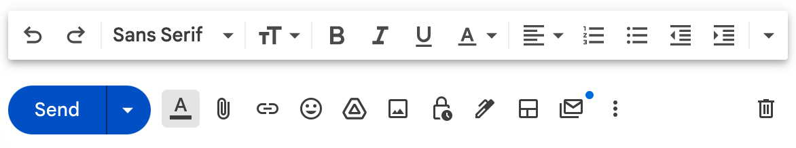
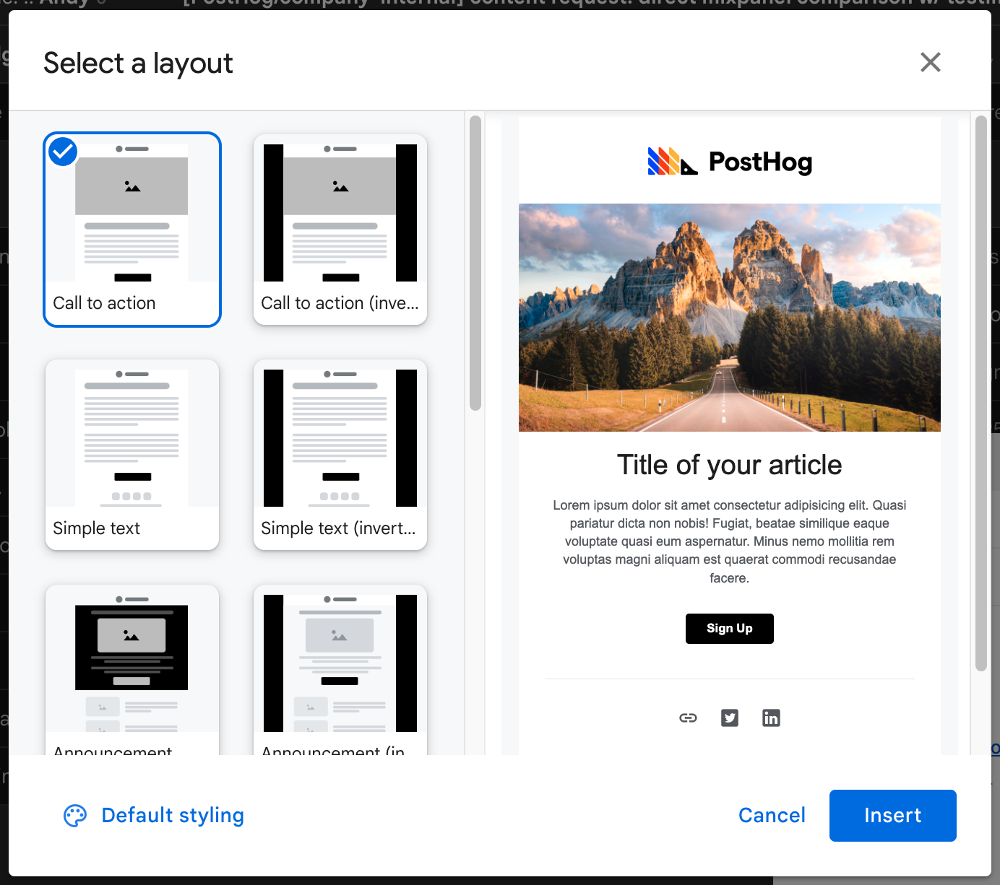
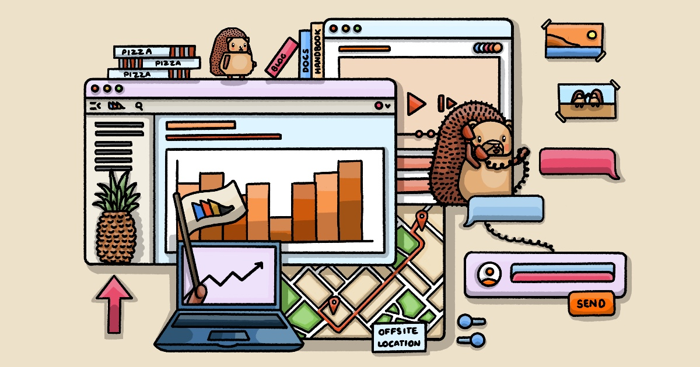

Welcome to PostHog! 

Giving a new joiner a great onboarding experience is super important to us. We want new joiners to feel they’ve made the right decision to join us, and that they are excited and committed to what we’re doing as a company. 

> Want to introduce a new joiner to the People team for onboarding, but don't know who on the team does what? Just introduce them to people@posthog.com and a member of the team will jump in and take it from there!

Our [team](/team) is spread across the world, and so are our new joiners. In order to ensure the best possible onboarding experience, we aim for the new joiner to meet up with someone from their team in their first week. Depending on the new joiner's location, they might fly out to one of our team members, or the other way around. So the onboarding experience will look a little bit different, depending on where the new joiner is based and which team they will be joining.

## Onboarding checklist

This is maintained as an issue template in GitHub, [which you can view here](https://github.com/PostHog/company-internal/blob/master/.github/ISSUE_TEMPLATE/onboarding.md). The People team will create a new onboarding issue for each new joiner.

### Onboarding email

We send an introductory email to all new hires to welcome them to the team and ease them in the some of the essential actions we need them to take. This needs communicating openly, as users may not be able to access the `company-internal` repo yet. So, we send them an email. 

The onboarding email is sent by the People team directly. We want to strike a balance between sending attractive, personalized emails and avoiding creating process or using overpowered tools, such as Customer.io or Mailchimp. So, we send email using Gmail Layouts. You can access Gmail Layouts with this button: 



If this is the first time you've used Gmail Layouts, select `Default Styling` before choosing a template. Choosing Black `#00000` as your primary colour will create simple black buttons which match the design of other emails. Please also upload a PostHog logo and enter our Twitter and LinkedIn links. You can use the following text in your email footers. 

```
No hedgehogs were harmed in the making of this email.
PostHog's mailing address is 2261 Market Street #4008 in the city of San Francisco, CA 94114
```

With default styling set, you can now choose the 'Call to action' template. 



With an email template chosen, you can then enter the copy you want to send. [This doc is a suggested template](https://docs.google.com/document/d/1O3_d4v3xgOr1awKkJb8K3xj8-6VV_fHsPkwtgaEhWKI/edit?usp=sharing) with important actions specified, though we recommend personalizing it to the individual. We've linked to these as docs and direct images to make the formatting easier for you, but here is an accompanying image for use in emails. 



## Onboarding buddy

Every new joiner at PostHog has an onboarding buddy. If possible, a new joiner will meet their onboarding buddy in person during their first week. In case in-person onboarding isn't an option, we will make alternative arrangements. The onboarding buddy is usually a member of the team a new joiner is joining - ideally the team lead - and they can help with any questions that pop up and with socializing during the first couple of weeks at PostHog. Of course, everyone is available to help, but it’s nice to have a dedicated person to help.

### Guidance for onboarding buddies

- Once we have decided which team a new joiner will join, the People & Ops team will reach out to the team to find an onboarding buddy. _Please make sure if don't have any leave booked in the week before and the two weeks after the new starter joins_
- We will intro the new joiner and the onboarding buddy via email - please say hi and decide together where and when the in person onboarding will happen. 
 > If any travel is needed for the in-person onboarding, please check our [Spending Money page](/handbook/people/spending-money) and book your travel accordingly. _You don't need to let us team know, just use your Brex/Revolut card._
- Please make sure you spend at least 3 days together, working through the [first week onboarding list](/handbook/people/onboarding#during-their-first-week) and spending time working on any role-specific tasks that are outlined in the new joiner's personal onboarding issue. 
- You will remain the new joiner's main point of contact for the first few weeks, so please continue to check in with them at least once a week for the first month or so. 

## In-person onboarding

Except under special circumstances, new joiners meet with members of their team in-person to go through the onboarding process. Upon acceptance of an offer, your Team Lead will notify the People & Operations team who will help you coordinate travel if necessary.

In these cases, the process is:

  - Preemptively create the new team member a Google account
  - Issue them a Brex card to their work email with a sufficiently high temporary balance to cover travel costs
  - Have the new team member book travel as usual

### Engineering

We hire engineers on a regular basis, running in-person onboarding practically every time. Over the years, we've learned a lot about doing this efficiently and there's much to gain from sharing the knowledge between teams.

Based on this ongoing learning process, here are our **five rules for onboarding an engineer**:

1. Ship something together on day one – even if tiny! It feels great to hit the ground running, with a development environment all ready to go.
2. Run 1:1 learning sessions with the new teammate every day. Give them all the context they need to succeed. By the end of the onboarding, each team member present should've run at least one such session.
    <details>
      <summary>Looking for learning session ideas?</summary>
      <p>Here's a non-exhaustive list:</p>
      <ul>
        <li>The <a href="/handbook/engineering/databases/event-ingestion">lifecycle of an event</a>, from a client library all the way to query results</li>
        <li>How we turn all our TSX and SCSS files into a fast frontend served from S3</li>
        <li>The architecture of PostHog Cloud</li>
        <li>Trunk-based development - how we make use of feature flags</li>
        <li>Query nodes and how they're used throughout the app</li>
        <li>What the dead letter queue is for</li>
        <li>How PostHog experiment results are calculated</li>
        <li>What engineering planning looks like at PostHog</li>
      </ul>
      <p>
        Any of these chats can take as little as 15 minutes or as long as 1 hour, depending on the level of detail.
        You'll also find that some topics apply perfectly in some teams, but not so much in others.
        This is all up to you!
      </p>
    </details>
3. Do at least one brainstorming session on a topic important for the team, writing down actionable conclusions. Use the time together to discuss issues and involve the new joiner in decisions.
4. Pair whenever possible. You're all sitting next to each other, so pick work that can benefit from in-person collaboration.
5. Have fun, because life isn't all work! Do some sightseeing, go out for dinner, or find a fun activity – just hang out together any way you like.

## Tools we use

We use a number of different tools to organise our work and communicate at PostHog. Below is a summary list of the most important ones - this list is not intended to be exhaustive

### Everyone
- Google Suite - Gmail, Google Apps such as Docs, Sheets, Slides
- GitHub - most comms and product work
- Slack - we have an internal workspace and a users Slack as well
- Brex (US, RoW) or Revolut (UK, EU) - company cards and expenses tracking
- Shopify - powers our merch store
- Printfection - merch inventory management, [YC onboarding](/handbook/growth/sales/yc-onboarding) merch, and merch [drop-shipping for small events](https://github.com/PostHog/meta/issues/31)
- CharlieHR - holiday tracking, personal details
- Gusto - payroll and benefits (US)
- Deel - contractor payroll (EU and special arrangements)

### Engineering
- AWS
- PagerDuty
- Heroku
- Grafana
- Sentry

### Design
- Figma

### Ops, People & CS
- HubSpot - customer CRM
- Zendesk - our support platform
- Pry - financial modelling
- LTSE Equity - cap table management
- Fondo - US accounting
- Calendly - external meeting scheduling (e.g. demos, sales)
- Gusto - US payroll and benefits management
- Deel - international payroll and contracts management
- Ashby - recruitment

## Signatories

Charles, James and Tim at this time are the only people able to sign legal paperwork on behalf of the company.

## How we work

Now it's time to dive into some of the more practical stuff - these are the most important pages:

1. [Communication](/handbook/company/communication) - we have a distinctive style. If PostHog is your first all-remote company, this page is especially helpful.
2. [Team structure](/handbook/small-teams/team-structure) - we are structured in Small Teams. These pages will help you get the lay of the land, and who does what. 
3. [Management](/handbook/company/management) - we have a relatively unusual approach to management, and it is possible that you will not be familiar with our approach. 

### Working in GitHub

We use [GitHub](https://github.com/PostHog) for _everything_, including non-engineering task management. This might take some getting used to if you are non-technical. If that is the case, we have [this intro video](https://www.youtube.com/watch?v=2BB4Nkc0uVM) that will teach you the basics and [a detailed guide on how to set up a local version of Posthog.com so that you can make changes to the docs, handbook and website](/handbook/engineering/posthog-com/developing-the-website). 

Our most active repositories (aka 'repos') are:

- [PostHog](https://github.com/PostHog/posthog) - main app
- [PostHog.com](https://github.com/PostHog/posthog.com) - website
- [Product Internal](https://github.com/PostHog/product-internal) - product-related issues that need to be kept internal, e.g. security issues, customer-specific issues (private)
- [Company Internal](https://github.com/PostHog/company-internal) - company-facing issues, e.g. internal processes, hiring planning (private)

When you have a new Issue or want to submit a Pull Request, you do that in the relevant repo. 

We use GitHub Projects to track the status of Issues in an easily viewable way. When you create an Issue, you can assign it to a Project - think of a Project as a way of organising and filtering Issues in a particular view. This makes it easy for Small Teams to easily track what they are working on without having to jump between different repos. Some Issues may be assigned to multiple Projects if they involve the work of more than one team.

You can also assign an Issue to a specific person, and tag it with a relevant label - use these to help people filter more easily.

Each Small Team has its own Project for tracking their Issues - [full list here](https://github.com/orgs/PostHog/projects). Most teams run two week sprints - as part of onboarding, you will be invited to the relevant planning meetings. 
