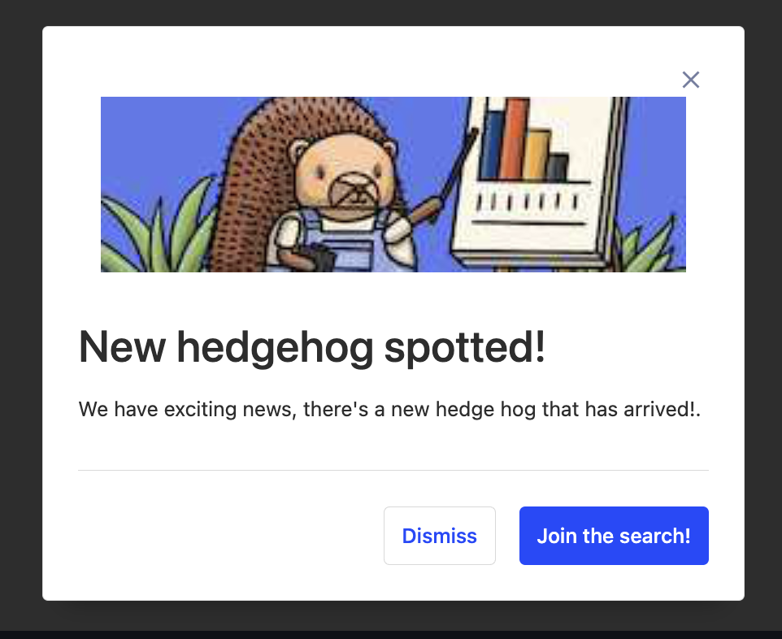
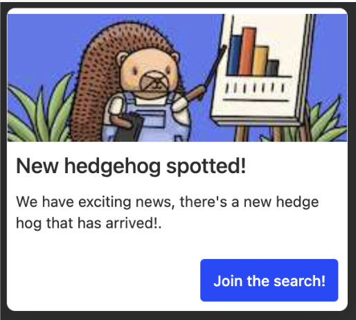

> These are instructions to set up in-app prompts using an internal tool for the PostHog team only. To set up your own, check out this tutorial on "[How to add popups to your React app with feature flags](/tutorials/react-popups)"

If you want to announce a new feature, invite a customer to a Slack channel, or drive engagement of a particular feature in the product, you might want to use our internal in-app prompts tool.

## How to create a new prompt

In-app prompts are powered by JSON feature flags.

1. Create a new feature flag with the name starting with `prompt-`
2. Add the payload (delete the comments such as `// optional`)

   ```json
   {
      "title": "title of the prompt",
      "body": "body of the prompt, can be HTML including links",
      "type": "popup", // can be "modal" or "prompt"
      "image": "url of the image", // optional
      "url_match": "regex to match url against e.g. '.*feature_flags.*'", // optional
      "primaryButtonText": "text for the primary button", // optional
      "secondaryButtonText": "text for the secondary button", // optional
      "primaryButtonURL": "url for the primary button (opens in a new window)" // optional
   }
   ```

3. Add the cohort or user properties that you want to show the prompt to.
   - If you want to show a prompt based on events, you should create a dynamic cohort based on the event, then export the cohort and use it to create a static feature flag.
4. **Important** Add the release condition that the user property `${feature_flag_name}` **is not set**. This ensures that the prompt is only shown once.

It will only show one prompt a day, no matter how many prompt feature flags are enabled.

It's recommended to run the prompt for yourself first to make sure it works as expected. You can keep changing the text and refreshing. When you click one of the buttons, it won't show you the popup again. The easiest way to retest it is to change the feature flag name (make sure to keep the user property `${feature_flag_name}` up to date) and run this in your [javascript console](https://developer.chrome.com/docs/devtools/console/javascript/) `localStorage.removeItem("prompt-last-seen")`.

## Examples

### Modal prompt

Shows in the middle of the screen. It's more intrusive than a popup.



### Popup prompt

Shows in the bottom right corner. It's less intrusive than a modal.


