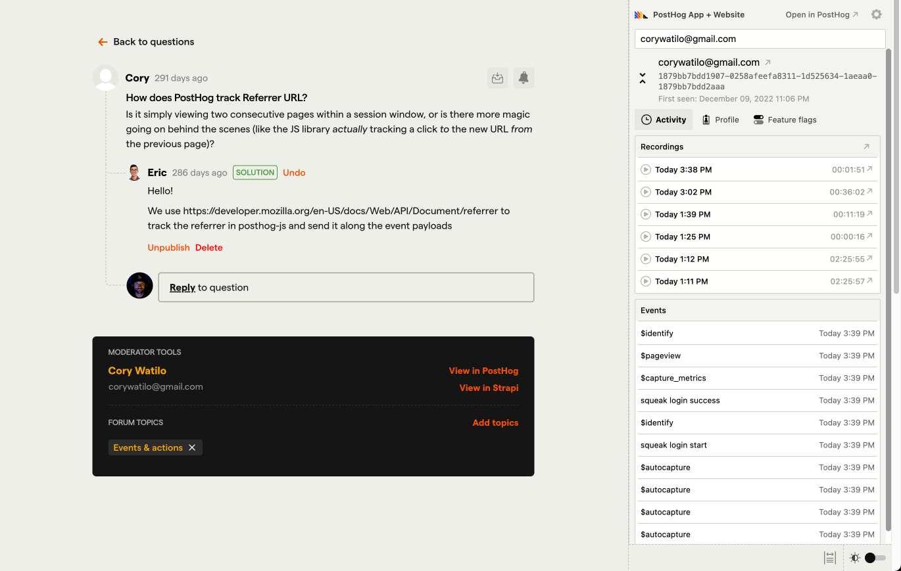

Rather than using an off-the-shelf community platform, the [Website & Docs team](/handbook/small-teams/website-docs) has rolled our own. This gives us the flexibility to do what we want with it, all without having to depend on third parties or their cookies.

## Community forums

Our community forums live at [posthog.com/questions](/questions) – but they come with a twist...

Anyone can ask a question within the forums, but they can _also_ ask a question at the end of any docs page (under the "Questions?" subheading). We've found this to be a great place for people to ask very specific questions after attempting to find an answer in documentation, as it acts as a mini-FAQ section.

Questions that are asked within the docs are also automatically aggreagated to the correct category in the community forums.

### Asking a question

A user can type a question, but they'll need to create a PostHog.com account before posting. (Note: This authentication system is currently separate from PostHog Cloud accounts, though [we have plans to unify them](https://github.com/PostHog/posthog.com/issues/5847).) Users can write Markdown and upload images to a question.

Once it's posted, a question permalink page is generated, which gets indexed in our site search (and tends to rank well in Google, too). The user is automatically subscribed to reply notifications by email.

Anyone can subscribe to thread replies by clicking the bell icon in a thread (after signing in).

### Answering questions

The Website & Docs team can help in configuring Slack notifications for small teams to receive alerts to questions in a team channel (usually the one designated for support).

Individually, you can also subscribe to topics of your choosing (with your PostHog.com account) by clicking the bell icon next to the topic's title. You'll receive a daily summary of new questions by email, and you'll find open threads for that topic in your personalized [community dashboard](/community/dashboard) (available when signed in).

### Who should answer community questions?

**We encourage all team members to watch for new community questions, and answer them if they can.** (Questions are sent into Zendesk for the support hero, but you can help ease the burden _while_ contributing to faster response times, which can lead to more positive interactions with customers (or prospective customers).

- Teams should be responsible for staying on top of community questions within their product areas.
- Teams can decide if they want their weekly support person to handle them, or if they want to collectively keep an eye on tickets. (We’re adding more info to Slack notifications so they’re more useful.)
- At our current size and current question volume, teams should be able to stay on top of question notifications in Slack and help out *proactively*.

If a question needs a follow-up later on, tag it with `Internal: follow-up` and the Website & Docs team can make sure there's a resolution.

#### Guidelines & tone

**Phrasing**

When possible, respond in a phrase that doesn’t directly indicate you work for PostHog. (We can encourage community engagement by intentionally separating ourselves from the image it's a support forum where only PostHog employees respond.)

- Instead of... _“We are launching a new feature that will solve this - here’s the pull request.”_
- Try... _“There’s a pull request out for this feature now.”_

**Various cases you may come across...**

Some questions don’t make sense to be public, and some answers should be more widely accessible. Here’s how to handle those:

- If an answer is worth adding to docs, the moderator has a few options:
    - Answer the question and update the docs directly
    - Tag the question (`Internal: documentation`) so the Website & Docs Team can triage
    - Create an issue in `posthog/posthog.com` with the `technical documentation` label
    - If the topic is worth creating a tutorial, tag it with `Internal: tutorial idea`
- If a question is better off a private support ticket, reply asking them to create a ticket within the app (or better yet: create one for them and reply to let them know!)
    - After responding, use the Archive button. This hides the question from being listed within a forum category and removes the question from search indexes.
    - _Note that free users might not have the option to directly message support in-app, so get context as to who the person is before pointing them there._

** Thread resolution**

We want the OP (original poster) to mark a solution themselves. Never mark your response as a solution immediately, as it can look like we're too presumptuous in assuming we correctly answered a question, when there may be more nuance.

#### Context

Moderators can see additional info about a user when viewing a question. (If you're not yet a moderator, create an account, then ask your team lead to add you to your small team's page. Once you're added there, you'll instantly be upgraded to moderator status.)

1. **Below the question** is a moderator panel with the user's name and email, as well as a link to their record in PostHog Cloud.
1. **In the right sidebar** is an embedded version of [PostHog Sidecar](https://github.com/posthog/sidecar), a yet-to-be-released Chrome Extension that reveals the user's activity from PostHog Cloud wherever they can be identified across the web (usually by email). _Note: You don't need to install the Chrome extension as the pane is embedded directly within the community forums._
