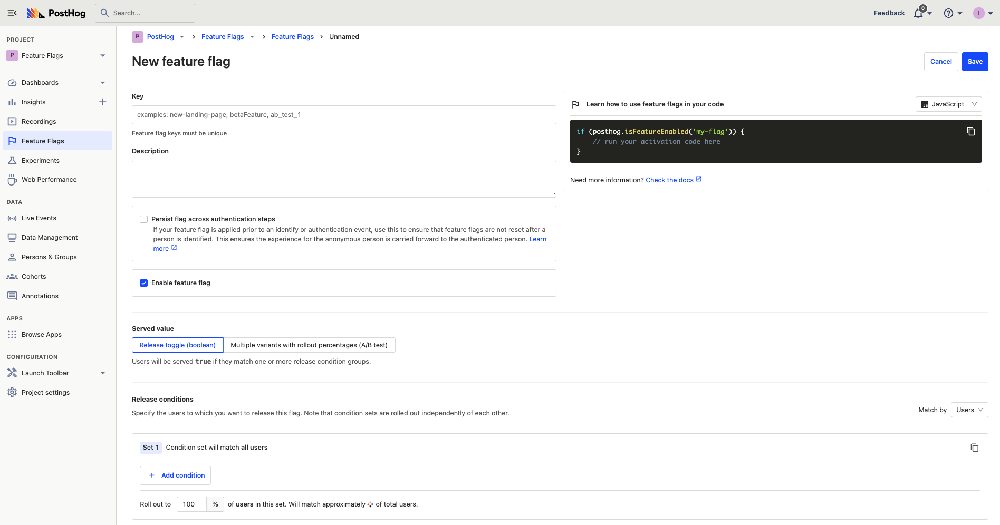
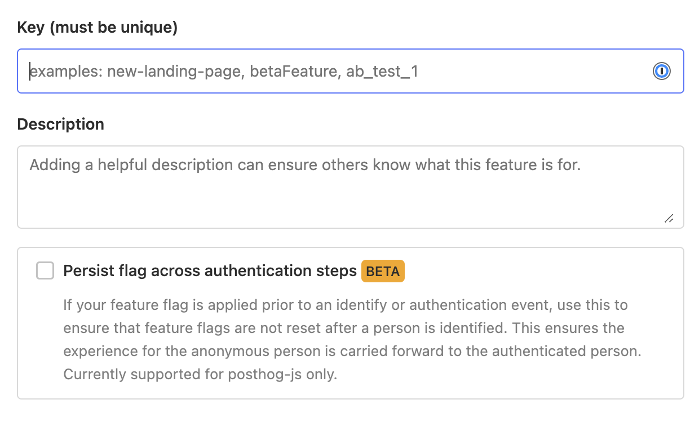

Feature Flags allow you to safely deploy and roll back new features. This means you can ship the code for new features and then roll them out to your users in a managed way. If something has goes wrong, you can then roll back without having to re-deploy your application. Feature Flags can also help you control access to certain parts of your product, such as only showing paid features to users with an active subscription.

> Looking to _test_ changes to your product? Check out our [Experimentation](/docs/user-guides/experimentation) feature.

## Learning resources

We have a number of comprehensive guides to using feature flags, including:

- [How to do a canary release with feature flags in PostHog](/tutorials/canary-release)
- Tips for [feature flag best practices with examples](/blog/feature-flag-best-practices)    

## Creating Feature Flags

In the sidebar, go to 'Feature Flags' and click '+ New Feature Flag'.

Think of a descriptive name and select how you want to roll out your feature.



## Persisting feature flags across authentication steps

You also have an option to persist flags across authentication steps.

Consider this case: An anonymous person comes to your website and you show them a green call to action.

With usual feature flags, the flag value can change when someone logs in, or changes their identity. So, once they login, they may see a red call to action instead.


This usually is not a problem since experiments run either completely for anonymous users, or completely for logged in users.

However, with some businesses, like e-commerce, it's very common to browse things anonymously and login right before checking out. In cases like these you can preserve the feature flag values by checking this checkbox.



Note that there are some performance trade-offs here. Specifically,

1. Enabling this slows down the feature flag response.
2. It disables local evaluation of the feature flag.
3. It disables bootstrapping this feature flag.


## Implementing the feature flag

When you create a feature flag, we'll show you an example snippet. It will look something like this:

<MultiLanguage>

```js
if (posthog.isFeatureEnabled('new-beta-feature')) {
    // run your activation code here
}
```

```node
const isMyFlagEnabledForUser = await client.isFeatureEnabled('new-beta-feature', 'user distinct id')

if (isMyFlagEnabledForUser) {
    // Do something differently for this user
}
```

```php
const isMyFlagEnabledForUser = await client.isFeatureEnabled('new-beta-feature', 'user distinct id')

if (isMyFlagEnabledForUser) {
    // Do something differently for this user
}
```

```ruby
is_my_flag_enabled = posthog.is_feature_enabled('new-beta-feature', 'user distinct id')

if is_my_flag_enabled
  # Do something differently for this user
end
```

```go
isFlagEnabledForUser, err := client.IsFeatureEnabled(
    FeatureFlagPayload{
        Key:        "new-beta-feature",
        DistinctId: "distinct-id",
    })

if (isFlagEnabledForUser) {
  // Do something differently for this user
}
```

```python
if posthog.feature_enabled("new-beta-feature", "user_distinct_id"):
    runAwesomeFeature()
```

```
curl https://app.posthog.com/decide/ \
-X POST -H 'Content-Type: application/json' \
-d '{
    "api_key": "phc_Wg2jMXmDvsnrQ3IKuVyspZghFIVE2IbxuqVYlhm7ry0",
    "distinct_id": "[user distinct id]"
}'
```

</MultiLanguage>

What you do inside that if statement is up to you. You might change the CSS of a button, hide an entire section, or move elements around on the page.

### Ensuring flags are loaded before usage

Every time a user loads a page we send a request in the background to an endpoint to get the feature flags that apply to that user. In the client, we store those flags as a cookie.

This means that for most page views the feature flags will be available immediately, _except_ for the first time a user visits.

To combat that, there's a JavaScript callback you can use to wait for the flags to come in:

```js
posthog.onFeatureFlags(function() {
    // feature flags are guaranteed to be available at this point
    if (posthog.isFeatureEnabled('new-beta-feature')) {
        // do something
    }
})
```

You can also bootstrap the flags to make them immdiately available.

```js
posthog.init('<ph_project_api_key>', {
    api_host: '<ph_instance_address>',
    bootstrap: {
        distinctID: 'your-anonymous-id',
        featureFlags: {
            'flag-1': true,
            'variant-flag': 'control',
            'other-flag': false
        }
    }
})
```

To get the flag values, you can call `getAllFlags()` in your server-side library, then pass the values to your frontend initialization. 

### Forcing feature flags to update 

In our JS library, we store flags as a cookie to reduce the load on the server and improve the performance of your app. This prevents always needing to make an HTTP request, flag evaluation can simply refer to data stored locally in the browser. This is known as 'local evaluation.'

While this makes your app faster, it means if your user does something mid-session which causes the flag to turn on for them, this does not immediately update. As such, if you expect your app to have scenarios like this _and_ you want flags to update mid-session, you can reload them yourself, by using the `reloadFeatureFlags` function.

```js
posthog.reloadFeatureFlags()
```

Calling this function forces PostHog to hit the endpoint for the updated information, and allows you ensure changes are reflected mid-session.

### Server-side local evaluation

If you're using our server-side libraries, you can also use local evaluation to improve performance instead of making additional API requests. This requires you to know all the person or group properties the flag realies on and initialize the library with your personal API key. 

Local evaluation, in practice, looks like this:

<MultiLanguage>

```js
await client.getFeatureFlag(
    'beta-feature',
    'distinct id', 
    {
        personProperties: {'is_authorized': True}
    }
)
# returns string or None
```

```python
posthog.get_feature_flag(
    'beta-feature',
    'distinct id',
    person_properties={'is_authorized': True}
)
# returns string or None
```

```php
PostHog::getFeatureFlag(
    'beta-feature',
    'some distinct id',
    [],
    ["is_authorized" => true]
)
// the third argument is for groups
```

```ruby
posthog.get_feature_flag(
    'beta-feature',
    'distinct id', 
    person_properties: {'is_authorized': True}
)
# returns string or Nil
```

```go
enabledVariant, err := client.GetFeatureFlag(
        FeatureFlagPayload{
            Key:        "multivariate-flag",
            DistinctId: "distinct-id",
        PersonProperties: posthog.NewProperties().
            Set("is_authorized", true),
        },
)
```

</MultiLanguage>

## Roll out the feature flag

There are three options for deciding who sees your new feature. You can roll out the feature to:

1. A fixed percentage of users
1. A set of users filtered based on their user properties or a cohort (based on user properties)
1. A combination of the two

### Roll out to a percentage of users

By rolling out to a percentage of users, you can gradually ramp up who sees a new feature. To do this, we "hash" a combination of the key of the feature flag and the unique distinct ID of the user.

This way a user will always fall on the same place between 0 and 100%, so they will consistently see or not see the feature controlled by the flag. As you move the slider towards 100%, more users will start seeing your feature.

The hashing means that the same user will fall along different points of the line for each new feature. For example, a user may start seeing the feature at 5% for feature A, but only at 80% for feature B.

### Filter by user properties

This works just like any other filter in PostHog. You can select any property and users that match those filters will see your new feature.

By combining user properties and percentage of users you can determine something like:

> "Roll out this feature to 80% of users that have an email set"

## De-activating properties

If the feature has caused a problem, or you don't need the feature flag anymore, you can disable it instantly and completely. Doing so ensures _no users_ will have the flag enabled.

## Feature flag persistence

For feature flags that filter by user properties only, a given flag will always be on if a certain user meets all the specified property filters.

However, for flags using a rollout percentage mechanism (either by itself or in combination with user properties), the flag will persist for a given user as long as the rollout percentage and the flag key are not changed.

As a result, bear in mind that changing those values will result in flags being toggled on and off for certain users in a non-predictable way.

## Multivariate feature flags (beta)

<FeatureAvailability availability={_frontmatter.availability.features.multivariate} />

> Multivariate feature flags are only available when using PostHog >= 1.28 (if self-hosting) and [posthog-js](https://github.com/PostHog/posthog-js) >= 1.13.

PostHog 1.28 introduced support for multivariate feature flags which can return string values according to a specified distribution. Some examples for a 3-variant case would be 33/33/34%, 50/25/25%, or 70/20/10%. This is ideal for when you want to test multiple variants of the same interchangeable content, such as marketing taglines, colors, or page layouts. Currently, this is a beta feature for paying customers. Contact us through one of our [support options](https://posthog.com/support) to try this out!

### Creating a feature flag with multiple variants

Create a multivariate feature flag just like you would a standard flag, and then change the "Served value" option to "a string value". You will then be prompted to enter a few keys with optional descriptions and set the distribution percentages for each.

Note that the rollout percentage of feature flag variants must add up to 100%. If you wish to exclude some users from your test, i.e. have some users receive no value at all, configure the _release condition groups_. While the release condition groups determine how many users will be bucketed into _any_ of the given variants, the rollout percentage of each variant determines the portion of the overall release group that will be assigned to that particular variant.

### Using multivariate feature flags in your code

With the latest version of our JS library, you can call:

```js
if (posthog.getFeatureFlag('checkout-button-color') === 'black') {
    // do something
}
```

`getFeatureFlag` also returns true or false for standard (Boolean) feature flags, meaning that the following statements are equivalent:

```js
posthog.isFeatureEnabled('new-beta-feature')
posthog.getFeatureFlag('new-beta-feature') === true
```

### `getFlagVariants`

Just as you can call `getFlags()` to return an array of feature flags that are currently active, you can call:

```js
posthog.feature_flags.getFlagVariants()
```

`getFlagVariants` returns an object:

```json
{
    "new-beta-feature": true,
    "checkout-button-color": "black"
}
```

### `onFeatureFlags`

`onFeatureFlags(callback)` now passes the feature flag variants object as the second argument to `callback`, which looks like this:

```js
posthog.onFeatureFlags(function (flags, flagVariants) {
    // do something useful
    console.log(flags) // ["new-beta-feature", "checkout-button-color"]
    console.log(flagVariants) // { "new-beta-feature": true, "checkout-button-color": "black" }
})
```

Note that `getFlags()` and the callback argument `flags` will include the key names of all truthy feature flags, including active multivariate feature flags.

### Querying data by multivariate feature flag values

With the latest version of our JS library, we send each feature flag's value as a separate property on every event. This means the values can be used in filters and breakdowns in Insights queries or wherever else you may choose to filter incoming events.

We send the event properties as `$feature/your-feature-name`, for example `$feature/checkout-button-color`. Standard (Boolean) flags are captured in this format as well.

For example, if you have a Trends graph of button click events and you'd like to narrow it down to clicks only when the checkout button is blue, apply a filter to your graph series such that `$feature/checkout-button-color = blue`.

If you'd like to compare all variants for which we have data in one graph, apply a breakdown by `$feature/checkout-button-color`.

## Experimentation

Feature Flags and Experimentation are different features and work for different use cases. Check out our [Experimentation](/docs/user-guides/experimentation) manual for more details.

### Further reading

Want to know more about what's possible with Feature Flags in PostHog? Try these tutorials:

- [How to run Experiments without feature flags](/tutorials/experiments)
- [Tracking key B2B product metrics](/tutorials/b2b)
- [Analyzing user behavior with cohorts](/tutorials/cohorts)

Want more? Check our [full list of PostHog tutorials](https://posthog.com/tutorials). 
