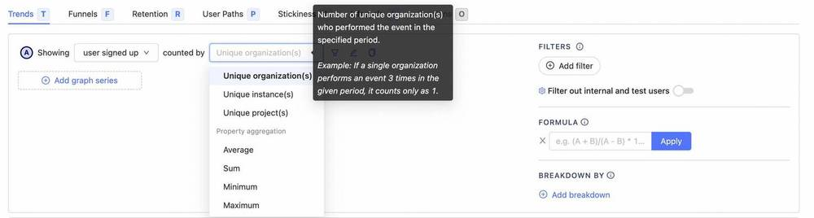

<FeatureAvailability availablePlans={['standard', 'enterpriseCloud', 'startup', 'scale', 'enterprise']} />

Groups are an especially powerful feature within PostHog that allows you to aggregate events by entities other than a user.
In an abstract sense, groups allow entities such as companies or projects to 'send' events in the same way that users can.

Groups can be configured to represent almost anything, including organizations, companies, devices, posts, files, and much more.

Here are some of the questions that group analytics can help answer:
- Number of companies who signed up in the last month
- Which posts have had the most activity
- Number of projects created in the past month
- Compare the conversion rate between small and large companies
- Which communities are growing the fastest

Groups can be used directly in a number of other parts of the PostHog suite, including [insights](/manual/insights), [feature flags](/manual/feature-flags), and [experiments](/manual/experiments).

## Understanding group analytics

Before we start learning how to use groups, it's best to get some intuition behind exactly how the behave within PostHog.

At a high-level, a group is simply a way to take a specific set of events, and 'group' them together under a specified 'type' of entity.
This 'entity' can be anything you like (organizations, companies, posts, files, etc.) and depends entirely on your application.

One very common use case is to create groups that contain events that are sent as part of a larger group of users.
This could be things such as making groups for each company that uses your app, to creating a separate group for each community within your app.

> **Note:** While groups are often thought of as representing groups of users, it's important to keep in mind that groups aggregate **events** and not users directly.

### Groups vs group types

When considering group analytics, it is also important to make the distinction between 'Groups' and 'Group types'.
At a high level, a group type is the name for the kind of object you would like to aggregate based on (`company`, `project`, `post`), whereas a group is a particular member of that type.

> **Tip:** If you're familiar with object-oriented thinking, you can think of each 'group type' as a class, with each 'group' being a unique instance of that class.

A simple example of a group type might be a `company`, whereas each group would be specific companies such as `PostHog`, `Google`, `IBM`, etc.
There's a hard limit of 5 group types you can create, although within each group type you can have unlimited groups.

Another important concept to remember here is that a single event belongs to only a single group per group type.
For example, let's say you have a `project shared` event.
This event could be associated with both a `company` _and_ a `project`, but it can't be associated with _two separate_ companies or _two separate_ projects.

### Groups vs cohorts

While groups and cohorts may seem almost identical at first, it's important to understand the differences between them.
When comparing groups and cohorts, it's important to remember that groups **aggregate based on events, not users**.
While it is possible to view persons that are related to a group, they aren't directly 'members' in the same way as cohorts.

Cohorts represent a single list of users, whereas groups represent many separate lists of events all under a specific group type.

Following the company example again, you can have a cohort of users which belong to a certain company (e.g. Company A).
However, this only represents a single company, and you would need to keep creating new cohorts as users from other organizations signed up, which is not practical.
In this case, it's best to create a group type `company`, and then specify which company each event you send is related to.

## Getting started

This section will give an overview of setting up your first group within PostHog.

### Creating groups

Groups and group types are defined directly from our libraries when sending events.
In the examples below, we use the group type `company`, and set the unique id for the group to be `id:5`.

<MultiLanguage>

```js
// All subsequent events will be associated with company `id:5`
posthog.group('company', 'id:5');

posthog.capture('some event')
```

```python
posthog.capture('[distinct id]', 'some event', groups={'company': 'id:5'})
```

```go
client.Enqueue(posthog.Capture{
    DistinctId: "[distinct id]",
    Event:      "some event",
    Groups: posthog.NewGroups().
        Set("company", "id:5").
})
```

```node
posthog.capture({
    event: "some event",
    distinctId: '[distinct id]',
    groups: { company: 'id:5' }
})
```

```php
PostHog::capture(array(
    'distinctId' => '[distinct id]',
    'event' => 'some event',
    '$groups' => array("company" => "id:5")
));
```

```segment
analytics.track('[event name]', {
    "$groups": {
        "company": "id:5"
    }
})
```

</MultiLanguage>

> **Tip:** When specifying the group type, try using the singular version (`company` instead of `companies`).

We now have one group with id `5` that has the type `company`, and the `some event` that we sent will be attached to this newly created group.

### Setting and updating group properties

Every group can have properties associated with it.
Continuing with the previous example of using `company` as our group type, we might want to add `company_name`, `date_joined`, and `user_count` as additional fields.

> **Note:** You must include at least one group property for a group to be visible in the "Persons & Groups" tab

<MultiLanguage>

```js
posthog.group('company', 'id:5', {
    name: 'PostHog',
    user_count: 33,
    date_joined: '2020-01-23T00:00:00.000Z'
});
```

```python
posthog.group_identify('company', 'id:5', {
    'name': 'PostHog',
    'user_count': 33,
    'date_joined': '2020-01-23T00:00:00.000Z'
})
```

```go
client.Enqueue(posthog.GroupIdentify{
    Type: "company",
    Key:  "id:5",
    Properties: posthog.NewProperties().
        Set("name", "PostHog").
        Set("user_count", 33).
        Set("date_joined", "2020-01-23T00:00:00.000Z"),
})
```

```node
posthog.groupIdentify({
    groupType: 'company',
    groupKey: 'id:5',
    properties: {
        name: 'PostHog',
        user_count: 33,
        date_joined: '2020-01-23T00:00:00.000Z'
    }
})
```

```php
PostHog::groupIdentify(array(
    'groupType' => 'company',
    'groupKey' => 'id:5',
    'properties' => array("name" => "PostHog", "user_count" => 11, "date_joined": "2020-01-23T00:00:00.000Z")
));
```

```segment
analytics.track('$groupidentify', {
    "$group_type": "company",
    "$group_key": "id:5",
    "$group_set": {
        "name": "PostHog",
        "user_count": 33,
        "date_joined": "2020-01-23T00:00:00.000Z"
    }
})
```

</MultiLanguage>

Properties on groups behave in the exact same way as properties on persons within insights. They can also be used within exepriments and feature flags to rollout features to specific groups.

> **Note:** The PostHog UI identifies a group using the `name` property. If no `name` property is found, it falls back to the group key.

## Using groups in PostHog

Now that we have created our first group type, we can take a look at how to use groups within PostHog.

### Viewing groups and their properties

To view groups and their properties, head to the "Persons and Groups" tab on the navigation bar.

From here you can select the group type you are interested in and view the groups and properties (by clicking the chevrons on the left).


You can now click on a specific group to see information such as all the events that have been sent by this group.

Under the 'Related people & groups' tab, you can also see all of the persons who have sent events that we're associated with this group, as well as all the other groups from different types that have shared events.

### Analyzing group insights

Using groups in insights works in almost the exact same way as with users, and works by aggregating events and properties based on unique groups.
Within a trends insight, you can select which of your group types you would like to view, which will display the count of unique organizations that performed a certain event in a given period.

#### Organizations signed up in last week

To see a concrete example of groups in action, let's say that we wanted to see a graph showing how many different organizations have signed up recently.
Within an insight, we would expand the menu next to the event we've chosen, which should show a list of all the group types you have available.

Selecting 'Unique organizations', this will show us a graph with the total number of organizations that have signed up, as opposed to individual users.



### Organization signup funnel

Another place where group analytics can be used is within funnels.
For example, you may want to understand how an organization moves from their first visit to eventually signing up, which we can do by setting the 'Aggregating by' field to 'Unique organizations'.

This will show how many organizations have made it through, as well as the percentage of organizations that dropped off. It's also possible to see exactly which groups dropped of at a specific step in exactly the same way as with users.


### Renaming group types

You can change how group types are displayed in your Insights interface and throughout PostHog from the Project settings.

### Integrating groups with feature flags

Similar to insights, where you're aggregating events by group type, you can have Feature Flags that work on groups.
This allows you to rollout a feature by company, instead of users.
Preventing disruption when two users at the same company see a different experience.

You can use feature flags as you normally would, except you need to select the group type you wish to "Match by", using the drop down by release conditions.

You will also need to update your event tracking code (covered below), for the feature flag to be able to determine the groups of the current user.

<MultiLanguage>

```js
// Make sure you have called posthog.group() beforehand

if (posthog.isFeatureEnabled('new-groups-feature')) {
    // Do something
}
```

```python
if posthog.feature_enabled("new-groups-feature", "[distinct id]", groups={"company": "id:5"}):
    # Do something
```

```php
if (PostHog::isFeatureEnabled('new-groups-feature', '[distinct id]', false, array("company" => "id:5"))) {
    // Do something
}
```

```node
const isFlagEnabled = await posthog.isFeatureEnabled('new-groups-feature', '[distinct id]', false, { company: 'id:5' })

if (isFlagEnabled) {
    // Toggle feature-flag specific behavior
}
```

</MultiLanguage>

## Limitations

-   A maximum of 5 group types can be created per project
-   Multiple groups of the same type cannot assigned to a single event (e.g. Company A & Company B)
-   Groups are not currently supported for the following insights:
    -   Lifecycle - Expected soon
    -   User Paths - These only support user level analytics
-   Only groups with known properties are shown under 'Persons & groups'
-   Groups cannot be directly deleted

## Further reading

Want to know more about what's possible with Groups in PostHog? Try these tutorials:

-   [How to track how teams use your product](/tutorials/tracking-teams)

Want more? Check our [full list of PostHog tutorials](https://posthog.com/tutorials).
