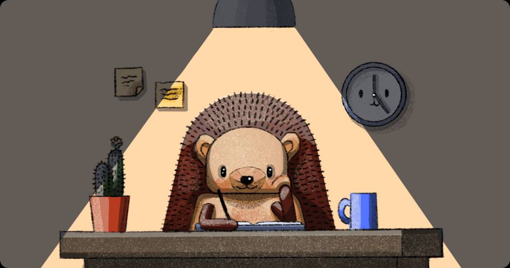

**Want to chat press opportunities? Email [sales@posthog.com](mailto:sales@posthog.com) and we'll get back to you.**

If you'd like to keep up to date with PostHog news, we recommend you [subscribe to our fortnightly newsletter](https://newsletter.posthog.com/subscribe). You can also follow us on [Twitter](https://twitter.com/posthog) or [LinkedIn](https://www.linkedin.com/company/posthog) too. 

## About PostHog

PostHog is the open-source, all-in-one platform that helps engineers build better products. 

We enable software teams to capture events, perform analytics, record user sessions, conduct experiments and deploy new features, all in one platform. 

Founded in January 2020 by James Hawkins and Tim Glaser, PostHog was a member of Y Combinator’s Winter 2020 batch, and has subsequently raised $27m in funding from [GV](https://www.gv.com/), [Y Combinator](https://www.ycombinator.com/), and notable angel investors including Jason Warner (CTO, GitHub), Solomon Hykes (Founder, Docker), and David Cramer (Founder, Sentry).

You can read more about [PostHog's story](/handbook/company/story) and [our transparent, work-in-the-open philosophy](/handbook/company/culture) in our company handbook. 

### Funding history

- **Series B** - March 2021, $15M Series B round, led by Y Combinator's Continuity Fund, with participation from GV, 1984 Ventures and Tapas Capital. [More info](/blog/15-million-series-b).
- **Series A** - July 2020, $9M Series A round, Alphabet’s VC firm GV, with participation from Y Combinator's Continuity Fund and Tapas Capital. [More info](/blog/posthog-announces-9-million-dollar-series-A). 
- **Seed** - March 2020, $3M seed round, led by Y Combinator and 1984 VC.

### Founder bios

You can find biographies, social links and headshots for our founders, James and Tim, as well as the rest of our team in [our handbook](/team). You can also read about the importance of [our first five hires](/blog/posthog-first-five)!

## PostHog Logos

We've created brand assets for you. You don't have to negotiate legal agreements for them. You can find them on our [brand assets](/handbook/company/brand-assets) page.

## Banner images

Want to show your support for PostHog? You can use these banners anywhere you want.

## Hedgehog avatars

Our mascot is a hedgehog called Max. Here he is in some of his favourite outfits!

| Builder Max         | Professor Max     | Detective Max|
|:--------------:|:-----------:|:------------:|
|   |      |         |
