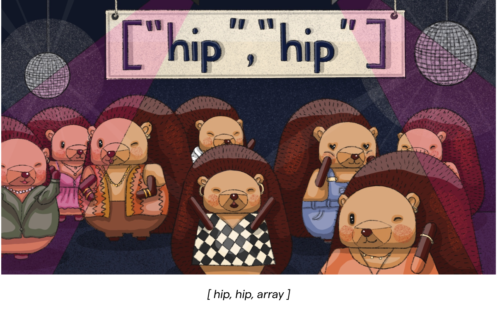

<Section
    divider={false}
    title="HogMail is a fortnightly newsletter that’s about helping you make better products."
    size="full"
    cols={2}
>
    

        <ul className="text-[20px] font-semibold">
            <li>Select cuts from the PostHog blog</li>
            <li>The latest tutorials and news</li>
        </ul>
    

    

        <ul className="text-[20px] font-semibold">
            <li>A selections of new articles we love</li>
            <li>And an awesome hedgehog cartoon!</li>
        </ul>    
    

</Section>

<NewsletterForm
compact
className="bg-offwhite-purple dark:bg-darkmode-purple text-gray-900 dark:text-white"
/>
