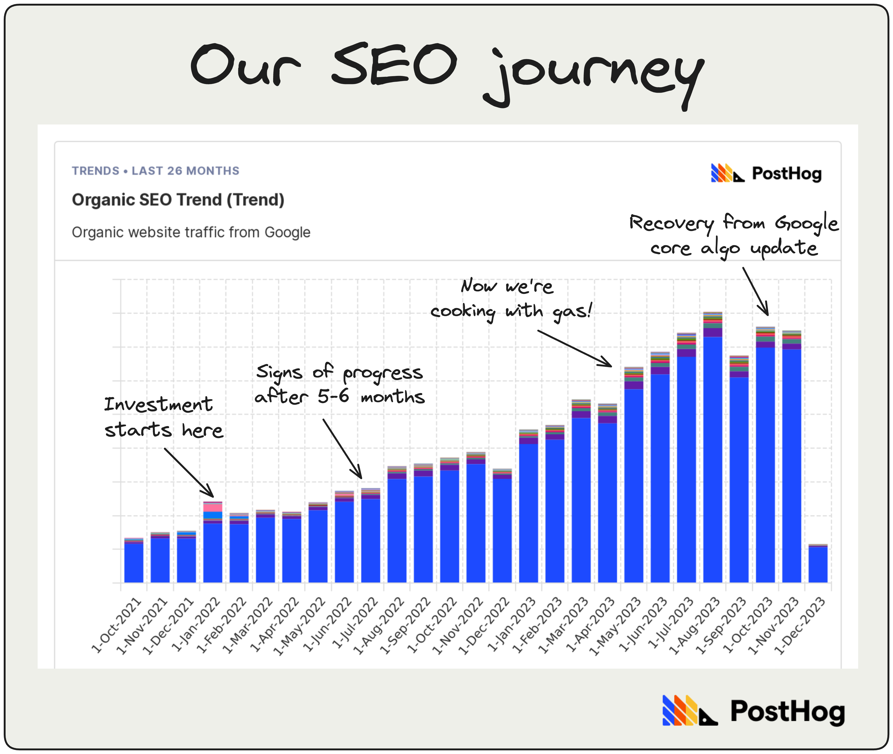

In three years, we’ve grown PostHog from nothing in 2020 to tens of thousands of users, millions in revenue, and default alive.

We’re product-led. We have [product-market fit](/founders/product-market-fit-game). We [ship really fast](/founders/how-come-we-ship-so-much). But, when it comes to marketing, we’re total noobs.

How nooby? Well, here’s our team and their marketing “credentials”:

- [Charles](/community/profiles/254) – leads marketing and (weirdly) ops and finance. No prior marketing experience.
- [Andy](/community/profiles/62) – worked in online publishing for 15+ years. No prior marketing experience.
- [Ian](/community/profiles/269) – software engineering background. No prior marketing experience.
- [Lior](/community/profiles/684) – spent five years in engineering at Meta before PostHog. No prior marketing experience.
- [Lottie](/community/profiles/227) – our awesome graphic designer. PostHog is her first proper job.
- [Joe](/community/profiles/59) – former journalist and, to be fair, has actual marketing experience at previous startups. Way too much experience, probably.

So, yeah. Here’s what we’ve learned about marketing for startups, specifically for a B2B startup for developers. Let us know where we’re wrong!

> This post was first published in our Substack newsletter, [Product for Engineers](https://newsletter.posthog.com/). It's all about helping engineers and founders build better products by learning product skills. We send it (roughly) every two weeks. [Subscribe here](https://newsletter.posthog.com/subscribe).

## 1. Prioritize what you care about ✅

It’s easy to get distracted in marketing. There are so many channels, so many ways to waste a lot of time (and money) being unproductive.

To avoid this, we break our work down by:

- **Things we want to be great at** (8/10 and above)
- **Things we want to be good at** (7/10 is enough)
- **Things we might want to be good at** (stuff we want to try)
- **Things we don't want to spend time on** (have tried already / don’t care about)

Optimizing paid ads, for example, sounds like a good use of time. Who wants to waste money, right? But is getting them from 7/10 to 10/10 going to move the dial for us? We don’t think so, so we’re happy to get them to 7/10.

We cover what we care about in more detail in the [marketing section of our handbook](https://posthog.com/handbook/growth/marketing). Your things may be different to ours, but we typically prioritize more leveraged, long-term activity (e.g. SEO, word-of-mouth, etc.) over high-effort campaigns (e.g. ProductHunt launches).

Above all, don’t get distracted by rivals doing something better than you. Stick to what you want to be great at.

> **Further reading:** [How we spend our marketing budget (with actual $ figures)](https://posthog.com/founders/actual-marketing-budget)

## 2. Compete on depth, not breadth 👨‍🎓

Trying to go head-to-head with much larger competitors on content output is a losing game, so focus on quality. One great article >>> 25 generic ones. We write approx. ⅓ SEO articles, ⅓ tutorials, ⅓ anything goes.

High quality articles perform better in the long run, especially SEO ones. Treat your SEO portfolio like a VC treats their investments – invest time updating your content, don’t publish and forget.

## 3. Build a channel you truly own 💌

Being really good at Twitter/X, LinkedIn, or writing blog posts for HackerNews is worthwhile, but the engagement you get is transient and often subject to the whims of opaque algorithms.

It’s one of the key reasons we launched this newsletter. With the slight exception of Gmail’s “helpful” sorting features, no one other than you decides whether you see our latest issue. And we can be confident the time we invest building *Product for Engineers* won’t be blown to bits by factors outside our control.

Other options include:

- A really great Discord (better for communities than Slack)
- Your own subreddit (not something we’ve tried)
- A community on your website (we’re building it)
- A podcast (good ones take way more effort than you think)

Why do this? FWIW, a single *Product for Engineers* newsletter drives more clicks to our website than a $5,000 newsletter sponsorship we ran recently.

## 4. Make your website genuinely different 🙃
This means:

1. Keeping it separate from marketing, which is the opposite of what most companies do.

2. Avoiding popular design tropes among similar products – how many devtool websites have you seen that look just like Linear?

While our marketing and website teams work closely together, the website team has the final say on what appears on posthog.com. This stops the website becoming too marketing-y and falling foul of marketing ‘best practices’ that most developers (and people in general) despise.

A good (and different) website is a great source of word-of-mouth.

## 5. Perfect attribution is a white whale 🐳

Here’s a simplified history of online marketing attribution:

Attribution has always been hard, and it’s only getting harder because traditional methods are impeded by privacy regulations. This is a 7/10 problem. The journey from 7/10 to 10/10 will end you.

**Here’s our simple advice:**

1. Setup some basic tracking ([multi-touch attribution](https://www.linkedin.com/advice/1/what-pros-cons-using-first-touch-last-touch-multi-touch) is more of late-stage thing)

2. You’ll get much better data if you [deploy a reverse proxy](https://posthog.com/docs/advanced/proxy).

3. Add a free text “where did you hear about us” box to your onboarding.

4. Track UTMs on paid ads. Accept they don’t tell you the whole picture.

5. Run experiments to see what happens when you switch off certain channels.

Combining all the above will get you a roughly accurate picture. Unless you’re selling mattresses in a box (i.e. direct to consumer), anything more complex can wait.

## 6. Paid ads aren’t all bad 💸

Everyone who works at a tech company thinks they’re immune to ads because they’re super-good at internetting, but they’re wrong. We’re still experimenting, but here’s what’s worked for us:

- **Hiring a cheap agency.** $5k/mo is achievable, especially if they're just managing channels and creative, and not throwing in 'value add' services like landing pages and SEO strategy. Don't hire an agency based in the US – they are triple the price.

- **Using Google search ads for conversion.** Provided you don’t use the default settings, or rely on Google’s AI/dynamic/whatever keyword generator tools, search ads. Search ads higher intent than any other types.

- **Using Twitter & LinkedIn for content promotion.** Neither platform are, in our experience, great for conversion, but they can be useful for promoting content and general brand awareness.

- **Promoting our newsletter in other newsletters.** Provided you know your audience, other newsletters can be a great way to expand your audience. It’s much easier to convert people to reading your newsletter than immediately signing up to your product.

> **Further reading:** [Burning money on paid ads for a dev tool – what we've learned](https://posthog.com/founders/dev-marketing-paid-ads)

## 7. Invest in SEO after product-market fit 📈

Really good search-optimized content is highly leveraged – it’s cheaper than paid ads and lasts longer. But it comes with caveats:

1. **It’s a long play.** Expect it to take 5 to 6 months to see meaningful progress. You’ll really start reaping the benefits after 12 months.

2. **It’s pointless before PMF** because your product is changing and you’re unlikely to have the domain authority to rank against entrenched rivals.

That said, don’t delay once you do have product-market fit. It’ll be tempting to use AI to scale SEO quickly. This is a great strategy if you want to murder your growth every six months when Google tweaks its algorithm.

## 8. Own your branded search 🔍

You really don’t want anyone outranking you for any search that’s “your brand name + another keyword”, such as:

- **Comparisons** – i.e. "your company vs another company"
- **Alternatives** – i.e. "alternatives to your company"

There’s no shortage of websites that will try. G2 and its many imitators are top of that list, but your competitors will too. You may need to spend some money on defensive Google ads as well.

Once you’ve built this content out, focus on SEO content targeting your rivals – e.g. “alternatives to rival companies”. And make it genuinely useful. Include comparison tables, real data, reviews from users, and up-to-date screenshots.

## Good reads for product engineers 📖

**[Crafting The First Mile Of Product](https://medium.com/positiveslope/crafting-the-first-mile-of-product-7ed25e8f1027) – Scott Belsky:** ”A failed first mile cripples a new product right out of the gate. Your product may get lots of downloads or sign-ups, but very few customers get on-boarded and primed to the point where they know three things: (1) why they’re there, (2) what they can accomplish, (3) and what to do next.”

**[NPS vs CSAT vs CES: Which satisfaction metric is best for SaaS?](/product-engineers/nps-vs-csat-vs-ces) – Lior Neu-ner:** ”CES (Customer Effort Score) surveys don’t provide any insight into short or long-term user sentiment, but they're useful if ease of use is critical to your product.”

**[Planning for unplanned work](https://linear.app/blog/planning-for-unplanned-work) – Linear:** ”Unplanned work happens unexpectedly, but it’s not unexpected. You know that there will be bug reports, you just don’t know when, where, and in what shape they will come up. The only thing that is certain is that they will appear.”

**[Ten Principles for Growth as an Engineer](https://medium.com/@daniel.heller/ten-principles-for-growth-69015e08c35b) – Dan Heller:** ”Your job isn’t just to write the code and wait for everything else to fall into place; your job is to figure out how to create value with your efforts.”

*Words by Andy Vandervell, who thinks people who use a hyphen instead of en dash are sociopaths.*