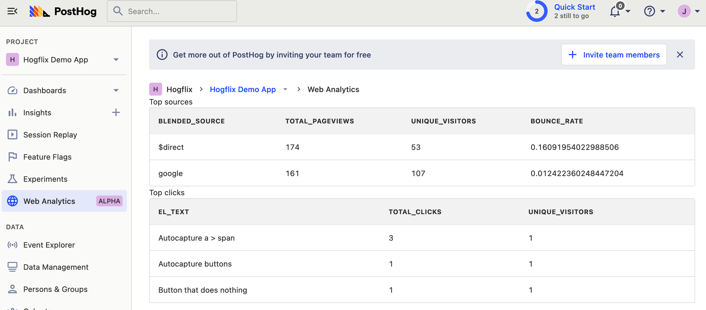
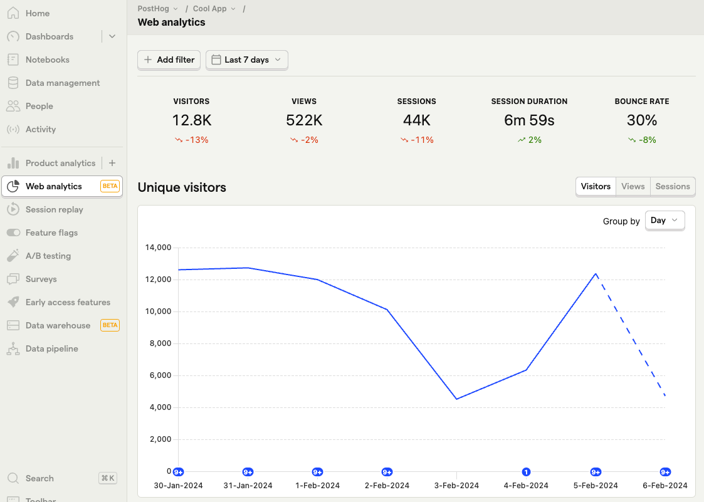
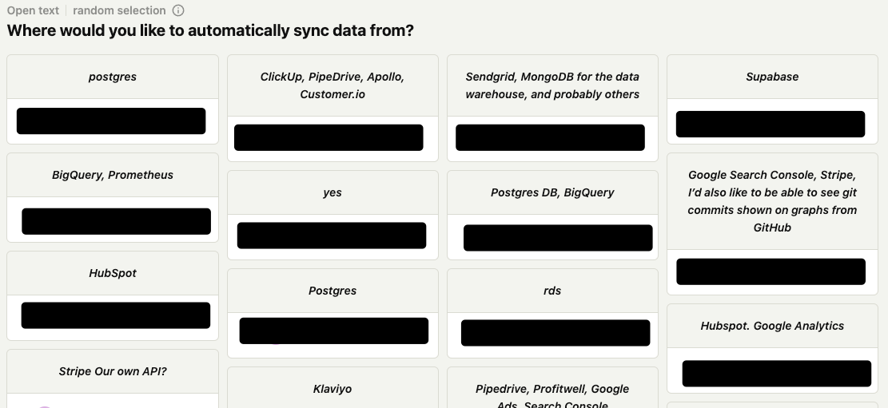

If your rocket points in the wrong direction, it will miss its target, regardless of how fast it goes. Products, specifically the teams behind them, are much the same. 10x engineers are idealized for their incredible technical skills that fuel progress, but if they are working on the wrong things, a product isn’t 10x more likely to succeed.

At PostHog, we rely on engineers to make product decisions. They set their roadmap and goals, and it is their responsibility to see these through. More than most companies, we’re reliant on engineers to point us in the right direction, and that is why we look for specific traits beyond dazzling technical abilities.

**This week’s theme:** What we look for in (product) engineers.

> This post was first published in our Substack newsletter, [Product for Engineers](https://newsletter.posthog.com/). It's all about helping engineers and founders build better products by learning product skills. We send it (roughly) every two weeks. [Subscribe here](https://newsletter.posthog.com/subscribe).

## 1. Always prototyping and experimenting
You can plan and polish a feature to death. We prefer to ship early and iterate. This means engineers must be comfortable:

- Building functional MVPs and proofs of concept.
- Shipping before others would consider it ready.
- Soliciting [feedback from users](/tutorials/feedback-interviews-site-apps) and addressing issues.
- Pivoting or eliminating features that aren’t working.

Doing all this means engineers need all the skills to take a product from zero to built. This includes knowledge of infrastructure, scalability, usability, and design.

We don’t have product management or design by default, so they need these skills to remain autonomous.

[Robbie Coomber](/community/profiles/1187), for example, is a one-person team working on [web analytics](/docs/web-analytics). The [first version](https://github.com/PostHog/posthog/pull/17626) in production was very simple:

He’s since figured out the right visuals, added scroll depth to autocapture, addressed user feedback, optimized query performance, tested sampling, and more.

The work it took to reach the current beta phase has required skills across the stack.  

> **What to look for:** People who have built products or projects from scratch, done hackathons, have an eye for UX and design, and understand system design.

## 2. Comfortable writing

Being a [remote and async company](https://newsletter.posthog.com/p/how-we-work-asynchronously), our team primarily communicates through writing. Common writing tasks include:

- Issues before new features and documentation after.
- Pull request descriptions and review comments.
- [Request for comments](https://newsletter.posthog.com/p/how-we-work-asynchronously#%C2%A7our-request-for-comments-process) (RFC) for big, cross-team decisions.
- Documenting processes in our handbook.

Good writing is vital for all the above. It demonstrates clear thinking and enables us to document what’s important, have fewer meetings, and [stay fast](https://newsletter.posthog.com/p/how-to-design-your-company-for-speed).

[Team Pipeline](/handbook/small-teams/pipeline), for example, has been investigating how to efficiently split events between person IDs and adding overrides to resolve data quality issues. This requires gathering feedback on the design of storage, write path, read path, backfill, and more.

To do this async with multiple teams involved, [Ted](/community/profiles/1421) wrote two 1,500+ word RFCs, which the team followed up with 2,000+ words of comments. Few decisions are as complex as this, but it’s a textbook example of why we look for people who can write.

> **What to look for:** People who communicate well throughout the hiring process, have a blog, or come from a writing-heavy culture.

## 3. A genuine love for building

There are two types of engineers:

1. Those who do it because it makes money.
2. Those who do it because they love it.

We don’t think there’s anything wrong with the first person. Money is a motivator and that is why we make our [compensation transparent](/handbook/people/compensation), so applicants can see their approximate starting salary before they even apply, but…

We look for the second type of person, who is motivated by the work and the mission of PostHog. These people are more likely to:

Be proactive. We look for drivers, not passengers. People who can go from idea to finished feature without managers telling them what to do.

Join us on the journey. We have a huge opportunity and need people who want to capture it.

Because engineers shape the direction of every product, having this trait ensures we are both moving fast enough and in the right direction.

> **What to look for:** People who build cool stuff for the sake of it – e.g. side projects, open source contributions – and haven’t job-hopped to optimize title or salary.

## 4. Customer obsessed

To uncover the real problems users have (and value), [product engineers](/blog/what-is-a-product-engineer) at PostHog interact with them much more often than regular engineers do. This includes:

- [Talking to users](/product-engineers/10x-engineers-do-user-interviews), doing user interviews.
- Recruiting testers for new features and collecting feedback.
- Doing support and responding to incidents.

For example, [Eric](/community/profiles/115) is building our [data warehouse](/docs/data-warehouse). His goal, instead of features built or usage, is 5 reference customers. To make this happen, he has been finding potential users and shaping the product to their requirements. His choice of early connectors (Stripe, Hubspot, and Postgres) was driven by a [survey](/surveys) he ran.

The opposite of this is being dogmatic and solution-obsession. This is being attached to the “right” way or “how we’ve always done it.” It is researching and planning instead of building. It is polishing a feature instead of releasing it and iterating.

Customer obsession guides us toward building products people want, not just what we believe is best.

> **What to look for:** Technical ex-founders, engineers who have built big projects of their own, been in customer-facing roles (like “product”), and have experience firefighting / doing support.

## 5. Understands the broader context

Our teams have a lot of autonomy. They decide on their roadmap, goals, and implementation details. To ensure they make the best decision possible, they must be able to analyze and use all the information available to them. This means:

- Analyzing feedback usage and benchmark data.
- Understanding the competitive landscape (feature sets, pricing).
- Choosing the right metrics to [measure the success of new features](https://newsletter.posthog.com/p/how-to-build-new-features-users-love).
- Understanding the infrastructure requirements and scalability.

To guide the development of mobile replay, [Manoel](/community/profiles/1166) researched competitors and feedback about them. He and [Paul](/community/profiles/69) also developed a spec for mobile replay that included details about the client lifecycle, API request, data structure, and compatibility with [rrweb](https://github.com/rrweb-io/rrweb). This research and planning helps them build a feature that makes business sense while also being scalable and maintainable.

The ability to see the bigger picture enables us to make better long-term decisions. If we’re too tunnel-visioned, we can miss opportunities or build things that break in the long run.

> **What to look for:** People who have worked in similar companies, used tools like PostHog, full-stack understanding (from infrastructure to user experience), and are curious and knowledgeable about the broader ecosystem.

## 6. Easy to work with

We realize that our journey will not be easy, but to make it easier, we try to find people who are energetic, positive, and easy-going. These people are often experienced and later into their careers, but there are exceptions, and we are working on improving this.

The opposite of this is people who are heavily self-promoting and ego-driven. Job hopping every 12 months to optimize their pay and the logos on their resume is a bad sign.

As an example of what being easy to work with looks like, the best sort of communication at PostHog is a pull request. Other companies encourage piling tasks on other people’s plates. We try to figure it out ourselves and open a PR if possible (even if it is wrong). It is a lot easier to tweak a PR than make a change from scratch, helping us ship faster.

Because we work closely and give each other a lot of feedback, being difficult to work with would create a lot of tension and could have a massive negative impact on many.

> **What to look for:** Referrals, lack of excuses and complaints from past roles, gels well with team, proactive during the interview process.

## Why do we value these traits?
Looking for these traits makes it harder to find engineers, especially 10x ones, but we think it’s worth it. Among other things, it enables us to:

- [Optimize for speed](https://newsletter.posthog.com/p/how-to-design-your-company-for-speed) by having small, autonomous teams.
- Have minimal hierarchy and management. We only have a 3-person exec team and “manager” is only part of someone’s role.
- Let everyone focus on doing their best work. Rely on trust and feedback over process.
- 4x growth last year while only adding 3 net new people.

Because we believe talent compounds, it is worth the extra work to find someone with top-tier technical skills as well as the traits listed here. Our culture and growth is proof of it.

## Good reads for product engineers 📖

- **[Traits I Value](https://boz.com/articles/traits) – Andrew Bosworth:** Boz, the CTO of Facebook, writes about the traits he looks for in people. He looks for a lot more than us, but there is a lot of overlap like ownership, bias for actions, and scalable

- **[What Distinguishes Great Software Engineers?](https://newsletter.getdx.com/p/great-engineers) – Abi Noda:** Beyond being a component coder, maximizing the current value of work, making good decisions, and learning continuously set great engineers apart.

- **[What startup recruiters actually see when you apply for a job](/founders/what-recruiters-see) - Charles Cook:** We had 9,000 people apply for roles at PostHog in the last 12 months. Charles goes over how we evaluate them and how to set yourself apart.
