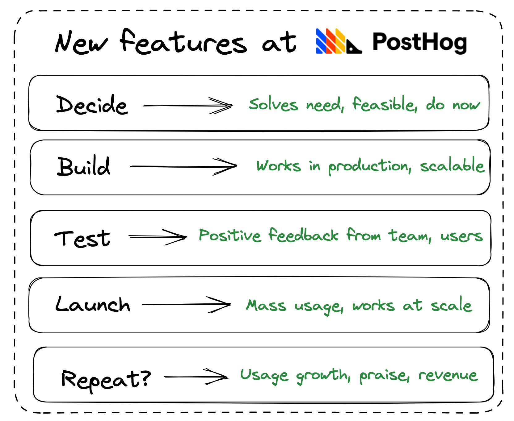
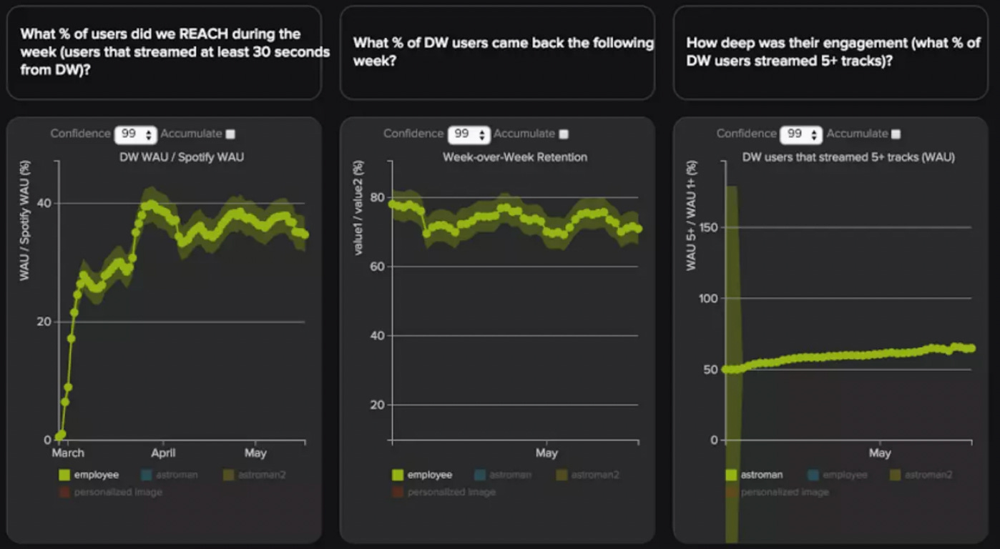

> This post is from our Substack newsletter, [Product for Engineers](https://newsletter.posthog.com/). It's all about helping engineers and founders build better products, and successful companies. We send it (roughly) every two weeks.

What is the meaning of life?

How can someone achieve happiness?

What does it mean to be successful?

These are some of life’s greatest questions, and in this issue, we answer one of them (sort of).

**This week’s theme is:** Launching successful new features

## 🛠️ How we build new features users love
At PostHog, a new feature is successful if it:

1. Solves a real user problem.

2. Is actually used.

These are simple principles. The real secret lies in the process, which we can divide into five steps: Decide, Build, Test, Launch, Repeat.

Here’s that process in more detail:

1. **Decide to build a feature.** We use quantitative data, qualitative feedback, and personal experience to decide what to build. It must also be feasible, and worth doing now, to move to the next stage.

2. **Build an MVP and test it.** We build a simple version of the feature, and ship it behind a feature flag for internal use. Success here is the feature working as intended and can scale up.

3. **Beta testing and gathering feedback.** We use the feature internally and give each other feedback. We also find relevant users to try it, and ask for their feedback. Positive feedback is a success; a common goal here is “5 happy customers”

4. **Wider launch and usage monitoring.** Use the feature flag to expand the rollout, eventually to 100% of users. Monitor usage metrics and session recordings to ensure it is being used, and working as intended.

5. **Continued development post-launch.** If a feature continues to show success after launch, it may warrant further work. What success looks like here is continued growth in usage metrics, recommendations, public praise, and potentially, revenue.

### Why it works
There are 3 key takeaways:

1. **It’s lean.** It’s about building, testing, shipping, and learning quickly.

2. **It’s fluid.** There aren’t any mandatory reports, or metrics.

3. **It encourages ownership.** A single engineer can identify a problem, build a solution, gather feedback, measure success, and iterate.

In [How we build features users love (really fast)](/blog/measuring-feature-success), we go deeper into this process using a real-world example – our data sampling feature created by Yakko to solve the pain points of some of our largest users.

## 🎵 What Spotify learned from Discover Weekly
Discover Weekly was a huge success for Spotify. There’s plenty to learn from the how and why it was a success, and how they validated that success.

### 1. Inspiration
The idea came from the success of a custom, year-end playlist, and was worked on as a [hackathon project](https://newsroom.spotify.com/2018-06-05/love-discover-weekly-thank-a-hack-for-that/). They defined [success metrics](https://www.subtraction.com/2015/11/23/spotifys-discover-weekly-from-idea-to-execution/) as:

1. Reach: Discover Weekly WAU / Spotify WAU

2. Depth: Discover Weekly Time Spent / Spotify WAU

3. Retention: Discover Weekly week-over-week retention

### 2. Building an internal MVP
They iterated several versions internally, using their own experience to guide them. For example:

1. They decided on a length of two hours because it was long enough to be immersive, but short enough to feel special.

2. When working on tuning the algorithm, they found a bug that let in semi-familiar content. It was kept to build trust in the playlist.

### 3. Testing internally
After a few weeks of iteration, it was rolled out to employees, who loved it. The reach, depth, and retention metrics showed this, as did the qualitative feedback.

Not all companies can generate as much usable internal test data, but Spotify has the scale to generate lots of reliable usage insights before showing new features to customers.

### 4. Limited rollout
Next, they rolled Discover Weekly out to 1% of users. They gathered qualitative feedback using a Google Form in the description. The responses were overwhelmingly positive. When asked “Did you like the music in your Discover Weekly?” 65% of users gave it a 5/5 rating.

### 5. Iteration and final launch
Further development was driven by this positive response (including tweets), as well as the massive growth in listening time. It reached one billion tracks streamed in 10 weeks. In the 5 years after it launched, [2.3 billion hours](https://newsroom.spotify.com/2020-07-09/spotify-users-have-spent-over-2-3-billion-hours-streaming-discover-weekly-playlists-since-2015/) were spent listening to Discover Weekly, and many more afterward.

### Takeaways
What can we learn from this process?

1. Define your success metrics at the start. Goal posts move too much if you define success later.

2. Give users a simple way to provide feedback, like a Google Form, a feedback box, or even direct messages.

3. You might not be able to copy Discover Weekly’s outcome, but you can copy the process. A path towards success is building lots of ideas, A/B testing and measuring them, and working on the ones that drive results.

## 📚 Further reading on building successful features

**[12 Signs You’re Working in a Feature Factory](https://cutle.fish/blog/12-signs-youre-working-in-a-feature-factory) by John Cutler.**
What is the opposite of measuring success? Pumping out features with little thought or direction. [John Cutler lists 12 signs you’re in a feature factory](https://cutle.fish/blog/12-signs-youre-working-in-a-feature-factory).

**[The clever way GitHub tracks CoPilot usage](https://thakkarparth007.github.io/copilot-explorer/posts/copilot-internals#secret-sauce-3-telemetry) by Parth Thakkar.**
GitHub claims Copilot writes 40% of its users’ code. How did they get this number? Parth Thakkar reverse-engineered Copilot to find out.

**[8 A/B test mistakes every engineer should know](https://posthog.com/blog/ab-testing-mistakes) by Lior Neu-ner.**
Testing is vital for building great features. Lior explains some common pitfalls. “Generating numbers is easy; generating numbers you should trust is hard!”

**[Feature flag best practices and tips](https://posthog.com/blog/feature-flag-best-practices) by Ian Vanagas.**
Feature flags are an essential tool for releasing and testing new features. See also: [How to do a canary release with feature flags](/tutorials/canary-release).

## 🤔 More good reads
**[Rooting Out Red Tape At Your Startup](https://blog.staysaasy.com/p/rooting-out-red-tape-at-your-startup) by Stay SaaSy.**
When orgs “become obsessed with correctness over speed” they “insist on gathering more data”. There’s “never enough data” so “decisions grind to a halt”.

**[Great engineers are critical thinkers](https://blog.pragmaticengineer.com/critical-thinking) by The Pragmatic Engineer.**
“Until you understand why something is done, or how something works: keep asking, and keep researching.”

**[CFOs Are Killing My Deals!](https://www.onlycfo.io/p/cfos-are-killing-my-deals) by OnlyCFO.**
What does a CFO think about your B2B SaaS product? A useful behind-the-scenes perspective on the when, why, and how of product procurement.

> If you enjoyed this, [sign up to Product for Engineers on Substack](https://newsletter.posthog.com/).
