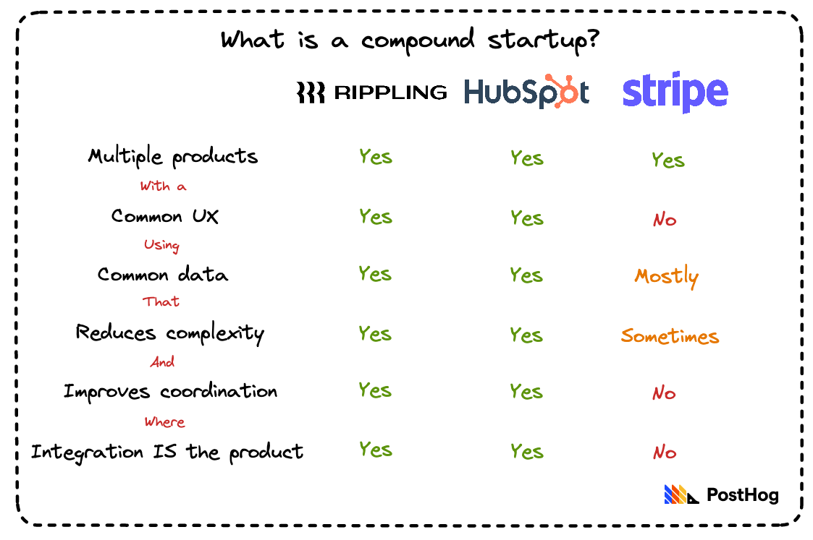

> This post is from our Substack newsletter, [Product for Engineers](https://newsletter.posthog.com/). It's all about helping engineers and founders build better products, and successful companies. We send it (roughly) every two weeks.

Focus is important, right? Building a single great product and monetizing it is the path to startup success. Everyone knows this. It _feels_ intuitively correct. 

Parker Conrad, founder and CEO of the workforce management platform Rippling, disagrees. [Speaking to Startup Grind in 2021](https://www.youtube.com/watch?v=BbSNA64TQ7s), he said:

> “One of the most common tropes of startups, and how to do them well, is that it’s really important to focus. I think it’s advice that is largely wrong and has held back the industry.”
>
> “Some of the biggest, hairiest problems – the problems which could give rise to the most valuable companies – tend to be things that span a lot of different point solutions.”

**This week’s theme is:** The compound startup

## Introducing the “compound startup” 🚀

Conrad argues there’s a category of startup that’s underexplored, what he calls the “compound startup”. 

What is a compound startup? In short, they:

1. Combine several individual point solutions into one integrated product
2. Have a common UX with shared components
3. Tend to revolve around a single type of data – e.g. employee, customer data, etc.
4. Reduce complexity and costs for their customers
5. Solve a coordination problem across systems

Or, as Conrad puts it, compound startups “tend to be the ones where the product is the integration.”

### Examples of compound startups

Which companies match Rippling’s model of a compound startup?

My first instinct was Stripe. It’s big, has loads of products. It must fit. 

But, when you dig down, it’s not even close:

Yes, it has lots of products and most revolve around payment data in some way, but integration isn’t the product. It’s more like a hydra – Adobe for payments, if you will. Hubspot, however, totally does. 

What Rippling does for HR, IT, and finance using employee data, Hubspot does for sales and marketing using customer data. They both store that data centrally, and create workflows where each product makes the others better. Customers gain efficiencies when they use the products together. 

Customers gaining efficiencies = compounding product value. 

### Advantages of a compound startup

So, why build a compound startup?

The simplest reason is because other people aren’t. People are so busy being narrow and focused, they’re blind to larger, untapped opportunities:

“If you take on a series of related problems and do them all at once, there are **islands of undiscovered product market-fit** that are just behind the horizon line that no one has sailed out to because of all this advice.”

Other advantages include:

- **Pricing:** You can “maximise the price of the bundle” while undercutting point solutions on individual products. Your clients save money while you make more.

- **Amortized costs:** Sales and marketing spend is spread across multiple products – R&D costs as well, to an extent.

- **Value:** Compound startups can generate more value for customers, and are more ambitious and valuable themselves as a result.

## Arguments against compound startups

The arguments against are basically the ones that dictate it’s better to focus on one thing and do it well. And, a lot of the time, that’s still valid advice.

Building a compound startup is, by Conrad’s own admission, hard. There’s more to build, and more that can go wrong when your attention is divided across multiple products. You have to welcome the challenge, and hire great leaders.

But here’s the big bet... If the idea is good enough and clearly better than what’s already out there, **execution becomes the only problem**. Rippling is valued at $11bn and Hubspot has a market cap of nearly $20bn. When it works, it really works.

So, next time you’re considering what bets to take with your startup, consider following Parker Conrad’s advice and think bigger.

- [Watch Parker Conrad's full talk on YouTube](https://www.youtube.com/watch?v=BbSNA64TQ7s)

## More good reads 🤔

- **[Stripe isn’t a platform, it’s a mouse](https://numair.medium.com/stripe-isnt-a-platform-it-s-a-mouse-913b2352fb5) – Numair Faraz:** An insightful perspective on Stripe, which likens it to record labels “whose true intention is to nibble away at every dollar” their artists make.

- **[Tips for Writing Great One-Pagers](https://medium.com/@johnpcutler/great-one-pagers-592ebbaf80ec) – John Cutler:** One-pagers are “short, space-constrained, descriptions of a proposed product bet.” A great guide on how to build arguments for big, transformative bets.

- **[How to find your blind spots](https://www.zeptonaut.com/posts/find-your-blind-spots/?utm_source=posthog-newsletter&utm_medium=email) – Charlie Andrews:** Argues that (1) success is a bad measure of success – e.g. you can play a good game of chess and lose – and (2) identifying minigames is the key to improving your skill.

- **[Numbers To Know For Managing Software Teams](https://blog.staysaasy.com/p/numbers-to-know-for-managing-software?utm_source=posthog-newsletter&utm_medium=email) – StaySaaSy:** Some practical tips on managing (and hiring for) software teams, including the number people use when they’re very unhappy.

- **[Why we use GitHub as our CMS](https://posthog.com/blog/github-cms?utm_source=posthog-newsletter&utm_medium=email) – Ian Vanagas:** GitHub is the ideal CMS for engineers and developers because they already use it, and it encourages non-technical people to be more technical.”

> If you enjoyed this, [sign up to Product for Engineers on Substack](https://newsletter.posthog.com/).