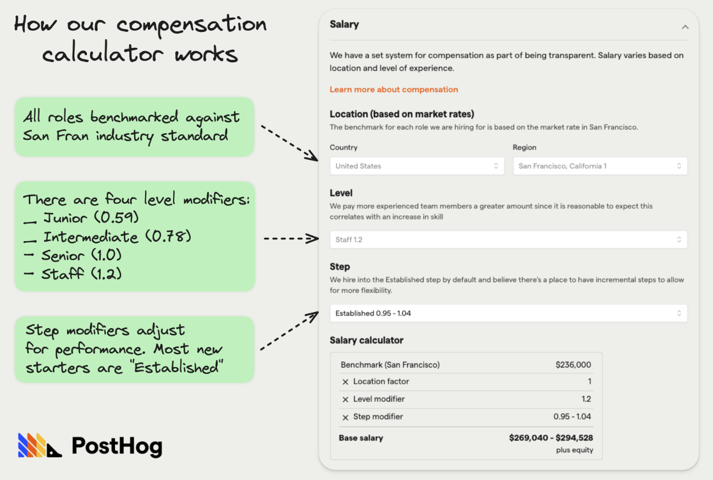
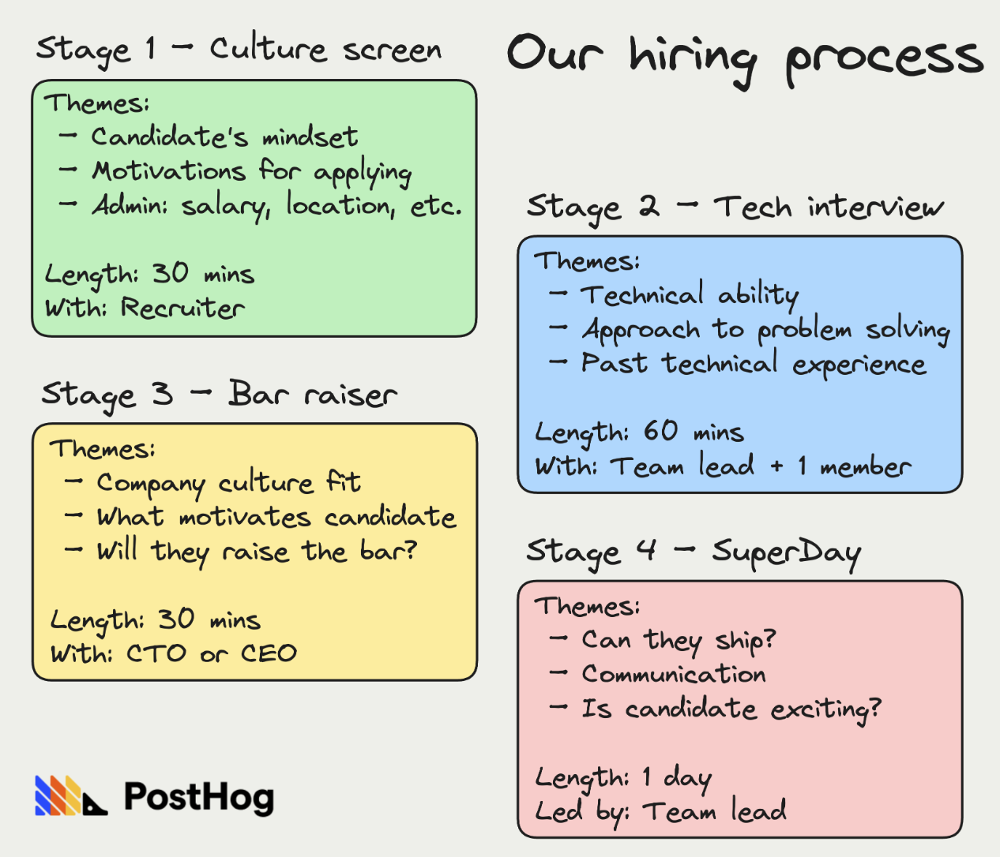

Hiring isn’t just important, it might be the most important thing for a startup.

Finding product-market fit is a hard problem. Finding it with a bad team is near impossible.

We’ve interviewed 1,400 people in over three years, we hired 62 of them, and we have product-market fit. This is what we’ve learned about hiring.

**This week’s theme is:** Hiring bar raisers

> This post was first published in our Substack newsletter, [Product for Engineers](https://newsletter.posthog.com/). It's all about helping engineers and founders build better products by learning product skills. We send it (roughly) every two weeks. [Subscribe here](https://newsletter.posthog.com/subscribe).

## 1. Define your culture before you start hiring

PostHog’s co-founders, Tim and James, wrote [our public handbook](/handbook/) before they hired their second employee. It helped them:

1. Figure out what kind of company they wanted to build
2. The type of people that would thrive in that company
3. The traits they were looking for during interviews

**Why is this important?** Because a company’s culture is defined by the people you hire. It’s hard to retrofit a culture after you hire a dozen people, especially if it turns out you hired people who don’t fit your desired culture. Don’t just think about your culture. Write it down. Talk about it. Put it in your job ads.

## 2. Your early users could be your best hires

In the early days, PostHog’s CEO, [James Hawkins](/community/profiles/71), would check out people who starred the repo and sometimes get in touch to gather feedback. One such call resulted in our third hire, [James Greenhill](/community/profiles/90).

On the call, James G explained Uber (where he worked) had built a bunch of internal tools like PostHog for data control reasons. He found the project interesting and wanted to work on it. He ended up doing a few days of paid work and the rest is history.

He’s still a core member of the team three years later.

**Why is this important?** People who show a strong interest in your product in its infancy likely understand the problem you’re trying to solve, either because they have it now or have experienced it in the past. That’s valuable knowledge when you’re trying to find product-market fit.

## 3. Make your job ads weirdly transparent

Here are three ways to do that:

1. **Outline the exact process:** Tell candidates who they will talk to by name, and what task(s) they’ll be asked to complete. Do not make the process up for each candidate.

2. **Be specific about what the job entails:** Don’t list vague responsibilities, list out exactly what kind of tasks successful candidates will work on. We like to list open GitHub issues and completed pull requests as examples.

3. **Include a salary range:** If you can't afford to pay a good salary, then let expensive people self-select out. We built a [compensation calculator](/handbook/people/compensation/) just for this.

Follow these three principles and your ads will stand out from 90% of the competing adverts out there. Here’s [one of ours](/careers/technical-ex-founder) as an example.

**Why is this important?** Being transparent demonstrates credibility. It shows you’ve thought about the process, why you’re recruiting that role, and you won’t waste people’s time with lowball offers.

## 4. A “soft yes” is actually a no

At PostHog, everyone involved in a hire shares feedback at each stage and gives the candidate a score, broken down as follows:

- **0 – No:** I don’t approve this candidate
- **1 – Yes (Soft):** I approve this candidate (with caveats)
- **2 – Yes (Strong):** I strongly approve of this candidate

A majority of “soft yes” responses is normally indicative of some deeper unease about a candidate. We (mostly) don’t hire these candidates unless there’s a passionate advocate in their favor.

**Why is this important?** Hiring the wrong person is more expensive than passing on someone who might have been good. You’ll spend weeks or months figuring out if they’re working or not, and that’s time you won’t get back. Avoiding the soft yes candidates is vital for keeping hiring standards high.

## 5. Managers, not recruiters, are responsible for hiring

This is true from day one, but becomes more critical as you grow and use recruiters to manage sourcing and screening candidates.

As Charles Cook, our head of ops and a veteran of multiple startups, [explains](/blog/early-stage-startup-hiring-strategy#myth-recruiters-are-responsible-for-hiring):

> “Managers are responsible for the output of their teams. Output can be increased by hiring more people. Therefore managers are responsible for hiring.
>
> “Recruiters are responsible for maximizing your chances of success by running a great process, helping get a great job ad in the right places, ensuring no balls get dropped, and partnering with you to increase the size of the applicant pool.
>
>“If you are struggling to hire for a role, first ask yourself 'am I spending 20% of my time recruiting?' If the answer is yes, then go complain to your recruiter.”

**Why is this important?** Managers need to properly own hiring. Those that don’t end up hiring average people and blaming their recruiters.

## 6. Good people are always in demand

There’s a school of thought that hiring is easier when other, much bigger, companies are cutting people. This hasn’t been our experience. Here’s Charles [again](/blog/early-stage-startup-hiring-strategy#myth-hiring-gets-easier-when-other-companies-are-making-cuts):

> “The best people are always in demand and will have lined up five interviews within 24 hours of posting on LinkedIn. Often (but not always) the 'cuts' that are being made are in non-core product areas, or in more manager-y type roles that are unlikely to be relevant to your early-stage startup.”

Extra pro tip: consider approaching people who are still at those companies. There’s a good chance they’re considering their positions.

**Why is this important?** TL;DR, hiring good people is always hard, whatever the market conditions suggest. Make your peace with it and embrace the challenge.

## 7. Actual work is 10x more valuable than interviews

Interviews are a necessary and reasonably effective filtering system, but they’re not enough to make a final decision. Instead, get your candidates to do some real work in a semi-realistic context. And pay them, obviously.

At PostHog, the final stage is what we call a SuperDay, which comprises:

1. A task we want the candidate to work on, sent on the day.
2. A private Slack channel with the candidate and relevant people, where they can ask questions and discuss the task.
3. A kick-off meeting with the hiring manager at the start of the day outlining the task and our expectations.
4. An informal culture chat with people from outside the hiring team.

We’re as flexible as possible with SuperDays. They can be split over more than one day, or become SuperWeeks if the candidate’s schedule allows.

**Why is this important?** Real work filters out people who are just good at interviews, and gives you a stronger signal on how they work, communicate, and solve problems.

## 8. Make your own mind up

When interviewing with another colleague, it’s tempting to immediately ask them what they think afterwards. Don’t. Instead, write down your impressions separately then compare notes. You’ll get a much better read if you don’t bias yourself.

**Why is this important?** You’re less likely to say no to someone because of minor concerns, or to push for a candidate with hidden talent, if you already know what your colleagues think. This is important for avoiding too many “soft yes” candidates, too.

## 9. Hire fewer people, bias for autonomy

This is a principle we’ve had from the start, and it’s served us well.

Hiring more people doesn’t mean “more things get done” – often it’s the opposite. Over hiring also creates a cascade of problems for founders, such as people problems that suck up energy and... running out of money!

> “Whenever we see a company post-YC that’s running low on money, it’s almost always employee burn. It’s never some service they’re using, it’s always employees.” – Michael Seibel, YC partner

We look for people who can work autonomously. Often, but not always, this means looking for more senior people who want to be individual contributors, rather than manage a team. Managers at PostHog don’t exist to tell people what to do.

**Why is this important?** Over hiring is a surefire way to recruit the wrong people for your startup. People who work well autonomously will add energy to your team.

## 10. Be wary of people who’ve only worked at “amazing” companies

Imagine a perfect CV. A senior engineer who’s worked at Alphabet, Meta, and a well-known startup that exited through an IPO or acquisition. It can’t be coincidence, can it?

Maybe not, but many of the best people at PostHog worked at or founded companies that just didn’t work. We find this cultivates a degree of grit and optimism that’s invaluable in a startup, not to mention experience of all the mistakes they made along the way.

In contrast, someone who’s worked exclusively at FAANG-type companies c.2012-2022, or joined startups after they’d achieved product-market fit, has (maybe) had an easy life.

**Why is this important?** Working at a startup, especially before product-market fit, is totally different from a bluechip, or a startup that’s already (mostly) got stuff figured out. Don’t assume people will work just because their CV looks right.

## Good reads about hiring 📚

[How to hire your first engineer](https://www.ycombinator.com/library/4H-how-to-hire-your-first-engineer/)** – Haj Taggar**
”Candidates think differently to investors and you'll need to tweak the message that worked for your fundraise e.g. candidates will think less about your market size and more about your most interesting product challenges.”

[Myths (and truths) I've learned from 10 years of startup hiring](https://posthog.com/founders/early-stage-startup-hiring-strategy)** – Charles Cook**
”I've managed and hired for teams across engineering, ops, people, marketing, and design, interviewing some 800 people in the process. These are the destructive myths and important truths I've learned over that time.”

**[The SaaSy guide to hiring](https://staysaasy.com/hiring/2022/09/23/saasy-guide-to-hiring-how-to-hire.html/) – Stay SaaSy**
“If you’re a tech company, it’s worth your while to refine your recruiting process as if you were a company like Toyota or Apple refining their supply chain. Recruiting should be a priority for the smartest and most driven people at your company, rather than a backwater activity that gets passed around like a hot potato.”

**[PostHog hiring handbook](https://posthog.com/handbook/people/hiring-process/) – PostHog**
“For everyone on the PostHog team meeting a candidate, ask yourself – will this person raise the bar at PostHog? The answer should be yes if we want to hire them.”

**[Why do companies over-hire?](https://waysofworkingcollection.substack.com/p/why-do-companies-over-hire/) – Josephine Conneely**
“If [hiring for growth] ask yourself, what would the leanest version of hiring look like? What is the expected output difference versus current hiring plans? It may be possible to achieve most of your growth goals with a smaller team.”

**[What we learned about hiring from our first five employees](https://posthog.com/blog/posthog-first-five) – Andy Vandervell**
“While it's tempting to search for "that hire" who will magically transform your product and company, this is a fool's errand. Successful companies are built on collective strength, which is why talent compounds is one of our core values.”

_Words by Andy Vandervell, who thinks watermelon is pointless._