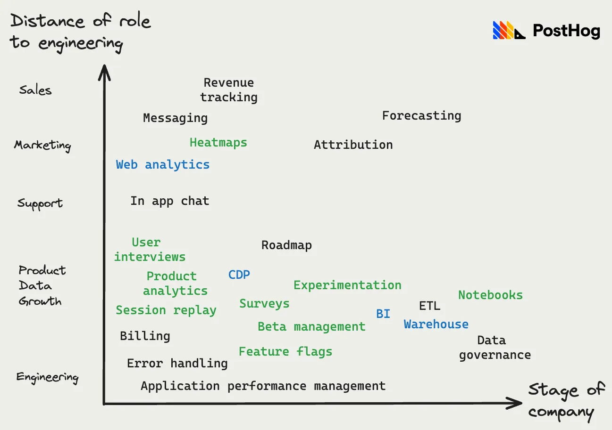
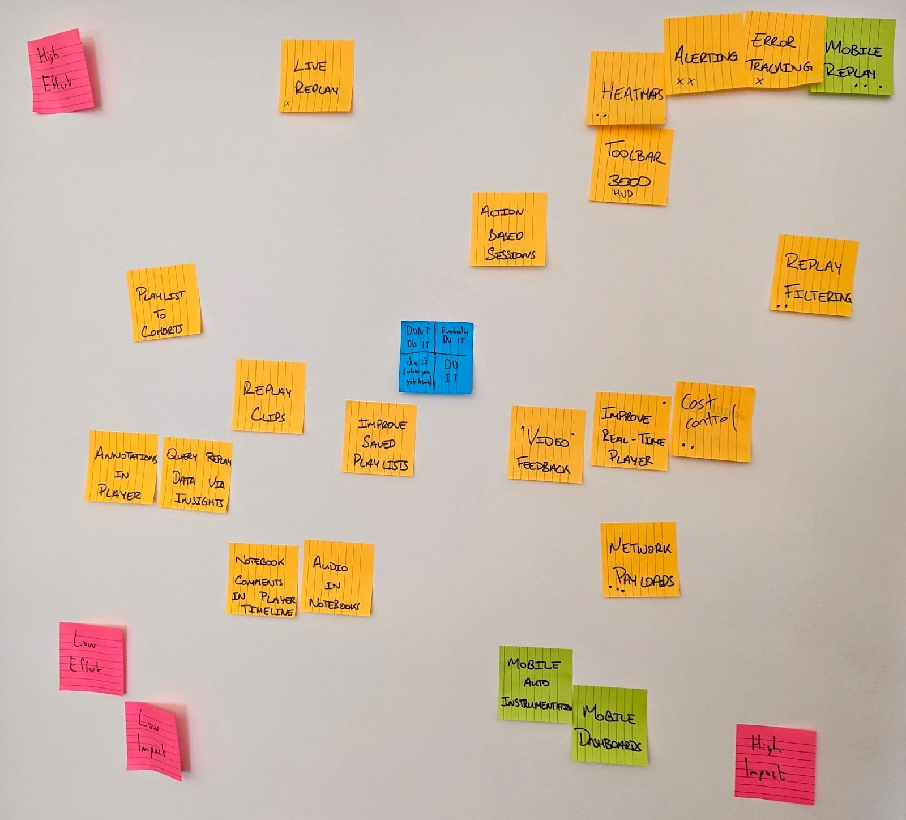
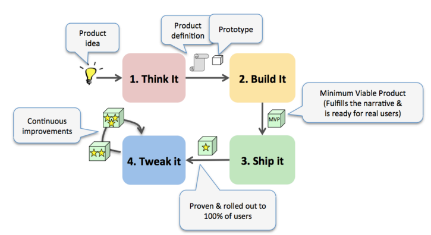
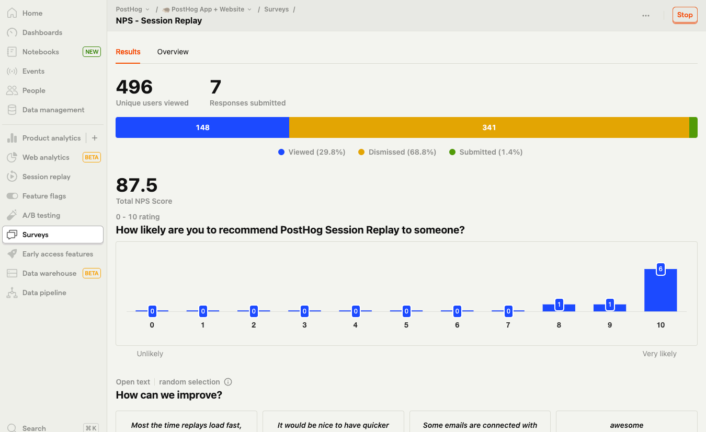

There is a point in your product journey where what to build next goes from obvious to unclear. The options seem endless and choosing correctly can be the difference between a thriving product and a failing one.

It’s a problem we’ve experienced firsthand. Our goal is to build the all-in-one platform for building better products (we like to aim high). Consequently, there are dozens of features we could build at any one time.

We’ve developed ways to navigate this problem. Based on the position we’re in and the success of [what we’ve built recently](/changelog), we’re confident in our process now. This is what we’ve learned.

**This week’s theme is:** Picking winning features

> This post was first published in our Substack newsletter, [Product for Engineers](https://newsletter.posthog.com/). It's all about helping engineers and founders build better products by learning product skills. We send it (roughly) every two weeks. [Subscribe here](https://newsletter.posthog.com/subscribe).

## 1. Agree on your product principles

It’s impossible to make good decisions without some shared principles to guide you. They give you a common language and framework for discussing ideas.

Critically, product principles make it easier to say no to ideas, even potentially good ones. Without them, you’re left with a lot of opinions and no way to evaluate them.

At PostHog, our principles for what to build tie to [our core strategy](/handbook/why-does-posthog-exist):

1. Provide every tool needed for evaluating success.

2. Get in first.

3. Be the source of truth for customer and product data.

We also put a lot of weight on user feedback, especially from [our ideal customer profile (ICP)](/handbook/who-we-are-building-for). We talk to users regularly and ask them to comment on our public roadmap and vote on what they want.

There are many other principles such as agile, lean, RICE, themes, metrics, top-down planning, weighted scoring, or following a [benevolent dictator](https://en.wikipedia.org/wiki/Benevolent_dictator_for_life). What matters is **choosing something**.

Principles help avoid pitfalls like becoming a feature factory, building for big customers, caring too much about competitors, focusing on easy features, or building what generates the most MRR. These can become never-ending treadmills that don’t improve your product.

## 2. Map everything your users want

You need a map to go exploring. Mapping everything your users want, or could want, ensures you don’t get tunnel vision. Start wide and then narrow down or you’ll miss great ideas just beyond the horizon.

By talking directly to users and making it easy to share ad hoc feedback, we’ve built a good idea of [all the products our users want](/handbook/which-products), ranging from product analytics to error handling, revenue tracking, and data governance.

The axes for this graph relate to our [ICP](/handbook/who-we-are-building-for): **product engineers** at **high-growth startups**. Everything we’ve built already is in green, while things we’re building at the moment are in blue.

Features towards the bottom left correlate best to our ICP, but there are outliers. We’re building web analytics, for example, because it helps us get in first and it’s easy for us to build because we’ve already built product analytics.

This brings us to our next point…

## 3. Prioritize by effort vs impact

At a lower level, individual teams also have an idea of what all the potential features they can build are. To discover these, they use [user feedback](/product-engineers/10x-engineers-do-user-interviews), metrics, experience, product principles, and personal opinions.

Our small teams use their offsites to map these options. Below is an example of a [Team Replay](/small-teams/replay) 2x2 grid from a recent offsite (notes in the top right are high effort and high impact):

After mapping out their ideas, the team voted on the 1-3 features they wanted to work on, “X” at the bottom. Depending on the size of the team, once a feature gets 2-3 Xs, it’s chosen and implementation begins.

For example, **mobile replay**, in the top right corner (high impact, high effort), now has an [in-progress mega issue](https://github.com/PostHog/posthog/issues/19037) dedicated to its implementation. **Mobile dashboards**, bottom right (high impact, low effort), will be live shortly.

## 4. Make ownership clear

This process creates clear ownership and, in turn, makes deciding what to build much clearer. The owner becomes responsible for validating the idea, implementing the feature, making tweaks and bug fixes, and ensuring ongoing success.

The unique qualities of [product engineers](/blog/what-is-a-product-engineer) are key here. They have all the skills needed to take an idea to a fully-featured, revenue-generating product. This enables them to work with a high degree of autonomy and speed.

This is counter to a larger, ownership-avoidant team. Their process for choosing what to build might look like:

1. Plan a decision-making process.

2. Have a brainstorming meeting.

3. Develop promising product specs from the brainstorm.

4. Have a meeting to decide which one to build.

5. Write up and agree on implementation details.

6. Project manage a multi-role team to get the feature to completion.

This is slow. Less gets shipped and the team is disconnected from the real user experience. Having someone own the decision and be responsible for its ongoing implementation speeds up the decision-making process and gets more shipped, faster.

## 5. Test with minimal effort

Testing is part of the decision-making process. Building MVPs of features and products reveals:

1. Does anyone care?

2. How much effort will building it take?

All of PostHog’s products (beyond product analytics) were initially built in 1 to 3 person teams at our hackathons. Our newest products like [web analytics](/teams/web-analytics) and the [data warehouse](/teams/data-warehouse) are being built by single-person teams.

This enables us to get stronger validation on demand before investing further. Companies like [Apple](https://review.firstround.com/six-steps-to-superior-product-prototyping-lessons-from-an-apple-and-oculus-engineer) and [Spotify](https://blog.crisp.se/wp-content/uploads/2013/01/HowSpotifyBuildsProducts.pdf) also rely on this prototyping-heavy style.

<Caption>Early Spotify’s product development process</Caption>

Another way we test with minimal effort is by building on what we’ve already done. For example, surveys use the JavaScript library to display forms, event capture for responses, and feature flags for targeting. Having all these things built first made surveys easier to implement, a perfect example of a high impact, low effort opportunity.

## Choosing to build surveys (a real-world example)

[Surveys](/surveys) were one of our largest releases of last year. How we inevitably chose to build it is a good example of how our process works:

1. The first request for a [user interview tool](https://github.com/PostHog/posthog/issues/2880) happened nearly 3 years before it launched. For the majority of this time, we pointed users who requested it to workarounds like capturing feedback as an event.

2. In October 2022, we hired our first product managers. This made the need for a feedback-gathering tool more obvious, as they were doing it more often. The process of finding and contacting users was tedious and had a low response rate.

3. Also around this time, Marius shipped [site apps](https://github.com/PostHog/posthog/issues/9479). This enabled MVPs of feedback, user interview, and NPS survey apps, which got solid usage internally and some usage externally.

4. At our [Aruba offsite](/blog/aruba-hackathon), the [Feature Success team](/teams/feature-success) was doing roadmap planning. They decided they had good ways to measure success quantitatively, but not qualitatively. To ensure PostHog “provides every tool needed for evaluating success” (a core strategy point), it made sense to build surveys out further.

5. [Li](/community/profiles/129) took ownership of surveys and built on top of site apps (initially), feature flags, and product analytics. Throughout the process, she got feedback (sometimes using surveys, very meta), and shipped towards launch.

## Good reads for product engineers 📖

**[11 years of SaaS product strategy](https://ghiculescu.substack.com/p/11-years-of-saas-product-strategy) – Alex Ghiculescu**

Alex, co-founder of Tanda, writes about the phases of product strategy he’s experienced over 11 years, and reflects on what he’d have done differently.

**[Shape Up](https://basecamp.com/shapeup) – Ryan Singer**

Basecamp’s full guide to building products detailing their three-step process: shaping, betting, and building.

**[The most useful product health metrics](/product-engineers/product-health-metrics) – Ian Vanagas**

The metrics you need to see if what you’re building is working. I break down metrics for adoption, retention, and engagement and how to pick the right ones.

**[Prioritising Features: Who’ll Use It & How Often?](https://www.intercom.com/blog/prioritising-features-wholl-use-it-how-often/) – Des Traynor**

The Co-founder and Chief Strategy Officer of [Intercom](/tutorials/intercom-session-replays) goes over how to avoid your product becoming a collection of useless tools by prioritizing features used by everyone all the time.

**[How to prioritize features](https://www.ycombinator.com/library/8p-how-to-prioritize-features) – Emmett Shear**

Former CEO of Twitch (and OpenAI 🧐) breaks down his three feature prioritization frameworks: built for me, switch to us, and three numbers matter.

_Words by Ian Vanagas, who wonders what happened to all the “growth hackers.”_
