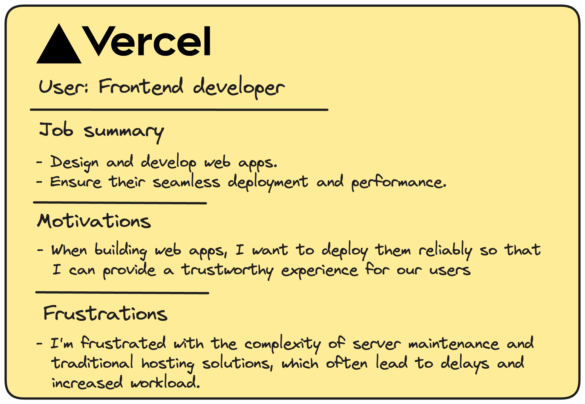
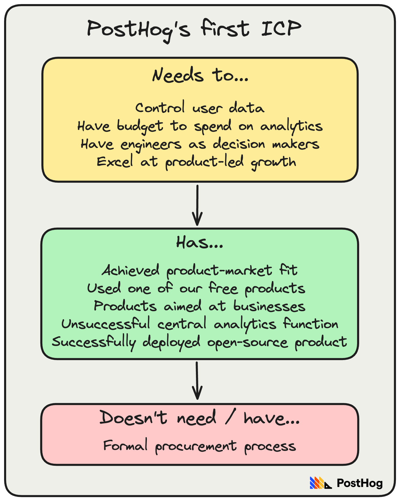
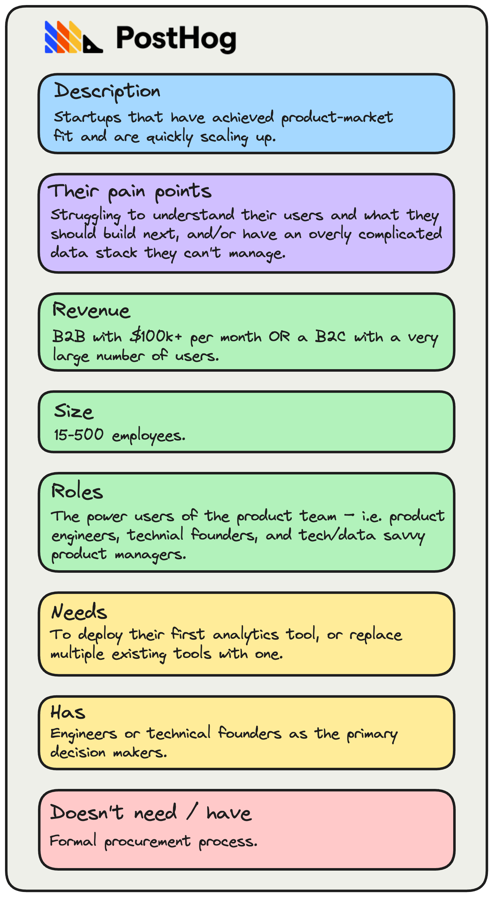
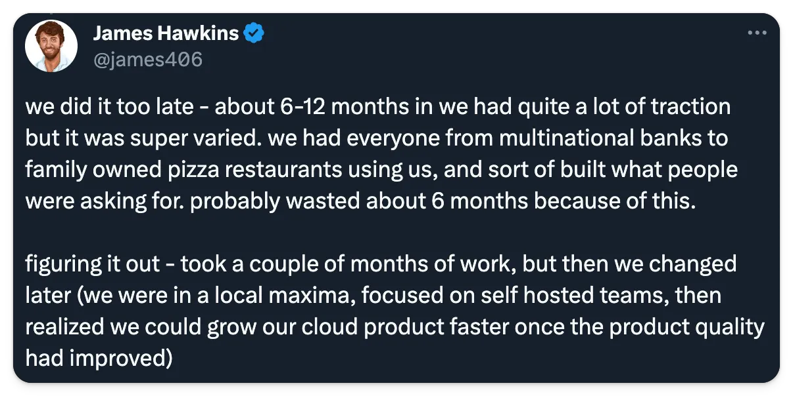

Defining our ideal customer profile (ICP) is one of the most important things we’ve ever done. We wish we’d done it sooner. Most startup founders say the same.

Why? Because having an ICP and [achieving product-market fit](/founders/product-market-fit-game) are inextricably linked. You can’t do one without the other.

It’s the invisible force that binds your product and your market.

**This week’s theme is:** Everything you need to know about finding your ICP

> This post was first published in our Substack newsletter, [Product for Engineers](https://newsletter.posthog.com/). It's all about helping engineers and founders build better products by learning product skills. We send it (roughly) every two weeks. [Subscribe here](https://newsletter.posthog.com/subscribe).

## 1. ICP and personas aren’t the same thing

An ICP defines your customers – i.e. companies or teams that need your product. An ICP can include individual personas, but it should also include things like:

- Company type (startups, mid-market, etc.)
- Who their customers are (e.g. are they B2B or B2C, etc?)
- How many employees they have (e.g. 5 to 50)
- How many users they have (useful for B2C)
- Who will use your product (individuals and teams at the company)
- The tools they use or want to replace with your product
- What they value (e.g. design, speed, etc.)

Personas, on the other hand, describe the motivations and frustrations of specific users. Here’s an example from Vercel:

**Why is this important?** A user persona isn’t specific enough. It won’t help you figure out your go-to-market strategy, or how you should price your product. Building your business around a user persona is a great way to build a product people love, but won’t pay for.

> **Further reading:** [How to create a great user persona (with examples)](/product-engineers/how-to-create-user-personas)

## 2. Your entire strategy is downstream of your ICP

Some people think an ICP is just a sales and marketing framework. And, sure, it will help you with those, but it’s so much more than that.

An accurate ICP will define not just which customers you target, but every aspect of your product and go-to-market strategy. It’s the sun around which product, marketing, and sales orbit.

**Why is this important?** Broadly speaking, our ICP is high-growth B2B startups that have product-market fit, where engineers are the decision makers – see our handbook for a more detailed version.

Here are some of the decisions we’ve made because of this:

- An engineering-led culture
- Selling [features, not benefits](https://newsletter.posthog.com/p/why-we-sell-features-not-benefits)
- Transparent, [usage-based pricing](/founders/pricing-lessons)
- Being product-led with no outbound sales
- A UI that [feels like a dev tool](/blog/posthog-as-a-dev-tool), not an analytics tool
- A focus on high-quality content for engineers and founders
- Not running advertising cookies and retargeting campaigns
- An unconventional website full of code snippets and memes
- Building dev-focused features (e.g. dark mode, SQL querying, data warehouse)

TL;DR: Your ICP will influence every decision you make.

## 3. Start with your best guess and test it

Do this as early as possible.

Back when PostHog was just a self-hosted product analytics tool, our first ICP was broken down into three categories:

1. Things our customers need
2. Things our customers have
3. Things our customers don’t need

This lacks a few important details you need for a complete ICP, such as company size and revenue, but it was specific enough for us to test and refine later.

**Why is this important?** Your first attempt will be wrong, so don’t overthink it. [Lenny Rachitsky notes](https://www.lennysnewsletter.com/p/how-to-identify-your-ideal-customer) that most companies he spoke to had just three attributes in their initial ICP.

## 4. Gather intel every way you can

It should go without saying that defining your ICP requires talking to users a lot. Write everything down. You never know what detail will become important later.

Other ways of gathering intel include:

1. **Asking questions at signup**, such as how many employees a company has, or what tools they use. Look for patterns here.
2. **Comparing retention** between different types of companies and users.
3. **Identifying your power users** by analyzing who uses the product the most, or complete high value events most often.
4. **Running NPS or PMF surveys**, which will help you identify the roles and companies who love your product the most.

**Why is this important?** Talking to users will get you some of the way, but you need data to back that up. You’re on the right track if users in your ICP:

- Retain better than non-ICP users
- Give higher ratings in surveys than non-ICP users
- Use your product more than non-ICP users
- Trigger high value events more often, or faster, than non-ICP users.

> **Further reading:** [How to measure product-market fit – an in-depth guide](/founders/measure-product-market-fit)

## 5. Learn to identify real enthusiasm

The signs of product-market fit and a company in your ICP are basically the same. Look for people / companies who:

- Show visible excitement when you demo the product.
- Strongly agree when you describe the problem you’re solving.
- Constantly give you feedback on things you can improve.
- Spontaneously invite colleagues to your demo / to use your product.
- Use the product a lot even if it’s a bit janky.
- Refer other people / companies they know have the same problem.
- Start paying or actively want to pay (even if you’re not charging yet).
- Share your product publicly – e.g. on Twitter, LinkedIn etc.

Signs your ICP is wrong include people who:

- Describe your product as “interesting”, “cool”, or “clever”.
- Use your product to do something unintended (investigate further).
- Use the product but, when asked, state they wouldn’t pay for it.
- Refer you to someone junior who isn’t a decision maker.

**Why is this important?** Most people are polite, so they will let you down gently. Knowing the difference between genuine enthusiasm and polite indifference is vital.

## 6. Add more detail as you build confidence

As you talk to more users and gather more intel, you should add more detail until your ICP feels very narrow.

Eventually your ICP should look something like this, our current ICP:

This ICP works for us because they:

1. Have a very quick sales cycle, so we can grow efficiently.
2. Activate and retain better than those outside our ICP.
3. Have strong opinions about what they need, which helps our product teams.
4. Influence earlier-stage startups and slower moving companies, which is good for word-of-mouth growth.

You can be confident your is correct when users in your ICP activate and retain better than those outside your ICP. If they’re still quite similar, you need to get more specific.

**Why is this important?** A real ICP needs to be very specific to be directionally useful. It’ll be tempting to hedge a little to give yourself wiggle room. Don’t. It’s a good sign if you feel it could be too narrow. Lean into that.

## 7. Remember these rules

### A broad ICP is worse than none at all 🎯
It’ll be impossible to test and give you a false security. An industry is not an ICP. Neither is “people under the age of 30” or “B2B startups”.

### Leaving it too late will cost you time 🕣
You should start trying to define your ICP once you have a working product and some traction. Leaving it too late will waste a lot time, as we found out:

### It will take you months to perfect your ICP 📆
Startups we’ve spoken to (and our own experience) suggests anywhere between 3 months to a year is normal. It will also evolve over time. Don’t let it go stale.

### Don’t jump to conclusions 🛑
Locking in your ICP too quickly based on one or two successful users is a bad idea. They could be outliers that send you down the wrong path. Reaching 5 paying customers who look the same (i.e. they’re in your ICP) is a good sign for a B2B product; 10 or more is very strong. Verify with data.

### Don’t undervalue cold outbound 📨
Daniel Hsu, founder of Retool, believes outbound is very useful for early-stage startups, because interest generated this way is more honest:

“It gives you a very good sense of how something resonates. On the other hand, if you get a warm intro, people will take the call and maybe ask for a demo. It’s very non-committal and vague, and [it’s] harmful to startups because it can make them think they have product-market fit when they don’t.” – via [The Review](https://review.firstround.com/retools-path-to-product-market-fit-lessons-for-getting-to-100-happy-customers-faster#finding-customers)

## Good reads for product engineers 📖

- [How to identify your ideal customer profile](https://www.lennysnewsletter.com/p/how-to-identify-your-ideal-customer) **– Lenny Rachitsky:** Lenny’s guide includes dozens of great anecdotes from startup founders and CEOs, and useful examples of initial ICPs from the likes of Linear, Retool, and Figma.

- **[Should you have an AI strategy? Here's ours](/posts/should-you-have-an-ai-strategy-here-s-ours) – James Hawkins:** How should you think about AI if you’re not already an AI startup? Our take.

- **[How to create actionable developer personas](https://www.developermarkepear.com/blog/developer-personas) – Jakub Czakon:** Want to go deeper on personas? Jakub’s guide is a comprehensive look at creating developer personas and Jobs To Be Done (JTBD).

- **[Metrics that cannot even be measured in retrospect](https://longform.asmartbear.com/unmeasurable-metrics) – Jason Cohen:** Some product choices, such as small design changes, are impossible to measure. Jason shares some great examples of things you shouldn’t try to measure.