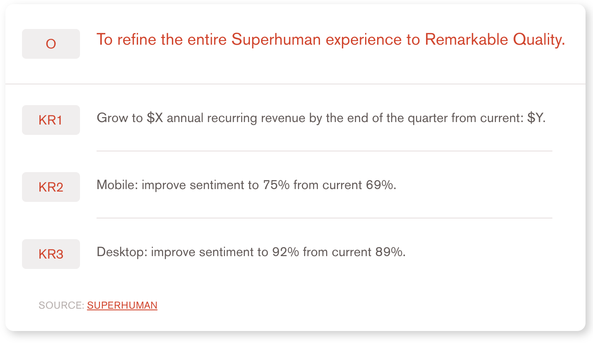
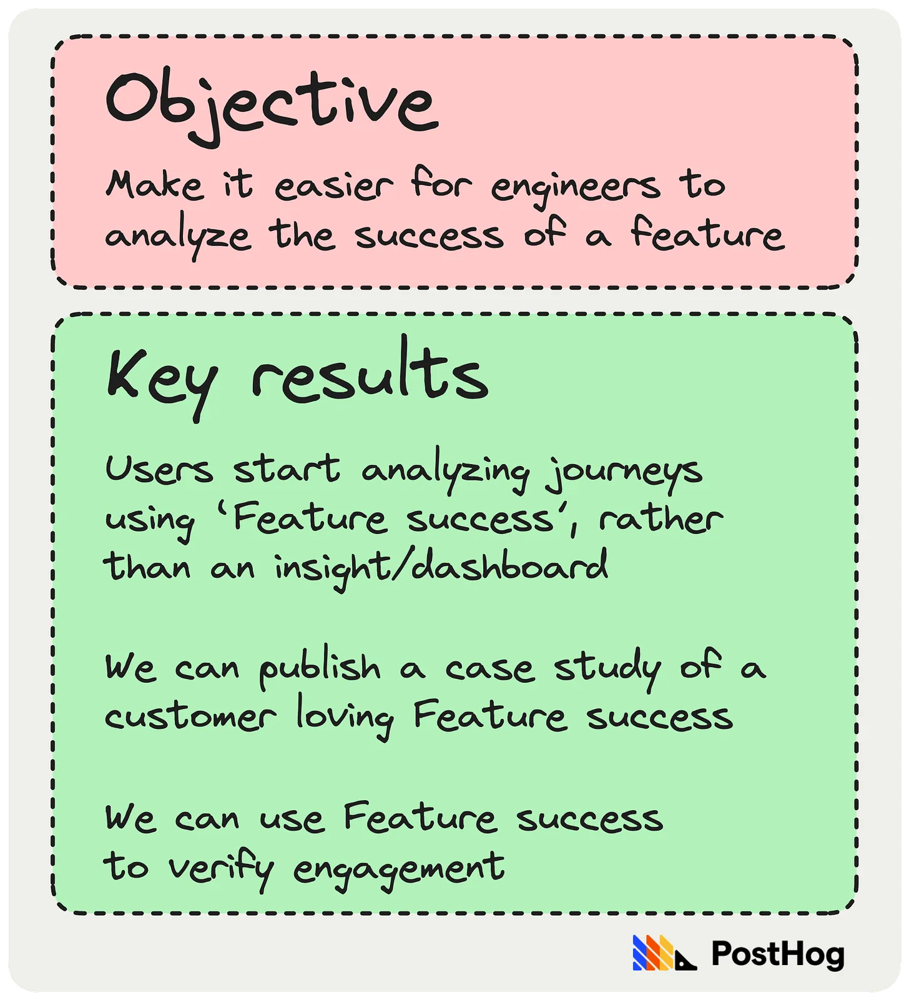

We’ve made mistakes at PostHog. We’re still making them, probably. In this issue, we’re sharing some important ones we’ve made, and what we learned from them.

I’d love to hear about mistakes and lessons you’ve learned, too. Just leave a comment.

**This week’s theme is:** Learning from our mistakes

> This post was first published in our Substack newsletter, [Product for Engineers](https://newsletter.posthog.com/). It's all about helping engineers and founders build better products by learning product skills. We send it (roughly) every two weeks. [Subscribe here](https://newsletter.posthog.com/subscribe).

## 1. Waiting too long to hire a product person

In the early days of PostHog, we focused on (i) building new features, and (ii) talking to customers. We had no product managers as James and Tim, PostHog’s co-founders, felt they would slow things down and didn’t want to “shield” engineers from customers.

It was the engineering team who persuaded them otherwise during a feedback session at our first all-company offsite. As [James explains](/blog/ceo-diary-5#product-people-can-transform-your-company):

> “Tim and I were both given the feedback that we've seen product done badly in our previous careers, and as a result, we aren't building this discipline at all into the company.
> 
> “Compellingly, Paolo – then, one of our engineers – had proactively acted like a product manager. He gathered deep feedback from dozens of users, which he summarized at the start of the offsite to everyone.
>
> It was incredibly useful (and influenced us going broad with our product, giving us a much better strategy).”

💡 **What we learned:** Don’t let bad experiences dictate how you work – use them as inspiration to find a better way. In this case, we realized the answer wasn’t “product managers are bad” but we needed product people who were technical, and product-minded engineers – aka product engineers.

## 2. Being intimidated by “more successful” companies

Before entering Y Combinator (YC), James and Tim hadn’t worked at a FAANG company, didn’t know anyone in Silicon Valley, had already [pivoted four or five times](/blog/story-about-pivots), and had no revenue. In contrast, everyone in YC’s example application videos had thousands of users, and had worked at impressive companies. They still got an interview invitation, and won a place in the W20 batch.

💡 **What we learned:** There will always be a company who is raising more money, generating more revenue, buzzier and “more popular”, and so on. Building a startup isn’t a zero-sum game, but the best way to fail is to chase someone else’s idea of success. Reminder: Fundraising + press ≠ product-market fit.

## 3. Believing people wanted to solve their problem

Talking to users is hard, especially when you’re trying to validate a problem exists. James and Tim once spent weeks building a tool to solve a problem 15 potential users insisted they had, and enthusiastically wanted to solve. Not a single one even tried the product when it launched.

💡 **What we learned:** Someone admitting they have a problem and them wanting to solve it aren’t the same thing. Now, when talking to users, we always ask why they haven’t solved their problem. Some problems are just not important enough for people to solve them. As per Rob Fitzpatrick in The Mom Test: “Anything involving the future is an over-optimistic lie.”

📖 **Further reading:**
- [10x engineers talk to users](/product-engineers/10x-engineers-do-user-interviews) – Luke Harries
- [How to turn user interviews into actionable snapshots](/product-engineers/interview-snapshot-guide) – Annika Schmid

## 4. Enforcing metric-based OKRs on engineering teams

In 2022, we formalized creating quarterly objectives and key results (OKRs) for all our teams.

Conventional wisdom says OKRs should have an objective (what you want to achieve) and a key result (how you’ll measure success). This typically results in OKRs like this [(source)](https://www.whatmatters.com/articles/leading-indicator-product-market-fit-okrs):

There’s nothing inherently wrong with this approach – it’s a popular method for a reason. But our engineering teams found they agonized over finding the right metrics, and found they didn’t accurately reflect their subjective view of progress.

As one engineer put it:

> “I knew what I needed to do, but then had to sit and think hard about my exact wording, which wouldn't have had any impact on my work, so I just didn't."

💡 **What we learned:** One size fits all rarely works, neither does following conventional wisdom because “Google does it”. Instead, we’ve given teams the freedom to set goals and how they measure them – including using precise metrics where appropriate. This has resulted in team goals like this:

## 5. Taking too long to re-hire roles

Talent compounds is one of [our key values](/handbook/company/values). We believe working with great people is hugely motivating, and the feedback we get bears this out. People love working at PostHog because they’re surrounded by world-class talent.

As a result, we prefer to let people go quickly when things aren’t working – and we [pay more than the industry average](/handbook/people/compensation) in severance. This works for us, but one unintended consequence is we developed a fear of re-hiring roles when the original hire didn’t work out.

The result? A lot of lost time and opportunity cost.

💡 **What we learned:** Early on, letting people go made us doubt whether we needed the role, or our ability to pick the right person – it dented our confidence. To combat this, we learned to quickly evaluate why hires didn’t work without losing sight of why we needed that role in the first place. You will make hiring mistakes, but failing act is worse than the mistake itself.

## 6. Trying to nail enterprise instead of self-serve

Our original go-to-market plan looked a little like this:

- Get our open source project to product-market fit
- Get a paid mid-size (~$20K-$40K a year) product to product-market fit
- Get a paid enterprise ($200K+ a year) product to product-market fit

We cleared stage one quite quickly, and found stage two went way better than anticipated. We grew quickly. Deals were larger, and easier to close, then we expected.

In contrast, potential enterprise deals took months of intense effort, and rarely converted to revenue. We persisted for several months before realizing we were better off focusing on self-serve customers.

💡 **What we learned:** We wanted to “Nail Enterprise” because that was an established route for open source, self-hosted products like ours – e.g. GitLab. In doing so, we ignored the evidence right in front of us – self-serve was working incredibly well. When you see something’s working, double down.

## 📖 Good reads

[11 Misconceptions Held by Early Stage Founders](https://www.focusedchaos.co/p/11-misconceptions-held-by-startups?utm_source=posthog-newsletter&utm_medium=email) – Ben Yoskovitz
A great piece in Focused Chaos on some of the fashionable points of view that you should question – e.g. everyone is out to steal your idea(s), and copying competitor pricing is a good idea.

[Why you should charge for priority support](https://twitter.com/Patticus/status/1671874697921716224?utm_source=posthog-newsletter&utm_medium=email) – Patrick Campbell
An interesting thread from Patrick Campbell, who bootstrapped ProfitWell to acquisition by Paddle.

[5 Things I Learned Building Snowpack to 20,000 Stars](https://dev.to/fredkschott/5-things-i-learned-while-building-snowpack-to-20-000-stars-b9d?utm_source=posthog-newsletter&utm_medium=email) – Fred K. Schott
A great post for anyone interested in open source software. Fred’s best tip? “Ignore your haters, listen to your users”, especially if you hit the front page of HackerNews!

[Forming Habits To Improve Retention](https://reidtandy.substack.com/p/forming-habits-to-improve-retention?utm_source=posthog-newsletter&utm_medium=email) – Growth Croissant
Useful tips on improving retention from Substack’s Reid DeRamus inspired by consumer apps like Strava, Duolingo, and Apple Fitness.

*Words by Andy Vandervell, who optimistically believes England will win The Ashes.*