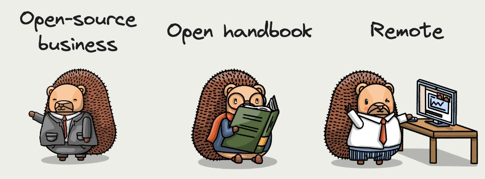
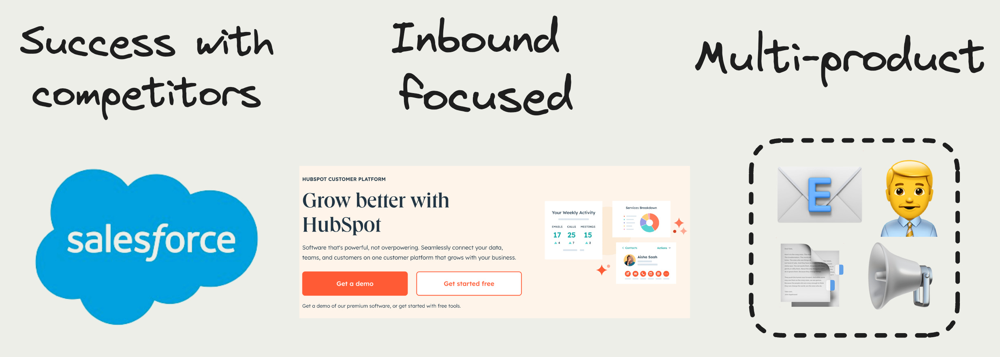
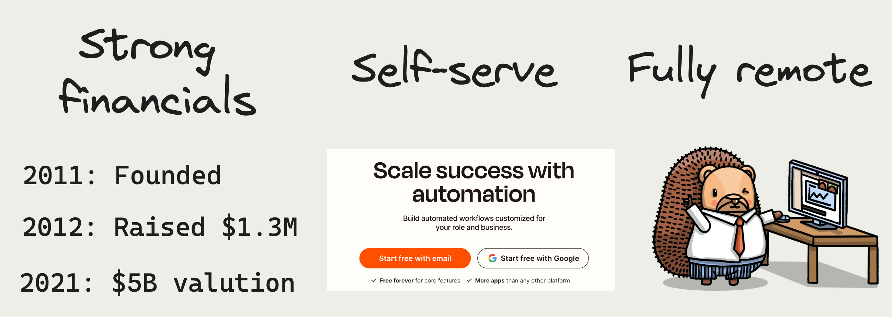
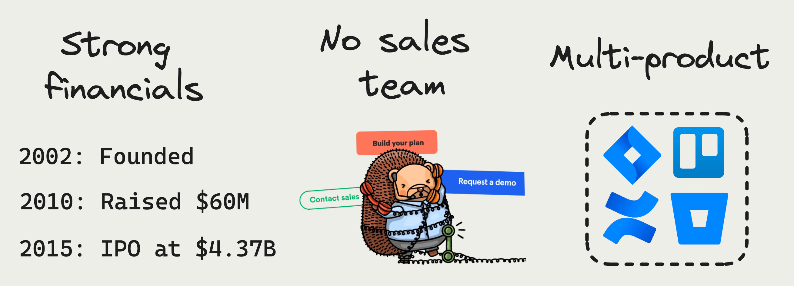
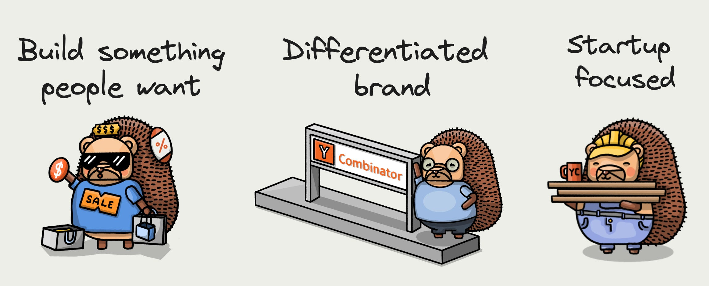

PostHog was not created in a vacuum. The companies we admire shaped PostHog as a product, company, and organization. Looking at their journeys, and what they did differently, guided us to where we are today and continues to guide where we’re heading.

To ensure we are heading in the right direction, our all-hands often include a reflection on these companies, the decisions they made, and why it matters to us. By sharing these with you, we hope it acts as inspiration to do things differently and reflect on the companies guiding you.

> This post was first published in our Substack newsletter, [Product for Engineers](https://newsletter.posthog.com/). It's all about helping engineers and founders build better products by learning product skills. We send it (roughly) every two weeks. [Subscribe here](https://newsletter.posthog.com/subscribe).

## 1. GitLab: The open-core trailblazer 📖

GitLab is the shining example of an open-core company. It is transparent and open-source. Beyond code, its handbook is open for anyone to read and contribute to. It includes all the details of how they run the company. This makes collaboration easier and is critical to GitLab’s success as a fully remote company.

It also solved a big challenge for open-core companies: making money and building a successful business. Making this possible is its innovation in project structure and [licensing](https://gitlab.com/gitlab-org/gitlab/-/blob/master/ee/LICENSE). Specifically, splitting out enterprise edition features and licensing them differently from its core, free app.

### Our takeaways

GitLab inspired our value of transparency, [open handbook](/handbook), and [compensation calculator](/handbook/people/compensation). These have similarly helped us to work and communicate better as a remote and [async](https://newsletter.posthog.com/p/how-we-work-asynchronously) company.

PostHog is also an open-core company, so we’ve looked to GitLab for how to structure and [license](https://github.com/PostHog/posthog/blob/master/ee/LICENSE) our product. Although we are open-source and self-hostable, we restrict some features to [our paid plan](/pricing) (with a free allocation), enabling PostHog to function as a business.

## 2. HubSpot: Compounded against competitors 📈

HubSpot is squarely in the middle of one of the most competitive markets in software. It has a ~$250B competitor in Salesforce and hundreds of other competitors, but still managed to build a ~$25B business.

Its ability to do this comes down to two things:

1. **It kept building products.** HubSpot started as an email tool but continued to add more products like content management, CRM, social media marketing, support, and SEO tools. This created a broader appeal and provided more tools small and medium-sized businesses needed.

2. **It focused on inbound.** Instead of relying on outbound sales like its competitors, HubSpot developed free tools and informative content to bring customers to it. Their team realized people don’t want marketers to interrupt them or salespeople to harass them. Creating genuinely helpful content is a more effective strategy.

### Our takeaways

There’s room in every market for another great product with a different business strategy. For us, that is being developer-focused, open-source, and multi-product. We provide more of the tools startups need, which makes us more appealing to them.

Like HubSpot, we’ve found that inbound works well for [our ideal customer](/handbook/who-we-are-building-for), which means we put a lot of effort into our website and content. Being helpful and making setup easy for engineers leads to ever-important word-of-mouth growth.

## 3. Zapier: Self-serve, self-sufficient, SEO 💵

Zapier was founded in 2011, went through YC, raised $1.3M, and then never raised money again. This didn’t hold it back though. As of 2021, it had revenue of $250M and a valuation of $5B.

It has done this all while being self-serve and fully remote. At its size, even the most idealistic of companies usually break and introduce a sales team and physical base.

A key to Zapier’s success is SEO. Its programmatic SEO, which drives organic traffic through its apps and integrations pages, is world-class. Similar to HubSpot, this enables it to be self-serve and less reliant on paid acquisition.

### Our takeaways

Zapier shows you can create a massive tech company while not raising a lot, not having a sales team, and not being in-person. PostHog looks similar. We’re default alive (meaning we don’t have fundraising pressure), self-serve, and fully remote.

We’ve also seen the value of SEO and continue to invest in it. It is a core channel for us, and we’re always looking for opportunities to scale it further, like with [templates](/templates) or [content hubs](/posts).

## 4. GitHub: Free to use then forced to buy 🧑‍💻

GitHub defined what it means to be developer-friendly. On top of its open-source support, it gives away its entire core product for free. GitHub is a high-quality product that doesn’t cost anything for hobbyists, small projects, or pre-product-market fit startups.

This makes its enterprise go-to-market basically “have 200 developers force their company to buy us.” This massive bottoms-up adoption enables monetization with enterprise-targeted features that free users don’t need.

### Our takeaways

We try to give as much away for free as possible. This means having a generous free tier for all our products as well as open-sourcing our [code](https://github.com/PostHog/posthog) and [strategy](/handbook). Developers and [early-stage startups](/startups) especially appreciate this. It pays back by creating word-of-mouth and bottom-up growth. We’re aligned with startups, their success leads to our success.

## 5. Atlassian: A multi-product marathon 🏃‍♀️

Similar to Zapier, Atlassian has an unorthodox fundraising history compared to most tech companies. It didn’t raise money until eight years after founding. At that point, it could raise on favorable terms, and then not raise again until IPO.

It also created a truly multi-product company with Confluence, Jira, Trello, Bitbucket, and more. With multiple products, it can make each of them cheaper than companies with a single focus. This drove rapid adoption, much to the chagrin of Jira haters.

Lower prices generally mean less revenue, but Atlassian makes this back through cross-selling. In many situations, it sold multiple products where companies formerly only wanted one.

Helping all of this was the lack of [a traditional sales team](https://www.wsj.com/articles/BL-DGB-34171) for most of its life. It relied heavily on its website and word-of-mouth to do sales for them and still does.

### Our takeaways

We focus on adoption over revenue growth. This means building multiple products and keeping them as [cheap as possible](/handbook/engineering/feature-pricing#we-should-match-the-cheapest-competitor). Once built, we focus on [getting in first](/founders/pricing-lessons#dont-let-pricing-get-in-the-way-of-adoption), and then cross-selling. We do both of these by relying on word-of-mouth, our website, and content rather than a sales team.

On top of this, we try to maintain a strong financial position and [never need to raise again](/handbook/finance).

## 6. Y Combinator: Build a product (and brand) people want 🏗️

Y Combinator helps create many successful startups. Core to doing this is a couple pieces of advice:

- **Build people something want.** This requires talking to users and having them shape the roadmap, even when your intuition says otherwise.

- **Launch now.** Shipping fast enables you to [test in production](/product-engineers/testing-in-production) and get the most real feedback possible.

Beyond its advice, YC showed how valuable startups are as a market. A lot of YC companies get off the ground by selling to YC companies. Building something high-growth startups want is a good indicator that later-stage or slower-growth companies will want it too.

Compared to other investors and accelerators, YC also has a differentiated brand. Its built something startups want, and because of this, it is the default and top choice for early teams everywhere.

### Our takeaways

PostHog went through Y Combinator and a lot of their advice has stuck with the company. Even though we’re beyond searching for [product-market fit](/founders/product-market-fit-game), we still talk to users, try to [build things they want](/handbook/making-users-happy), and launch fast.

We also work hard to build a unique brand with [our design](/blog/posthog-as-a-dev-tool) and website, which has led to a lot of word-of-mouth growth.

## 7. Honorable mentions 🏆

- **AWS:** A multi-product behemoth with a dense UX and usage-based pricing.

- **Sentry:** Focused on bottoms-up growth and built a brand developers love.

- **Algolia:** “Developers do marketing” turns out to be a good way to market to developers.

- **Retool:** Took a category traditionally not focused on developers (low-code) and built a product for them.

- **Linear:** Design is a moat. Creating an amazing homepage is worth the effort. It will get shared (and copied, but [not by us](https://x.com/ninepixelgrid/status/1730378034761421212?s=20)).

## Good reads for product engineers 📖
**[Learnings from Building and Scaling Ramp’s Growth Engine](https://engineering.ramp.com/growth-principles) – Hima Tammineed**

Ramp has been one of the fastest-growing companies of the last 5 years. To help make that happen, their growth team experimented a lot. This post lays out the principles of their growth team.

**[PostHog's recommended reading for startup teams](/founders/recommended-reading) – Joe Martin**

Looking for some holiday reads? Check out the best books our team recommends on topics like design, VC, management, and product development.

**[Don't Build a Mine Before You Struck Gold](https://flocrivello.com/dont-build-mine-before-struck-gold/) – Flo Crivello**

Startups are like looking for gold. They have two separate phases: looking for gold and building the mine. It’s a trap to do the second before the first.

**[What if PostHog looked like a dev tool?](/blog/posthog-as-a-dev-tool) - Cory Watilo**

We just released a redesign of PostHog aiming to make us look more like a dev tool and less like a SaaS app. Our lead designer, Cory, details the changes needed to make that happen from updated navigation to increased data density to dark mode.

*Words by Ian Vanagas, who wonders if Santa ever runs A/B tests.*