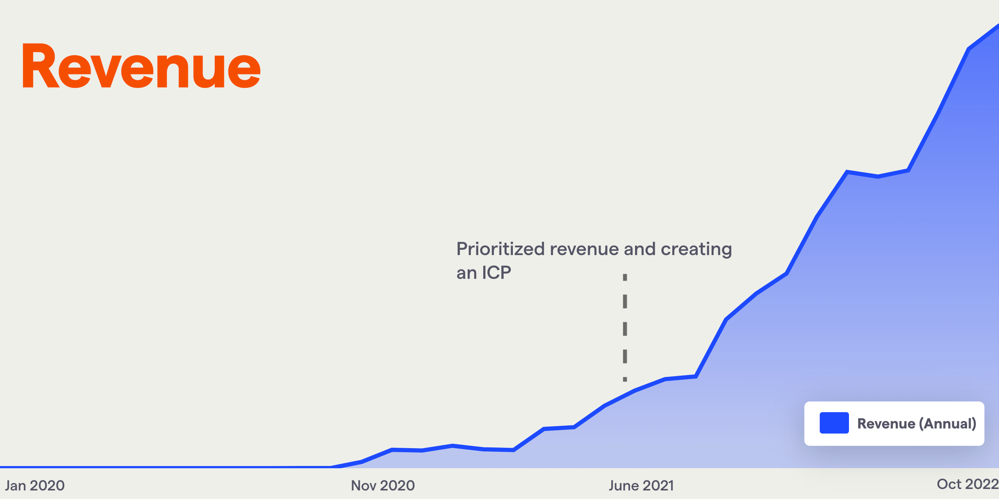
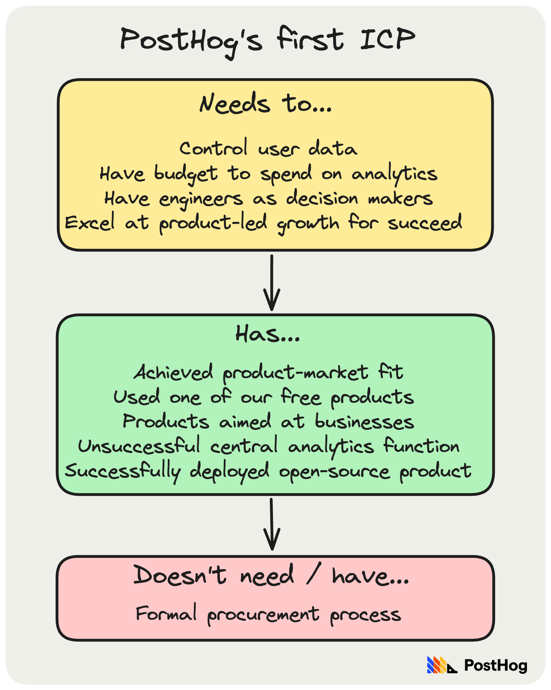
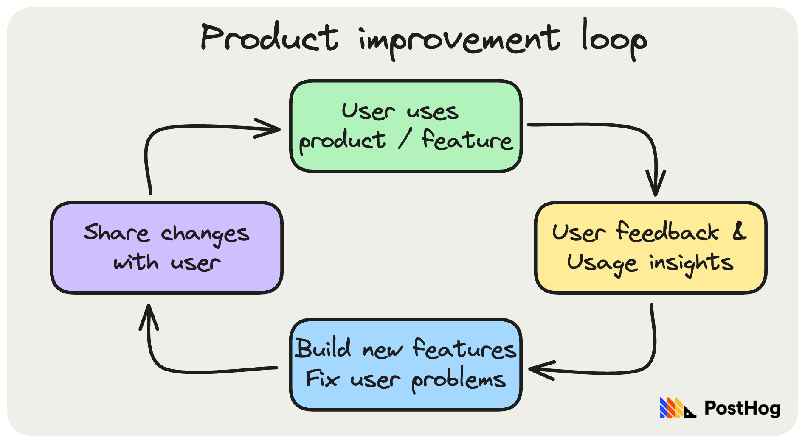

> Welcome to [Product for Engineers](https://newsletter.posthog.com/), a free newsletter created by PostHog for engineers, founders, and anyone who wants to build successful startups.

It’s “the only thing that matters” according to Marc Andreessen, who [coined the term](https://pmarchive.com/guide_to_startups_part4.html).

In our new in-depth guide, [The Product-Market Game](/founders/product-market-fit-game), PostHog’s James Hawkins shares everything he’s learned from achieving it as CEO of PostHog.

**This week’s theme is:** How to find product-market fit

## 1. Fundraising + press ≠ product-market fit

A big, buzzy funding round doesn’t mean a company has product-market fit. In fact, the trendier the space, the less likely a big round indicates a company has product-market fit. In contrast, a company growing out of its revenue is sure sign of product-market fit. Remember: [VC is a tool, not a religion](/founders/using-vc-carefully)

## 2. It’s easier to find when you have help

Finding product-market fit in a startup is tough, but the only sure way to fail is to give up. You’ll persist longer with two or more people, so find a co-founder(s). It’s useful if all co-founders are technical, but it’s critical one of you is happy doing sales most of the time.

## 3. You need a specific ideal customer profile

Defining our ideal customer profile (ICP) was a turning point for PostHog. You can see it in our revenue growth:

Your ICP should comprise very specific, individual needs, and haves – maybe even some anti-needs/haves. “Engineers with more than 100 staff” is not an ICP, nor is “enterprises who need [your product / solution]” or an industry.

Here’s what our first ICP looked like:

If you don’t have an ICP, you almost certainly don’t have product-market fit. Note: you need users who are retaining before defining your ICP.

📖 **Further reading:**
- [How we found our ideal customer profile](/founders/creating-ideal-customer-profile) – James Hawkins
- [Time savings is NOT your value prop](https://kylepoyar.substack.com/p/this-is-not-your-value-prop) – Kyle Poyar

## 4. Speed and momentum are vital

What does this mean?
- Don’t spend ages trying to validate ides that don’t work. Move on.
- Start with a software stack you’re familiar with. It’ll make progress faster.
- Respond to user feedback as quickly as possible. They’ll notice.
- Ship features quickly and iterate. You’ll learn faster.
- Don’t spend weeks/months debating whether to pivot. The writing is on the wall.

You’re optimizing for shots on goal. The more you have, the greater your chances.

## 5. So is motivation

If your idea doesn’t excite you, pivot.

## 6. There are numerous “signs” of PMF

To name just a few:

- Strongly positive customer feedback
- A flat retention curve over 12 months
- Customers are desperate to buy after a free trial
- Spontaneous word of mouth growth
- You can’t add servers fast enough
- People still use it if it’s a little broken
- Many paying customers in your ICP
- Everything feels easy

📖 **Further reading:**
- [How to know if you've got product-market fit](https://www.lennysnewsletter.com/p/how-to-know-if-youve-got-productmarket) – Lenny’s Newsletter
- [Do You Have Product Market Fit? It's All About Retention](https://www.youtube.com/watch?v=bpnYFG1-rdk) – 500 Startups

## 7. But $1 million ARR isn’t one of them

So argues [Kaitlyn Henry](https://www.linkedin.com/in/kaitlynhenry/), VP at VC firm [OpenView](https://openviewpartners.com/).

Why? Because there are [numerous ways a startup can reach $1m ARR](https://openviewpartners.com/blog/1m-arr-achieved-product-market-fit-think-again) without achieving product-market fit, such as:

- A reliance on one or two high-paying customers
- Spending lots to acquire customers
- Having customers who were “design partners” – i.e. it’s custom-built for them.
- Favorable macroeconomic conditions
- Lots of paying customers from your personal network

Reaching $1 million ARR is still a serious milestone, but only if it’s backed up other signals of product-market fit.

## 8. You need to “close the loop” with your users

Listening to users compounds. Use this simple loop to accelerate your progress to product-market fit:

The more you listen and act on their feedback, the more users will share useful feedback. Your product will get better fast, and you’ll generate great word of mouth growth.

## 9. Don’t work on multiple ideas at once

James on his and Tim’s experience in YC:

“During our YC batch, we saw a few companies have one founder work on X, while another worked on Y. Finding product-market fit is already complex, so don't make it harder by dividing your effort. Pick one idea and go all in. If you fail, quickly move to the other idea.”

## 10. You can measure product-market fit

Most explanations of product-market fit focus on how it feels – “you’ll know it when it happens” etc. But how do you measure product-market fit?

That was the question facing Superhuman CEO [Rahul Vohra](https://www.linkedin.com/in/rahulvohra/) in 2017. His answer was to use the [PMF Survey](https://pmfsurvey.com/) developed by Dropbox, LogMeIn, and Eventbrite alum, [Sean Ellis](https://www.linkedin.com/in/seanellis/).

The PMF survey asks four questions, including “How would you feel if you could no longer use [Your Product]?

1. Very disappointed
2. Somewhat disappointed
3. Not disappointed

After researching 100+ startups, Ellis found 40% or more users replying “very disappointed” is a strong indicator of product-market fit, while companies that struggled “almost always had less than 40% of users”.

Rahul used this to create a process to optimize Superhuman to product-market fit, which you can read about it in his write-up for [First Round Review](https://review.firstround.com/how-superhuman-built-an-engine-to-find-product-market-fit).

## 11. Fractional pivots are dangerous

James shares this story from the [early days of PostHog](/blog/story-about-pivots):

“One of our first ideas was a tool to monitor tech debt – it inserted a survey as a GitHub check asking the engineer where they encountered problems, and how much time was wasted. We had to pivot when it was impossible to sell it. We then moved into using the same surveys to monitor engineering happiness, re-using our code. The result? A week of wasted meetings.”

## 12. Talking to users isn’t optional (for anyone)

You can’t achieve product-market fit without talking to users. And that means everyone should be involved.

CTOs and engineers, for example, will need to fix problems for users, and it’s more effective if they talk to directly to users to do so.

A startup where only one founder talks to users will only get one perspective. That’s a recipe for failure. Learn to listen, not talk.

📖 **Further reading:**

- [The Mom Test](https://www.momtestbook.com/) – Rob Fitzpatrick
- [10x engineers talk to users](/product-engineers/10x-engineers-do-user-interviews) – Luke Harries
- [How to turn user interviews into actionable snapshots](/product-engineers/interview-snapshot-guide) – Annika Schmid

## 13. Product-market fit ≠ success

It’s just a milestone. What’s next?

Are you [default alive, or default dead](http://www.paulgraham.com/aord.html)? Per YC founder, Paul Graham:

When I talk to a startup that's been operating for more than 8 or 9 months, the first thing I want to know is almost always the same. Assuming their expenses remain constant and their revenue growth is what it has been over the last several months, do they make it to profitability on the money they have left? Or to put it more dramatically, by default do they live or die?

📖 Further reading:

- [Life After Product-Market Fit: Go-To-Market Fit](https://medium.com/@pearvc/life-after-product-market-fit-go-to-market-fit-fb87bedfd8da) – Pear VC
- [Where to Go After Product-Market Fit](https://a16z.com/2018/07/20/where-to-go-after-product-market-fit-an-interview-with-marc-andreessen/) – Marc Andreessen and Elad Gil
- [Why Product Market Fit Isn't Enough](https://brianbalfour.com/essays/product-market-fit-isnt-enough) – Brian Balfour