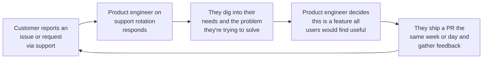

Any company can benefit from hiring product engineers, but startups are where they're most likely to thrive because [startups win on speed](/founders/how-come-we-ship-so-much), and product engineers are all about creating speed and urgency. 

Imagine, for a moment, what product development often looks like:

This is an inherently slow process. In this environment, an engineer is mainly consuming requirements, interpreting the intent of users and product managers at a distance, or being told what to build with little input into the direction.

This process isn't interested in an engineer with a strong opinion about what to build, it wants someone who can build to spec even when it's obvious to them it's the wrong path for their product.

It repeats endlessly until a product dies.

## The product engineer way

How does this work when a product engineer is in the loop? At PostHog, where product engineers own product teams and make product decisions, it often looks something like this:

In this scenario, product engineers gather feedback directly from customers. [User feedback and context](/newsletter/talk-to-users) isn't filtered through someone else. It's direct and without bias.

A product engineer, having both direct context from users, [product sense](/newsletter/good-taste-great-products), and the technical knowledge of what is actually possible, can quickly figure out what to build and how to build it, test it with users, ship it and iterate. Speed compounds. You learn faster. Grow faster. The more you do it, the better it gets. 

In arguments against this, people often argue that speed comes at the expense of polish. They say you can have one but not the other, but this is nonsense. Polish comes from shipping fast. The faster you ship, the faster you can polish and improve what you do. 

The first version of something you ship may be worse than a team who takes longer to ship, but the team that ships fast and (critically) remains focused, will improve their product faster.

## More reasons to hire product engineers

Speed isn't the only advantage of hiring product engineers, however. Others include:

### 1. Sparking joy in customers

Customers love it when an engineer listens to their problem and quickly ships a solution with minimum fuss. The naturally rapid feedback loop of product engineers who [talk to users](/newsletter/talk-to-users) and do support creates numerous opportunities to delight customers this way.

### 2. Spontaneous creativity

Product engineers who have autonomy to experiment often end up shipping brilliant products and features that an exec or product leader never imagine. Numerous PostHog products and key features, such as [session replay](/session-replay), [data warehouse](/data-warehouse), and [PostHog AI](/ai), came from individual engineers hacking together a proof of concept or MVP. 

### 3. You can do more at once

Companies where product decisions are planned and made centrally lack bandwidth – exec teams can only think about and manage a few things and remain effective. When you empower and trust product engineers to make decisions, you can tackle more problems and opportunities, and figure out what works faster.

### 4. Strategic flexibility

Likewise, it's easier to change direction when you've built your company around [small teams](/newsletter/small-teams) of talented and highly motivated people. Teams never become too big to change, product engineers have a broad set of skills that can be applied to different arenas and often, as noted above, important opportunities are generated from the bottom up.

### 5. Efficiency

A team of six or fewer product engineers at PostHog can out ship teams two or three times the size, so we achieve more with less, avoid hiring bloat, and stay efficient. This is beneficial for any company, but critical for startups who need to keep their burn rate down.

### 6. Attracting strong talent

Startups typically can't compete with Google, Meta, Open AI and co. on compensation or prestige alone, so creating a culture where product engineers can thrive is a great way to attract talent you otherwise couldn't. Talent, like speed, compounds.

### 7. Happiness

Product engineers are intrinsically motivated because [they love building](/blog/why-product-engineering-is-so-fun). Surround them with people just like them, and they will love their work. People who love their work will stick around and become invested in what you're trying to build. 

Ultimately, building a successful company and product is a team sport, and a long journey. You're much more likely to be successful if the people responsible for building that product feel invested and trusted to build that success. 