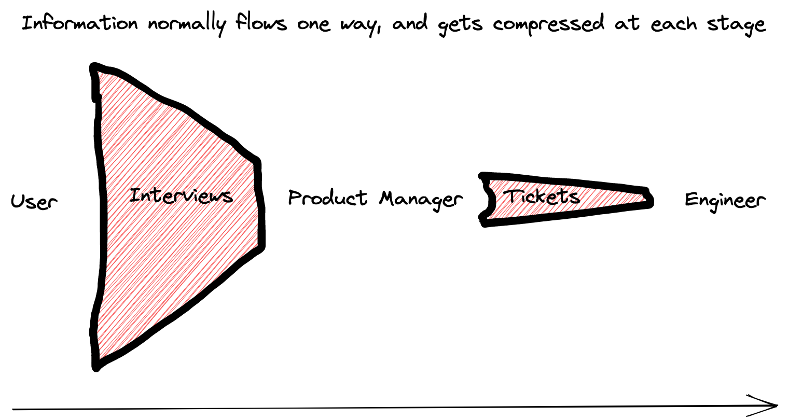
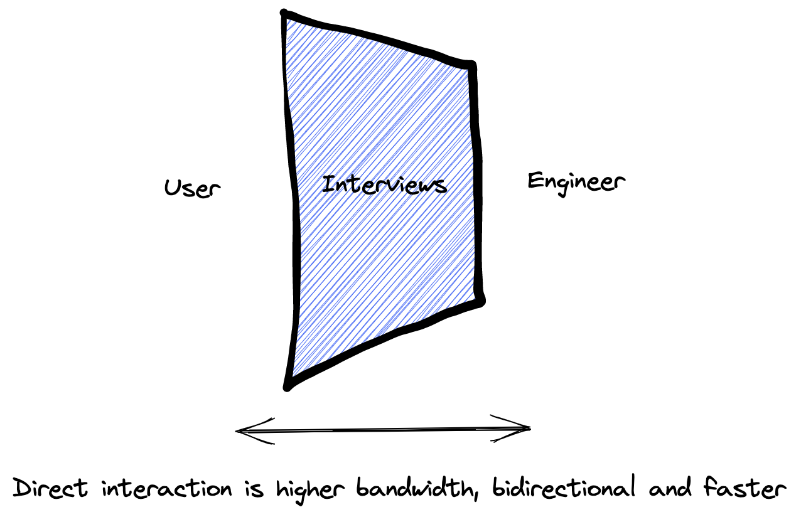
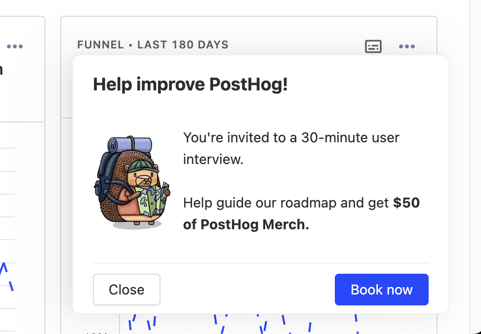
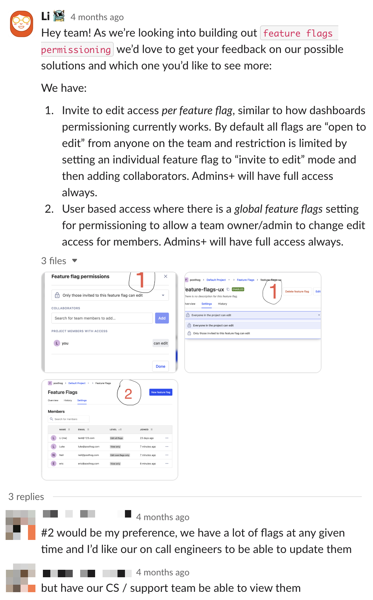
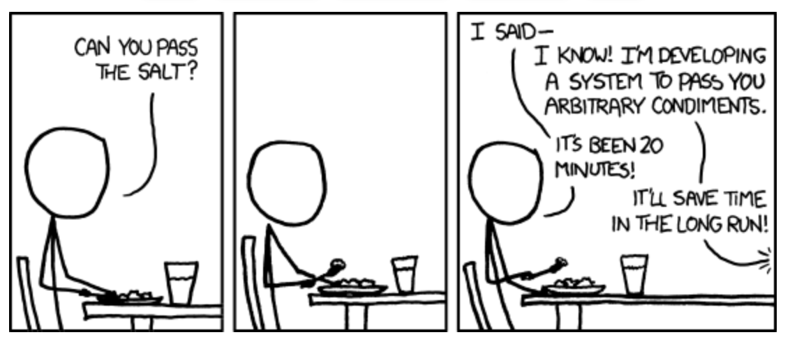

I believe the best way to become a 10x engineer is to zoom out and solve for user impact. Engineers and founders need to deeply understand and care about their users. In doing so, you generate true leverage by choosing the right problem, building the right solution, and solving their "hair-on-fire" problems.

The best way to do this? Speak directly to them.

## Solving the information bottleneck

In traditional tech companies, information flows from the user to the product manager (PM) by an interview, and then from the PM to the engineer through a bunch of tickets:



At each stage, important context is lost. Information flows one way, so you can’t go deeper on the important areas, and engineers lose agency in what they're building and why.

Here's what it looks like when engineers talk directly to users:



Information moves quickly and in both directions, boosting the signal. By increasing the signal you can quickly cut scope, realize you’re tackling the wrong problem, or come up with a more elegant solution – something engineers can do most effectively because they have the background on the existing architecture and components. 

Companies still need product managers, but it's easier to ship faster and better work when engineers behave like [product engineers](/blog/what-is-a-product-engineer) and talk to users. And in doing so, product managers are freed from writing tickets to spend more time exploring bigger opportunities.

> 💬 **Sidenote:** PostHog's session recording feature came about because one of our engineers took the time to talk to a user and realized the best solution was integrating recordings with our existing product analytics tool. One hackathon later, we had a prototype. Session recording is now a core part of our product and was a key driver in our strategy shift from a pure, self-hosted product analytics tool to an all-in-one product OS.

## How to talk to users (as an engineer)

Automation is crucial here. Too much friction and you’ll ride an initial burst of motivation followed by regression to the old way of heads-down coding.

Step one is to find users to talk to. You can define your segment using company traits, user traits, and behavioral information. A data warehouse or analytics platform like PostHog can be helpful here.

Next, it's time to bulk email your segment. The simplest way is to email out a Calendly link in batches via bcc’ed using a message like this:

```jsx
Hi! I’m {YOUR NAME}, a software engineer at {YOUR COMPANY}. I’m currently working on {FEATURE / PROBLEM} and would love your input on it. Free for a quick call at any of these times? {INSERT CALENDLY LINK} 
```

This is a good start, but you should move to an in-app prompt as soon as you can to save time and increase conversion – we built PostHog's [user interview app](https://posthog.com/tutorials/feedback-interviews-site-apps#setting-up-the-user-interview-app) (pictured below) just for this.  



We’ve seen an increase in conversion from outreach to booking by ~5x (from 3% to 16%) since we started using in-app prompts, a reduction in email spam, and better organization by doing so. A reward like a $30 merch voucher helps.

## The two basic types of user interview

Effective user interviews need a goal and you have two basic options:

### 1. Problem exploration

Find the biggest hair-on-fire problem and then deeply understand the parameters. Focus on the concrete times they’ve experienced the problem.

Example questions:
- How have they tried to solve it before?
- What do they think of the other solutions on the market?
- Would they pay for it?
- Can you talk me through the last time you experienced this problem?
- Is this actually a problem for you?

### 2. Solution validation

You’ve identified the hair-on-fire problem and understand it well. Now you’re validating whether your solution actually solves it. Focus on presenting the user with quick prototypes.

Example activities:

 - Have the user click through a Figma prototype and think out-loud. Ask them to complete the high-level goal and see where they get stuck. Ask what they think the text means.

- Send a few mockups of the solutions over Slack to the user from the problem exploration interview and ask if it solves the problem.

- Create a mock-up and have a call with the user to see if they will commit to paying some amount if you build it.

## Building async feedback loops

User interviews are powerful but slow. You can quickly narrow down the most important problem and gather all the parameters, but it normally takes a few days to get on the call.

After the initial discussion, get your user on Slack for B2B or iMessage for B2C – or whatever messaging tool works best for them. This will enable you to quickly follow up with mockups or further questions during the solution validation phase.

Here's an example from Li on our [Feature Success Team](/handbook/small-teams/feature-success) seeking feedback on our feature flag permissioning. She received a response 3 minutes (!!) later.



The more important the problem for the user, the quicker they'll respond.

## Beware solution ideas from users, reframe them as problems

During interviews, users will often suggest an idea for the solution of what they want. It’s crucial to not accept this at face value and instead ask “Why?” until you can reframe it as a problem with the appropriate context. 

Often the solution they propose doesn’t actually solve the problem they experienced, or there’s a much better solution that you can build instead. But most times it's not even a problem they are facing at all! Treat the solution idea as an ember and get curious about it.

*There's an entire [wikipedia page](https://en.wikipedia.org/wiki/XY_problem) dedicated to this.*

That said, be careful not to go too far the other way and generalize every problem. The art of product is using your judgment.



For example, quickly shipping small usability improvements based on feedback is a great way to delight users, generate goodwill, and encourage more relevant feedback. 

## My challenge to you: Book a user interview this week

We see the benefits of engineers speaking directly to users every day at PostHog – important problems being solved, and better products being shipped. But you probably won't believe me until you’ve done a few interviews yourself and realized what someone wrote on a ticket is completely different from reality.

So here’s the challenge: **book your first user interview this week**. *Add a reminder on your phone now*

It will take less than 15 minutes to set up. How? Create a Calendly link and connect it to your Google Meet and Google Calendar. Grab a list of 30-50 customer emails and send out the following message via bcc:

```jsx
Hi! I’m {YOUR NAME}, a software engineer at {YOUR COMPANY}. I’m currently working on {FEATURE / PROBLEM} and would love your input on it. Free for a quick call at any of these times? {INSERT CALENDLY LINK} 
```

Alternatively, if there’s already a sales call or customer interview organized, then ask to join, and add your own questions at the end.

Have any questions, feel free to email me at {firstName}@posthog.com or DM me on [Twitter](https://twitter.com/lukeharries_).

## Further reading:

I have a couple of book recommendations if you want to go even deeper into this topic:

- **"The Mom Test" by Rob Fitzpatrick:** Generally considered the bible of "talking to users". It's a fantastic primer on problem exploration.

- **[Don’t Make Me Think](https://www.amazon.co.uk/Dont-Make-Me-Think-Usability/dp/0321344758) by Steven Krug:** A foundational text on usability testing.
