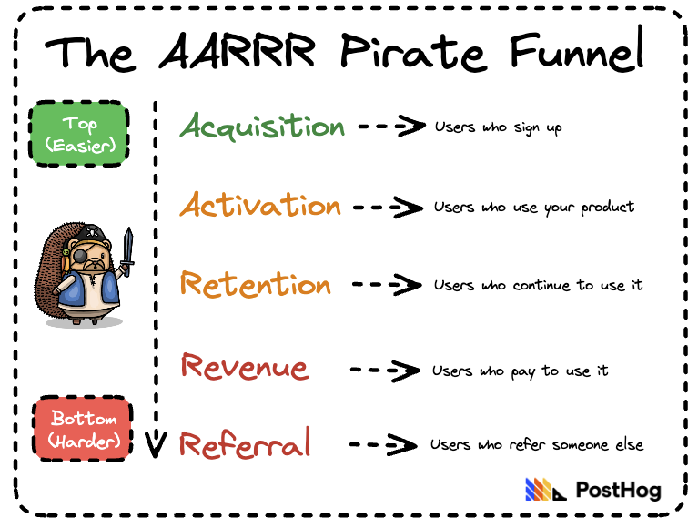
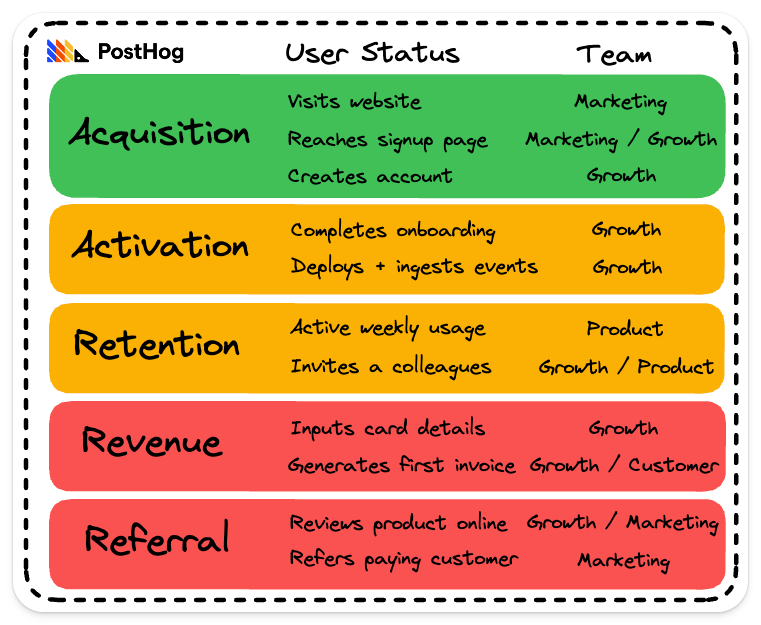

> **Want to build an AARRR funnel in PostHog?** Use our [AARRR dashboard template](/templates/aarrr-dashboard) to set one up quickly and easily.

## What is the AARRR framework?

The AARRR framework, also known as "pirate metrics" or the AARRR funnel, is a classic framework for understanding customer behavior. It was originally [devised](https://www.slideshare.net/dmc500hats/startup-metrics-for-pirates-nov-2010) by startup guru Dave McClure in 2007. 

It's useful for marketers, product managers, and growth hackers at startups, and applicable to any kind of online business, such as a B2B SaaS product, e-commerce website, or direct-to-consumer product.

In this guide, you'll learn:

- [How the AARRR funnel works](#how-does-the-aarrr-funnel-work)
- [Why you should use the AARRR framework](#why-use-the-aarrr-framework)
- [How to build an AARRR pirate funnel](#how-to-build-an-aarrr-pirate-funnel)
- [How to use pirate metrics in your company](#how-to-use-pirate-metrics-in-your-product)

> **Article changelog:**
> - **Aug 3, 2022:** Original article publish date 
> - **May 9, 2023:** Improved intro, new graphics, pirate metrics template

## How does the AARRR funnel work?

The five pirate metrics are:

- **Acquisition:** How many users signed up to your product?
- **Activation:** Do those new users actually use the product?
- **Retention:** Do your activated users continue to use the product?
- **Revenue:** How many users go on to pay you and how much?
- **Referral:** Do your users like the product enough to share it?

Tracking the five pirate metrics will give you a complete, end-to-end view of user behavior, and help you understand areas of weakness and opportunity.

McClure visualized the AARRR funnel in a table like the one below, though you could also create a funnel insight, or just build a dashboard of related metrics.  

This version is what the funnel might look like for our product, PostHog, an [all-in-one analytics platform](https://posthog.com/) comprising product analytics, session replay, feature flags, and A/B testing.

Applying conversion rates is optional – the real value comes from forming an understanding your potential customer journey, and the metrics you need to track to monitor it effectively.

> 📖 **Further reading:** How healthy is your product? Pirate metrics are useful for understanding the efficiency of your conversion funnel, but you may also want to track some product health metrics. They're like the vital signs of a product – i.e. metrics that should remain steady and improve slowly over time. See: [The most useful product health metrics](/blog/product-health-metrics) for more.

## Why use the AARRR framework?

So those are the fundamentals of the pirate metrics framework, but why should you use it? There are a few key benefits:

1. **It's about users, not organizations:** B2B products should avoid optimizing for specific companies. Build for a company's end users and its activation, retention and revenue will follow. 

2. **It creates a baseline single source of truth:** It's easy to get lost if you don't know what "normal" looks like. Your pirate metrics give you a baseline.

3. **It acts as an early warning system:** Once you have a clear picture of historical trends, it'll be obvious when something has changed for good or ill.

4. **It helps you identify weaknesses and opportunities:** Are you acquiring, activating and retaining users, but not seeing revenue growth? It's time to focus on monetization. Retaining well, but not seeing growth? You have an acquisition problem.

5. **Pirate metrics are comparative:** A CEO has different needs to a salesperson, so it's sensible to consider activation and retention differently. You can use your pirate metrics to compare different cohorts of users.

## How to build an AARRR pirate funnel

So you're sold on the AARRR framework, how do you get started?

It all starts with how you track user behavior in your product. While you can use Google Analytics to track some pirate metrics, it's best to use a product analytics tool like PostHog, [Amplitude](/blog/posthog-vs-amplitude) or [Mixpanel](/blog/posthog-vs-mixpanel).

> ☠️ **Try our AARRR dashboard template:** PostHog users can use our [customizable AARRR pirate metrics template](/templates/aarrr-dashboard) to get started. Simply input your events and tweak as you require.

### 1. Acquisition

- How many users signed up?
- How many people downloaded the app?
- How many users hit the landing page?
- How many people signed up to a newsletter?
- How many unique users visited the website?
- How many users viewed a product listing?
- Signup conversion rate

Acquisition is probably the easiest metric to define, but what you track will depend on what kind of product you're building.

For an e-commerce website, overall unique users is an important metric, but user signups is better for B2B products.

It may also be prudent to add a quality metric here, too. Tracking signups based on an ideal customer profile (ICP) can be important to avoid over optimizing for the wrong kind of new users.

> 💡 **PostHog Tip:** People call it the pirate funnel, but the framework doesn't dictate what you should optimize first. Most B2B SaaS products should prioritize retention – it's a great indicator of [product-market fit](/blog/product-market-fit-game).
 
### 2. Activation

- New users who complete a specific action in their first week
- New users who engage with your core feature
- New users who complete the onboarding process
- New users who enable a third-party integration
- New users who spend x minutes using the product/website

Some users create accounts but never use your product. Tracking activation helps you isolate onboarding issues from long term retention issues.

Don't be afraid to go deep here. Good activation metrics capture the "aha" moment a user has when they get value from your product.

> 💡 **PostHog Tip:** It's a good idea to double check your chosen activation metric leads to increased retention. To do so, [create a cohort of activated users](/docs/user-guides/cohorts) and check you retain them significantly better than non-activated but signed-up users. If your retention doesn't change, you need to rethink your activation metric.

### 3. Retention

- Activated users who came back within n-days/weeks/months
- How often activated users come back and perform an action

Retention is one of the most important metrics in any business. If you nail activation and retention, it's a good sign you have a product people value.

For most products, measuring retention means defining a usage interval – i.e. how often you expect your retention event to occur. Do you expect users to come back every day, week or month.

You can also track unbounded retention, where you track if/how often users return without a specific interval.

> 💡 **PostHog Tip:** There are two ways to track retention in PostHog. Create a [retention insight](/docs/user-guides/retention) for tracking the percentage of users who performed an event within a given time period; use a [stickiness insight](/docs/user-guides/stickiness) to track how many times an activated user returned and performed an action. And, whatever you're measuring, make sure you're tracking activated users and not 'all users'.

### 4. Revenue    

- Monthly recurring revenue (MRR)
- Annual recurring revenue (ARR)
- Average basket value (ABV)
- Average revenue per user (ARPU) or per account (ARPA)

What you track here will depend on your business.

Monthly recurring revenue (MRR) is good for a B2B SaaS products. B2C companies businesses may prefer average revenue per user (ARPU), while e-commerce platforms might prefer Average Basket Value (ABV). 

If you can imagine three or four random letters, it's probably an acronym for a revenue metric!

> 💡 **PostHog Tip:** You can send revenue data to PostHog by defining a property and setting a numerical value on that property. You can then visualize revenue data in Trends using event property averages, sums, percentiles and formulas. You can even integrate with payment systems via the [PostHog App Store](/apps).

### 5. Referral

- Users who invite their colleagues to use your product
- Users who invite their friends to download your app
- Users who submit a review of your product / app 

Is there a better validation for your product than someone inviting a colleague, or a friend, to use it?

It's a great sign that people enjoy using what you've built and a powerful driver for word-of-mouth growth – aka, the best kind of growth.

Referral metrics are especially important for products or services that have a [growth loop](/product-engineers/growth-loops) – i.e. when the product experience is improved through multiple users, or when friends are using it together.

Referrals can also be both internal (more users from the same organization) or external.

> 💡 **PostHog Tip:** At PostHog, we automatically invite active paying users to review PostHog using official the [Customer.io integration](/apps/customer-io). There are also marketing automation apps for Engage, Sendgrid, Intercom, and Zapier.

## How to use pirate metrics in your product

So, you've started tracking user behavior, chosen your pirate metrics and built your dashboard... what next? We recommend taking the following steps:

### 1. Validate your metrics

As noted earlier, it's a good idea to check your metrics before you start making business critical decisions! Validating your main activation metric leads to better retention is the big one, but review them all periodically. 

### 2. Prioritize your metrics

Don't start with Acquisition because it's at the top. Instead, ask yourself... what's your biggest problem right now? 

Most early-stage startups should focus their efforts on retention and activation. A product with loads of signups, but terrible activation / retention isn't a product, it's a churn machine.

Even products that rely on viral growth (e.g. social media apps) need some confidence in their user experience. First impressions last.

### 3. Assign metric owners

AARRR is sometimes considered a "marketing framework". This is nonsense. It spans disciplines, which is why it's a useful framework for product-led growth. And if you want to influence them all, people and teams need to own them.

At PostHog, we're [organized into small teams](/handbook/company/small-teams).

Here's how our earlier breakdown might look like if we assigned different PostHog teams to each user status:

As you can see, there is trickle down to all levels of the funnel, and we could go further. Activation is influenced by whether people coming into the funnel match our Ideal Customer Profile (ICP), so marketing also influences it even if they don't own activation directly. 

### 4. Research, test and iterate

This is where effective analytics become essential. Your pirate metrics identify problems and opportunities, but you need to drill down deeper to understand the causes. 

Use session replays to observe real users using your product, develop solutions, and A/B test them to test their effectiveness.

Once you've found good solutions, roll them out to your users and measure the results. It's best to roll out your solution to a subset of users first to make sure they have the expected impact – use [feature flags](/product/feature-flags) to do this.

Dave McClure's original framework suggests you spend 80% of your effort on refining and improving existing features, and 20% on new ones. It's a good rule of thumb.

> 💡 **PostHog Tip:** You can use PostHog at every stage of this journey. Use product analytics to track user behavior, session recording to observe and identify real user pain points, experimentation to run A/B tests and multivariate tests, and feature flags to stagger feature releases.
 
## Takeaways

1. There's a reason pirate metrics is still popular 15 years since its inception. It's simple on the surface, but unlocks deep insights into user behavior, products and their trajectory. It's a not a cure-all for success, but it provides clarity and alignment for all teams in a startup.

2. When implementing it, it's best to focus on one or two metrics to improve at a time. Trying to optimize all of them simultaneously is maddening unless you have enough dedicated resource to deploy. 

3. Less is more when it comes to metrics, too. It might be tempting to have three or four measures for retention, for example, but try to stick to one or two for each category.  

### Further reading

- **[In-depth guide to measuring product-market fit](/blog/measure-product-market-fit):** The 7 ways to measure product-market fit, explained. 

- **[The most useful B2B product metrics for SaaS companies](/blog/b2b-saas-product-metrics):** Need help choosing the right metrics for your product? This guide looks specifically at product metrics and which ones are worth measuring.

- **[How to work out what your users really need](/blog/how-to-work-out-what-users-need):** How to use 1:1 customer interviews, surveys, metrics and session recordings to work out what your users really need.

[^1]: _[Startup Metrics for Pirates deck](https://www.slideshare.net/dmc500hats/startup-metrics-for-pirates-nov-2010) – Dave McClure refined his original deck from its inception in 2007. This version is from 2010._ 

> **Want to build an AARRR funnel in PostHog?** Use our [AARRR dashboard template](/templates/aarrr-dashboard) to set one up quickly and easily.
