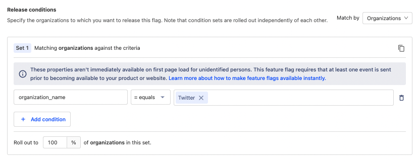

Feature flags, aka feature toggles, are awesome. New feature for your beta test group? Use a feature flag. Testing multiple variants of a new UX? Use a feature flag. Kill switch to prevent performance problems? Yup, feature flag. We could go on, but safe to say they are [many benefits to feature flags](/blog/feature-flag-benefits-use-cases).

This post explores feature flag best practices for areas like implementation, usage, naming, and removal. Some are specific to [feature flags in PostHog](/product/feature-flags), but the principles apply no matter what [feature flag tool](/blog/best-open-source-feature-flag-tools) you use.

## 1. Minimize or group changes behind them

It's best to use a single feature flag to control a single component, function, method, class, or other pieces of code.

Having a flag in multiple places can be confusing. Developers expect single-use feature flags, and when they aren’t, this can cause unintended consequences. For example, a developer could remove the flag in one place without removing it in another.

Multiple uses of the same feature flags increase maintenance and overhead. Every time a developer sees a feature flag, they must figure out its status and impact on the code. If active, they must work around it and maintain multiple fallbacks.

Having too many changes behind a feature flag also makes it difficult to maintain. If you are doing experiments, it makes the relevant parts difficult to identify. Parts behind your feature flag are more likely to break when there are many changes. Keeping your flags focused is best.

## 2. Fallback to working code

If a feature flag returns `false` or fails and returns `none`, you want to make sure you fallback to working code. This is a best practice for a few reasons:

- If there is a PostHog-related problem with the flag, we return `None`. Having a fallback handles this.

- If you use experiments, the fallback is the control the test is comparing against. If your fallback doesn’t work properly, it causes the experiment to be inaccurate.

- If you rollback your code using a feature flag, knowing you are rolling back to working code helps you do it quickly.

To fallback consistently, keep new changes separate from existing code and behind a feature flag. Test that flags returning `false` fallback to old code and that the fallback code works. This ensures your apps continue to work, even if the code behind the flag isn’t used.

## 3. Accurately identify users

Because feature flags evaluate based on the distinct ID of the user, having accurate identification is critical. Not knowing your user limits the flags you can show to them. If you identify users accurately, you can better target your feature flags to them.

Having at least a “sticky” ID (like a cookie, which is the default in PostHog) ensures the user gets a consistent flag evaluation in your product. Without identification, PostHog wouldn’t know what feature flags to show them. We default to not showing flags, but if the distinct ID changes often, we could show multiple variants to the same user.

Accurate identification includes setting up group analytics and person properties if you use them to rollout feature flags. Users must be a part of groups or have a property before PostHog can decide to show them a feature flag relying on that group or property. 

## 4. Use local evaluation for faster flags

An underrated feature of PostHog’s feature flag tool is the ability to evaluate flags locally. By using the already received feature flag data, your application doesn’t need another request to check if the flag is active. 

Fewer requests mean feature flags evaluate faster and show to more users. Local evaluation is also useful for speeding up code with multiple flags, such as loops. Instead of waiting for multiple requests, your code can run right away (if the flag is active). 

If you are using the JavaScript library or the snippet, local evaluation is the default. Once your application receives flag data, they save as cookies for local evaluation. Calling `posthog.reloadFeatureFlags()` refreshes them.

If you are using another library, PostHog defaults to making a request when evaluating flags, but you can set it up to use local evaluation. This requires having access to all the person or group properties the flag depends on. Here’s what the local evaluation of a flag looks like for our server libraries:

<MultiLanguage>

```js
await client.getFeatureFlag(
    'beta-feature',
    'distinct id', 
    {
        personProperties: {'is_authorized': True}
    }
)
# returns string or None
```

```python
posthog.get_feature_flag(
    'beta-feature',
    'distinct id',
    person_properties={'is_authorized': True}
)
# returns string or None
```

```php
PostHog::getFeatureFlag(
    'beta-feature',
    'some distinct id',
    [],
    ["is_authorized" => true]
)
// the third argument is for groups
```

```ruby
posthog.get_feature_flag(
    'beta-feature',
    'distinct id', 
    person_properties: {'is_authorized': True}
)
# returns string or Nil
```

```go
enabledVariant, err := client.GetFeatureFlag(
        FeatureFlagPayload{
            Key:        "multivariate-flag",
            DistinctId: "distinct-id",
      PersonProperties: posthog.NewProperties().
        Set("is_authorized", true),
        },
)
```

</MultiLanguage>

> **💡 PostHog Tip:** To enable local evaluation of feature flags, you may also need to set a `personal_api_key` in your server-side initialization. Check the [integrations docs](/docs/integrate) for details.

## 5. Bootstrap your flags to set them before the library loads

Bootstrapping your flags makes them available as soon as possible, before the library loads. This is useful if you want your flags to be available when the page first loads, such as on a landing page. 

Without bootstrapping, you must wait for the library to load and then make a request. By the time your application gets the flag data, it is too late. Your page loads without the feature flag data and any code behind the flags (after this they save as cookies for easy access).

To bootstrap your flags, add the relevant distinct ID and feature flag data when initializing. In Javascript, this looks like this:

```js
posthog.init('<ph_project_api_key>', {
    api_host: '<ph_instance_address>',
    bootstrap: {
        distinctID: 'your-anonymous-id',
        featureFlags: {
            'flag-1': true,
            'variant-flag': 'control',
            'other-flag': false
        }
    }
})
```

You can get values for the bootstrap object by using a server-side library. Call `getAllFlags` with a server-side library, then add those values as the `featureFlags` object in your client-side initialization. This enables your flags to be available instantly on page load. See more about bootstrapping flags in [our JavaScript docs](/docs/integrate/client/js#bootstrapping-flags).

> Bootstrapping your flags also ensures events have accurate feature flag data. If you capture events before receiving feature flags data, data can be missing. Bootstrapping prevents this.

## 6. Name your feature flags well

Here is some practical advice on naming your feature flags to avoid confusion. None of these are laws and you can create your own conventions, but for us, names should:

- Relate to the feature you are flagging. Make them predictable to the next person who reads them. Their key and name should provide insight into what they do.

- Be searchable in your code. If they are too similar to other code, you can’t find them easily or people will mistake their functionality.

- Get saved as constants in a single file. PostHog saves our feature flags as [constants](https://github.com/PostHog/posthog/blob/master/frontend/src/lib/constants.tsx) that get accessed to maintain consistency and legibility.

- Use positive wording. PostHog does the same. Our library checks feature flags by calling `isFeatureEnabled`. Using “negative” wording, such as `disable-feature`, can be confusing.

- Use name “types” if you have a large number of flags. This helps organize them and makes their purpose clear. Types might include experiments, releases, and permissions. For example, instead of `new-billing`, they would be `new-billing-experiment` or `new-billing-release`.

## 7. Roll out for specific groups

Feature flags are usually checked at the person level, but there are other ways. One useful and under-utilized way is rolling out based on groups.

For example, a customer complains about an issue with your product. You create a fix for them but aren’t sure it works for everyone. You can roll it out behind a feature flag and set the distribution to members of that company.



Enabling flags for specific groups allows the experience to be consistent for those groups. Members of an organization aren’t seeing different UIs or getting different experiences. They also act as a “permission” to access those changes.

This enables you to coordinate and communicate with those groups while rolling out features. This is especially useful for massive features, organizations, and integrations. It allows you to beta test functionality, do [canary releases](/tutorials/canary-release), and deal with issues before a larger rollout.

> **💡 PostHog Tip:** Be sure to identify users as part of that group using [group analytics](/manual/group-analytics).

## 8. Remove flags at the right time

Leaving flags in your code for too long can confuse future developers, especially if it is already rolled out and integrated. It can confuse those reading the code and the flag’s detail in PostHog.

Stale flags are also liabilities in code that cause problems if left too long. For example, there could be problems with your feature flags causing them to not trigger or return the wrong value. With a large number of old, stale feature flags, this becomes a major problem. 

Everyone has different opinions on when to remove their feature flags, but here are some ideas:

- If there were multiple release cycles without an issue. Schedule cleanup along with other post-release or sprint work.

- If they are old and deal with core functionality.

- If the feature causes problems and the flag is permanently turned off. Create a new flag for the fix.

- If there are active feature flags under or over that feature flag.

- Provide a date or guidance on when to remove a feature flag in the description or comment.

- Restrict full rollout to removing the flag, such as limiting rolls out to 95% of users until removed.

Whatever you choose, it should be clear to your team when to remove a feature flag. This limits the overhead and staleness of flags.

## Further reading

- [How to run Experiments without feature flags](/docs/experiments/running-experiments-without-feature-flags)
- [Setting up and using feature flags](/manual/feature-flags)
- [How to do a canary release with feature flags ](/tutorials/canary-release)
