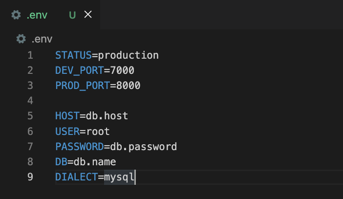

Sometimes you want to change the behavior of your app without changing the code. Both feature flags and configurations are options for doing this. This guide explains each method, and how to choose the right one for your use case.

## What is a configuration?

A configuration, or config, is a key that returns a specific value when called with function, service, or library dedicated to handling configs. You set both the key and value, and then add the key and service to your code. You can then modify the key’s value. Configurations are often separated into a dedicated file or even handled by an external service. 

An example of a configuration is a secret key for an external service like Stripe or AWS set in an environment variable. It is set in a `.env` file or by using the `export` keyword in bash and accessed with a module like `dotenv` or `os`.

At a technical level, configurations are often set at compile or load time and don’t change. This means the app needs to be re-complied or restarted to make a change to the configuration. Because of this, developers expect they won’t change often; for example, they aren’t used to provide multiple different values during the same session.

When an app deploys, configurations (and environment variables) are often handled by the service hosting the app. For example, Vercel, Netlify, and Render let you easily set and access environment variables, while Firebase, Azure, and AWS all have configuration management services for large, elaborate enterprise products.

Developers assume configurations will be permanent. Values might change, but they plan for that key and its associated value to always be important. This means versioning is critical for some configurations. Versioning helps debug potential issues related to code controlled by configs.

> **Note:** Configurations can be environment variables, but they aren’t exclusively. They can be key-value pairs stored anywhere in your stack.

### What is remote configuration?

A remote configuration, or remote config, is a configuration that can be set and changed remotely. This means a developer can change the value for users without needing to change any code. [Firebase](https://firebase.google.com/docs/remote-config) popularized this, but it also exists for [Unity](https://unity.com/products/remote-config) and many other services.

Remote config is especially relied on for mobile apps. This is because mobile apps must go through an especially long review process, which can take at least 24-48 hours. If an issue pops up, this review process delays shipping a fix. If an app uses remote configs, it can mitigate (turn off) the problem feature immediately.

## What is a feature flag?

[Feature flags](/docs/feature-flags) function nearly the same as configurations. They are a key that returns a value when called with a service, but they often include detail on the user as well.

> **Note:** For simplicity, we assume you are using an [external feature flag service](/blog/feature-flags-as-a-service). Of course, you could (and many do) build your own feature flag tool. This might include some of the functionality below.

The big difference compared to configurations is feature flags’ expanded functionality:

- Contains more data, like multiple variants and JSON.
- Connects to usage and user data.
- Provides simplified creation UI and permissioning.

To access these, [feature flag services](/blog/best-open-source-feature-flag-tools) often connect to external services like CDPs, product analytics, and data warehouses. They get data from these sources to customize which users get specific values when calling the flag.

Feature flags are almost always remotely configurable, and because they use an external service, developers can modify them at run time. No need to reset or recompile, just call the external service again. These services also provide a simplified UI, creating a centralized location for modifying feature flags and enabling quick rollouts and rollbacks.

An example use case of a feature flag is rolling a new feature into beta. A conditional statement wraps the beta feature to check the value of the flag. The feature flag service evaluates if the user is part of the beta, and either grants or denies the user access.

As showcased by this use case, feature flags are often meant to be temporary. Once you test and fully release a feature, you can remove the flag from the code. The failure to remove it can create technical debt.

## Testing feature flags and configurations

A problem both face is testing, as both require different testing strategies than standard unit tests.

- Feature flags need to be mocked to test all potential paths. Variants can be forgotten about and not tested, leading to issues. For a tutorial on how to test feature flags, see "[Testing frontend feature flags with React, Jest, and PostHog](/tutorials/test-frontend-feature-flags)."

- Configs are often forgotten in testing altogether. To test well, they require integration tests, shadowing, and/or [canary releases](/tutorials/canary-release), which require a lot of work. Bad configs have caused major outages at companies like [Cloudflare](https://web.archive.org/web/20211006135542/https://blog.cloudflare.com/todays-outage-post-mortem-82515/), [Facebook](https://engineering.fb.com/2021/10/05/networking-traffic/outage-details/s), and [Google](https://blog.google/inside-google/company-announcements/todays-outage-for-several-google/).

## Which should you choose?

Like many tech choices, you should think about what is the simplest solution for your objective. This table summarizes the differences between the two:

<table className="w-full mt-4" style="min-width: 600px;">
  <thead>
    <tr>
      <td className="w-3/12"><strong>Need</strong></td>
      <td className="w-3/12 text-center"><strong>Feature flags</strong></td>
      <td className="w-3/12 text-center"><strong>Configuration</strong></td>
    </tr>
  </thead>
  <tbody>
    <tr>
      <td>Longevity</td>
      <td className="text-center">Temporary</td>
      <td className="text-center">Permanent</td>
    </tr>
    <tr>
      <td>Changes</td>
      <td className="text-center">Frequent</td>
      <td className="text-center">Infrequent</td>
    </tr>
    <tr>
      <td>Integrations</td>
      <td className="text-center">✔</td>
      <td className="text-center">✖</td>
    </tr>
    <tr>
      <td>Versioning</td>
      <td className="text-center text-red">Bad</td>
      <td className="text-center text-green">Good</td>
    </tr>
    <tr>
      <td>UI/UX</td>
      <td className="text-center text-green">Good</td>
      <td className="text-center text-red">Bad</td>
    </tr>
    <tr>
      <td>Remote</td>
      <td className="text-center">Almost always</td>
      <td className="text-center">Sometimes</td>
    </tr>
    <tr>
      <td>Use cases</td>
      <td className="text-center">A/B tests, releases</td>
      <td className="text-center">Secrets, settings</td>
    </tr>
  </tbody>
</table>

Another key part of the decision is figuring out what works well with the stack you have now:

- If you are relying on many Google-related products, [Firebase Remote Config](https://firebase.google.com/docs/remote-config) might be best.

- If you implemented the modern data stack with a data warehouse, you might use a feature flag tool like [LaunchDarkly](/blog/best-launchdarkly-alternatives).

- If you’re just starting up and want an all-in-one platform with analytics, A/B tests, and session replays, [PostHog](https://app.posthog.com/signup) is your choice.

You can find more comparisons on [our feature flag comparisons page](/feature-flags/comparisons).

## Further reading

- [Why use feature flags? Benefits, types and use cases, explained](/blog/feature-flag-benefits-use-cases)
- [Feature flag best practices and tips (with examples)](/blog/feature-flag-best-practices)
- [How to do a canary release with feature flags in PostHog](/tutorials/canary-release)
