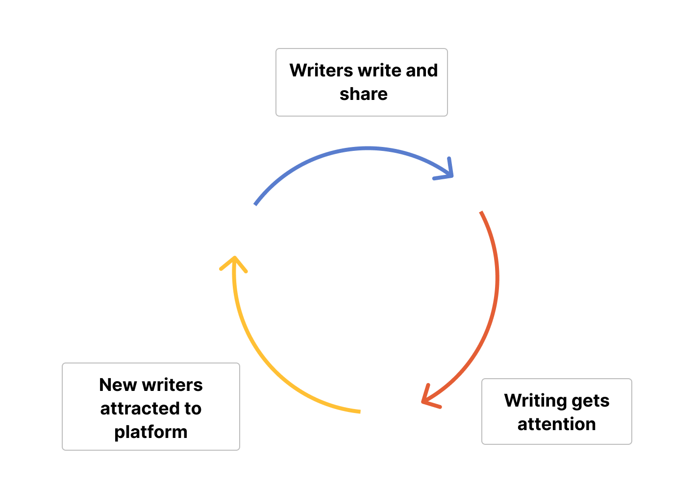
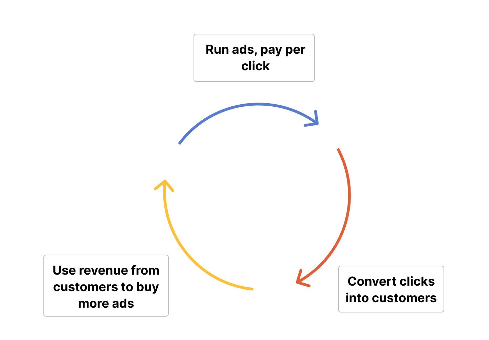
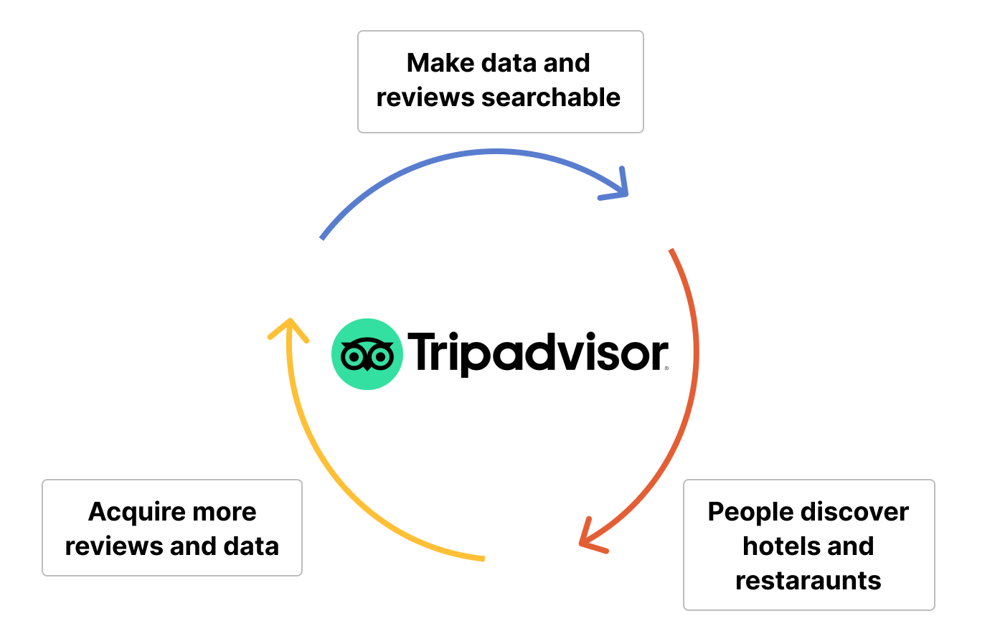
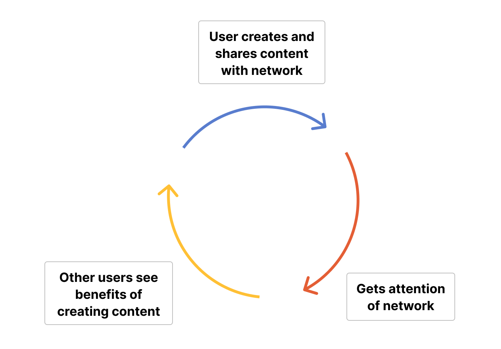
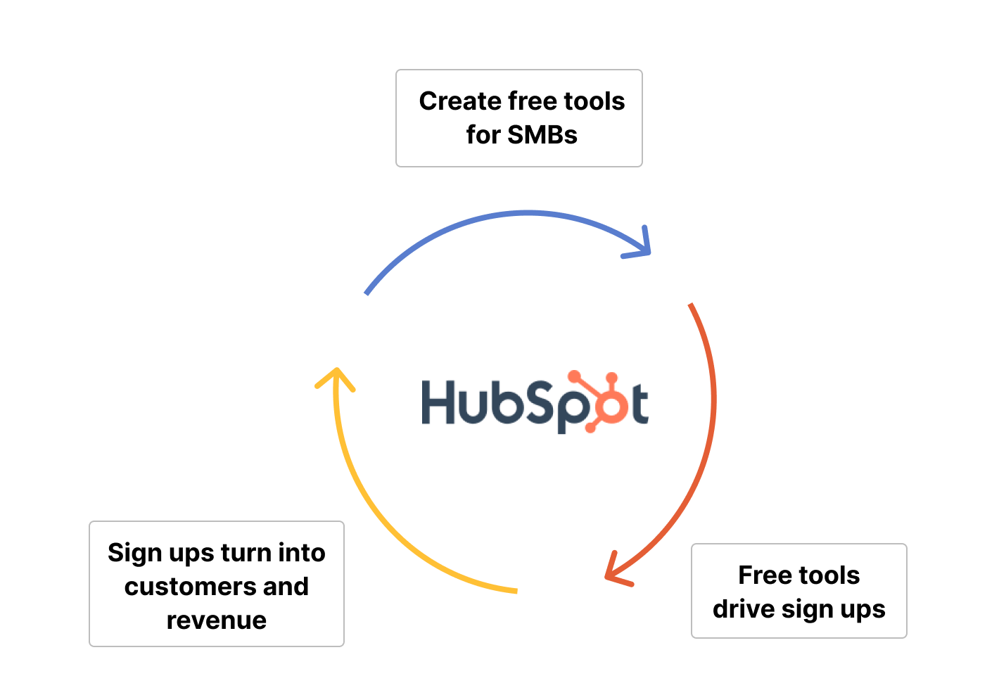

Growth loops are like biking downhill. Once started, the same effort takes you progressively faster and further. In business terms, your key metrics grow exponentially, while the average investment to create that growth stays the same or decreases. The beauty of growth loops is that they compound and can go on forever (unlike biking downhill).

In this guide, we cover everything you need to know to harness growth loops for your product. This includes types of growth loops, how to choose the right one, and how to measure them. 

## Why should you care about growth loops?

Nearly every successful company utilizes growth loops, consciously or not. For example, the newsletter platform Substack enables writers to easily share and monetize their work with their audience. As they do (for their own benefit), it gets the attention of other writers, who discover Substack, join, and continue the loop.

Growth loops combine multiple business efforts to create an impact much larger than the sum of its parts. For a loop to succeed, the work of customer-facing teams often must align with the work of engineering and product teams.

In our Substack example, the marketing and business development teams must attract popular writers (who often require upfront payments) while the product and engineering teams must deliver a great writing and subscription experience. This provides compounding benefits for Substack like bigger writers, better experiences, more readers, and ultimately, more revenue.

## Loops vs funnels

Growth loops are a similar framework to funnels like [AARRR pirate metrics](/product-engineers/aarrr-pirate-funnel). Both are a series of events leading to a desired outcome. 

The difference is that funnels are linear, while growth loops are cyclical. Funnels are a series of events that lead to an end like a conversion. Growth loops are a series of events that continuously lead to more events.

Companies often use both. Growth loops are useful for high-level strategy, while funnels work well for lower-level optimizations. For example, a company might use a funnel to optimize their onboarding flow, but a growth loop for their overall product development strategy.  

## Types of growth loops

There are many types of growth loops, but five of the most important are:

### 1. Virality

Virality is growth through attention, word-of-mouth, and referrals. Users find a product useful or entertaining and share it with others. New users then do the same and the cycle repeats. Ideally, the product becomes more valuable as new users join (AKA network effects) which drives exponential growth.

This is generally good for two types of products:

- Multiplayer or networked products that improve (or only work) when multiple friends or colleagues also use it (e.g. Discord, Figma, Zoom). Users invite others to join so they can use the product together. 

- Products that are fun to share with others (e.g. TikTok, Instagram, BeReal). Users share the app or content from the app on social media and other communications platforms to drive new users to join and create more shareable content.

### 2. Performance marketing (paid ads)

The performance marketing growth loop is using [paid marketing](/founders/dev-marketing-paid-ads) to acquire customers, then using the new revenue to fund more marketing. It is reliant on connecting marketing to acquire users (performance) with value (revenue) captured. If you see a social media or search ad for a product, that is a product relying on performance marketing.

For example, with Google Ad Words, companies pay per click on specific keywords related to potential customers’ searches. With the correct math figured out (cost of acquisition), this can lead to a growth loop of increasing ad spend and revenue growth.

Products that use performance marketing growth loops generally have high margins (more money for ads), but low organic demand. Good examples include ecommerce and direct-to-consumer goods (e.g. Casper, Warby Parker, Dollar Shave Club) and SaaS software targeting small-medium businesses (e.g. Shopify, Hubspot, Slack).

### 3. Content

Content is the growth loop of creating discoverable content which attracts new users to join and create content. Content growth loops rely heavily on distribution channels like search engines and social media.

Two types of products benefit from this:

- Users discover your product through content other users create and share (e.g. StackOverflow, Reddit, Substack). This is also known as user-generated content.

- Your product generates a large amount of data, which you use to create content (e.g. Tripadvisor, Zillow, Expedia). These companies rely heavily on programmatic SEO, which is the process of turning data into content that shows up in search engines.

### 4. Sales

The sales process creates a growth loop where acquired customers grow the company's revenue, which enables the company to improve the product and hire more salespeople.

Products relying on sales generally pitch for large contracts that need high levels of support, engagement, and customization. Offers are often tailored to the specific customer and require a large amount of time and effort. 

For example, sales is a growth loop for enterprise SaaS companies (e.g. Salesforce, SAP, Oracle) and big consultancies (e.g. McKinsey, Deloitte)

### 5. Feedback

In a product-led company, [user feedback](/tutorials/feedback-interviews-site-apps) can be a growth loop. You ask for feedback and use it to improve your product. Your improved product attracts more users, and all this leads to more feedback.

For example, many early-stage startups talk to users to understand their problems, and then build a product that solves them. They repeat this loop to grow towards [product-market fit](/founders/product-market-fit-game).

## Choosing the right growth loop

These give you an idea of what growth loop could work for your product. There are two key questions to help you clarify this further:

1. Who are your ideal users?
2. What benefits do those users get as part of your growth loop?

### 1. Who are your ideal users?

Understanding your ideal user helps you decide where to put your effort. If your ideal user won’t pay for your product, it isn’t a good idea to use sales as your growth loop, feedback works better. This creates a growth loop that better aligns with what they want. Growth loops are about creating win-wins.

For example, say you are LinkedIn. Your ideal user is a newly graduated business professional. They have less income, so they are less likely to pay for a subscription. Sales and performance marketing are less likely to work.

What you can do is create a connection between their network and content creation. They value their network a lot, and creating content is free. When a user creates and shares content, their network pays attention. With this attention, the user engages with their network, and LinkedIn sells ads. When other users see the benefits of this, they share content, and this cycle repeats.

### 2. What do they get out of it?

A user needs a win-win to repeatedly take an action that fuels a product’s growth loop. They need an incentive, whether it is status, attention, or money. Smart companies build this incentive into the core of their product.

For example, HubSpot builds a large number of free tools small businesses benefit from, like "Website Grader" or "Email Signature Generator" as well as the free tier of their product. These freebies get a lot of attention which drives signups, and some turn into customers. They invest more in their overall product (including their free tools) and create a B2B viral growth loop.

There are many creative ways to incentivize users to join your growth loop. Optimizing existing win-wins with users, as well as finding new ones, fuels the growth loops that help products succeed.

## Measuring your growth loop

To understand your growth loop and the value it is providing, it is important to measure your chosen growth loop. Measurement usually involves figuring out whether your input leads to increasing amounts of the output you want. What exact metrics to measure depends on the product and the growth loop. Here are examples:

### Virality

To measure virality, you want to know what drives users to share your product and the referral source of signups. To do this, measure traffic and shareability. You want events for the loop of signing up, getting started, referring others, and repeating. More occurrences of each and better connections between them are good signs for our viral growth loop.

### Performance marketing

Performance marketing is about measuring money spent is leading to signups and revenue. The margin between the cost of acquisition (CAC) and how much value we receive from them (LTV) drives the performance marketing growth loop (and the rest of the company).

To get data about CAC and LTV, you must understand the sources of our traffic, conversion, and finally, retention. This combined with our marketing spend and revenue enables us to calculate CAC and LTV.

> **Calculating CAC and LTV**: CAC is sales and marketing spend divided by acquired customers. For example, $100 spent on Facebook ads leads to 10 new customers, which means CAC is $10. LTV is the amount the customer pays multiplied by the time they spent paying. For example, the average customer has a $20 per month subscription and stays subscribed for 5 months. The average customer LTV is $100.

### Content

The key to content growth loops is knowing users interests and what drives traffic. You must understand what motivates someone to create and share a piece of content. If you have a data-driven content creation strategy, you want to understand how data can lead to conversion and what are the best ways to generate more data.

Both versions rely on traffic, conversion, and usage events. Content growth loops are similar to viral ones in this way.

### Sales

Sales has many of its own special metrics unrelated to product and marketing. This doesn’t mean measurement isn’t helpful. Trial usage, lead conversion, usage after conversion, and [account-level analytics](/docs/product-analytics/group-analytics) can help sales teams do a better job.

If the sale involves implementation or customization, usage metrics are useful for optimizing this. Anything that creates a better offering (like building a better product) help the sales process.

### Feedback

Measuring if a feedback loop is working is simple: Are users providing feedback? Beyond this, you should measure it with your core product metrics. For startups, these are likely related to [measuring product-market fit](/founders/measure-product-market-fit), such as user engagement, retention, and their PMF score.

## Further reading

- [How to write great product survey questions (with examples)](/product-engineers/product-survey-questions)
- [How to start a growth team (as an engineer)](/product-engineers/how-to-start-a-growth-team)
- [The most useful product health metrics](/product-engineers/product-health-metrics)

