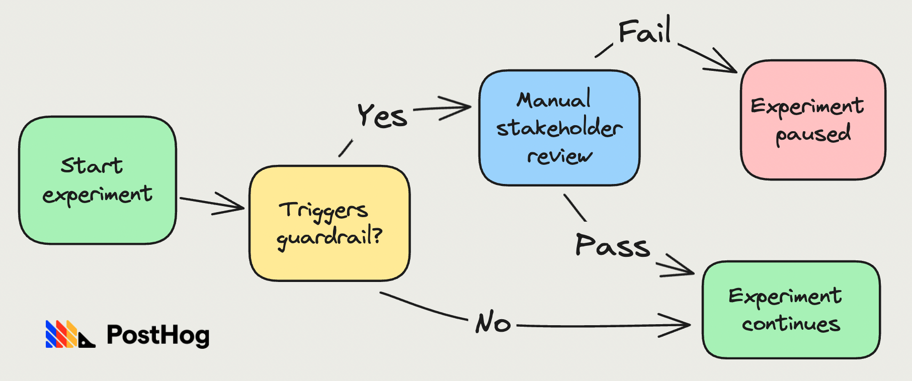

## What are guardrail metrics?

Guardrail metrics, also known as counter metrics, are business-critical metrics you want to monitor for negative change while conducting A/B tests.

Most [A/B tests](/blog/ab-testing-guide-for-engineers) have a single goal metric you use to compare how two or more variants improve your product. But focusing on a single metric hides the impact a test has on other metrics, potentially harming the product experience overall.

Product and growth teams use guardrail metrics as an early warning system for A/B tests. For example, a team testing a simplified signup flow would include "conversion to paid" as a guardrail metric because any increase in signups is negated if fewer users end up paying for the product.

When guardrail metrics hit a negative threshold, teams do more analysis to decide what is causing the negative impact and if they should pause the experiment – e.g. by watching [session replays](/tutorials/explore-insights-session-recordings).

## Are guardrail metrics and secondary metrics the same?

Guardrail metrics are a subset of secondary metrics. A secondary metric is a non-goal metric you monitor for either positive or negative impacts in A/B tests. Guardrail metrics generally monitor for **negative** impacts.

## Benefits of guardrail metrics

For developers, benefits include:

- More confidence A/B tests aren’t causing problems. You spend less time checking for the negative impact of an experiment.

- A more accurate source of issues than bug reports or general metrics. You don’t need to guess if an A/B test is causing an issue because guardrail metrics will tell you

- More confidence in the results of the experiment knowing it doesn’t have broader negative effects.

- Promoting a culture of experimentation knowing A/B tests are safer to do. Creates trust between teams knowing other teams’ A/B tests won’t affect them.

[Airbnb](https://medium.com/airbnb-engineering/designing-experimentation-guardrails-ed6a976ec669) is a good case study for why guardrails are useful and how to implement them.

A team responsible for increasing bookings ran a test where the house rules weren't shown at checkout. This increased bookings, but decreased one of the test's guardrail metrics: review ratings.

When an A/B test triggers a guardrail metric at Airbnb, it's immediately escalated to a group of stakeholders who decide whether to continue the test or not.

Out of the thousands of experiments that run at Airbnb each month, guardrails trigger ~25 for review. 80% of these rollout after stakeholder discussion. They decide to pause ~5 experiments per month, which prevents 5 potentially major impacts to critical metrics and product areas.

## How to choose your guardrail metrics

As a general guideline, you should pick metrics important to the entire product or company. These are often [north star](/blog/north-star-metrics) or [product health](/blog/product-health-metrics) metrics. Airbnb breaks guardrail metrics into three categories:

- Key business metrics
- User experience metrics
- Strategic priority metrics

You need a mix of metrics from each category to ensure you don't miss potential issues. Just remember that each guardrail metric you add also increases the likelihood of false positives. 

For example, an [A/A test](/tutorials/aa-testing) with 3 guardrail metrics, and a significance level of 0.05, would cause a false alert approximately 14% of the time. The risk increases to 40% with 10 guardrail metrics and a massive 73% with 25 guardrail metrics.

More false positives means you run fewer tests, limiting the pace of improvements. 

### Example guardrail metrics

Potential guardrail metrics include clickthrough rate, active users, customer lifetime value, conversion rate, and pageviews. Here are some real-world examples:

- [Airbnb](https://medium.com/airbnb-engineering/designing-experimentation-guardrails-ed6a976ec669): revenue, bounce rate, page load speed, seats booked for experiences.

- [Square](https://developer.squareup.com/blog/lessons-learned-from-running-web-experiments/): bottom of funnel conversion, page load speed.

- [Bing](https://exp-platform.com/Documents/2017-08%20KDDMetricInterpretationPitfalls.pdf): page load time, page returns.

- [Netflix](https://www.adventuresinwhy.com/pdf/beyond_ab_testing.pdf): sample mismatch ratio, engagement, retention, conversion.

- [Ebay](https://innovation.ebayinc.com/tech/research/measuring-success-with-experimentation/): purchases, bought items, gross merchandise bought.

To help pick a metric, it's useful to know which secondary metrics have stopped experiments in the past. These are your company's [revealed preference](https://en.wikipedia.org/wiki/Revealed_preference) for guardrail metrics and likely make good choices to formalize.

##  Implementing guardrail metrics in PostHog

Now that you know all about guardrail metrics, it’s time to implement them in your A/B tests in PostHog. To do this:

1. Start by [creating an experiment](/docs/experiments/creating-an-experiment) in PostHog.

2. Fill out the key name, variants, goal metric, and any other details. Adding details about the guardrail metrics to the description is useful.

3. Under "secondary metrics," click "Add metric," and set up the trend or funnel you want as a guardrail. 

4. Click "Save," implement the experiment in your app, and press "Launch."

5. Guardrail metrics display alongside your goal metrics on the experiment detail screen.

Another way to track guardrail metrics is by creating them as an insight or dashboard. This enables you to completely customize your guardrail metrics as well as reuse them across experiments. You can then send them to your email or Slack with a [subscription](/docs/product-analytics/subscriptions).

Once you’ve done this, you have everything you need for safer, more effective A/B tests.

## Further reading

- [Multivariate testing, explained](/blog/multivariated-testing-explained)
- [What you can learn from how GitHub and GitLab use feature flags](/blog/github-gitlab-feature-flags)
- [How YC's biggest startups run A/B tests (with examples)](/blog/ab-testing-examples)
