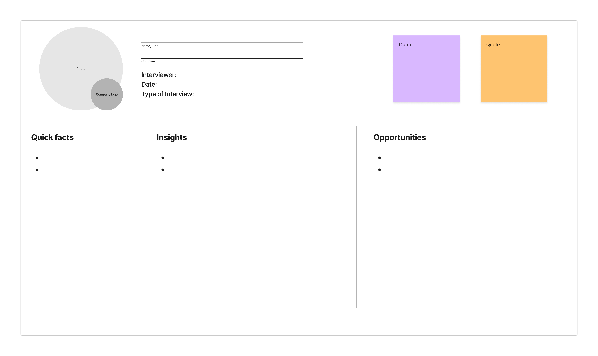

Regularly talking to users is an important habit for any product team, but it's wasted without an efficient way to share what you learn. At PostHog, we favor interview snapshots. Championed by Teresa Torres in the book [Continuous Discovery Habits](https://www.amazon.com/Continuous-Discovery-Habits-Discover-Products/dp/1736633309), we like snapshots because:

 1. They're easy to create – 30 minutes if you do them right after an interview.
 2. They're easy to digest – no scrolling necessary, just drop a screenshot into Slack.
 3. They're conversation starters – each snapshot triggers lively debate and ideas.

In this guide, I'll share how we create user interview snapshots at PostHog – template available as a [JPEG](https://posthog.com/images/interview-snapshot.jpg), [Figma file](https://www.figma.com/file/iO6kIZ8kXdMudLtu7kSyc5/PostHog-Interview-Snapshot-Template?node-id=0%3A1&t=LDU8ALaROQyfh6JL-1), or on [Google Sheets](https://docs.google.com/presentation/d/1JnewtJmeRHrXPloJzT5nGmXYrBUbaKnN7-k4kYjbo9M/edit?usp=sharing).

## Interview snapshots explained

Snapshots are an easy-to-digest summary of the insights you glean from interviews. Ideally you take those notes during the interview, or you can ask one of your colleagues to do so – sometimes it's easier if one person talks and the other takes notes. 

Here's what a completed snapshot looks like:

While taking notes, focus on how the user is using your product, and how they feel while using it. What makes them excited? What frustrates them? Those are the insights that later go into your interview snapshot.

Another approach is to record the conversation then transcribe and summarize it later. This might seem easier, but I don't recommend it because it's more time-consuming – remember we're optimizing for efficiency here. You can, of course, still record interviews as a useful reference for your notes, or for extracting direct quotes later.

Instead, I recommend blocking 30 minutes after your interview to review your notes and fill out the user interview snapshot while it's fresh in your mind. This way, each interview becomes a simple 60-minute block – 30 minutes for your interview, and 30 minutes for review.

## Creating your interview snapshot

Once you've reviewed your notes, you're ready to start filling out your snapshot. You can save and edit the snapshot below, or make a copy on [Figma](https://www.figma.com/file/iO6kIZ8kXdMudLtu7kSyc5/PostHog-Interview-Snapshot-Template?node-id=0%3A1&t=LDU8ALaROQyfh6JL-1) and [Google Sheets](https://docs.google.com/presentation/d/1JnewtJmeRHrXPloJzT5nGmXYrBUbaKnN7-k4kYjbo9M/edit?usp=sharing).

### 1. Note high-level information of your user

Don't forget to add the job role and company name if you're a B2B company – it's important context. If easily available, add a picture of the user and the company logo. This is optional, but I find it helps trigger my memory when I revisit interviews a few weeks after the fact.

### 2. Add any relevant background information

What information about your user is relevant to your company and product? Their age? Their responsibilities in their job role? What does their morning routine looks like? Write this information down in the “quick facts” column. I also recommend writing down any previous experience the user has with your product here – i.e. are they a long-term user, or have they recently started using your product?

### 3. List the opportunities you’ve identified

Did the user express any pain points or desires in relation to your product or problem area? Write these down in the “Opportunities” column. During the interview, make sure you really get to the bottom of the user’s needs, and avoid the **XY problem**. Make sure to list problems here, and **not feature ideas**.

> The [**XY problem**](https://xyproblem.info/) describes when you ask a user for a solution Y to their problem X. If you build Y without understanding X, you are missing important context that would allow you to build a solution that actually solves the problem.

### 4. Note any other interesting insights

If the user mentioned anything interesting that doesn’t fit in the “Opportunities” column, you can add it to “Insights”. This can include anything that isn’t a pain point, a need or a desire. Did they use the product in an unexpected way? Did they share anything about why they chose your product (or not)? If there is anything you want your colleagues to know about without reading the whole interview transcript, this is the place to put it.

### 5. Add one or two memorable quotes

At the top of the template, there is space to add one or two memorable quotes from the interview. This is useful, for example, if the user shared a particular emotion in the interview you want to relay word for word, and you want to create empathy in your team for this particular issue.

### 6. Share the interview snapshot with your team

Take a screenshot of your completed interview snapshot and share it with your team – we have a dedicated Slack channel for them. Snapshots are bound to create a conversation, follow-up questions or ideas. This is exactly what you want. At PostHog, interview snapshots frequently convince people we should invest in a certain feature, or remind us of older issues that have escaped our attention.

## More tips for successful interviews

- Invite your team members to join for the interview and have a quick debrief after. You will be surprised how the same user feedback is perceived differently by different people.

- Make your full interview notes accessible to everyone in the team. This allows people to get context around the snippets you have added to your interview snapshot.

- If you’ve done a round of interviews around a certain topic, aside from user snapshots, summarize what you’ve learned. This allows you to highlight opportunity areas that have been mentioned several times or are a bigger problem then others, thus guiding your prioritization.

To conclude, interview snapshots are a great way of quickly capturing the gist of a user interview and sharing those insights with your team. Remember, this is just how **we** do them – you can adapt this template however you want to suit your needs. 

If you're new to doing user interviews, read our [guide to talking to users as an engineer](/blog/10x-engineers-do-user-interviews) for more tips on how to plan your interviews and find people to talk to.
