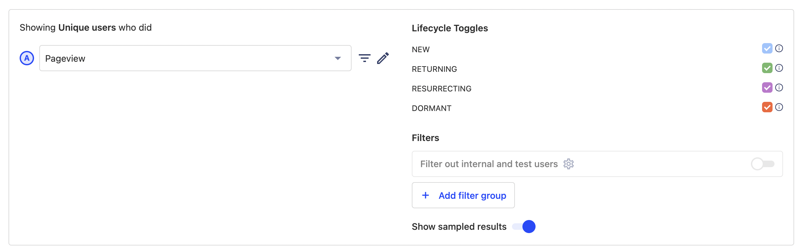
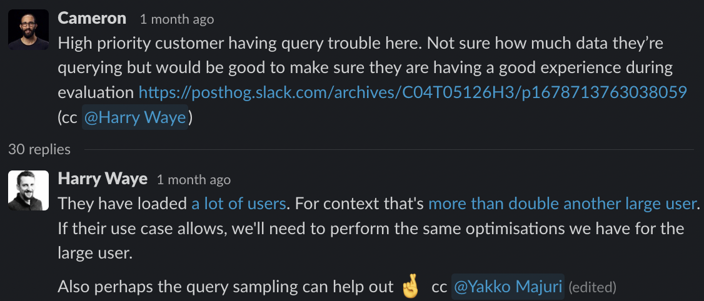
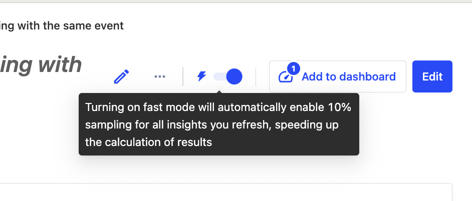
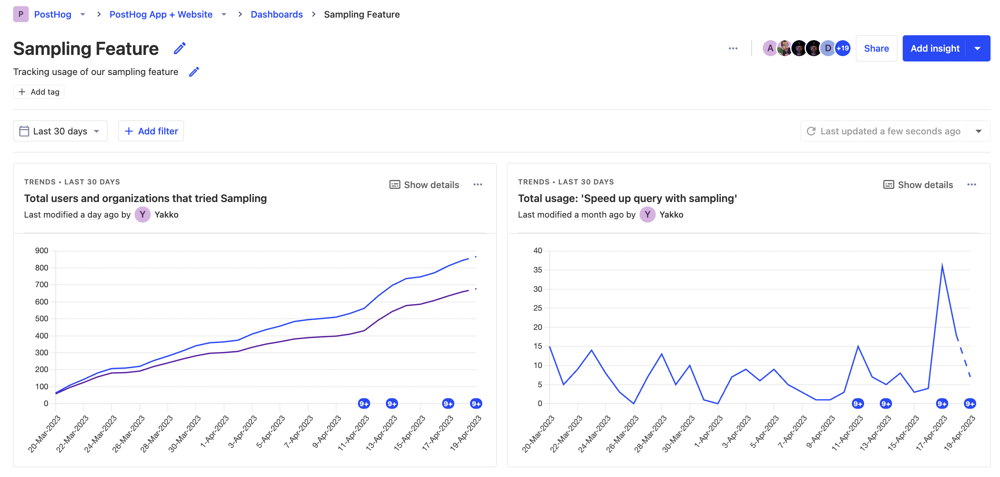

Is my new feature working? It's the question PostHog exists to answer – we even have [an entire team dedicated to it](/teams/feature-success). 

We define a successful new feature as one that:

1. **Solves a real user problem.** Key to this is understanding and defining users’ problems, then figuring out ways to solve them that fit with the product and business. 
2. **Is actually used.** No matter how good you think your feature is, if it doesn’t get used, it isn’t benefitting users.

If that sounds simple, well... that's kind of the point. The principles _are_ simple, but how deep you go in either is entirely up to you. 

In this post, I'll share how we measure feature success at PostHog to build features users love. We'll use a real-world new feature launch, [data sampling](/blog/measuring-feature-success), which was defined, built, and measured by a single engineer, Yakko.

> **What is sampling?** The sampling feature speeds up queries by analyzing a portion of the data and extrapolating the results.
>
> 
 
## Step 1: Deciding to build a feature
 
Measuring feature success at PostHog is a multi-step process that goes hand-in-hand with our release process. Deciding what to build starts with identifying a user problem we can solve, which we'll do using a combination of:

1. **Quantitative data** – Usage metrics showing users have a specific problem 
2. **Qualitative feedback** – Support tickets, direct user feedback, session replays etc.
3. **Personal experience** – Dog fooding is old advice, but good advice.

In this case, Yakko decided to work on data sampling because:
1. Slow results on complex queries were causing frustrations for large customers. This ties to the product analytics team objective of "[make PostHog performance frustration free for our 10 largest customers](/teams/product-analytics#objective-2-make-posthog-performance-frustration-free-for-our-10-largest-customers)."

2. Sampling felt like a simple solution that could be implemented quickly.

3. Manually benchmarking the impact of 10% sampling on large customers' queries confirmed 3-10x improvements in speeds with only a 1-2% loss in accuracy.

This showed that sampling was technically feasible, and it was worth doing now.

## Step 2: Building an MVP and testing it

Once we decide to build a feature, the success evaluation can begin. We move fast and build the feature, review that it matches what we envisioned, and ship it behind a feature flag. The flag rolls out to a single developer to start. This helps them to check if it has the smallest bit of success in solving the problem in production.

This is exactly what Yakko did with sampling. He picked one insight (lifecycle was easiest), updated the API, built a quick UI, and [shipped it](https://github.com/PostHog/posthog/pull/14283) behind a feature flag. Within hours, the feature was working in production with production data. 

A feature is successful at this stage if it solves the issue, isn’t broken, and can scale to millions of events and users. Since we use PostHog at PostHog, this often means using it ourselves (aka dogfooding). Feature flags let us roll out or roll back quickly if needed.

## Step 3: Beta testing and gathering feedback

Once an MVP of a feature ships, it continues the process of evaluation by rolling out further. More members of our team try out the feature and provide feedback.

For sampling, Yakko added more insights that supported sampling and then started polishing. He asked the team to try out the feature, wrote [docs](/docs/product-analytics/sampling), and discussed with his team what sampling should look and feel like. He also started to take Michael's UI feedback more seriously.

If a specific user requested the feature or has a problem potentially solved by it, we might roll it out to them with the expectation that it is a recently built, beta feature. Feature flags enable us to adjust the rollout and do this fast. We communicate with the user through this process, and ideally receive feedback that helps us improve it.

Sampling got its first real users through the support hero tagging Yakko in places they felt sampling might help out. This helped improve the experience for customers without completing the feature. When these users were positive about their experience, he knew the feature was successful so far and continued the rollout. 

A feature is successful at this stage if users use it and the qualitative feedback we receive from them is positive. A common goal at this stage is "5 happy teams using it."

## Step 4: Wider launch and usage monitoring

Once we have positive feedback and usage in beta, and the feature reaches the point we are ready to release, the flag rolls out further, eventually to 100% of users.

Yakko continued to update the simple UI for sampling (it changed four times) to ultimately land on something he was happy with. He instrumented tracking for the feature’s usage, and rolled it out to 25% of all organizations in PostHog.

At this stage, success is significant usage by the target user. What this portion is depends on the usage of similar features. At PostHog, this looks like:

- 10-12% of our daily active users use individual products (like product analytics or session recordings)
- 15-40% of daily active product users use a large features (like flag payloads or funnels) within those products.
- 4-12% of daily active product users use a small features (like sampling, replay network tab, or dashboard templates) within those products.

The feature should also be issue free and work as intended. Bug reports or confusion on how to use the feature are bad signs.

To evaluate success after launch, we did [real user monitoring](/blog/real-user-monitoring) by watching session replays and tracking metrics that matched criteria we care about. For example, we might look at the session recordings of power users who are in our ICP and paying customers. We also might create a dashboard to show usage and the feature’s impact.

In Yakko’s case, he: 

- created a key metrics dashboard that he would dig into a few times a day.
- watched [session replays](/tutorials/explore-insights-session-recordings) of the feature to see if it was having the intended impact or causing any confusion (he fixed a few visual regressions as a result of this).
- used the [user interview app](/docs/apps/user-interview) to prompt users who tried sampling for a user interview.

After doing all these, he was confident the feature was trending towards success, and continued the rolling out until he hit 100% of users.

## Step 5: Continued development post-launch

Success after launch looks like continued growth in usage metrics. It also looks like recommendations, or public praise for that feature, such as this feedback we got about sampling:

> Btw, love the new sampling feature - makes queries much faster

If the feature has a large enough impact, it may even inspire a marketing push or case study.

If a large feature is successful to warrant dedicated, sustained work, such as session recordings or group analytics, we might plan to [charge for it](/handbook/engineering/feature-pricing). If this is the case, then success becomes users paying for it. As an example, charging for our feature flags product is a goal for Q2 2023. Follow-on goals are likely growing the revenue of the product. 

The success of the feature post-launch determines future effort and investment in that feature or related features. If a feature gets a lot of usage and feedback, then we often develop plans to continue working on ideas related to it.

Sampling is a relatively self-contained feature. It likely won’t get charged for. Yakko continues to ask for feedback about sampling, but more work will go into improving query performance generally as it's important ongoing metric for us. The success of sampling led to more investment in improving query performance.

## Why we measure feature success like this

To summarize, we build successful features by:

1. Finding real user problems we know we can solve
2. Building an MVP that works in production
3. Gathering qualitative feedback from team members, and then beta users
4. Launching and verifying significant usage by our target user
5. Constantly measuring usage, iterating, and testing the impact of changes 

You may have noticed that this process is relatively fluid. We don’t enforce mandatory reports, guidelines, metrics, or processes. We let small teams, and the individuals in those teams, decide what feature success means to them.

This is because we bias for impact, and believe that ownership is key to building successful features. Without people or teams owning features, there is little incentive to make them successful. No process can make ownerless features successful.

We know that every team, inside and outside of PostHog, has different ways of evaluating success, it's a [key focus of ours](/handbook/strategy/overview#strategy) to build tools to help them do this. If you're curious exactly what that looks like, you can check out what the feature success team is up to on [their small team page](/teams/feature-success).

## Further reading

- [The 80/20 of early-stage startup analytics](/blog/early-stage-analytics)
- [Why use feature flags? Benefits, types and use cases, explained](/blog/feature-flag-benefits-use-cases)
- [Master Feature Flags: Best practice, tips and examples](/blog/feature-flag-best-practices)
