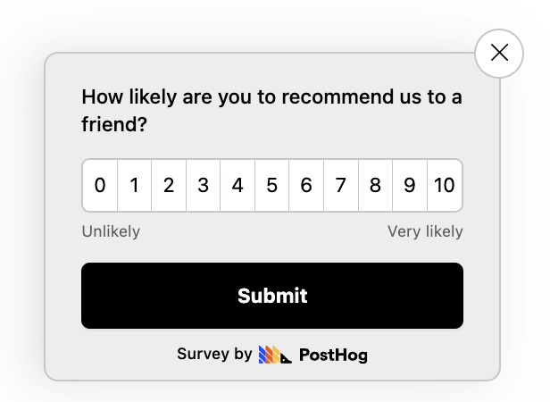
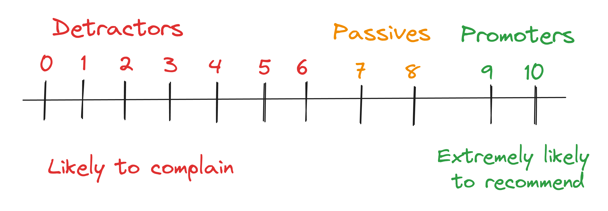
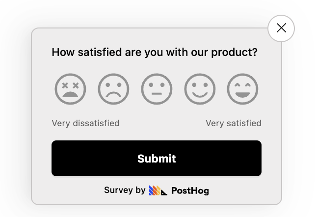
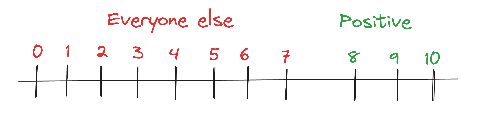
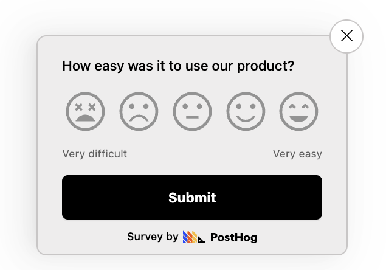
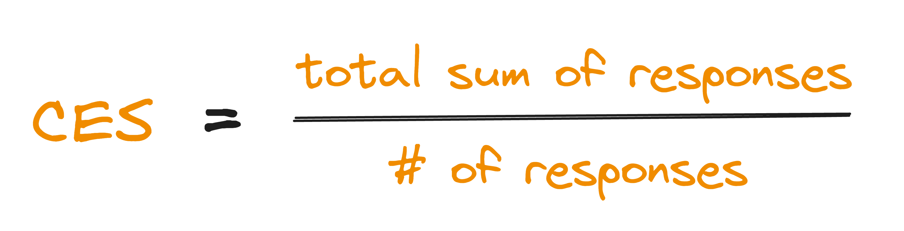

The two most important metrics in SaaS are growth and retention. [User surveys](/surveys) are a great way to unlock insights into how to improve them, but which survey type gives you the best insights? 

Net promoter score (NPS), customer satisfaction (CSAT) and customer effort score (CES) are three of the most popular surveys and in this post we'll dive into our choice for which one is best for SaaS.

Here's the TLDR:

- **CSAT** is most useful before product-market fit when you're constantly iterating on your product.
- **NPS** is best after you've achieved product-market fit.
critical.
- **CES** is good for understanding if your features are easy to use and debugging UX problems, but not much else.

## What is NPS?

Net Promoter Score (NPS) measures how passionate your users are about your product. You ask them how likely they are to recommend your product to a friend or coworker and they respond on a scale from 0 (not likely at all) to 10 (extremely likely).

NPS gives you insight into who your loyal customers are and which are at risk of churning.

### How to calculate NPS score

NPS survey responses are grouped into three categories:

- **Promoters** – people who respond with 9 or 10. They're extremely happy with your product.
- **Passives** – people who respond with 7 or 8. They aren't unhappy, but they're not overly excited either.
- **Detractors** – people who respond with 6 or below. They may have had a bad experience and are likely to complain to others.

Your NPS score is the `% of promoters - % of detractors`. The scores range between -100 (100% negative) and +100 (100% positive).

For example, let's say you survey `100` people. `50` are promoters, `30` are passives, and `20` are detractors. Your NPS would be `50% - 20% = 30`.

### What is a good NPS score for SaaS?

Anything above 0 is good, above 20 is great, and above 50 is amazing. According to [Satmetrix](https://www.satmetrix.com/wp-content/uploads/2023/07/NICE-Net-Promoter-Benchmarks-2023.pdf), the average NPS score for software and apps is 27.

Below is a table with a benchmark of NPS scores from well-known SaaS products.

| Product | NPS score |
|--------------------------------------------------------------------|-----------------------------------------------------------------------------------------------------------------------|
| [Snowflake](https://www.snowflake.com/blog/customer-experience-report-2022/) | 72 |
| [Square](https://d1g145x70srn7h.cloudfront.net/documents/investor-relations/presentations/05-11-2018-overview.pdf) | 70 |
| [Zoom](https://blog.zoom.us/zooms-nps-dominates-video-conferencing/) | 69 | 
| [DocuSign](https://www.docusign.com/why-docusign) | 66 |
| [Zapier](https://www.comparably.com/brands/zapier) | 64 |
| [Slack](https://www.comparably.com/brands/slack) | 53 |
| [Mailchimp](https://www.comparably.com/brands/mailchimp) | 47 |
| [Netflix](https://www.comparably.com/brands/netflix) | 46 |
| [Twilio](https://www.comparably.com/brands/twilio) | 34 |
| [Dropbox](https://www.comparably.com/brands/dropbox) | 27 | 

### Drawbacks of NPS

NPS can be tricky because it's often contextless. It gives you an indication of your users' sentiment toward your product but not much else.

To counteract this, it's best to ask follow-up questions in your NPS survey, like:

- Which features do you find most useful?
- What are you finding difficult to do?
- Is there a feature or aspect of the product that particularly disappoints you?
- What would it take to improve your score to a 9 or 10?
- Would you be open to a follow-up call to discuss your feedback in more detail?

NPS is particularly handy for understanding long-term user satisfaction.

With this in mind, it's best to wait for users to properly experience your app. Then, you should run NPS surveys every month or quarter to understand how their experience changes over time. This enables you to identify trends in how your product changes are affecting your user experience.

### How to use NPS to improve your SaaS

First, segment your responses by assigning a [persona](/product-engineers/how-to-create-user-personas) to each person that filled out the survey. Then, filter out any responses by users who do not match your key user persona. This way 
you can focus on the feedback from your target user group and ensure the insights are more relevant.

Next, **focus your attention on the passive responses** (the users who responded with 7 or 8). These users will be the easiest to convert into active promoters of your product and there's usually just one or two things holding them back. Find out what these things are (by conducting interviews or follow-up surveys) and address their feedback with product changes. Once you've done so, let them know and they'll be grateful you've taken their input seriously. This should persuade them into becoming promoters.

Once you've done so, repeat the same steps for detractors who responded with 5 or 6. You can also repeat the process again for detractors who reponded from 0-4, but keep in mind that the lower someones response is, the closer they are to being a lost cause and it may not be worth the effort to save.

## What is CSAT?

Customer satisfaction (CSAT) score measures how satisfied your users are with a specific feature or product. Responses range from 1-5 or 1-10 on an "extremely dissatisfied – extremely satisfied" scale.

CSAT shows you how well your product meets the expectations of your users. You usually collect CSAT responses straight after a user has interacted with feature

The main difference between CSAT and NPS is that CSAT measures short-term satisfaction while NPS measures long-term loyalty. The best way to think about this is that *satisfaction* tends to be a more short-lived sentiment, while *recommendation* tends to be harder won and long term.

### How to calculate CSAT score

Responses are grouped into two categories:

- **Positive responses** – people who respond with 4 or 5 if your scale is from 1-5 (or 8, 9, or 10 if your scale is from 1-10).
- **Everyone else**

Your CSAT score is the `Total number of positive responses / Total responses = % of satisfied customers`.

For example, let's say you survey `100` people. `70` people give a positive score, your CSAT would be '70 / 100 = 70%`.

### What is a good CSAT score for SaaS?

A good score is typically 75-85%. Anything higher is amazing, and anything lower is poor. 

According to [fullview](https://www.fullview.io/blog/csat-benchmarks-by-industry#toc-csat-benchmarks-for-software-companies), the average CSAT score for SaaS apps is 78.

### Drawbacks of CSAT

While a low CSAT scores correlates with user churn, a high CSAT doesn't necessarily mean users are likely to stay. Users might be satisfied with your product but could still switch to a competitor for reasons not covered in the survey – like pricing or other features. 

Thus if your goal is to increase long-term retention (as is the case for most SaaS apps), it's best to pair CSAT with other feedback methods in order to [uncover your users' real problems](https://newsletter.posthog.com/p/how-to-uncover-your-users-real-problems).

### When to use CSAT surveys

CSAT surveys are most effective when you need real-time feedback after specific interactions with your product.

With this in mind, try to use CSAT surveys after key interactions in your user journey, such as:

- **After onboarding –** to understand if your onboarding was effective and engaging.
- **During [beta testing of a new feature](/tutorials/beta-feedback) –**  to see if it meets your users' expectations.
- **After major app updates –** to understand whether your UX has improved or if there are new issues to address.
- **Before subscription renewal –** to allow you to address any issues beforehand.
- **After customer support interaction –** to see if customers feel their issue has been resolved.

## What is CES?

Customer effort score (CES) measures how easy it is to use your product or feature. Users are asked "How easy was it to use `<name of feature>`" and a response scale ranging from 1 (very difficult) to 5 (very easy).

CES is great for pinpointing UX problems in your app.

### How to calculate CES score

To find your CES score, calculate the average score of all your responses. That is: `sum of all responses / number of responses = CES score`

For example, let's say you survey `100` people. If the sum of all their responses is `450`, your CES score is `4.5`.

### What is a good CES score for SaaS?

While there are no published benchmarks for CES scores, you should aim for a score of 4 or higher. Any lower is a sign that users are struggling to use your app and this will lead to churn.

### Drawbacks of CES

CES surveys focus on a single feature interaction and are very narrow in scope. So while they help you debug UX issues, they don't give you insights into overall satisfaction with your feature.

Additionally, CES only tells you if a feature is difficult to use, but it doesn't tell you _why_. To counteract this, you need to ask follow-up questions, such as:

- What makes `<feature name>` difficult to use?
- What could we do to make it easier to use?

### When to use CES surveys

To best debug UX problems, you should use CES surveys after key interactions, such as:

- **After using a feature for the time** – to understand how intuitive it is.
- **After a major UI update** – to confirm users can still navigate through your app effectively.
- **When a user is migrating from a competitor's product to yours** – to highlight areas for improvement in onboarding.

## NPS vs CSAT vs CES: Which one is best?
 
Our recommendation is to use CSAT before you have [product-market fit](/founders/measure-product-market-fit), and NPS after you do.

Before product-market fit, your app is constantly changing as you figure out what to build, so it makes sense to focus on the short-term only. CSAT surveys will enable to you quickly determine if your changes are meeting the expectations of your users, helping you iterate faster. On the other hand, NPS is better for understanding long-term user sentiment, so is not well suited for rapidly evolving products.

Conversely, once you've achieved product-market fit and your product is more stable, NPS will be more valuable. At this stage, you're looking to grow and maintain a loyal user base, and NPS provides a clearer picture of which of your users are likely to retain or churn.

CES surveys don't provide insights into short or long-term user sentiment, so we prefer to avoid using them. However, CES can be useful if ease of use is key feature differentiating you from your competitors. For example, [Linear](https://linear.app/) emphasizes it's speed and keyboard shortcuts as a differentator from it's main competitor [Jira](https://www.atlassian.com/software/jira). In this case, measuring CES over time can be an indicator of whether your product is maintaining its competitive advantage.

Lastly, it's worth mentioning that neither NPS, CSAT, or CES surveys are a replacement for [talking to your users](/product-engineers/10x-engineers-do-user-interviews). Surveys are efficient at collecting data from a large audience and thus are useful for quickly identifying general trends in user opinions. However, they lack the depth and nuanced understanding that can be gained from direct conversations with your users. 

User interviews are time-consuming, though, and so not scalable for larger user bases. Thus it's best to combining surveys with regular interviews. This approach allows you to gather both broad quantitative insights and deep qualitative feedback.

## Summary

To summarize:

- **CSAT** is great for immediate feedback and is most useful during the early stages of a product when rapid iteration and responsiveness to user feedback are critical.
- **NPS** is ideal for gauging long-term customer loyalty and can be more effective for mature products, where the focus is on growth and retention.
- **CES** is particularly useful for products where ease of use is a key differentiator. It helps in understanding how smooth and effortless the user experience is, which can be a crucial factor in retaining users in highly competitive markets.

Here's a table summarizing their differences:

|           | NPS                                   | CSAT                                       | CES                                           |
|-----------------|---------------------------------------|--------------------------------------------|-----------------------------------------------|
| **Timeframe**   | Long-term                             | Short-term                                 | Short-term                                    |
| **Insight**   | User sentiment towards your app     | User satisfication                                | Ease of using a specific feature                                    |
| **Best for**         | Identifying users who are likely to retain or churn              | Understanding how well your product meets user expectations                          | Identifying UX problems                 |
| **When to ask**    | At regular intervals (e.g., monthly, quarterly) to existing users           | Immediately after using a feature                | Immediately after using a feature      |

## Further reading 📖

- [How to create a great user persona (with examples)](/product-engineers/how-to-create-user-personas)
- [How to write great product survey questions (with examples)](/product-engineers/product-survey-questions)
- [How to analyze surveys with ChatGPT](/tutorials/analyze-surveys-with-chatgpt)

