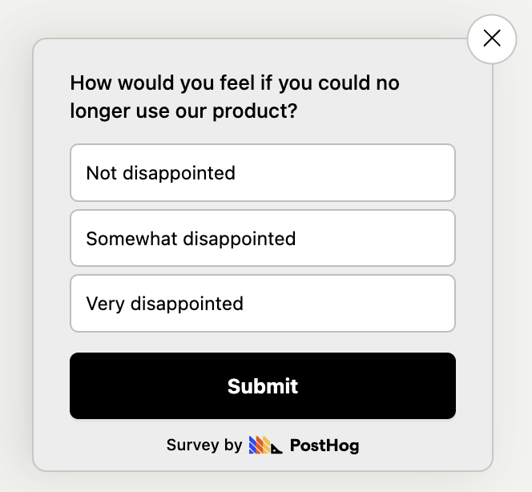
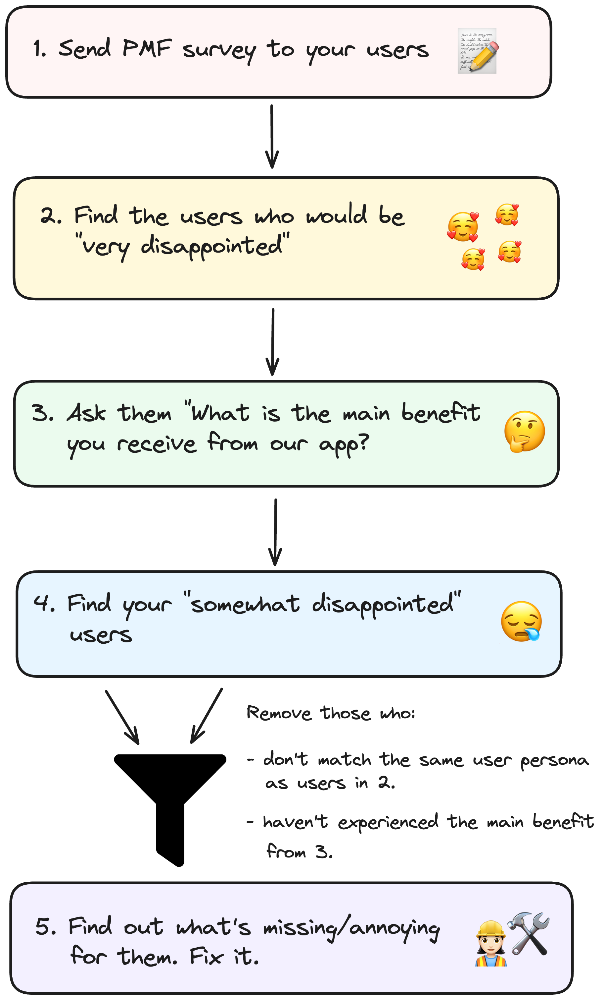

*"How would you feel if you could no longer use our product"*, a.k.a the product-market fit survey, is perhaps the most famous question in SaaS circles. But how do you actually gain useful insights from it?

In this post we dive into exactly that – and look at two case studies – so that you can learn how to use it to build the best products.

## What is the product-market fit survey?

> If you're already familiar with PMF surveys, skip to the [next section](#how-to-use-pmf-to-improve-your-app).

Created by entrepreneur Sean Ellis, the core question (among others) it asks is:

"How would you feel if you could no longer use [product name]?"

- a) Very disappointed
- b) Somewhat disappointed
- c) Not disappointed

Responses from this survey shed light on how vital your product is to your users, and a high percentage of 'Very disappointed' indicates strong product-market. Ellis [asserts](https://blog.growthhackers.com/using-product-market-fit-to-drive-sustainable-growth-58e9124ee8db) that learning everything you can about these users is the key to building the best products.

### How to calculate PMF score

Your PMF score is the percentage of "very disappointed" responses out of the total number of responses.

For example, let's say you survey `100` people. `50` people respond with "very disappointed", your PMF score would be `50 / 100 = 50%`.

### What is a good PMF score?

Based on his research of 100+ startups, Ellis believes 40% answering "very disappointed" is a strong signal of product-market fit. The more responses you get, the more reliable the signal. 

Ellis recommend a minimum of 30 responses before the survey becomes directionally useful, and that 100+ responses is ideal.

### Drawbacks of PMF surveys

Calculating your PMF score is not enough. The *real* insights come from segmenting your users based on their response, and then asking follow-up questions – either in a [survey](/surveys) or by [conducting interviews](/product-engineers/interview-snapshot-guide).

Here are five follow-up questions you should ask:

1. Why did you select this answer? (after responding to the main survey question)
   
2. What is the primary benefit that you have received from our product?

3. What would you use as an alternative to our product?

4. What type of person do you think would benefit most from FYI?

5. How can we improve our product?

Answers to these questions is often surprising – how your users view your product might not be the same as how you do.

### Who should answer the PMF survey?

Ellis recommends sending the PMF survey to users that have recently had meaningful interactions with your product. This means users that have:

- experienced the core value-prop of your product.
- used your product at least twice.
- used your product in the last two weeks.

This way, you ensure that the feedback you receive is relevant and accurate.

## How to use PMF to improve your app

Rahul Vohra, founder of [Superhuman](https://superhuman.com), famously used PMF surveys to build an [engine to find product-market fit](https://review.firstround.com/how-superhuman-built-an-engine-to-find-product-market-fit). This catapulted them to over 50,000 paying customers and whopping **$20 million** in revenue!

At a high-level, here are the steps you need to follow to do the same for your app (we'll dive a [case study of Superhuman below](#case-study-superhuman)):

1. Send the PMF survey to your users.

2. Identify your best users i.e., those who answered "very disappointed".

3. Paint a clear picture of who these people are by creating a [user persona](/product-engineers/how-to-create-user-personas) of them.

4. Find out why they love your product. Do this by asking `"What is the main benefit you receive from our product"` as follow-up question in your survey.

5. Next, direct your attention to the "somewhat disappointed" users. Focus only on those who match the user persona you created in `step 3` *and* responded the same to "main benefit" question in `step 4`.

6. It's clear that your app resonates with them, but something is holding them back from *loving* it. Find out what's missing or annoying for them. Do this by asking `How can we improve our app for you?`. 

7. Reprioritize your roadmap to address their issues and ship your changes.

8. Repeat the process to convert your "somewhat disappointed" users into your best users.

### Case study: Superhuman

Superhuman nearly doubled their PMF score from 33% to 58%. More importantly, users became noticeably more vocal about how much they loved the product. Here's how they did it:

First, they sent out a survey with four questions:

1. How would you feel if you could no longer use Superhuman?

2. What type of people do you think would most benefit from Superhuman?

3. What is the main benefit you receive from Superhuman?

4. How can we improve Superhuman for you?

Then, they took the responses from this survey and did the following:

1. **Segmented users:** They assigned user personas to everyone who responded (e.g. founder, engineer, customer success) and created an [Ideal Customer Profile](/founders/creating-ideal-customer-profile) based on the users that responded "very disappointed". 

2. **Doubled down on what their ideal customers love:** People loved how fast Superhuman was and how quickly they could get their work done using shortcuts. Superhuman made sure to continue improving these. They built more features to increase email efficiency – like "Snippets", the ability to automatically type phrases, paragraphs, or whole emails. 

3. **Converted on-the-fence users:** They focused on the users who loved Superhuman's speed but still responded with "somewhat disappointed". They learned that these users wanted a mobile app. So they built it – and their users loved them for it!

4. **Repeated the process:** Superhuman continued to survey users, tracking progress towards the 40% mark. The score became the primary OKR for the product team and, after three quarters, Superhuman increased their score to 58%.

<BorderWrapper>
<Quote
    imageSource=""
    size="md"
    name="Rahul Vohra"
    title="Founder & CEO, Superhuman"
    quote={`"If you only double down on what users love, your product-market fit score won’t increase. If you only address what holds users back, your competition will likely overtake you."`}
/>
</BorderWrapper>

### Case study: Slack

In 2015, co-founder of KISSmetrics [Hiten Shah](https://twitter.com/hnshah) ran an [open research project](https://hitenism.com/slack-product-market-fit-survey/) where he conducted the PMF survey on 731 Slack users. Here's what he learned about their best users:

- They believed it increased productivity and improved collaboration.
- The key benefit of using Slack is a reduction in email volume.
- They loved integrations – and they requested better ones.
- Video conferencing was a sorely missed feature
- In their opinion, Slack would benefit anyone that works on projects where teamwork and communication is important.
- "Search" was rarely mentioned as a benefit.

From these responses, Hiten recommended the following product and marketing changes:

- Add video conferencing (which they soon did!)
- Make integrations even better, and have Slackbot start recommending the best ones to people.
- On the homepage, emphasize teamwork, communication, and collaboration more. De-emphasize search.
- Replace marketing site copy with words that must-have users use instead. Specifically, add copy about the benefits of Slack helping reduce company emails. 

## Further reading 📖

- [In-depth: How to measure product-market fit](/founders/measure-product-market-fit)
- [What we've learned about product-market fit](/newsletter/what-weve-learned-about-product-market-fit)
- [NPS vs CSAT vs CES: Which is best for SaaS?](/product-engineers/nps-vs-csat-vs-ces)