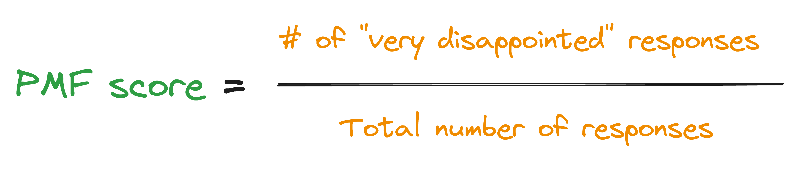
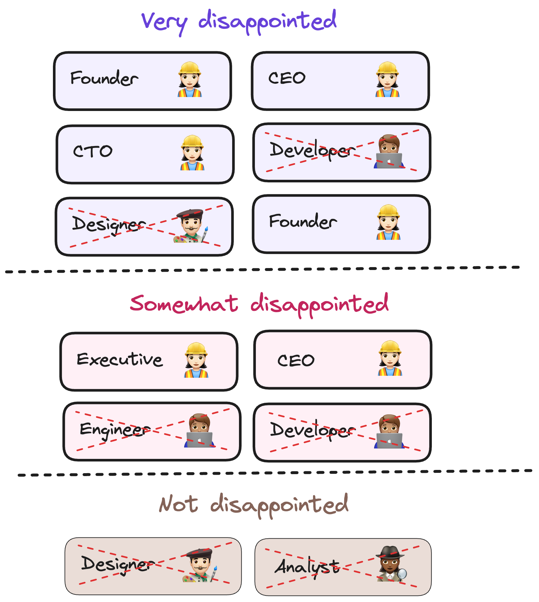

*"How would you feel if you could no longer use our product?"* a.k.a the product-market fit survey.

This is perhaps the most well-known question in SaaS circles. [Superhuman](https://superhuman.com) famously used it to catapult themselves to over 50,000 paying customers and a whopping **$20 million** in revenue. 

You might be wondering, "How can I do the same?"

In this post we show you just that. We break down [Superhuman's product-market fit engine](https://review.firstround.com/how-superhuman-built-an-engine-to-find-product-market-fit) into an easy step-by-step guide you can follow as well as dive into two case studies.

## A very brief introduction to PMF surveys

> If you're already familiar with product-market fit surveys, skip to the [next section](#how-to-drive-product-market-fit-with-pmf-surveys).

Created by entrepreneur Sean Ellis, the core question (among others) it asks is:

"How would you feel if you could no longer use [product name]?"

- a) Very disappointed
- b) Somewhat disappointed
- c) Not disappointed

Your PMF score is the percentage of total responses that are "very disappointed".

For example, let's say you survey `100` people. `50` people respond with "very disappointed", your PMF score would be '50 / 100 = 50%`.

Based on his research of 100+ startups, Ellis believes 40% answering "very disappointed" is a strong signal of product-market fit.

## How to drive product-market fit with PMF surveys

### Step 1: Survey informed users

The first step is to learn more about your customers and what they think of your app. Do this by creating a [survey](/surveys) with the following questions:

1. How would you feel if you could no longer use our product?
   
2. What type of people do you think would most benefit from it?

3. What is the main benefit you receive from it?

4. How can we improve our app for you?

Each question plays an important and specific role – we'll explain how later. 

In the meantime, to receive the best feedback, send the survey to users who have recently had meaningful interactions with your app. This means users that have:

- experienced the core value-prop of your product.
- used your product at least twice.
- used your product in the last two weeks.

You can begin analyzing the results once you have at least 30 responses. 

### Step 2: Study your best customers

Start by examining the users who would be "very disappointed" if they could no longer use your product. There are two things you need to learn about them:

1. Who they are

2. Why they love your product

To find the answers, look at their responses to the questions `What is the main benefit you receive from our product?` and `What type of people do you think would most benefit from it?`.

Then, use this information to create a [user persona](/product-engineers/how-to-create-user-personas) of your best supporters. Users who match this persona are the ones you need to improve your app for and you should focus your attention solely on them. In the next step we explain how to do this.

<Caption>Focus your attention only on users that match your user persona</Caption>

### Step 3: Find your "on-the-fence" users

Direct your attention to the users who responded with "somewhat disappointed". In particular, focus on the ones that:

- match the user persona you created in the previous step, and
- gave similar responses like your best supporters when asked about the main benefit they receive from your app.

It's clear that these users are seeing the value in your app, but something is holding them back from becoming passionate users. Usually, only one or two things are in their way, so these users will be the easiest to convert into fanatics who champion your product.

To find out what their problems are, look at their response to the question `"How can we improve our app for you?" and make a note of the common themes.

### Step 4: Reprioritize your roadmap

Now that you understand your app's most important benefits and missing features, the next step is to reprioritize your roadmap. 

You need to continue improving the app's main benefits while also addressing the problems your users mentioned. Rahul Vohra, founder of Superhuman, explains why this is important:

<BorderWrapper>
<Quote
    imageSource=""
    size= "md"
    name= "Rahul Vohra"
    title= "Founder & CEO, Superhuman"
    quote={`"If you only double down on what users love, your product-market fit score won't increase. If you only address what holds users back, your competition will likely overtake you."`}
/>
</BorderWrapper>

When prioritizing your roadmap, you don't need to overthink things. Stack-ranking your projects by assigning each one a label of `low/medium/high` for effort and impact is sufficient (or you can even [add dollar estimates](/product-engineers/fixing-growth-problems#problem-2-prioritization)). This will give you a clear idea of which projects to work on first.

### Step 5: Repeat

Keep repeating the process from steps 1-4. Each time you do, you'll learn more about what you need to improve and how to prioritize it.

As you start shipping your improvements, continue tracking your PMF survey score. It should begin to improve as you gradually convert your on-the-fence users into loyal advocates. 

Lastly, to keep your product team focused on a single goal, consider making your PMF score their primary OKR.

### Frequently Asked Questions

#### How many responses do I need?

Ellis recommends a minimum of 30 responses for the survey to become directionally useful. However, he also mentions that 100 or more responses is ideal.

#### What do I do about users who answer "not disappointed"?

Respectfully ignore them! 

It's likely that there are many aspects of your app that are bothering or not benefiting them. Thus, they are essentially a lost cause. This is why you should instead focus on the "somewhat disappointed" users mentioned in step 3.

## Case study: Superhuman

Superhuman [nearly doubled their PMF score](https://review.firstround.com/how-superhuman-built-an-engine-to-find-product-market-fit) from 33% to 58%. More importantly, users became noticeably more vocal about how much they loved the product. Here's how they did it:

1. **Segmented users:** They assigned user personas to everyone who responded (e.g., founder, engineer, customer success) and created an [Ideal Customer Profile](/founders/creating-ideal-customer-profile) based on the users that responded "very disappointed". 

2. **Doubled down on what their ideal customers love:** People loved how fast Superhuman was and how quickly it helped them get their work done. Superhuman made sure to continue improving on this. They built more features to increase email efficiency – such as "Snippets": the ability to automatically type phrases, paragraphs, or whole emails. 

3. **Converted on-the-fence users:** They focused on the users who loved Superhuman's speed but still responded with "somewhat disappointed". They learned that these users need a mobile app, and so they built it. Their users loved them for it!

4. **Repeated the process:** Superhuman continued to survey users, tracking progress towards the 40% mark. The score became the primary OKR for the product team and, after three quarters, Superhuman increased their score to 58%.

## Case study: Slack

In 2015, co-founder of KISSmetrics [Hiten Shah](https://twitter.com/hnshah) ran an [open research project](https://hitenism.com/slack-product-market-fit-survey/) where he conducted the PMF survey on 731 Slack users. While he didn't follow the exact format we outlined in this post, it's worth diving into research.

Here's what he learned about Slack's best users:

- They believed it increased productivity and improved collaboration.
- The key benefit of using Slack is a reduction in email volume.
- They loved integrations – and they requested better ones.
- Video conferencing was a sorely missed feature
- In their opinion, Slack would benefit anyone who works on projects where teamwork and communication are important.
- "Search" was rarely mentioned as a benefit.

From these responses, Hiten recommended the following product and marketing changes:

- Add video conferencing (which they soon did!)
- Make integrations even better, and have Slackbot start recommending the best ones to people.
- On the homepage, emphasize teamwork, communication, and collaboration more. De-emphasize search.
- Replace marketing site copy with words that must-have users use instead. Specifically, add copy about the benefits of Slack helping reduce company emails. 

## Further reading 📖

- [In-depth: How to measure product-market fit](/founders/measure-product-market-fit)
- [What we've learned about product-market fit](/newsletter/what-weve-learned-about-product-market-fit)
- [NPS vs CSAT vs CES: Which is best for SaaS?](/product-engineers/nps-vs-csat-vs-ces)