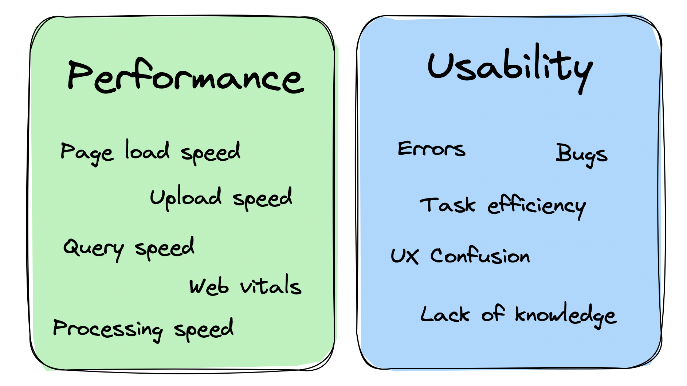
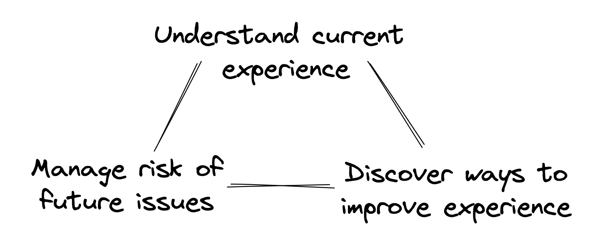
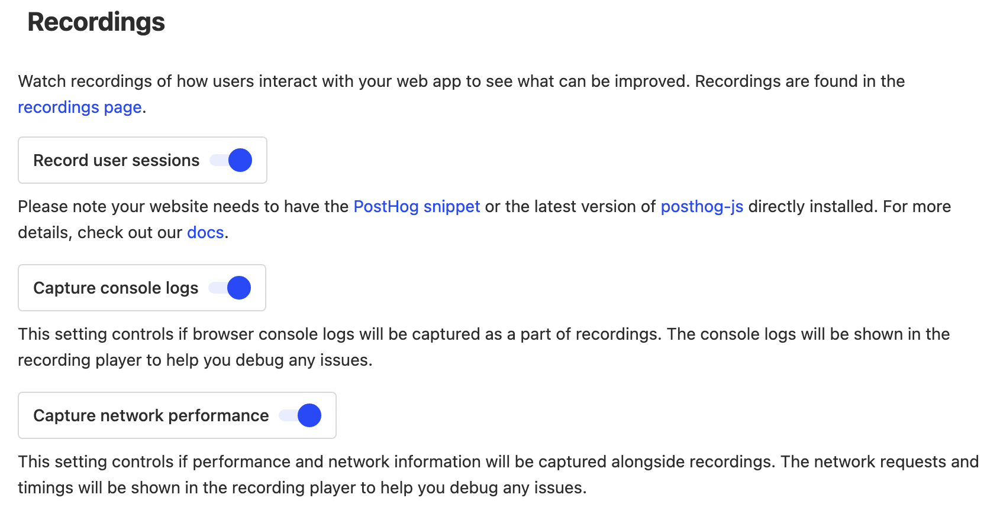
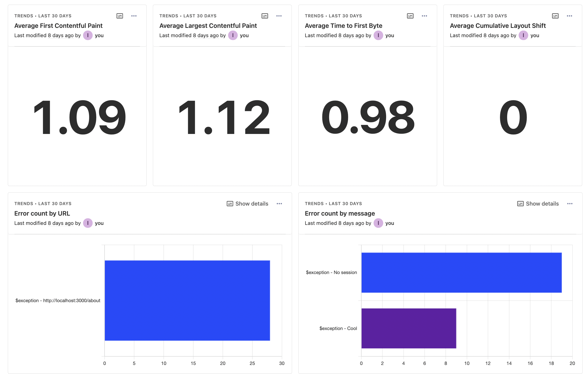
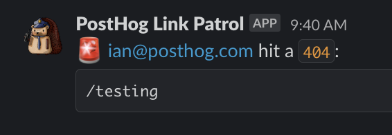

Before anyone can use your product, you must make sure it actually works as expected. Figuring this out is trickier than just running it locally. Changes often have unintended consequences on other parts of the app or create non-obvious issues. 

One way to track and prevent this is synthetic monitoring, which relies on simulated behaviors and software tests. The second way, which we cover in this post, is real user monitoring. 

## What is real user monitoring?

Real user monitoring is tracking the usage, performance, and quality of your product based on how users are experiencing it.

Because it tracks real user behavior, it is a closer representation of reality. It identifies real issues, largely broken down into two classes:

- Performance: loading, page, and query speed, core web vitals
- Usability: errors, confusion, bugs, rageclicks, unclear UI

The ideal real user monitoring system captures data about these issues, provides details, supports planning of fixes, and ultimately, supports creating a better user experience.

## Benefits of real user monitoring

By helping you understand your current user experience, real user monitoring helps you discover ways to improve it and manage the risk of future issues.

### 1. Improve experience

There are always endless potential improvements to your product. To get the largest impact on what you build, real user monitoring provides metrics to prioritize these improvements. For example:

- A slow query might not matter for a free user but might be a top priority for a large potential customer in a trial stage.

- Multiple users complain about slow queries, but you don’t know which ones or how slow they are without tracking.

- A user complains a feature "sucks." This feedback by itself is unclear. It could mean slow page speed, poor design, a bug, or a lack of knowledge.

Real user monitoring helps you get the information to understand and prioritize the issues. It also provides details on how to solve those issues; for example, session replays are bug recreation steps and query metrics show which ones are slow.

### 2. Manage risk

Real user monitoring uncovers potential risks, provides details for planning, and is part of the incident alerting process.

By knowing error rates, page and query speeds, and product usage, teams are able to monitor the the health of the product and prevent incidents. These metrics also enables companies to make promises about their experience quality, and back those promises with data. 

For large companies, this is critical. These promises are often solidified in a service-level agreement, or SLA, which is a contract defining the expected service levels an application must provide (such as uptime and performance).

## How to setup real user monitoring with PostHog

Setup happens over three stages: capture, analyze, and action. PostHog, as an all-in-one product OS, has the tools to do all three.

> Not a PostHog user? [Get started for free](https://app.posthog.com/signup?utm_source=real-user-monitoring-blog) – all users get 1 million events and 5k recordings free every month, no card required.

### 1. Capture

To capture data for real user monitoring in PostHog, we rely on [session replays](/docs/session-replay) and [custom event capture](/docs/getting-started/send-events#2-capture-custom-events). 

Session replays capture a visual of exactly how users are interacting with your product. To enable session replays, install and initialize the [JavaScript Web SDK](/docs/libraries/js) or add the [snippet](/docs/getting-started/install?tab=snippet) to your site. After, make sure to enable the options related to "Recordings" in your [project settings](https://app.posthog.com/project/settings#recordings).

To capture errors, query speed, and other events relevant to the real usage of your product, you need a way to know when those events happen in your code. This could be an error boundary, web vital report, or a server profiler. Many frameworks, like React and [Next.js](/tutorials/nextjs-monitoring), have functions for these built-in, others you must build them yourself. Once set up, when an event happens, capture it with one of our [SDKs](/docs/libraries/js) or with our [API](/docs/api/post-only-endpoints).

Alternatively, for error capture, you can use our [Sentry integration](/docs/libraries/sentry). 

### 2. Analyze

Once you’ve begun to capture data, you can start to analyze it. This helps you identify usability and performance issues in your product. You can [create insights](/docs/product-analytics/insights#how-to-create-an-insight), and add them to a monitoring [dashboard](/docs/product-analytics/dashboards). Some insights you might want to add to your dashboard include:

- Errors broken down by page, group, or user.
- Average or p95 page load speed broken down by page.
- Average or p95 query speed broken down by query.
- Rageclicks broken down by page.
- User path to errors.

For each of these insights, you can use session replays to dive deeper into exactly what is happening in the related sessions. Click the visualization to get a list of users and their replays. In those replays, you can see where events like errors or queries happen, console logs, and performance details for that specific session. 

Enabling session replay also captures performance metrics which you can aggregate and analyze using [SQL insights](/docs/product-analytics/sql) and the `raw_session_replay_events` table.

The combination of these insights enables you to understand your current user experience and what areas need improvement.

### 3. Action

Once you’ve set up capture and analysis, you must take action on what you've discovered. There are two key ways of doing this: feature development and business processes.

Your monitoring can inform what you are working on. It can show the most common issues hurting user experience, errors, slow queries, and more. Understanding the full landscape of your product’s user experience enables you to prioritize solutions.

For example, breaking your insights down by page enables you to see what pages have the highest number of errors. You can then work to fix errors on that page to improve users’ experience with it. Session replays show you the exact details, enabling you to figure this out quickly. 

Real user monitoring can also integrate with your business processes because a high-quality experience doesn’t only mean the product, but also your interactions with users. For example, you can use actions to send notifications to webhooks on errors. You can then use these webhooks to send details to the places your team spends time in like Slack or Teams. 

At PostHog, we do this with a [broken link checker](/tutorials/broken-link-checker), which sends us a notification in Slack when someone navigates to a page that doesn’t exist and gets a 404. This helps us fix these links and provide a better user experience.

## Further reading

- [The most useful product health metrics](/blog/product-health-metrics)
- [Retention rate vs churn rate: An intro to churn analysis](/blog/churn-rate-vs-retention-rate)
- [How to improve web app performance using PostHog session replays](/tutorials/performance-metrics)