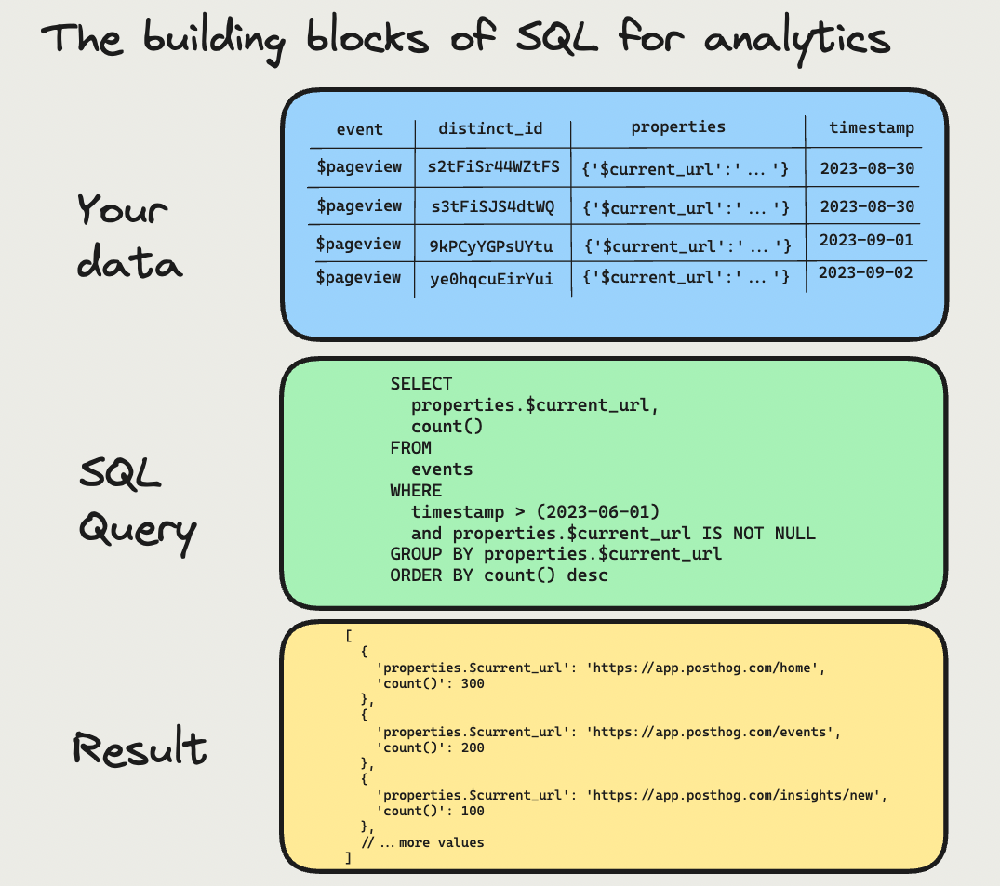
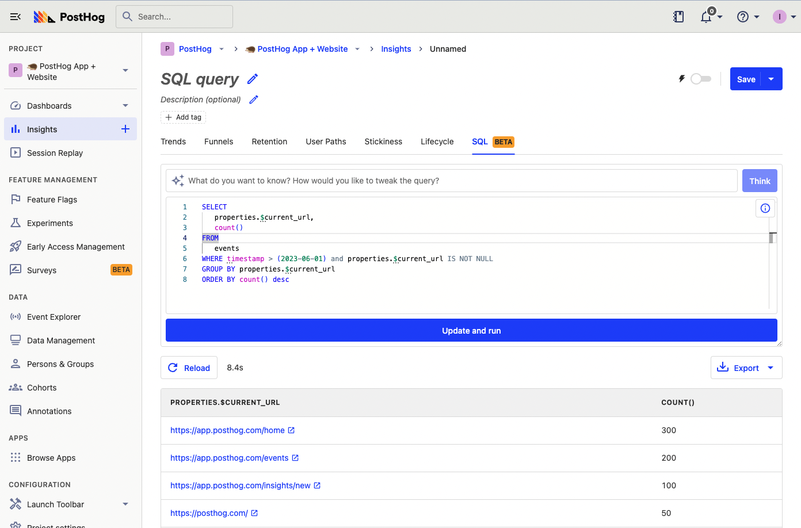
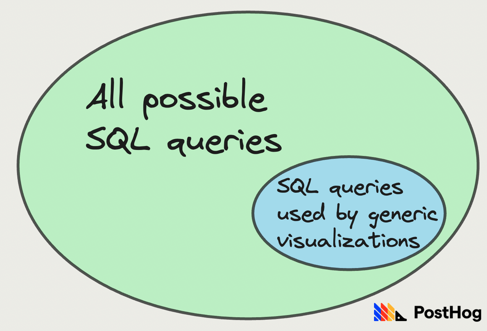

Analytics is one of SQL's most important use cases. There are many ways to slice, modify, and interpret analytics data. SQL provides the depth and customizability to get insights from it, answer questions, and make data-driven decisions.

This post goes over how to analyze your analytics data with SQL and recommendations for your analysis process.

## The building blocks of SQL

SQL provides complete customization into the retrieval and formatting of analytics data. Because of the limitless options for doing this, it is useful to break down the analysis process into three main blocks: your analytics data, the SQL query, and the results.



### 1. Your data

Data is generally stored in a table in a database, which is an organized collection of rows, like a rigid spreadsheet.

The important part of data in relation to SQL is the structure, types, and names. Knowing this enables you to retrieve the right data for your analysis. It is also useful to know how your app captures and set values, so you can tie data to real usage.

For example, in PostHog, you query a large number of events representing user behavior with many columns (aka properties), and rely heavily on aggregation. For a social media site, you might have more types of data like users and posts, with smaller numbers and columns, and want more details on individual entries.

### 2. SQL query

The query is the actual SQL. For our analytics use case, it is a piece of code using a combination of specific commands, identifiers, and functions to retrieve data you want. The most useful commands for analytics are:

- `SELECT`
- `FROM`
- `WHERE`
- `GROUP BY`
- `ORDER BY`

For example, a basic statement to select the `$current_url` of pageview events that happened after June 1, 2023, and order by their count looks like this:

```sql
SELECT
	properties.$current_url,
	count()
FROM
	events
WHERE timestamp > (2023-06-01) and properties.$current_url IS NOT NULL
GROUP BY properties.$current_url
ORDER BY count() desc
```

`count()` in query is an example of an SQL function. There are hundreds of these functions to use. They generally help you:

1. Aggregate values like `avg()`, `sum()`, `max()`
2. Modify or calculate values like `extract()`, `dateDiff()`, `multiIf()`

To learn more about SQL queries, commands, and useful functions, check out our [SQL insights](/docs/product-analytics/sql) and [expressions](/docs/hogql/expressions) documentation.

> **Where are queries written?** Queries are generally written in a UI connected to the database. This could be a CLI for a framework, a UI in a database service, or a visualization tool. Examples include PostHog, Metabase, MySQL WorkBench, and psql.

### 3. Result

As an output from the query on your data, you get a result. The result takes the form of basically a list of values you selected, ordered, grouped, and modified in the way you want. For example, the query from the last section returns a list like this:

```json
[
	{
		"properties.$current_url": "https://app.posthog.com/home",
		"count()": 300
	},
	{
		"properties.$current_url": "https://app.posthog.com/events",
		"count()": 200
	},
	{
		"properties.$current_url": "https://app.posthog.com/insights/new",
		"count()": 100
	},
	//...more values
]
```

Most analytics platforms transform the data from the result into a visual such as a table, formatted page, or graph. This enables further analysis.



## Why use SQL for analytics?

There are two main reasons to use SQL for analytics: **customizability** and **availability**

First, SQL enables you to retrieve and format data in any way you like. You aren’t constrained by the tools and visualizations an analytics platform provides to you. This enables you to fully customize your query and results to your goals.

The options analytics platform provide are a subset of all possible queries since they likely use SQL to calculate and power those options. Using SQL yourself provides access to all possible SQL queries, data, and formatting. 



Although analytics platforms try to cover as many types of analysis and data as possible, they can’t do everything. Many types of queries aren’t possible to template. This is because the format of data for everyone’s analytics is different. For example, your filters might be too complex or your data might be in a format visualizations can’t handle. With SQL knowledge, you can create queries using your own data format and get results relevant to you.

The second reason to use SQL in analytics is its **availability**. SQL is one of the most popular programming languages and is the standard way to interact with data in databases. There is a massive amount of content about best practices and how to learn it. The syntax is relatively simple and intuitive too. Many people and platforms already use it. This makes it easier to adopt and work on as a team.

For example, you can write [SQL insights](/docs/product-analytics/sql) in PostHog and also use [SQL expressions](/docs/hogql/expressions) as filters elsewhere. Beyond our user-facing app, in our backend, we write SQL to query our non-product data as well as [power our visualizations](/docs/how-posthog-works/queries) by interfacing with ClickHouse.

## How to analyze your analytics with SQL

Just knowing SQL isn’t enough. To do analytics analysis with SQL, you need a process and structure. Here are some recommendations:

- **Start with a goal.** SQL can be overwhelming if you don’t know what you are looking for. Having a specific analysis goal or question helps solve this. Having a goal makes it easier to know what data is relevant and what SQL commands might be useful.

- **Understand the data you have.** You must know the data you have access to, and what is relevant to your goals. Having this understanding helps you get insights faster and shows you what data you might want to collect to fill gaps.

- **Build your query piece by piece**. Especially if you are unfamiliar with SQL or the data you have access to, start with a simple query and add filters, aggregations, and groups as you understand more. If you write all the SQL at once, it can be difficult to debug because many of the functions do complicated calculations.

- **Format results.** Try multiple different ways of formatting results. Test multiple options for aggregations (`GROUP BY`) and what values of the data to `SELECT`. Sometimes a change in structure or values is all you need to turn a non-insight into an insight.

- **Share your results.** Analysis with SQL is only as good as the impact it has on decisions in your organization. Use your analysis to make recommendations, write those recommendations up, and share them with the relevant stakeholders.

- **Ensure you know dos and don’ts.** Be sure you can’t mess anything up when querying. PostHog and most analytics tools enable only read-only access to data, but having full database access could enable you to update or add data corrupting your data.

SQL is a powerful tool for analyzing analytics. Although it can be intimidating at the start, there are many resources to help you learn and the customizability it provides is a massive reward. It is a skill that continues to be useful for anyone interacting with data.

> **Looking for a place to start with SQL?** Try PostHog’s [SQL insights](/docs/product-analytics/sql) which enable you to directly query your product data.

## Further reading

- [Adventures in null handling: Null money, null problems](/blog/null-handling-hogql)
- [Using HogQL for advanced breakdowns](/tutorials/hogql-breakdowns)
- [In-depth: ClickHouse vs PostgreSQL](/blog/clickhouse-vs-postgres)
