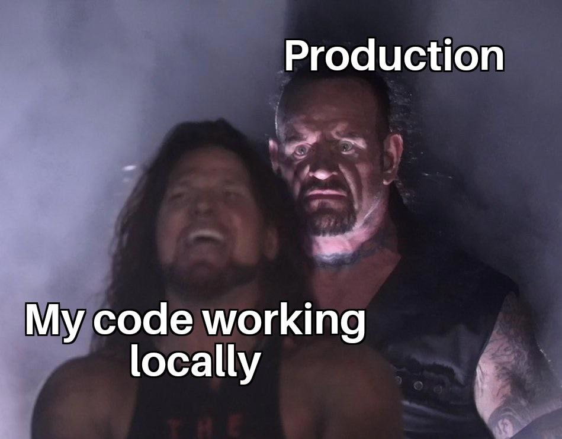

 

At PostHog, we test in production. There are many misconceptions about doing this. It **does not** mean:

- we commit to `main` every time we make a change.
- we randomly click around once the code releases to make sure it works.
- we ship code into production without testing it.

Testing in production *successfully* is a multi-step process, and this post goes over what it is, why we do it, and how to do it well.

## What is testing in production?

Testing in production checks that new code works with real infrastructure and data, rather than local machines or staging servers and synthetic data.

Testing in production brings to light problems with code not surfaced by local testing. This enables you to discover issues and "fail small" before problems impact the user experience or become outages.

### Types of production testing

Testing in production includes techniques like:

- **[Real user monitoring](/blog/real-user-monitoring):** Tracks app, query, and site performance, as well as error rate and logs.

- **Load, spike, soak testing:** Checks code for issues and performance when under a high volume or stressful load.

- **Shadowing, mirroring, dark launch:** Evaluates new code with duplicated or mirrored production data hidden or separated from users.

- **Integration testing:** Checks services, features, and infrastructure work together once deployed.

- **Alerts:** Notifying relevant team members when issues and errors occur.

- **Usage tracking:** Uncovers how users are using a product with analytics, session replays, and A/B testing.

- **Feedback and [surveys](/surveys):** Provides qualitative feedback about how users' experience with the product.

### When should you _not_ test in production?

Testing in production comes with risks. Tests fail and failures in production can cause issues for real users if you aren’t careful. Because of this, testing in production’s practicality depends on:

- the size of the business.
- the potential negative impact of the change.
- the speed to identify and resolve issues.

For example, testing a UI change to a small web app with feature flags is likely safe to do in production. The impact is small and any issues get mitigated quickly. Testing an algorithm update on a massive, automated financial trading product with slow deployments is better to do away from production.

## Why do we test in production?

At PostHog, we test in production. We have three main reasons for doing this:

### 1. Production is the real world

Ultimately, we want the code we write and the features we build to work in reality. We try to make the development environment as close to production as possible, but it can never be a complete match and there is diminishing returns to trying.

Some checks aren’t even possible outside of production. For example, we handle massive amounts of data and use big machines to process and query it. Replicating this locally is expensive and unsustainable.

In production, we learn how new code and features interact with production data and infrastructure. There are often bugs or issues missed locally that get solved by doing this. As the code release widens, we also get feedback and real usage data from teammates and [beta users](/tutorials/beta-feedback).

### 2. Dogfooding and collaboration

We are our own best customers at PostHog. Many of the features we develop are the ones most useful to us. Testing in production enables us to use the features we develop before releasing them, also known as dogfooding.

For example, we used the [early access management feature](/docs/feature-flags/early-access-feature-management) to manage the beta of early access management (very meta). This enabled us to both test the feature and have the structure in place to roll it out to users. By solving issues that arose in beta, we released a more polished final feature to users.

Dogfooding also enables our team to collaborate in production. Instead of managing and jumping between in-progress branches, they ship to production and work off that. When someone requests feedback for a new feature, they simply add their teammates to the feature flag. 

Once ready, this feature flag transitions to a way to do [phased rollouts](/tutorials/phased-rollout).

### 3. No need to maintain a staging environment

A staging environment is a smaller replica of the production environment where code and features get tested on synthetic data before going into production. By testing in production, we skip this and drop its maintenance need.

We once had a demo environment, but shut it down. Although it was a place where we could test outside of production (like a staging environment), a lot of maintenance went into it. It broke and had bugs that were different from production. Solving them was an effort better used elsewhere. We shifted efforts to improving onboarding, making it faster to get started on a new project.

At best, testing in a staging environment is a bit like confirmation bias. It works and breaks in all the ways you expect it to, but what you care about is actually what’s unexpected. Reality is much different.

## How we test in production

Testing in production is detrimental if it leads to more issues than it solves. To test in production safely, you need ways to rollout, monitor, and rollback tests effectively. For us at PostHog, this happens largely in two stages: deployment and release.

> **The importance of local tests:** Good local tests lower the risk of testing in production. We run frontend unit tests, visual regression tests, backend tests, and end-to-end tests locally and on new pull requests. They ensure merged code doesn't cause bugs, regressions, and degradations.

### Testing once deployed

Once writing coding and passing tests, it gets deployed in production. This doesn’t mean all users are using it, we [separate deployment from release](/product-engineers/decouple-deployment-from-release).

To do this, we rely on [feature flags](/docs/feature-flags). They enable us to control a feature's rollout. Often feature flags start only rolled out to the developer responsible for the change.

For example, our team makes many improvements to query performance. We use production data and machines to load test it with real queries. We do this in either [our production app or through Grafana](/handbook/engineering/databases/query-performance-optimization). We also keep an eye on error monitoring to ensure the new code hasn’t caused any exceptions.

For others, this is where spike, soak, shadowing, mirroring, and integration testing happen.

### Testing once released

Once the production tests related to deployment pass, we expand the release. This usually means rolling out the feature flag further and getting more users to try it.

This is where you use the rest of the production testing techniques. They include usage analytics, session replays, monitoring, feedback, and surveys. This goes along with error tracking and bug reports.

By testing in production, we uncover issues and get feedback fast. This is its major benefit. For teams wanting to get to the heart of the issue faster and ship more, testing in production might be right for you.

## Further reading

- [What is real user monitoring (and how to set it up)](/blog/real-user-monitoring)
- [How to do a canary release with feature flags in PostHog](/tutorials/canary-release)
- [How we build features users love (really fast)](/blog/measuring-feature-success)
