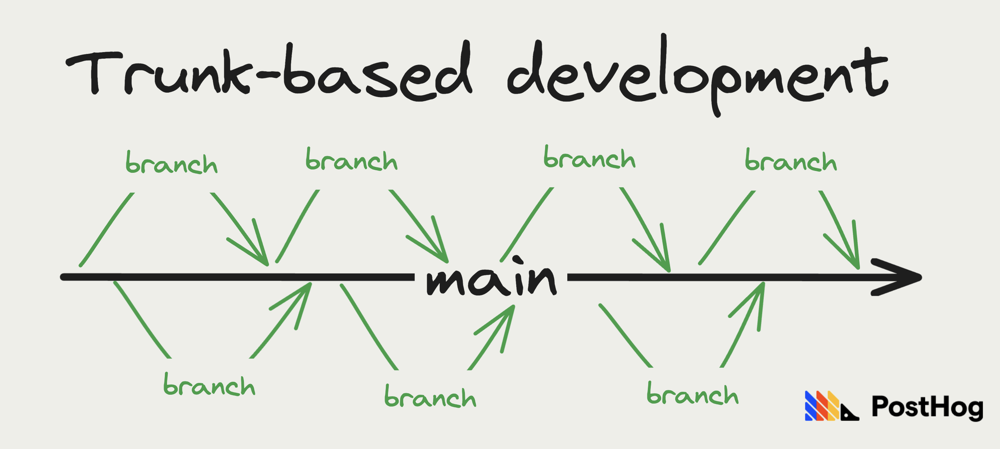
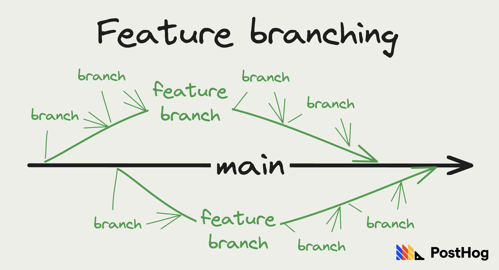
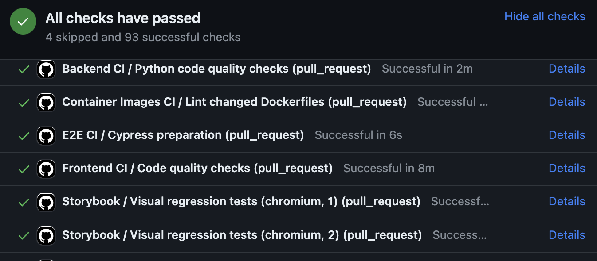

What do trees, elephants, and successful software all have in common? They rely on their trunks to help them grow big and strong. In the case of software, the trunk is the main codebase engineers make changes to and that deploys to users.

At PostHog, we make a lot of changes to our trunk. In 2023, we merged [4,344 pull requests](https://github.com/PostHog/posthog/pulls?q=is%3Apr+created%3A2023-01-01..2023-12-31+is%3Amerged) to our main app. This is what trunk-based development looks like and it's a conscious choice.

While other companies choose strategies focused on polish and perfection, trunk-based development helps us ship fast, reduce work-in-progress, and keep momentum. Ultimately, we feel this helps us build a better product and can help you do the same.

## What is trunk-based development?

Trunk-based development is one of many strategies for developing, merging, and shipping code. Teams implemented these strategies through a distributed version control system, most popularly, Git. This system uses the concept of branching and merging where developers create separate branches of the code and then merge those branches later.

Specifically for trunk-based development, there are two types of branches:

1. `main`: The trunk or main codebase. The base branch developers branch off of and merge into. 

2. `feature/fix`: Relatively small and short-lived branches where work and changes happen, and then get squashed and merged into `main` regularly. 

This simplicity is different than other software development strategies with more branches such as:

- **Feature branching:** Each feature gets a branch. To make changes related to a feature, developers branch off and merged into the feature branch. Once the feature is complete, the feature branch merges into the trunk.

- **Git Flow:** A structured branching model with `feature`, `develop`, `release`, `hotfix`, and `main` branches. Each has clear rules for how to use them. Designed for larger projects on a clear release schedule.

- **Forking:** Often used by open-source projects, developers have their own repository, make changes, and then maintainers review and pull changes into the main repository.

## What are the benefits of trunk-based development?

The big difference between trunk-based development and other software development strategies is **smaller, shorter-lived branches**. This may seem like a small difference, but it leads to three specific benefits for trunk-based development.

### 1. Avoiding merge conflicts

Merge conflicts happen when attempting to merge branches with different changes to the same areas. These are often unexpected and take time to solve. 

Long-lived branches provide opportunities for merge conflicts to pile up. The short-lived branches of trunk-based development stay closer to `main` because they branch off and merge into it often. This helps avoid merge conflicts.

### 2. Keeps main healthy

The `main` or trunk branch is the most important branch for two reasons:

1. It gets deployed or shipped to users.
2. It is the source of truth for the codebase.

By merging to `main` regularly, everyone can be confident `main` is stable and the most up-to-date code. Developers do not need to search for healthy branches. 

It also enables engineers to be more confident in continuously deploying it. This helps teams ship more and maintain momentum. 

### 3. Reviewable PRs

Large feature branches can often have hundreds or thousands of lines of changes. Developers dread massive pull requests (PRs AKA merge requests) for a reason. Reviewing these requires a significant amount of overhead to get up to speed with the code.

The smaller branches of trunk-based development create more reviewable pull requests. They require less overhead for someone to review. Merging regularly also creates opportunities for teams to collaborate. Every PR is a chance to interact with each other, get feedback earlier, and see what others are working on. 

## The philosophy behind trunk-based development at PostHog

Our main goal is to **minimize work-in-progress**. 

This is a [core philosophy of our development process](/handbook/engineering/development-process#sizing-tasks-and-reducing-wip) at PostHog and relates to all the key benefits of trunk-based development.

Implementing this philosophy (and trunk-based development) means:

1. Optimizing pull requests for quality of implementation *and* the speed of merge.

2. Keeping changes doable in one day, including code review and QA.

3. If not, split them into smaller changes until they fit into one day.

4. Responding to colleagues' review requests early in your day to help unblock them.

5. Pushing code out early. PRs are better than issues, even if they are half-done. This enables more concrete feedback on the approach.

6. Merging whenever. Our testing, reviewing, and build processes should be good enough that we are confident doing this.

As proof we take this seriously, our median pull request is **just under 8 hours** old when merged. On an average day, our team merges around 20 pull requests in our main repo.

## The tools of trunk-based development

For someone coming from a different branching strategy, this philosophy may seem intimidating. Pushing code early and merging whenever may seem especially scary, but to help alleviate this fear, we recommend (and use) two key tools:

### 1. Test-driven development

We expect engineers to write tests for their code as they are working on it and before they merge it. They run these locally then add them to our test suite that runs on every PR.

You can look at [a pull request on our repo](https://github.com/PostHog/posthog/pulls) to see the suite of end-to-end, frontend, linting, Storybook, code quality, visual regression, and migration tests before merging. This enables us to be confident in the code we are merging.

### 2. Feature flags

[Feature flags](/feature-flags) enable us to include code in the "trunk" without immediately releasing it to users. This [decouples deployment from release](/product-engineers/decouple-deployment-from-release). 

Once deployed, we can then test in production, dogfood, beta test, get feedback, and progressively roll out the feature. 

We currently have [67 feature flags](https://github.com/PostHog/posthog/blob/249d82043bcd70bb3e95a0553551246998d0d160/frontend/src/lib/constants.tsx#L125C1-L198C3) in various stages of release in our main PostHog repo.

## How you can implement trunk-based development

Implementing trunk-based development starts with a philosophy shift. Teams must encourage (or force) developers towards short-lived branches, rather than long-lived ones. This means breaking up PRs into smaller changes, prioritizing reviews, and pushing code out earlier. 

Along with this shift, the right tools can help break a team's reliance on long-lived branches. These often happen for two reasons tools can help with:

1. The team isn't confident in the code being merged.
2. The code being merged isn't ready for release.

Testing and a continuous integration and deployment (CI/CD) system creates confidence in merged code. It helps avoid issues and increase code quality. Feature flags decouple deployment from release, meaning developers can merge code without needing to release it to users.

The combination of a philosophy shift and the implementation of the right tools will help you transition to trunk-based development. We think making this transition is worth it. With it, we get more shipped, create momentum, and ultimately, build a more successful product. 

## Further reading

- [Feature flag best practices and tips (with examples)](/blog/feature-flag-best-practices)
- [Why use feature flags? Benefits, types and use cases, explained](/blog/feature-flag-benefits-use-cases)
- [Why we test in production (and you should too)](/product-engineers/testing-in-production)
