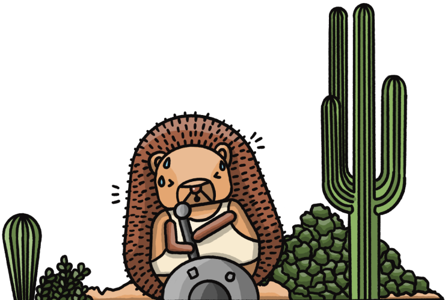

import { StaticImage } from 'gatsby-plugin-image'
import Table from './_includes/example-table.mdx'
import { getImage, GatsbyImage } from 'gatsby-plugin-image'

 

<h1 className="text-center px-2 pt-4 pb-2 md:px-8 text-3xl md:text-5xl xl:text-6xl relative z-20" style={{ marginTop: "-2rem", marginBottom: "-.5rem" }}>There's currently no maintenance underway</h1>

<Hero
    subtitle="But we'll let you know if that changes"
/>

 
  
 Why is this page here? 

   
  When we need to run scheduled maintenance or updates to PostHog we alert impacted users ahead of time by email, then include an in-app notice while the maintenance is running. In both cases, we direct users to this page to get updates and to answer detailed questions. There's no maintenance scheduled currently, so this page is currently in hibernation like an adorable hedgehog.

 

 Is there maintenance scheduled? 

   
  We don't currently have any maintenance scheduled for the immediate future. If that changes, we'll update impacted users directly and post an in-app banner to make sure you're aware.

 

 Is PostHog down? 

   
  We hope not! But you can always check status.posthog.com to see if there are any outages or disruptions on our end. If you think something is wrong, let us know in the community Slack, or email us at hey@posthog.com.

<h6>Got more questions? Let us know!</h6>
<CallToAction type="primary" width="84" to="/questions">
    Ask a question
</CallToAction>

