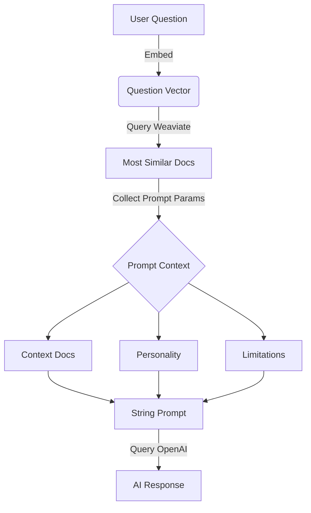

An AI-powered support bot that combines vector embeddings with GPT to answer questions about PostHog. Built at the 2023 Aruba hackathon, MaxAI was deployed across Slack, the PostHog app, and website before evolving into [PostHog AI](/docs/posthog-ai).

## What it does

- **Semantic Search**: Uses Weaviate vector database to find contextually relevant documentation
- **Knowledge Integration**: Ingests PostHog docs, GitHub issues, and community Q&A
- **Personalized Responses**: Custom prompts with personality, safety guardrails, and relevant context
- **Multi-Platform**: Deployed to Slack, web apps, and internal tools
- **Thread Summarization**: Condenses long support threads into actionable summaries

## How it works



## Tech Stack

- **Vector Database**: Weaviate for semantic search
- **Orchestration**: Haystack for pipeline management
- **LLM**: GPT-3.5-turbo (at launch)
- **Backend**: Python + FastAPI

## Origin Story

Team Bandwaggoners (James Greenhill, Paul Hultgren, Eric Duong, Raquel Smith, and Neil Kakkar) built MaxAI at PostHog's 2023 Aruba offsite hackathon. The goal was to reduce load on support engineers while helping the community find answers faster.

## Legacy

MaxAI has since evolved into [PostHog AI](/docs/posthog-ai), but the original repo remains available as a reference implementation for building support bots with vector search and LLMs.

```bash
git clone https://github.com/PostHog/max-ai
# See repo README for setup instructions
```

**Note**: This repository is archived. For current AI support features, see [PostHog AI](/docs/posthog-ai).
