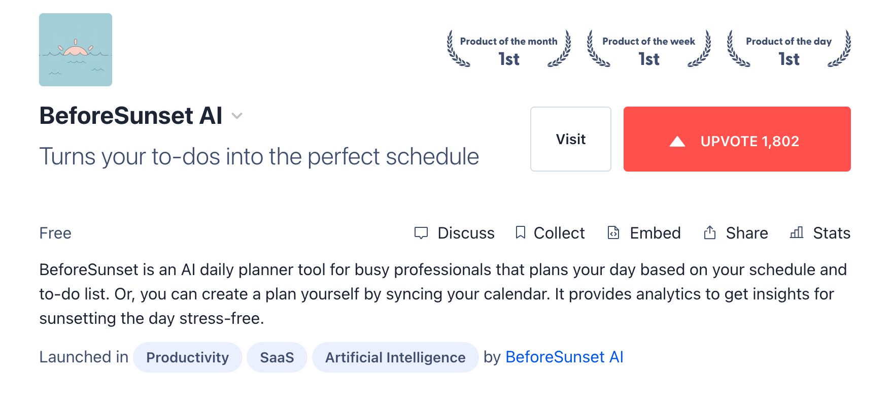
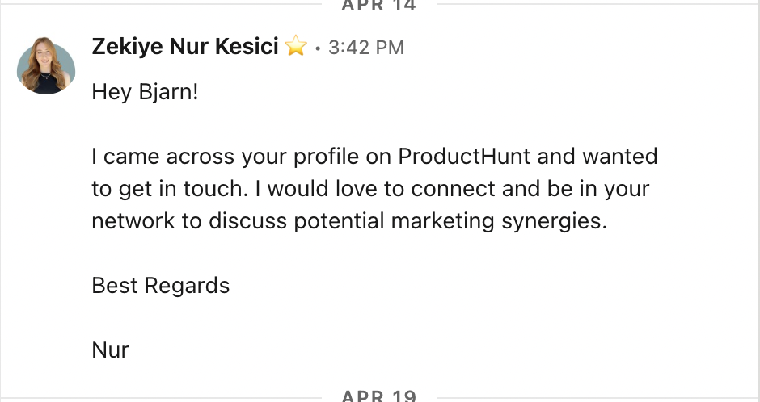

> Each month, we speak to a team enrolled in [PostHog for Startups](/startups) about the way they work and the challenges they face. This month we spoke to BeforeSunset AI about their approach to launching new products!

[BeforeSunset AI](https://www.beforesunset.ai/) is a daily planning app that creates the ideal schedule for people who have difficulty planning their day. It uses an algorithm that implements proven productivity hacks, like time boxing,  while keeping in mind personal preferences. Founded in May 2022 began at a software company called BREW, but has since launched as its own startup.

“The first version of BeforeSunset was just an internal time tracking tool we’d built,” explains Elif. “But when we launched the first version, we saw that no other productivity tool asked you the questions needed to plan a day properly and execute as planned. We realized that AI could help if it had the right information.”

After rebuilding the product around this AI-powered vision, the team wanted to relaunch in earnest — and in June 2023 debuted on Product Hunt, going on to win [Product of the Day, Week, and Month](https://www.producthunt.com/products/beforesunset). Here’s how:

### 1. Don't leave launch planning to the last minute

Unsurprisingly for a productivity startup, it all began with a plan.

“We had a clear plan in our minds for the product,” says Elif. “Our goal was to first finalize the essential features, like to-do lists and time blocking. Additionally, we aimed to incorporate AI functionalities. In total it took about three months to complete these tasks and prepare for the launch.”

This development time afforded the growth team time to plan, while also giving them the benefit of knowing how the product would come together. Work was hard and required some long nights, but came together smoothly. 

“On the marketing side our efforts started six months before the launch,” says Growth Lead Zekiye Nur Kesici. “In addition to on-going activities we began a waitlist for the new version and began growing it. We tried many different channels, including Reddit, Indie Hackers, Hacker News — and we spent a month on competitor analysis to shape our marketing activities.”

> **Putting it into action:** For new product launches take steps to align your product and marketing team as early as possible, and make sure they stay in sync as development continues. Product managers should keep marketing teams informed of key features and delays, so marketing can plan how to position the launch and manage deliverables. Product marketers, unsurprisingly, can help bridge the gap. 

### 2. Define your audience. Engage with their communities.

Focusing on community engagement is an important part of any launch plan, according to Nur — and the earlier you start, the more successful you’ll be. 

“We chose to focus on the Product Hunt community and we knew that would require us to be active on the platform,” she explains. “That means finding ways to add value; ways you can support them whenever you’re in touch so that, in turn, you can benefit from the community.”

For BeforeSunset, this included engaging with the community regularly and offering expertise where possible. 

Creative assets were also a major focus for BeforeSunset AI. The team created new product screenshots and videos ahead of the launch, and carefully considered how to make the launch page look as on-brand as possible even as the product continued to change and improve internally.

Finding the right community or launch channel can be a significant challenge all by itself and requires a keen understanding of your target audience. Knowing who users are, what their pain points are, and where they look for solutions is just as important to selecting a launch channel as experimentation.

"We're always working on better defining our target audience," says Nur. "Nailing the persona is especially hard, because we often see users interacting with the product in ways we don't expect, which is very exciting for us."

One example of this came from BeforeSunset's 'Plan my day' AI feature, where users are intended to add tasks and let the AI schedule time for them. [Session replays](/session-replay) showed users were instead adding their own time blocks in the description. This helped the team understand that when users write down their tasks, they write down the amount of time they want to spend on these tasks next to their to-dos, and they think the AI will assign that time slot to that task.

> **Putting it into action:** Document your target audiences and personas somewhere that everyone can access, then use this to identify the communities where these users may congregate. Use the persona as a benchmark for the quality of your marketing assets, and be sure to engage with communities well in advance of a launch to build goodwill. See how [PostHog does this with ICPs](/blog/creating-ideal-customer-profile) for more info. 

### 3. Move fast. Ask for support personally.

<Caption>An example of a community outreach message sent by BeforeSunset's team</Caption>

With Product Hunt, you only have a short amount of time in order to get traction and galvanize the community. Take too long and you’ll fall off the daily page, and into the archives. So, you need a strategy to continue currying favor and votes throughout the day.

“We created a spreadsheet of our waitlist and users and ran some one-on-one outreach to them,” says Zekiye Nur Kesici. “We also had a competition in the marketing team, offering a prize to whoever could reach out to the most people via LinkedIn. Motivating your team to be involved in the product launch preparation process is the secret to having a successful launch.”

> **Putting it into action:** Waitlists are an essential tool for any significant product launch, and you can even invite existing users to sign-up if appropriate. Then, when launch day nears, you can warm up subscribed users by giving them a sneak preview and asking them to share the word or refer their friends. 

### 4. If at first you don’t succeed, try again

BeforeSunset AI's latest Product Hunt launch wasn't its first attempt to succeed on the platform. An earlier Product Hunt launch for the AI-less version of the tool had failed to breakthrough because it hadn't yet reached [product-market fit](/blog/product-market-fit-game).

"That initial launch was still a milestone for us," says Elif. "It enabled us to get product feedback and led us to discover the real need in the market, which nobody was serving...It’s always important to bear in mind that success is rarely straightforward and that setbacks are a normal part of being an entrepreneur."

In BeforeSunset's case, the team responded to the first launch by speaking to users and spending a month on intense competitor analysis. This led Elif to realize that AI and the human aspect of daily planning were the missing ingredients and that, by asking users the right questions, AI could plan time much more effectively. Without this insight, BeforeSunset may never have had its later breakthrough. 

“You must be patient and persistent; have faith in your ability to find answers or make a new path," advises Elif. "You have to be strong all the time, and know you are not alone. A good team makes everything easier, greater. Product is important, but humans are everything.”

> **Putting it into action:** Failure is the best teacher, so if a product announcement doesn't go as planned then make sure to run a post-mortem process and think of how it can be improved. It can also help to use [surveys](/docs/surveys/manuals) to reach out to existing users and ask them for their advice directly!

**More success stories from PostHog for Startups**
- [How Golioth designs new IoT software and drives product development](/spotlights/startup-golioth)
- [How Bugprove uses influencer marketing to grow word of mouth](/spotlights/startup-bugprove)
- [How Documenso got 5,000 stars and grew an active GitHub community](/spotlights/startup-documenso)
